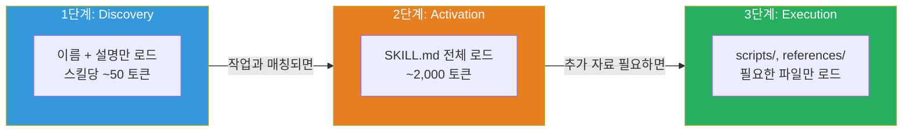
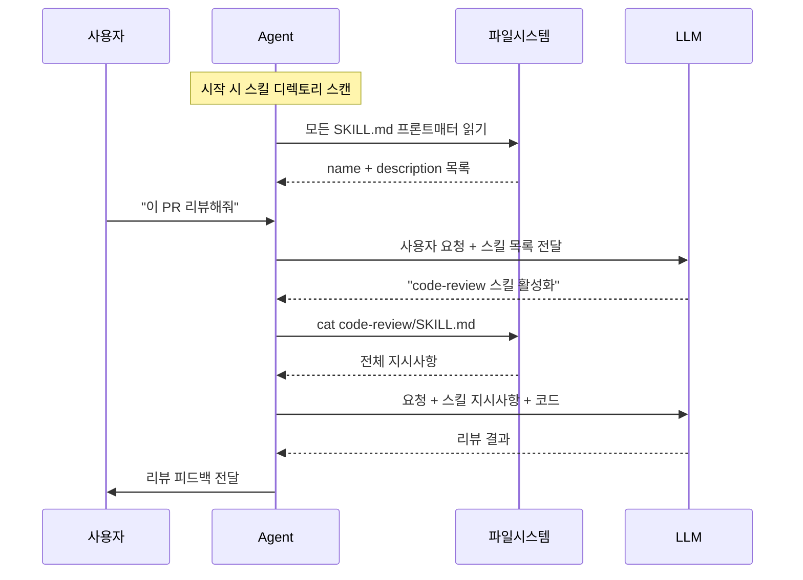

## 소개

3회차에서 MCP를 다뤘습니다. MCP가 Agent에게 **손**을 달아주는 거라면 — 파일을 읽고, API를 호출하고, DB를 쿼리하는 능력 — 이번에 다룰 Agent Skills는 **매뉴얼**을 쥐여주는 겁니다.

손이 있어도 뭘 해야 하는지 모르면 소용없잖아요.

실제로 Agent를 실무에 투입해보면 이런 상황이 반복됩니다:

- "우리 회사 코딩 컨벤션을 왜 안 지켜?" → Agent가 모릅니다
- "PR 올릴 때 이 체크리스트 확인해야 하는데?" → Agent가 모릅니다
- "이 프로젝트에서 API 응답 형식은 이렇게 쓰거든?" → Agent가 모릅니다

LLM은 범용 지식은 엄청나지만, **우리 조직의 맥락**은 전혀 모릅니다. 시스템 프롬프트에 몇 줄 끼워 넣을 수는 있는데, 프로젝트 10개에 컨벤션 20가지, 배포 절차, 코드 리뷰 기준까지 다 넣으면 프롬프트가 5만 토큰을 넘어갑니다. 컨텍스트 윈도우 절반을 매뉴얼이 차지하는 거예요. 그러면 정작 코드 분석할 공간이 없습니다.

**Agent Skills**는 이 문제를 깔끔하게 풉니다. "지금 필요한 매뉴얼만, 필요할 때만 로드한다."

---

## Agent Skills란 무엇인가

한 줄로 요약하면:

> **Agent Skills = 폴더 하나에 담긴, Agent가 읽을 수 있는 업무 매뉴얼**

Anthropic이 만들고 오픈 표준으로 공개한 포맷입니다. 구조는 놀라울 정도로 단순해요.

```
my-skill/
├── SKILL.md          # 필수: 메타데이터 + 지시사항
├── scripts/          # 선택: 실행 가능한 스크립트
├── references/       # 선택: 참고 문서
└── assets/           # 선택: 템플릿, 리소스
```

핵심은 `SKILL.md` 파일입니다. YAML 프론트매터로 메타데이터를 정의하고, 마크다운 본문에 지시사항을 씁니다. 그게 전부예요.

```markdown
---
name: code-review
description: 팀 코딩 컨벤션에 따라 PR을 리뷰하고 피드백을 생성합니다.
---

# 코드 리뷰 스킬

## 언제 사용하는가
사용자가 PR 리뷰, 코드 리뷰, 코드 품질 검토를 요청할 때 활성화합니다.

## 리뷰 절차
1. 변경된 파일 목록을 확인합니다
2. 각 파일에 대해 다음을 검토합니다:
   - 타입 안전성 (any 사용 금지)
   - 에러 핸들링 (try-catch 대신 Result 패턴)
   - 네이밍 컨벤션 (camelCase 변수, PascalCase 타입)
3. 심각도별로 분류합니다: Critical / Warning / Suggestion
4. 수정 제안 코드를 포함합니다
```

이게 스킬의 전부입니다. 특별한 SDK도, 복잡한 빌드 과정도 없습니다. **마크다운 파일 하나.** 진입 장벽이 이렇게 낮으니까 빠르게 퍼지는 거예요.

---

## 왜 이런 게 필요한가 — 프롬프트 엔지니어링의 한계

"그냥 시스템 프롬프트에 다 넣으면 되는 거 아냐?"

맞는 말 같지만, 실무에서는 세 가지 문제에 부딪힙니다.

### 문제 1: 컨텍스트 윈도우를 잡아먹는다

회사에서 Agent가 알아야 할 것들을 나열해보세요:

```
코딩 컨벤션 .................. ~2,000 토큰
API 응답 형식 규칙 ........... ~800 토큰
Git 브랜치 전략 .............. ~500 토큰
PR 리뷰 체크리스트 ........... ~1,200 토큰
배포 절차 ................... ~1,500 토큰
DB 마이그레이션 규칙 ......... ~700 토큰
보안 가이드라인 .............. ~1,800 토큰
테스트 작성 기준 ............. ~1,000 토큰
─────────────────────────────────
합계                      ~9,500 토큰
```

이걸 시스템 프롬프트에 **항상** 넣으면, 코드 분석하기도 전에 9,500 토큰이 날아갑니다. 32K 컨텍스트 모델이면 30%를 매뉴얼이 차지하는 셈이에요.

### 문제 2: 관련 없는 지시가 간섭한다

배포 절차를 알 필요가 없는 코드 리뷰 작업에서도 "배포할 때는 staging 먼저..." 같은 지시가 컨텍스트에 있으면, LLM이 가끔 엉뚱한 맥락을 끌어다 씁니다. "이 코드 리뷰해줘"라고 했는데 "배포 전에 staging에서 테스트하는 것도 추천합니다"라는 불필요한 코멘트가 달리는 식이에요.

### 문제 3: 관리가 안 된다

시스템 프롬프트에 모든 지식을 우겨넣으면, 그 프롬프트 자체가 관리 불가능한 덩어리가 됩니다. 누가 뭘 언제 바꿨는지 추적도 안 되고, 팀 간에 공유도 안 되고, 버전 관리도 안 돼요.

### Agent Skills의 해법: Progressive Disclosure

Agent Skills는 **Progressive Disclosure**(점진적 공개) 패턴으로 이 문제를 해결합니다.



**1단계 — Discovery**: Agent가 시작될 때, 모든 스킬의 이름과 설명만 로드합니다. 스킬이 20개여도 ~1,000 토큰이면 충분합니다. Agent는 "이런 스킬들이 있구나" 정도만 알고 있어요.

**2단계 — Activation**: 사용자가 "PR 리뷰해줘"라고 하면, Agent가 "아, code-review 스킬이 관련있겠다"고 판단하고 그 SKILL.md 전문을 로드합니다. 이때 다른 스킬(배포 절차, DB 마이그레이션 등)은 로드하지 않습니다.

**3단계 — Execution**: SKILL.md 안에서 참조하는 스크립트나 레퍼런스가 있으면, 필요할 때만 추가로 읽습니다.

결과적으로 "지금 이 작업에 필요한 지식만" 컨텍스트에 들어갑니다. 9,500 토큰이 아니라, 리뷰 작업이면 1,200 토큰만 쓰는 거예요.

---

## SKILL.md 스펙 상세

실제로 스킬을 만들려면 스펙을 알아야겠죠. 하나씩 뜯어봅시다.

### 프론트매터 (YAML)

```yaml
---
name: pdf-processing
description: PDF 파일에서 텍스트와 테이블을 추출하고, 폼을 작성하고, 문서를 병합합니다.
license: Apache-2.0
compatibility: git, docker, jq 필요. 인터넷 접근 필요.
metadata:
  author: example-org
  version: "1.0"
allowed-tools: Bash(git:*) Bash(jq:*) Read
---
```

필드별로 정리하면:

| 필드 | 필수 | 제약 | 설명 |
|------|------|------|------|
| `name` | O | 최대 64자. 소문자+숫자+하이픈만. 디렉토리명과 일치 | 스킬 식별자 |
| `description` | O | 최대 1024자 | 스킬이 뭘 하는지 + 언제 쓰는지 |
| `license` | X | - | 라이선스 명시 |
| `compatibility` | X | 최대 500자 | 환경 요구사항 (특정 도구, 패키지, 네트워크 등) |
| `metadata` | X | string → string 맵 | 추가 메타데이터 (author, version 등) |
| `allowed-tools` | X | 공백 구분 목록 | 사전 승인된 도구 목록 (실험적) |

### name 필드 규칙

이름 규칙이 꽤 엄격합니다:

```yaml
# OK
name: pdf-processing
name: data-analysis
name: code-review

# NG
name: PDF-Processing    # 대문자 불가
name: -pdf              # 하이픈으로 시작 불가
name: pdf--processing   # 연속 하이픈 불가
name: pdf_processing    # 언더스코어 불가
```

그리고 **디렉토리명과 name이 일치**해야 합니다. 디렉토리가 `code-review/`면 name도 `code-review`여야 해요.

### description 잘 쓰는 법

description은 Agent가 "이 스킬을 활성화할까 말까" 판단하는 유일한 단서입니다. Discovery 단계에서 이것만 보고 결정하거든요.

```yaml
# 나쁜 예 — Agent가 언제 써야 할지 판단할 수 없음
description: PDF 관련 도구.

# 좋은 예 — 뭘 하는지 + 언제 쓰는지 명확
description: >
  PDF 파일에서 텍스트와 테이블을 추출하고, 폼을 작성하고,
  문서를 병합합니다. 사용자가 PDF 작업, 문서 추출,
  폼 작성을 언급할 때 사용합니다.
```

**핵심은 "언제 활성화할지"를 명시하는 것**입니다. "PDF 관련 도구"만으로는 Agent가 이 스킬을 써야 할 상황을 판단하기 어렵습니다.

### 마크다운 본문

프론트매터 아래의 본문이 실제 지시사항입니다. 형식 제약은 없지만 권장 구조가 있습니다:

```markdown
# 스킬 이름

## 언제 사용하는가
이 스킬을 활성화해야 하는 조건을 기술합니다.

## 절차
1. 단계별 지시사항
2. 구체적인 행동
3. 검증 방법

## 예시
입출력 예시를 보여줍니다.

## 엣지 케이스
주의해야 할 상황들.
```

**중요한 가이드라인:**

- **500줄 이하로 유지하세요.** SKILL.md가 길어지면 상세 내용은 `references/` 디렉토리로 빼세요
- **5,000 토큰 이하를 권장합니다.** Activation 시 전체가 컨텍스트에 들어가니까요
- **참조 파일은 상대 경로로.** `references/REFERENCE.md` 처럼, 스킬 루트 기준 한 단계만

---

## 선택적 디렉토리 구조

SKILL.md 하나만으로도 스킬은 동작합니다. 하지만 더 복잡한 스킬이 필요하면 디렉토리를 추가할 수 있습니다.

### scripts/

Agent가 실행할 수 있는 코드를 넣습니다.

```
my-skill/
├── SKILL.md
└── scripts/
    ├── extract_pdf.py      # PDF 텍스트 추출
    ├── merge_pdfs.sh       # PDF 병합
    └── validate_form.py    # 폼 데이터 검증
```

스크립트 작성 규칙:
- 자체 완결적이거나, 의존성을 명확히 문서화할 것
- 에러 메시지를 친절하게 작성할 것 (Agent가 에러를 읽고 대응해야 하니까)
- 엣지 케이스를 처리할 것

### references/

상세 참고 문서를 넣습니다. SKILL.md에서 "자세한 내용은 여기 참조"라고 가리키면, Agent가 필요할 때만 읽습니다.

```
my-skill/
├── SKILL.md
└── references/
    ├── REFERENCE.md        # 기술 상세 문서
    ├── api-format.md       # API 형식 가이드
    └── error-codes.md      # 에러 코드 목록
```

각 파일은 **한 주제에 집중**하세요. Agent가 on-demand로 읽으니까, 파일이 작을수록 컨텍스트를 효율적으로 씁니다.

### assets/

템플릿, 스키마, 이미지 등 정적 리소스를 넣습니다.

```
my-skill/
├── SKILL.md
└── assets/
    ├── pr-template.md      # PR 템플릿
    ├── config-schema.json  # 설정 파일 스키마
    └── architecture.png    # 아키텍처 다이어그램
```

---

## Agent에 Skills 통합하기

스킬을 만들었으면, Agent가 이걸 인식하고 사용하게 해야겠죠. 통합 방식은 크게 두 가지입니다.

### 방식 1: Filesystem 기반 (CLI Agent)

Claude Code, OpenCode 같은 **파일 시스템에 접근 가능한 Agent**가 이 방식입니다. Agent가 직접 `cat /path/to/SKILL.md`로 스킬 파일을 읽습니다.



### 방식 2: Tool 기반 (IDE/웹 Agent)

파일 시스템에 직접 접근하지 못하는 Agent(웹 기반, IDE 플러그인 등)는 **도구(Tool)를 통해** 스킬을 로드합니다. 구현은 개발사마다 다르지만, 패턴은 동일합니다.

### 시스템 프롬프트에 스킬 목록 주입

어떤 방식이든, Agent가 시작할 때 사용 가능한 스킬 목록을 시스템 프롬프트에 넣어줘야 합니다. 권장 형식은 XML입니다:

```xml
<available_skills>
  <skill>
    <name>code-review</name>
    <description>팀 코딩 컨벤션에 따라 PR을 리뷰합니다.</description>
    <location>/home/user/.skills/code-review/SKILL.md</location>
  </skill>
  <skill>
    <name>api-design</name>
    <description>REST API 엔드포인트를 설계하고 문서를 생성합니다.</description>
    <location>/home/user/.skills/api-design/SKILL.md</location>
  </skill>
  <skill>
    <name>db-migration</name>
    <description>데이터베이스 마이그레이션 스크립트를 생성하고 검증합니다.</description>
    <location>/home/user/.skills/db-migration/SKILL.md</location>
  </skill>
</available_skills>
```

스킬당 50~100 토큰 정도니까, 20개 스킬이 있어도 ~1,500 토큰이면 됩니다. 시스템 프롬프트에 모든 지시사항을 넣는 것(9,500 토큰)과 비교하면 85% 절감이에요.

### 통합 파이프라인 요약

전체 흐름을 정리하면:

```
Discovery  → 설정된 디렉토리에서 SKILL.md 프론트매터 스캔
           → name + description만 추출
           → 시스템 프롬프트에 목록 주입

Matching   → 사용자 요청이 들어오면
           → LLM이 스킬 목록을 보고 관련 스킬 판단

Activation → 매칭된 스킬의 SKILL.md 전체 로드
           → LLM 컨텍스트에 추가

Execution  → LLM이 지시사항에 따라 작업 수행
           → 필요시 scripts/ 실행, references/ 참조
```

---

## 보안 고려사항

Agent가 스킬의 스크립트를 실행한다는 건, **신뢰할 수 없는 코드가 실행될 수 있다**는 뜻입니다. 인터넷에서 아무 스킬이나 다운받아 쓰면 위험합니다.

### 체크리스트

| 항목 | 설명 |
|------|------|
| **샌드박싱** | 스크립트를 격리된 환경에서 실행 (Docker, VM 등) |
| **허용목록** | 신뢰할 수 있는 소스의 스킬만 허용 |
| **사용자 확인** | 위험할 수 있는 작업 전에 사용자에게 확인 |
| **실행 로깅** | 어떤 스크립트가 언제 실행됐는지 감사 추적 |
| **네트워크 제한** | 스크립트의 외부 통신 제한 |

특히 기업 환경에서는 **"사내에서 만든 스킬만 허용"** 정책이 현실적입니다. 공개 스킬 저장소에서 가져다 쓸 때는 코드 리뷰를 거치세요.

`allowed-tools` 필드를 활용하면 스킬이 사용할 수 있는 도구를 제한할 수 있습니다:

```yaml
# 이 스킬은 git과 jq만 실행 가능, 그 외 명령은 차단
allowed-tools: Bash(git:*) Bash(jq:*) Read
```

단, 이 기능은 아직 실험적(Experimental)이고, Agent 구현체마다 지원 여부가 다릅니다.

---

## 생태계 현황

Agent Skills는 Anthropic이 개발하고 오픈 표준으로 공개한 포맷입니다. 2026년 현재 주요 AI 개발 도구 대부분이 지원하고 있습니다.

### 지원 도구 (2026년 2월 기준)

| 카테고리 | 도구 |
|---------|------|
| **코딩 Agent (CLI)** | Claude Code, OpenCode, Gemini CLI, Aider, Goose |
| **IDE** | Cursor, VS Code (GitHub Copilot), Windsurf, Roo Code |
| **플랫폼** | GitHub, Databricks, Factory |
| **프레임워크** | Letta, Spring AI |
| **기타** | OpenAI Codex, Amp, TRAE, Firebender, Piebald 등 |

**27개 이상의 도구**가 Skills를 지원합니다. 이게 중요한 포인트예요.

스킬을 한 번 만들면 Claude Code에서도, Cursor에서도, OpenCode에서도 동작합니다. 도구를 바꿔도 스킬은 그대로 쓸 수 있어요. 마치 USB 드라이브처럼 — 어떤 컴퓨터에 꽂아도 동작하는 거죠. (3회차에서 MCP를 "Agent의 USB 포트"라고 했는데, Skills는 "USB에 담긴 매뉴얼"인 셈입니다.)

### 검증 도구: skills-ref

공식 레퍼런스 라이브러리로 스킬을 검증하고 프롬프트 XML을 생성할 수 있습니다.

```bash
# 스킬 디렉토리 검증
skills-ref validate ./my-skill
# ✓ name field valid
# ✓ description field valid
# ✓ directory name matches skill name
# ✓ SKILL.md under 500 lines

# 프롬프트용 XML 생성
skills-ref to-prompt ./skills/*
# <available_skills>
#   <skill>
#     <name>code-review</name>
#     ...
```

---

## MCP와 Skills의 관계

3회차에서 다룬 MCP와 이번 Skills가 어떻게 다른지, 어떻게 함께 쓰는지 정리해봅시다.

| | MCP | Agent Skills |
|---|-----|-------------|
| **역할** | Agent에게 **도구**를 제공 | Agent에게 **지식/절차**를 제공 |
| **비유** | 손 (파일 읽기, API 호출, DB 쿼리) | 매뉴얼 (어떻게 하는지, 뭘 확인하는지) |
| **형태** | 서버 프로세스 (JSON-RPC) | 마크다운 파일 (정적) |
| **런타임** | 항상 실행 중 | 필요할 때만 로드 |
| **예시** | GitHub MCP 서버 (PR 읽기/쓰기) | 코드 리뷰 스킬 (리뷰 절차 정의) |

**함께 쓰는 패턴:**

```
사용자: "이 PR 리뷰해줘"

1. Agent가 code-review 스킬 활성화 (Skills)
   → "리뷰할 때 이런 기준으로 확인해라" 지시사항 로드

2. Agent가 GitHub MCP 서버로 PR diff 조회 (MCP)
   → 실제 코드 변경 내용 가져오기

3. Agent가 스킬 지시사항에 따라 코드를 분석하고 피드백 작성
   → Skills의 지식 + MCP의 도구 = 실행

4. Agent가 GitHub MCP 서버로 리뷰 코멘트 작성 (MCP)
   → 결과물을 PR에 직접 게시
```

MCP 없이 Skills만 있으면 "뭘 해야 하는지는 아는데 손이 없는" 상태.
Skills 없이 MCP만 있으면 "손은 있는데 뭘 해야 하는지 모르는" 상태.
둘 다 있으면 **"뭘 해야 하는지 알고, 할 수도 있는"** 완전한 Agent가 됩니다.

---

## 실전 예제: 우리 팀 스킬 설계

이론은 여기까지. 실제로 팀에서 유용한 스킬 3개를 설계해봅시다.

### 예제 1: 코딩 컨벤션 스킬

```markdown
---
name: team-convention
description: >
  팀 코딩 컨벤션을 적용합니다. 코드 작성, 리뷰, 리팩토링 시
  네이밍, 에러 핸들링, 파일 구조 규칙을 확인합니다.
---

# 팀 코딩 컨벤션

## 언제 사용하는가
- 새 코드를 작성할 때
- 코드 리뷰를 수행할 때
- 리팩토링을 제안할 때

## 네이밍 규칙
- 변수/함수: camelCase (`getUserById`)
- 타입/인터페이스: PascalCase (`UserResponse`)
- 상수: UPPER_SNAKE_CASE (`MAX_RETRY_COUNT`)
- 파일: kebab-case (`user-service.ts`)
- 컴포넌트 파일: PascalCase (`UserProfile.tsx`)

## 에러 핸들링
- throw 금지. Result<T, E> 패턴만 사용
- 참조: references/result-pattern.md

## 타입 규칙
- `any` 사용 절대 금지
- `unknown`으로 받고 타입 가드로 좁힐 것
- API 응답은 반드시 Zod 스키마로 검증

## 파일 구조
- 파일당 하나의 주요 export
- 300줄 초과 시 분리 검토
- index.ts에서 re-export (barrel export)
```

### 예제 2: PR 리뷰 스킬

```markdown
---
name: pr-review
description: >
  Pull Request를 리뷰합니다. 변경 파일을 분석하고 코딩 컨벤션,
  보안, 성능, 테스트 커버리지를 검토합니다.
---

# PR 리뷰

## 리뷰 절차
1. 변경 파일 목록과 diff 확인
2. 각 파일에 대해 아래 체크리스트 적용
3. 심각도별 분류: 🔴 Critical / 🟡 Warning / 🔵 Suggestion
4. 파일별 인라인 코멘트 형식으로 출력

## 체크리스트
### 필수 (Critical)
- [ ] any 타입 사용 여부
- [ ] 하드코딩된 시크릿/API 키
- [ ] SQL injection 가능성
- [ ] 인증/인가 누락

### 권장 (Warning)
- [ ] 에러 핸들링 누락
- [ ] 테스트 코드 누락
- [ ] 매직 넘버 사용
- [ ] 불필요한 console.log

### 제안 (Suggestion)
- [ ] 더 나은 네이밍
- [ ] 코드 중복 제거
- [ ] 성능 개선 여지

## 출력 형식
파일명:라인번호 [심각도] 설명
→ 수정 제안 (코드 포함)
```

### 예제 3: API 설계 스킬

```markdown
---
name: api-design
description: >
  REST API 엔드포인트를 설계합니다. URL 구조, 요청/응답 형식,
  에러 코드, 페이지네이션 패턴을 정의합니다.
compatibility: TypeScript, Express 또는 Next.js 프로젝트
---

# API 설계 가이드

## URL 규칙
- 복수형 명사: `/api/users`, `/api/projects`
- 중첩 리소스: `/api/projects/:id/members`
- 최대 깊이 3단계

## 응답 형식
모든 API 응답은 이 형식을 따릅니다:

성공:
{ "success": true, "data": T }

실패:
{ "success": false, "error": { "code": "NOT_FOUND", "message": "..." } }

목록 (페이지네이션):
{ "success": true, "data": T[], "pagination": { "page": 1, "limit": 20, "total": 142 } }

## HTTP 상태 코드
- 200: 조회/수정 성공
- 201: 생성 성공
- 400: 입력 검증 실패
- 401: 인증 필요
- 403: 권한 없음
- 404: 리소스 없음
- 409: 충돌 (중복 등)
- 500: 서버 에러

## 입력 검증
- 모든 입력은 Zod 스키마로 검증
- 스키마 파일: src/schemas/{resource}.ts
```

---

## 스킬을 잘 만드는 법

몇 가지 원칙을 정리합니다.

### 1. 구체적으로 쓰세요

```
❌ "코드를 잘 작성하세요"
✅ "변수명은 camelCase, 타입명은 PascalCase로 작성합니다.
    any 타입은 사용하지 않습니다."
```

LLM은 구체적인 지시에 잘 반응합니다. "좋은 코드를 써라"는 의미 없고, "이 규칙을 지켜라"가 효과적입니다.

### 2. 예시를 포함하세요

입력과 출력 예시를 넣으면 LLM의 이해도가 확 올라갑니다. 백 마디 설명보다 예시 하나가 낫습니다.

### 3. SKILL.md는 짧게, 상세 내용은 references/로

SKILL.md가 500줄을 넘으면 Activation 시 컨텍스트를 너무 많이 잡아먹습니다. 핵심 절차만 SKILL.md에 두고, 상세 참고 자료는 `references/`로 분리하세요.

### 4. 하나의 스킬 = 하나의 역할

"코드 리뷰 + 배포 + 테스트" 를 하나의 스킬에 넣지 마세요. 스킬을 분리해야 Agent가 필요한 것만 로드할 수 있습니다.

### 5. 버전 관리하세요

스킬은 파일이니까 Git으로 관리하면 됩니다. 프로젝트 저장소의 `.skills/` 디렉토리에 넣으면 코드와 함께 버전 관리됩니다.

```
my-project/
├── src/
├── tests/
├── .skills/           # 프로젝트 스킬
│   ├── code-review/
│   │   └── SKILL.md
│   ├── api-design/
│   │   └── SKILL.md
│   └── team-convention/
│       └── SKILL.md
└── package.json
```

팀원이 스킬을 개선하면 PR로 리뷰하고 머지합니다. **조직 지식이 코드처럼 버전 관리되는 겁니다.**

---

## 자주 묻는 질문

**Q: MCP 서버 만드는 거랑 비교하면 뭐가 쉽나요?**

A: 비교가 안 될 정도로 Skills가 쉽습니다. MCP 서버는 JSON-RPC 프로토콜 구현, 서버 프로세스 관리, Transport 설정이 필요합니다. Skills는 마크다운 파일 하나 쓰면 끝이에요. 물론 역할이 다르니 대체 관계가 아니라 보완 관계입니다.

**Q: 기존 CLAUDE.md나 .cursorrules 파일이랑 뭐가 달라요?**

A: CLAUDE.md, .cursorrules는 **항상** 로드됩니다. 내용이 길어지면 매번 컨텍스트를 잡아먹죠. Skills는 필요할 때만 로드되니까 컨텍스트를 효율적으로 쓸 수 있어요. 그리고 Skills는 특정 도구에 종속되지 않는 오픈 표준이라, 여러 Agent에서 재사용됩니다.

**Q: 스킬을 어디에 저장해야 하나요?**

A: 두 가지 선택지가 있습니다. **프로젝트 레벨**은 `.skills/` 디렉토리에 넣어서 해당 프로젝트에서만 사용. **사용자 레벨**은 `~/.skills/` 같은 곳에 넣어서 모든 프로젝트에서 사용. 코딩 컨벤션은 프로젝트 레벨, 개인 생산성 스킬은 사용자 레벨이 적합합니다.

**Q: 스킬이 너무 많으면 Discovery 단계에서 토큰 낭비 아닌가요?**

A: 스킬당 name + description이 50~100 토큰이니까, 50개여도 5,000 토큰 이하입니다. 모든 지시사항을 시스템 프롬프트에 넣는 것보다 훨씬 효율적이에요. 다만 100개 이상 되면 카테고리별로 그룹핑하는 전략이 필요할 수 있습니다.

**Q: LLM이 잘못된 스킬을 활성화하면요?**

A: description을 잘 쓰면 대부분 맞지만, 완벽하진 않습니다. 사용자가 명시적으로 "code-review 스킬 써줘"라고 지정할 수도 있고, Agent 구현체에 따라 스킬 선택을 확인하는 UI를 제공하기도 합니다.

---

## 마치며

Agent Skills의 진짜 가치는 기술적 우아함이 아니라 **실용성**에 있습니다.

- 만드는 데 5분. 마크다운 파일 하나면 됩니다
- 도구 종속 없음. Claude Code에서도 Cursor에서도 동작합니다
- Git으로 관리. 팀원이 PR로 개선하고, 변경 이력이 남습니다
- 컨텍스트 효율적. 필요한 것만, 필요할 때만 로드합니다

결국 Agent Skills는 **"조직의 암묵지를 형식지로 만들어서 AI Agent에게 전달하는 포맷"**입니다. 시니어 개발자의 머릿속에만 있던 "우리 팀은 이렇게 한다"를 파일로 만들어서 Agent가 참조하게 하는 거예요. 사람이 퇴사해도 지식은 남고, 새 팀원이 와도 Agent가 컨벤션을 알려줍니다.

7회차에서는 이 스킬을 **직접 만들어보는 실습**을 진행합니다. 사내 코딩 컨벤션 스킬을 처음부터 끝까지 작성하고, skills-ref로 검증하고, 여러 Agent에서 테스트하는 과정을 다룰 예정입니다.

---

*시리즈: AI Agent 실전 가이드 (4/8)*
