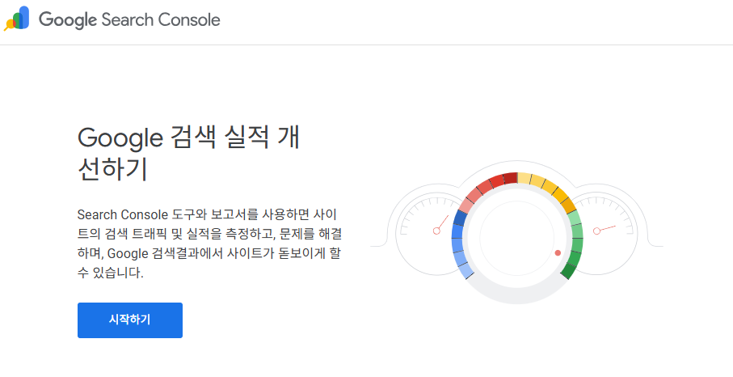

블로그를 만들었으면 Google 검색에 노출시켜야 한다.
이 글에서는 Google Search Console 등록부터 sitemap 제출까지의 과정을 정리한다.

---

## 1. Google Search Console 등록

### 1.1. 접속

  
[Google Search Console](https://search.google.com/search-console/about)에 접속한다.

### 1.2. 속성 추가

**시작하기**를 클릭하면 속성 유형 선택 화면이 나온다.

| 유형 | 설명 |
|------|------|
| 도메인 | 커스텀 도메인 사용 시 |
| **URL 접두어** | GitHub Pages 기본 URL 사용 시 |

GitHub Pages 기본 URL을 사용하므로 **URL 접두어**를 선택한다.

```
https://chunghyunwoooo.github.io
```

---

## 2. 소유권 확인

URL 확인 후 소유권 확인 창이 나타난다.

### 확인 방법 목록

| 방법 | 설명 |
|------|------|
| **HTML 태그** | `_config.yml`에 meta 태그 추가 (권장) |
| HTML 파일 | 루트에 확인 파일 업로드 |
| Google 애널리틱스 | GA 연동 시 자동 확인 |
| Google 태그 관리자 | GTM 사용 시 |
| 도메인 이름 공급업체 | DNS 레코드 추가 |

### 2.1. HTML 태그 방식 (권장)

**다른 확인 방법** 탭에서 **HTML 태그**를 선택한다.

아래와 같은 meta 태그가 제공된다:

```html
<meta name="google-site-verification" content="여기에_고유코드" />
```

`content` 값만 복사한다.

### 2.2. `_config.yml` 설정

```yaml
# _config.yml
# Site Verification (추가)
google_site_verification: "여기에_고유코드_붙여넣기"
```

minimal-mistakes 테마는 이 값을 자동으로 `<head>`에 meta 태그로 삽입한다.

> google 외에도 bing, naver 인증 코드를 넣을 수 있다.
> 참고: [minimal-mistakes 공식 문서](https://mmistakes.github.io/minimal-mistakes/docs/configuration/)

### 2.3. 배포 후 확인

```bash
git add _config.yml
git commit -m "Add Google site verification"
git push
```

배포 완료 후 Google Search Console에서 **확인** 버튼을 누르면 소유권이 확인된다.

---

## 3. sitemap.xml 설정

sitemap은 검색 엔진이 블로그의 모든 페이지를 크롤링할 수 있도록 안내하는 파일이다.

### 3.1. 플러그인 확인

`Gemfile`에 `jekyll-sitemap`이 포함되어 있는지 확인한다:

```ruby
# Gemfile
group :jekyll_plugins do
  gem "jekyll-sitemap"
end
```

`_config.yml`에도 포함:

```yaml
plugins:
  - jekyll-sitemap
```

### 3.2. 자동 생성 확인

`jekyll-sitemap` 플러그인은 빌드 시 자동으로 `/sitemap.xml`을 생성한다.

로컬에서 확인:

```bash
bundle exec jekyll serve
# http://localhost:4000/sitemap.xml 접속
```

**주의:** `_config.yml`의 `url`이 정확해야 한다.

```yaml
url: "https://chunghyunwoooo.github.io"
```

### 3.3. Collections도 포함되는가?

`jekyll-sitemap`은 `output: true`인 모든 Collection을 포함한다.

```yaml
collections:
  series:
    output: true    # ← sitemap에 포함됨
  articles:
    output: true    # ← sitemap에 포함됨
```

별도 설정 불필요.

---

## 4. robots.txt 설정

검색 엔진 크롤러에게 크롤링 허용 범위를 알려주는 파일이다.

### 4.1. 루트에 `robots.txt` 생성

프로젝트 루트(`_config.yml`과 같은 위치)에 생성한다:

```
User-agent: *
Allow: /
Sitemap: https://chunghyunwoooo.github.io/sitemap.xml
```

### 4.2. 확인

```bash
# 로컬 서버에서 확인
http://localhost:4000/robots.txt
```

---

## 5. Sitemap 제출

### 5.1. Google Search Console에서 제출

1. 좌측 메뉴 → **Sitemaps** 클릭
2. 새 사이트맵 추가에 `sitemap.xml` 입력
3. **제출** 클릭

### 5.2. 상태 확인

| 상태 | 의미 |
|------|------|
| 성공 | 정상 등록됨 |
| 가져올 수 없음 | URL 또는 파일 오류 |
| 오류 있음 | XML 형식 오류 |

---

## 6. 검색 노출 확인

등록 후 **며칠~2주** 정도 소요된다.

### 6.1. URL 검사

Google Search Console → **URL 검사**에 블로그 URL 입력:

```
https://chunghyunwoooo.github.io/
```

**"URL이 Google에 등록되어 있습니다"** 메시지가 나오면 성공.

### 6.2. Google에서 직접 검색

```
site:chunghyunwoooo.github.io
```

위와 같이 검색하면 색인된 페이지가 표시된다.

---

## 7. 정리

| 단계 | 작업 | 파일 |
|------|------|------|
| 1 | Search Console 등록 | - |
| 2 | 소유권 확인 | `_config.yml` |
| 3 | sitemap 확인 | 자동 (플러그인) |
| 4 | robots.txt 생성 | `robots.txt` |
| 5 | Sitemap 제출 | Search Console |
| 6 | 노출 확인 | 며칠 대기 |

---

## 참고

- [Google Search Console](https://search.google.com/search-console/about)
- [minimal-mistakes Configuration](https://mmistakes.github.io/minimal-mistakes/docs/configuration/)
- [jekyll-sitemap 플러그인](https://github.com/jekyll/jekyll-sitemap)
