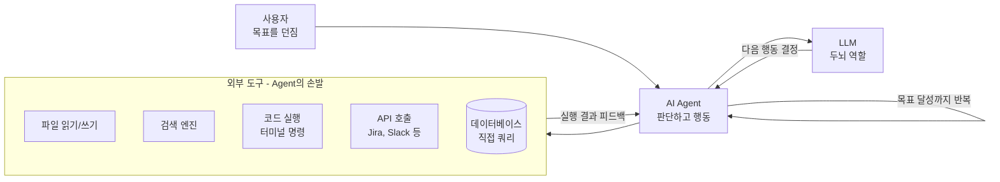
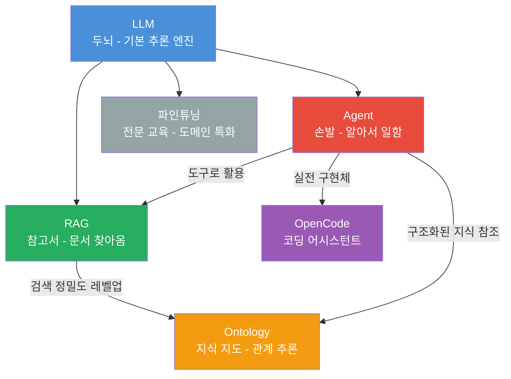
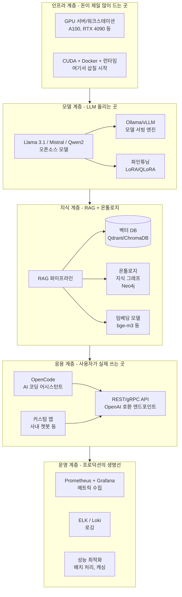

## 연재 소개

### 왜 온프레미스 LLM인가?

GPT API 쓰면 편하죠. 진짜 편합니다. 근데 한 달 청구서 보면 생각이 달라지거든요.

토큰당 과금이라 트래픽 좀 타면 월 수백만원 깨집니다. 사내에서 "우리도 AI 도입하자!" 하고 신나게 POC 만들었다가, 비용 리포트 나오는 순간 팀장님 표정이 굳어지는 거 다들 경험 있으시죠.

거기다 보안팀에서 **"고객 데이터 외부 전송 안 됩니다"** 하면 게임 끝이에요. 금융권, 의료, 공공기관 쪽은 이 한마디에 클라우드 LLM 프로젝트가 통째로 날아갑니다.

**보안 및 프라이버시 - 이게 제일 큰 이슈입니다**
- 고객 데이터, 소스코드가 OpenAI 서버로 전송되는 구조 → 보안 심사에서 100% 걸립니다
- 금융권은 개인신용정보, 의료는 진료기록, 국방은 뭐... 말할 필요도 없죠
- ISMS 인증 받으려면 데이터 흐름을 전부 설명해야 하는데, "외부 API로 보냅니다"는 통과 못 합니다
- 최근엔 AI 관련 규제가 더 세져서 유럽 거래처 있으면 EU AI Act도 신경 써야 하더라고요

**비용 - 처음엔 싸 보이는데 진짜 비용은 나중에 터집니다**
- GPT-4o 기준 input $2.5/1M tokens, output $10/1M tokens. 하루 1만 건 처리하면 월 $3,000~$5,000 그냥 나갑니다
- 직원 500명이 매일 쓰기 시작하면? 연 1억 넘어요
- 그런데 GPU 서버 한 대 (A100 80GB 기준) 사면 3,000~4,000만원이고, 2년이면 뽕 뽑거든요
- 물론 GPU 서버 운영 인건비, 전기세, 냉각 비용도 계산해야 합니다. 이것도 만만치 않아요

**커스터마이징 - 진짜 실무에서는 이게 핵심입니다**
- "우리 회사 코딩 컨벤션에 맞게 코드 리뷰해줘" → 파인튜닝 필요
- "사내 위키 기반으로 답변해줘" → RAG 필요
- "응답 시간 200ms 안에 와야 해" → vLLM 세팅, 모델 경량화 필요
- 폐쇄망(air-gapped) 환경이면 인터넷 자체가 안 되니까 온프레미스 말고는 답이 없습니다

이 연재에서는 실제로 **삽질하면서 얻은 경험**을 바탕으로 온프레미스 LLM 구축 전 과정을 다룹니다. 이론만 나열하는 건 누구나 할 수 있으니까, "실제로 해보니까 이게 문제였다"에 초점을 맞출 예정이에요.

---

## 핵심 개념 배경

본격적으로 들어가기 전에 핵심 개념들을 한번 정리하고 갑시다. 이거 안 잡고 가면 나중에 아키텍처 얘기할 때 뭐가 뭔지 헷갈리거든요. 교과서 스타일 말고, 실무에서 이 개념들이 왜 필요한지 위주로 설명할게요.

### LLM (Large Language Model)

쉽게 말해서 **겁나 큰 언어 AI**입니다. 파라미터가 수십억~수천억 개인 신경망인데, 인터넷에 있는 텍스트를 거의 다 학습해서 "다음 단어 예측"을 합니다.

이게 별거 아닌 것 같은데, 이 단순한 원리가 번역, 요약, 코딩, 논리 추론까지 다 해내더라고요. 처음에 GPT-3 나왔을 때 "에이 설마" 했는데, GPT-4 쓰고 나서 "아 이거 진짜구나" 싶었습니다.

- **기본 원리**: 엄청난 양의 텍스트 학습 → "다음 토큰 예측"을 반복. 이 단순한 메커니즘이 코딩, 번역, 수학 문제 풀이까지 가능하게 만듦
- **한계 - 이걸 모르면 프로덕션에서 사고 납니다**:
  - 학습 데이터 이후 정보를 모름 (지식 컷오프). "어제 나온 라이브러리 알아?" → 못 알아듣습니다
  - 환각(hallucination) 진짜 심각합니다. 자신 있는 어투로 완전 틀린 답변을 합니다. 코드에서 존재하지 않는 API를 자신 있게 추천하는 거 겪어보면 소름 돋아요
  - 도메인 전문 지식은 부족합니다. 우리 회사 사내 시스템 아키텍처를 알 리가 없죠
- **온프레미스 관점**: GPT-4, Claude 같은 거물급은 API로만 접근 가능합니다. 온프레미스에서는 **Llama 3.1, Mistral, Qwen2, DeepSeek** 같은 오픈소스 모델을 직접 GPU에 올려서 서빙하는 거예요. 성능이 상용 모델 대비 70~90% 수준인데, 특정 도메인에 파인튜닝하면 오히려 더 나을 때도 있습니다

### Agent (AI 에이전트)

LLM을 단순 챗봇에서 **"알아서 일하는 시스템"**으로 업그레이드한 개념입니다. 이게 요즘 AI 분야에서 제일 핫한 키워드예요.

```
일반 LLM:  사용자 질문 → LLM 답변 (1회성, 끝)
AI Agent:  사용자 목표 → 계획 짬 → 도구 실행 → 결과 확인 → 다시 생각 → 다시 실행 → ... → 목표 달성
```

카페에서 비유하면 이렇습니다. 일반 LLM은 "아메리카노 만드는 법 알려줘" 하면 레시피를 말해주고 끝. Agent는 직접 머신 앞에 가서 원두 갈고, 에스프레소 추출하고, 물 넣고, 잔에 담아서 가져다주는 겁니다.

- **핵심 구성요소** (이거 면접에서도 물어봅니다):
  - **Planning(계획)**: 복잡한 작업을 쪼갭니다. "이 코드 버그 고쳐줘" → 파일 읽기 → 분석 → 수정 → 테스트 실행 → 통과 확인
  - **Tool Use(도구 사용)**: 외부 도구를 직접 호출. 파일 읽기/쓰기, 터미널 명령, API 호출, DB 쿼리 등
  - **Memory(메모리)**: 대화 이력과 작업 컨텍스트를 기억. 안 그러면 매번 처음부터 다시 해야 함
  - **Observation(관찰)**: 도구 실행 결과를 보고 "됐나? 안 됐나?" 판단하는 피드백 루프
- **왜 중요한가**: LLM 단독은 "알려주는" 수준이지만, Agent로 만들면 **"직접 해주는"** 시스템이 됩니다. 이 차이가 엄청 커요
- **온프레미스 관점**: 로컬에서 Agent를 돌리면 사내 DB, 파일서버, CI/CD, Jira, Confluence에 직접 연동 가능합니다. 클라우드 API로는 방화벽 때문에 접근 못 하는 것들이죠

**Agent 아키텍처 한눈에 보기:**



**실제 사례 - 이미 쓰고 있는 것들:**
- **Claude Code / Cursor / OpenCode**: 코드 읽고, 수정하고, 테스트 돌리고, 커밋까지 하는 코딩 Agent. 요즘 개발자 생산성 도구의 끝판왕
- **AutoGPT / CrewAI / LangGraph**: 범용 Agent 프레임워크. 여러 Agent가 협업하는 구조도 가능
- **기업 내부 Agent**: "사내 규정에서 연차 관련 조항 찾아줘" → 검색 → 답변 → 관련 문서 링크까지 자동. 실제로 만들어보면 직원들이 엄청 좋아합니다

### RAG (Retrieval-Augmented Generation)

LLM의 최대 약점, **"모르면 지어낸다"**를 해결하는 핵심 기술입니다. 프로덕션에서 LLM 쓸 때 RAG 없이 나가면 사고 터집니다. 진짜로.

```
일반 LLM:   질문 → LLM(기억에만 의존) → 환각 위험 높음
RAG:       질문 → 관련 문서 검색 → 검색 결과 + 질문을 LLM에 전달 → 근거 기반 답변
```

비유하자면, 일반 LLM은 기억만으로 시험 보는 거고, RAG는 오픈북 시험인 겁니다. 오픈북이 당연히 정확도가 높겠죠.

- **동작 과정** (이게 실제로 구현하면 각 단계마다 삽질 포인트가 있습니다):
  1. **색인(Indexing)**: 문서를 적절한 크기로 잘라(청킹) → 임베딩 모델로 벡터 변환 → 벡터 DB에 저장. 여기서 "적절한 크기"가 진짜 애매합니다
  2. **검색(Retrieval)**: 사용자 질문도 벡터로 변환 → 벡터 DB에서 코사인 유사도 기반 검색. 생각보다 엉뚱한 결과가 잘 나옵니다
  3. **생성(Generation)**: 검색된 문서를 프롬프트에 끼워서 LLM에 전달 → 근거 기반 답변 생성. 컨텍스트 윈도우 제한 때문에 너무 많이 넣으면 안 됨
- **왜 필요한가**:
  - LLM을 재학습 안 해도 최신 정보 반영 가능. 문서만 업데이트하면 됨
  - 답변에 "출처: XX 문서 3페이지"처럼 근거를 달 수 있어서 신뢰성 확보
  - 파인튜닝은 비용도 크고 시간도 오래 걸리는데, RAG는 문서 넣기만 하면 바로 적용
- **주요 구성요소** (이 중 하나라도 잘못 고르면 전체 성능이 박살남):
  - **임베딩 모델**: 텍스트 → 벡터 변환. `bge-m3`, `multilingual-e5-large` 같은 다국어 모델 추천. 한국어만이면 `ko-sroberta-multitask`도 괜찮습니다
  - **벡터 DB**: `ChromaDB`(프로토타입용, 쉬움), `Qdrant`(프로덕션용, 빠름), `Milvus`(대규모용, 무거움). 프로덕션이면 Qdrant 추천합니다
  - **청킹 전략**: 고정 크기(512토큰)로 자르면 편한데 문맥이 잘림. 문장/문단 단위가 낫고, 요즘은 의미 기반 청킹도 나왔는데 아직 실험적이에요
  - **리랭킹(Reranking)**: 벡터 검색 결과를 다시 한번 정밀하게 순위 매기기. `bge-reranker-v2-m3` 같은 거 쓰면 체감 정확도가 확 올라갑니다

### Ontology (온톨로지)

처음 들으면 "뭐 이런 어려운 단어를..." 싶은데, 사실 개념은 간단합니다. **"지식을 구조화하는 방법"**이에요.

RAG가 "관련 문서를 찾아오는 비서"라면, Ontology는 **"지식 간의 관계를 정리해둔 지도"**입니다.

```
RAG 단독:       "A 서버에 연결된 DB는?" → 문서 검색 → A 서버 문서에 DB 언급이 있으면 찾고, 없으면 못 찾음
RAG + Ontology: "A 서버에 연결된 DB는?" → 지식 그래프 탐색 → A서버 → 연결 → [PostgreSQL, Redis, MongoDB] → 정확한 답변
```

- **핵심 개념** (사실 그래프 DB 써본 사람은 바로 이해할 겁니다):
  - **Entity(개체)**: 지식의 대상. 서버, 애플리케이션, 팀, 사람 등
  - **Relation(관계)**: 개체 간 연결. "A 서버는 PostgreSQL을 사용한다", "B팀이 A 서버를 관리한다"
  - **Attribute(속성)**: 개체의 특성. 서버의 IP, 스펙, 설치 일자 등
  - **Class/Hierarchy(분류 체계)**: 상위-하위 구조. 인프라 → 서버 → GPU 서버 → A100 서버
- **왜 RAG만으로 부족한가** (이걸 경험하면 온톨로지 필요성을 바로 느낌):
  - "B팀이 관리하는 모든 서버에서 돌아가는 애플리케이션 목록" 같은 **다단계 관계 질의**는 RAG로 거의 못 합니다
  - 문서에 직접 안 써 있는 **간접 관계** 추론. "A는 B에 의존하고, B는 C에 의존한다 → A는 간접적으로 C에 의존한다"
  - RAG는 키워드/의미 유사도 기반이라 구조적 관계를 이해 못 해요
- **구현 기술**:
  - **RDF/OWL**: W3C 표준. 학계에서 좋아하는 정식 방법
  - **Knowledge Graph**: Neo4j(가장 대중적), Apache Jena. 실무에서는 Neo4j가 압도적
  - **SPARQL**: 지식 그래프 쿼리 언어. SQL처럼 생겼는데 그래프용

### OpenCode

오픈소스 AI 코딩 어시스턴트입니다. 쉽게 말해서 **"보안 걱정 없는 Claude Code"**라고 보시면 됩니다.

- **왜 OpenCode인가** (이거 꽤 현실적인 이유가 있습니다):
  - GitHub Copilot, Cursor 쓰면 코드가 외부 서버로 전송됨 → 보안팀에서 "안 돼요" 합니다
  - OpenCode는 로컬 LLM(Ollama/vLLM)과 직접 연결 → 코드가 사내망 밖으로 안 나감
  - 터미널 기반이라 SSH로 접속한 서버에서도 사용 가능. GUI 없는 환경에서도 OK
  - 사실 Claude Code 느낌인데 로컬에서 돌린다고 생각하면 정확합니다
- **주요 기능**: 코드 자동완성, 리팩토링, 버그 분석, 테스트 생성, 문서 작성. Agent 모드도 지원
- **이 연재에서의 위치**: 온프레미스 LLM의 **킬러 앱** 역할입니다. 로컬 LLM + RAG(코드베이스 인덱싱) + Agent(파일 조작)가 합쳐진 실전 예시

### 각 개념의 관계 - 이걸 이해하면 전체 그림이 보입니다



| 개념 | 역할 | 실무 비유 |
|------|------|----------|
| **LLM** | 두뇌 - 이해하고 생성 | 똑똑한 신입. 기본기는 있는데 우리 회사 업무는 모름 |
| **Agent** | 손발 - 계획하고 실행 | 신입한테 노트북 주고 "알아서 해봐" 한 상태 |
| **RAG** | 참고서 - 필요한 자료 찾아옴 | 사내 위키 검색 기능 달아준 것 |
| **Ontology** | 지식 지도 - 관계를 보여줌 | 사내 시스템 연관도, 조직도 같은 구조화된 정보 |
| **OpenCode** | 전문 도구 - 코딩 특화 | 코딩만 전문으로 하는 AI 팀원 |
| **파인튜닝** | 사수 교육 - 도메인 역량 강화 | 신입을 3개월 OJT 시킨 것 |

---

## 전체 아키텍처 개요

"큰 그림부터 보자"는 얘기 많이 하는데, 온프레미스 LLM 구축도 레이어별로 보면 구조가 깔끔합니다. 아래에서 위로 쌓아 올라가는 구조예요.



**파이프라인 흐름 - 실제로는 이 순서대로 삽질합니다:**

1. **인프라 준비** → GPU 서버 구매(또는 확보), CUDA 설치, Docker 세팅. 여기서 CUDA 버전 미스매치로 하루 날리는 건 기본
2. **모델 배포** → Llama 모델 다운로드하고 Ollama나 vLLM으로 서빙. `ollama pull llama3.1` 한줄이면 되긴 하는데, vLLM으로 넘어가면 설정할 게 산더미
3. **지식 계층 구축** → RAG 파이프라인 만들고 벡터 DB 세팅. 온톨로지까지 하면 난이도가 확 올라감
4. **응용 개발** → OpenCode 같은 실제 도구 구축하거나, 사내 챗봇 만들기
5. **운영 시작** → 모니터링 달고, 느려지면 최적화하고, 모델 업데이트하고. 끝이 없음

---

## 연재 목차 (계획)

| 회차 | 제목 | 주요 내용 | 상태 |
|------|------|-----------|------|
| 01 | **아웃라인** | 연재 전체 구조, 아키텍처 개요 | 작성 중 |
| 02 | [**왜 온프레미스인가**](/series/on-prem-llm/02-why-on-premise/) | 클라우드 vs 온프레미스 비교, 의사결정 기준 | 예정 |
| 03 | [**인프라 준비**](/series/on-prem-llm/03-infrastructure/) | GPU 서버 선택, CUDA/cuDNN 설치, Docker 환경 | 예정 |
| 04 | [**Llama 모델 세팅**](/series/on-prem-llm/04-llama-setup/) | 모델 선택 기준, 다운로드, Ollama/vLLM 배포 | 예정 |
| 05 | [**OpenCode 활용**](/series/on-prem-llm/05-opencode/) | AI 코딩 어시스턴트 로컬 구축 | 예정 |
| 06 | [**RAG 파이프라인**](/series/on-prem-llm/06-rag-pipeline/) | 벡터 DB 선택, 임베딩 모델, 검색 파이프라인 구현 | 예정 |
| 07 | [**Ontology 설계**](/series/on-prem-llm/07-ontology/) | 지식 구조화, 도메인 온톨로지 설계, Neo4j | 예정 |
| 08 | [**RAG + Ontology 통합**](/series/on-prem-llm/08-rag-ontology/) | 지식 그래프 기반 검색, 하이브리드 접근 | 예정 |
| 09 | [**파인튜닝과 최적화**](/series/on-prem-llm/09-finetuning/) | LoRA/QLoRA 파인튜닝, quantization, 추론 가속 | 예정 |
| 10 | [**운영과 모니터링**](/series/on-prem-llm/10-operations/) | 실서비스 운영, 메트릭 수집, 트러블슈팅 후기 | 예정 |

---

## 참고 자료

### 공식 문서
- [Llama 모델](https://ai.meta.com/llama/) — Meta의 오픈소스 LLM
- [Ollama](https://ollama.ai/) — 로컬 LLM 실행의 시작점
- [vLLM](https://github.com/vllm-project/vllm) — 프로덕션 LLM 서빙의 표준
- [LangChain](https://python.langchain.com/) — RAG/Agent 프레임워크 (진입 장벽 낮음)
- [LlamaIndex](https://docs.llamaindex.ai/) — RAG 특화 프레임워크 (데이터 연결 강점)

### 벡터 DB
- [ChromaDB](https://www.trychroma.com/) — 프로토타이핑에 최고, 프로덕션은 좀...
- [Qdrant](https://qdrant.tech/) — 프로덕션 추천, Rust 기반으로 빠름
- [Milvus](https://milvus.io/) — 대규모 환경, 클러스터링 지원
- [Weaviate](https://weaviate.io/) — 하이브리드 검색 내장

### 온톨로지/지식 그래프
- [Protege](https://protege.stanford.edu/) — 온톨로지 시각적 설계 도구
- [RDF Primer](https://www.w3.org/TR/rdf-primer/) — RDF 입문 (W3C 공식)
- [Neo4j](https://neo4j.com/) — 실무에서 가장 많이 쓰는 그래프 DB

### 파인튜닝
- [PEFT (Parameter-Efficient Fine-Tuning)](https://github.com/huggingface/peft) — HuggingFace의 LoRA/QLoRA 구현
- [Axolotl](https://github.com/OpenAccess-AI-Collective/axolotl) — 파인튜닝 원스톱 프레임워크
- [Unsloth](https://github.com/unslothai/unsloth) — 2~5배 빠른 파인튜닝 (VRAM도 적게 씀)

### 커뮤니티
- [Hugging Face Forums](https://discuss.huggingface.co/) — 모델/라이브러리 관련 Q&A
- [r/LocalLLaMA](https://www.reddit.com/r/LocalLLaMA/) — 로컬 LLM 커뮤니티, 양자화/벤치마크 정보의 보고

---

## 마치며

이 연재는 실제로 **삽질하면서 얻은 경험**을 바탕으로 작성됩니다. 이론만 정리한 문서는 세상에 넘치니까, 여기서는 **"실제로 해보니까 이랬다"**에 집중할 예정이에요.

처음에는 데이터를 모으듯 넓게 다루다가, 점차 구조화해서 완성도 높은 가이드로 만들겠습니다. 각 회차에서 다루는 내용 중 궁금한 게 있으면 댓글로 남겨주세요. 실무 질문 환영합니다.

그리고 한 가지 미리 말씀드리면, 이 연재는 **"완벽한 정답"을 알려주는 게 아닙니다.** 온프레미스 LLM은 환경마다, 요구사항마다 최적의 구성이 다릅니다. 대신 **각 선택지의 트레이드오프**를 솔직하게 보여드릴 거예요. 그래야 여러분 환경에 맞는 판단을 내릴 수 있으니까요.

**다음 회차 예고:**
02화에서는 "왜 온프레미스 LLM인가?"라는 근본적인 질문에 정면으로 답합니다. 클라우드 API의 실제 비용, 온프레미스의 숨겨진 비용, TCO 분석 스프레드시트, 그리고 "그래서 우리 회사는 뭘 해야 하는가"에 대한 의사결정 프레임워크를 제시합니다.

---

*작성일: 2026-02-06*
*시리즈: 온프레미스 LLM 구축 (1/10)*
