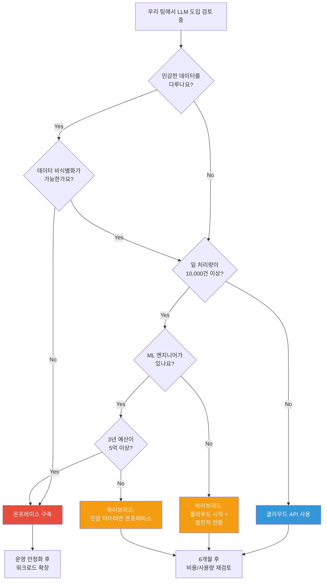
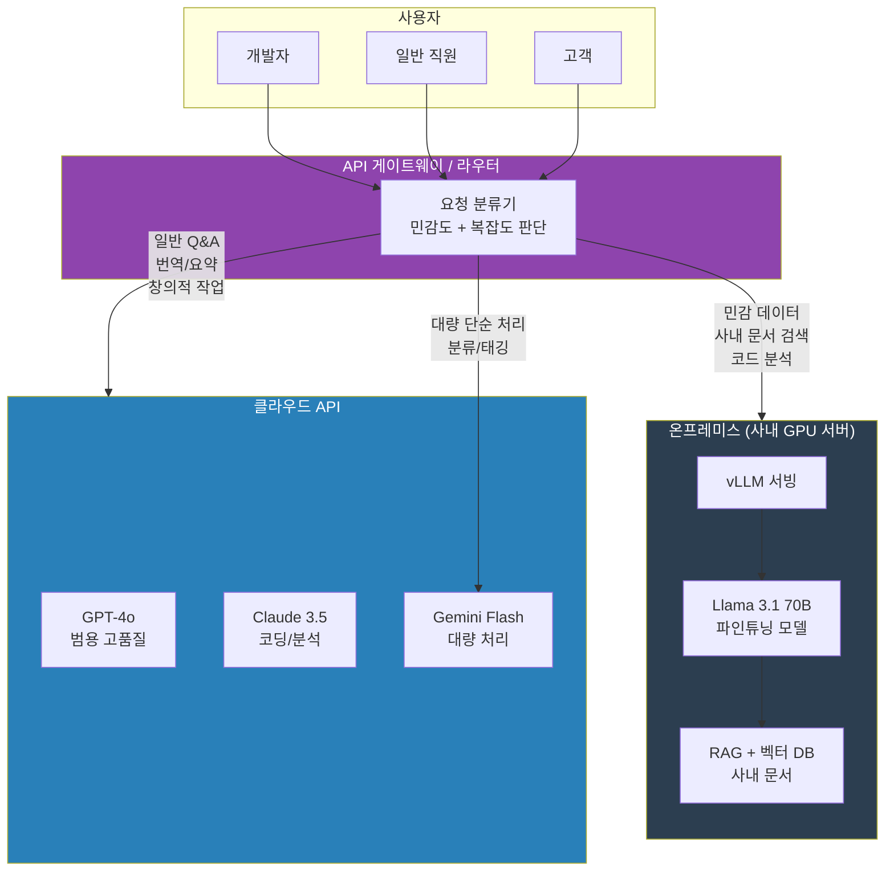

## 소개

"클라우드 쓰면 편하잖아요, 왜 굳이 온프레미스를?"

이 질문 한 달에 세 번은 듣습니다. 팀장님한테도 듣고, CTO한테도 듣고, 보안팀한테도 듣고. 그래서 이번 회차에서 제대로 정리합니다. 숫자로요.

결론부터 말하면 **무조건 온프레미스가 답은 아닙니다.** 오히려 대부분의 경우 클라우드로 시작하는 게 맞아요. 근데 어느 순간 규모가 커지거나, 보안 요구사항이 들어오거나, 청구서가 팀 예산을 초과하기 시작하면 — 그때부터 얘기가 달라집니다.

이 글에서는 감이 아니라 **숫자**로 판단할 수 있는 프레임워크를 드리겠습니다. "우리 상황에서 뭐가 맞는지"를 스스로 계산할 수 있게요. 엑셀 펴놓고 읽으시면 더 좋습니다.

> **스포일러**: 대부분의 팀에게 정답은 "하이브리드"입니다. 근데 그 비율을 어떻게 잡느냐가 핵심이에요.

---

## 클라우드 LLM의 현재 지형

먼저 2025년 기준으로 클라우드 LLM 시장이 어떻게 생겼는지 한눈에 봅시다. 주요 플레이어 정리입니다.

| 모델 | 제공사 | Input 가격 (1M tokens) | Output 가격 (1M tokens) | 컨텍스트 윈도우 | 강점 |
|------|--------|----------------------|------------------------|---------------|------|
| GPT-4o | OpenAI | $2.50 | $10.00 | 128K | 범용 최강, 멀티모달 |
| GPT-4 Turbo | OpenAI | $10.00 | $30.00 | 128K | 복잡한 추론 |
| Claude 3.5 Sonnet | Anthropic | $3.00 | $15.00 | 200K | 코딩, 긴 문서 분석 |
| Claude 3 Opus | Anthropic | $15.00 | $75.00 | 200K | 최고 품질 추론 |
| Gemini 1.5 Pro | Google | $1.25 | $5.00 | 2M | 초대형 컨텍스트, 가성비 |
| Gemini 1.5 Flash | Google | $0.075 | $0.30 | 1M | 초저가, 빠른 응답 |
| Mistral Large | Mistral | $2.00 | $6.00 | 128K | EU 규제 대응, 유럽 호스팅 |
| Command R+ | Cohere | $2.50 | $10.00 | 128K | RAG 특화 |

여기서 중요한 건 **가격만 보면 안 됩니다.** 각 모델마다 rate limit이 다르고, 같은 가격이라도 실제 성능 차이가 큽니다.

OpenAI 기준으로 Tier 1이면 분당 500 request, Tier 5까지 올려야 분당 10,000 request인데 — Tier 올리려면 누적 결제액이 있어야 합니다. 처음에 $100 결제해놓고 "왜 rate limit 걸리지?" 하는 분들 많이 봤어요.

Anthropic은 워크스페이스당 rate limit이 있고, Google은 무료 tier가 꽤 후하지만 프로덕션 레벨에서는 결국 비슷합니다.

---

## 클라우드 LLM API의 진짜 비용

표면 가격만 보면 "토큰당 몇 달러? 싸네!" 싶은데, 실제 청구서를 받으면 생각이 달라집니다. 진짜 비용을 시나리오별로 계산해봅시다.

### 기본 전제

- 평균 요청 1건당: input ~800 tokens, output ~400 tokens (일반적인 Q&A 기준)
- 코딩 어시스턴트: input ~2,000 tokens, output ~1,000 tokens (컨텍스트가 큼)
- 문서 분석: input ~4,000 tokens, output ~800 tokens

### 시나리오 A: 개발팀 10명, 코딩 어시스턴트

개발자가 하루에 AI 어시스턴트를 평균 50번 씁니다. 코드 리뷰, 리팩토링, 버그 분석 등.

| 항목 | 계산 |
|------|------|
| 일 요청 수 | 10명 x 50회 = 500건/일 |
| 월 요청 수 | 500 x 22일 = 11,000건/월 |
| Input tokens/월 | 11,000 x 2,000 = 22M tokens |
| Output tokens/월 | 11,000 x 1,000 = 11M tokens |
| **GPT-4o 월 비용** | ($2.5 x 22) + ($10 x 11) = **$165/월** |
| **Claude 3.5 Sonnet 월 비용** | ($3 x 22) + ($15 x 11) = **$231/월** |

$165~$231/월이면 솔직히 싼 겁니다. **이 규모면 클라우드가 답입니다.** 온프레미스 운영비가 이것보다 더 나와요.

### 시나리오 B: 사내 챗봇, 직원 500명

직원 500명이 사내 정보 검색용 챗봇을 하루 평균 10번씩 씁니다.

| 항목 | 계산 |
|------|------|
| 일 요청 수 | 500명 x 10회 = 5,000건/일 |
| 월 요청 수 | 5,000 x 22일 = 110,000건/월 |
| Input tokens/월 | 110,000 x 800 = 88M tokens |
| Output tokens/월 | 110,000 x 400 = 44M tokens |
| **GPT-4o 월 비용** | ($2.5 x 88) + ($10 x 44) = **$660/월** |
| **Claude 3.5 Sonnet 월 비용** | ($3 x 88) + ($15 x 44) = **$924/월** |

월 $660~$924. 연간 $8,000~$11,000. 아직은 클라우드가 유리해 보이죠. **근데 여기서 함정이 있습니다.**

사내 챗봇이면 RAG를 붙이게 되는데:
- **Embeddings API 비용**: 사내 문서 10만 건 인덱싱 + 매 쿼리마다 임베딩 = 월 $200~$500 추가
- **사용량 증가**: 챗봇이 쓸만하면 사용량이 2~3배로 뜁니다. 진짜로요
- **GPT-4o로는 부족**: 중요한 업무에 쓸 때 Claude Opus나 GPT-4 Turbo가 필요해지면 비용이 3~5배

현실적으로 6개월 후 비용은 초기 추정의 2~3배가 됩니다. **연 $20,000~$30,000** 각오해야 해요.

### 시나리오 C: 고객 대면 서비스, 일 10만 건

이게 비용 폭탄의 진짜 시작입니다.

| 항목 | 계산 |
|------|------|
| 일 요청 수 | 100,000건/일 |
| 월 요청 수 | 100,000 x 30일 = 3,000,000건/월 |
| Input tokens/월 | 3,000,000 x 800 = 2,400M tokens |
| Output tokens/월 | 3,000,000 x 400 = 1,200M tokens |
| **GPT-4o 월 비용** | ($2.5 x 2,400) + ($10 x 1,200) = **$18,000/월** |
| **Claude 3.5 Sonnet 월 비용** | ($3 x 2,400) + ($15 x 1,200) = **$25,200/월** |

**월 $18,000~$25,200.** 연간 $216,000~$302,400. 원화로 **연 3억~4억원.** 이 정도면 진지하게 온프레미스를 검토해야 합니다.

### 숨겨진 비용들

위 계산에 안 들어간 것들:

| 숨겨진 비용 | 설명 | 대략적인 금액 |
|------------|------|-------------|
| Embeddings API | 벡터 변환 비용 | 월 $200~$2,000 |
| Fine-tuning | 모델 맞춤 학습 | 건당 $500~$10,000 |
| Rate limit 해제 | 높은 tier 유지 비용 | 선결제 필요 |
| 토큰 오버헤드 | 시스템 프롬프트, few-shot 예시 | 실제 비용의 30~50% 추가 |
| 재시도 비용 | 실패/타임아웃 시 재호출 | 전체의 5~10% |
| 프롬프트 엔지니어링 | 이것도 인건비입니다 | 인력 비용 별도 |

> **현실 체크**: POC 때 월 $50이었던 비용이 전사 오픈하고 6개월 후에 월 $5,000이 된 적 있습니다. 매번 비용 추정할 때 "이 정도면 괜찮겠지" 하고 시작하는데, 사용량은 항상 예상을 초과합니다.

---

## 온프레미스의 진짜 비용

"GPU 사면 끝 아니에요?" — 아닙니다. GPU는 시작일 뿐입니다.

### 하드웨어 비용

2025년 기준 한국 시장 가격입니다. (부가세 포함, 서버 구성 기준)

| GPU | VRAM | 성능 (추론) | 단가 | 서버 구성 비용 | 비고 |
|-----|------|------------|------|-------------|------|
| NVIDIA A100 80GB | 80GB | 매우 높음 | ~2,000만원 | 4,000~5,000만원 | 데이터센터 표준 |
| NVIDIA H100 80GB | 80GB | 최고 | ~5,000만원 | 1.2~1.5억원 | 돈이 남으면 이거 |
| NVIDIA RTX 4090 | 24GB | 높음 | ~300만원 | 600~800만원 | 가성비 왕 |
| NVIDIA RTX A6000 | 48GB | 높음 | ~700만원 | 1,500~2,000만원 | 48GB가 필요할 때 |
| NVIDIA L40S | 48GB | 높음 | ~1,200만원 | 2,500~3,000만원 | A100 대체재 |

**모델별 필요 GPU:**
- 7B 모델 (Llama 3.1 8B): RTX 4090 1장이면 충분
- 13B 모델: RTX 4090 1~2장 또는 A100 1장
- 70B 모델: A100 2~4장 또는 H100 2장 (양자화하면 줄일 수 있음)
- 405B 모델: H100 8장... 이건 솔직히 돈이 많아야 합니다

### 월 운영 비용

GPU 서버 1대(A100 80GB x 2장, 300W TDP 기준) 24시간 상시 가동 시:

| 비용 항목 | 월 비용 | 산출 근거 |
|----------|--------|----------|
| **전기세** | 25~35만원 | GPU 600W + 서버 200W = 800W, 24h x 30일 = 576kWh, kWh당 약 150원 (산업용 전력 고압 기준, 기본요금 포함) |
| **냉각/공조** | 10~20만원 | 서버실 에어컨. 여름엔 2배. IDC 코로케이션이면 상면비에 포함 |
| **네트워크** | 5~10만원 | 사내망이면 추가 비용 거의 없음. 전용선이면 별도 |
| **스토리지** | 5~10만원 | 모델 파일, 로그, 벡터 DB. NAS나 SSD 감가상각 |
| **백업/재해복구** | 5~10만원 | 없으면 장애 때 울게 됩니다 |
| **소계 (인프라)** | **50~85만원** | 서버 1대 기준 |

여기에 **인건비**가 들어갑니다. 이게 진짜 큰 비용이에요.

| 인력 | 연봉 수준 | LLM 운영 비중 | 월 환산 비용 |
|------|----------|-------------|------------|
| 시니어 ML 엔지니어 | 8,000~12,000만원 | 50% (다른 업무 겸임 가정) | 330~500만원 |
| DevOps/인프라 | 6,000~9,000만원 | 20% | 100~150만원 |
| **인건비 소계** | | | **430~650만원** |

그러니까 서버 1대 운영하는 데 인프라비 50~85만원 + 인건비 430~650만원 = **월 480~735만원**. 연간 **5,760~8,820만원**.

"잠깐, ML 엔지니어 인건비를 왜 넣어요? 어차피 있는 인력인데?"라고 할 수 있는데, 그 인력이 LLM 운영에 시간을 쓰면 다른 프로젝트를 못 합니다. **기회비용도 비용입니다.**

### 1회성 비용 vs 반복 비용 정리

| 구분 | 항목 | 금액 |
|------|------|------|
| **1회성** | GPU 서버 하드웨어 | 4,000~15,000만원 |
| **1회성** | 서버실 구축/IDC 입주 | 500~2,000만원 |
| **1회성** | 초기 환경 세팅 (2~4주) | 인건비로 대체 |
| **반복 (월)** | 인프라 운영비 | 50~85만원 |
| **반복 (월)** | 인건비 | 430~650만원 |
| **반복 (연)** | 하드웨어 유지보수 | 구매가의 5~10% |

---

## TCO 비교: 숫자로 말하기

자, 이제 진짜 비교를 해봅시다. 3년 TCO(Total Cost of Ownership) 기준으로, 세 가지 규모별로 계산합니다.

### 소규모: 직원 50명, 일 1,000건

| | 클라우드 (GPT-4o) | 온프레미스 (RTX 4090 x 1) |
|---|---|---|
| **초기 비용** | $0 | 800만원 (~$6,000) |
| **1년차 운영** | $3,600 (~480만원) | 6,000만원 (인건비 포함) |
| **2년차 운영** | $3,600 | 6,000만원 |
| **3년차 운영** | $3,600 | 6,000만원 |
| **3년 합계** | **$10,800 (~1,440만원)** | **18,800만원** |

**판정: 클라우드 압승.** 이 규모에서 온프레미스 구축하면 돈 낭비입니다. 인건비가 운영비의 90%인데, 이 정도 트래픽에 전담 인력을 둘 이유가 없어요.

### 중규모: 직원 500명, 일 10,000건

| | 클라우드 (GPT-4o) | 온프레미스 (A100 x 2) |
|---|---|---|
| **초기 비용** | $0 | 5,000만원 (~$37,000) |
| **1년차 운영** | $36,000 (~4,800만원) | 7,200만원 (인건비 포함) |
| **2년차 운영** | $50,000 (~6,700만원) * | 7,200만원 |
| **3년차 운영** | $65,000 (~8,700만원) * | 7,200만원 |
| **3년 합계** | **$151,000 (~20,200만원)** | **26,600만원** |

\* 사용량 증가 반영 (연 30% 증가 가정)

**판정: 비슷하지만 클라우드가 약간 유리.** 근데 여기서 중요한 포인트가 있습니다:
- 클라우드는 사용량 증가에 비례해서 비용이 올라감
- 온프레미스는 서버 용량 안에서는 비용이 고정
- **3년차에 사용량이 2배로 뛰면 클라우드가 역전당합니다**

보안 요구사항까지 있으면? 온프레미스가 유리해집니다.

### 대규모: 직원 5,000명+, 일 100,000건

| | 클라우드 (GPT-4o) | 온프레미스 (A100 x 8, 서버 2대) |
|---|---|---|
| **초기 비용** | $0 | 20,000만원 (~$150,000) |
| **1년차 운영** | $216,000 (~28,800만원) | 12,000만원 |
| **2년차 운영** | $280,000 (~37,400만원) * | 12,000만원 |
| **3년차 운영** | $364,000 (~48,600만원) * | 14,000만원 ** |
| **3년 합계** | **$860,000 (~114,800만원)** | **58,000만원** |

\* 사용량 연 30% 증가
\** GPU 추가 1대 반영

**판정: 온프레미스 압도적 승리.** 3년 기준으로 클라우드 대비 **50% 절감.** 차이가 56,800만원, 약 5.7억원입니다. A100 서버를 몇 대 더 사고도 남는 돈이에요.

### 손익분기점

```
월 클라우드 비용 > 월 온프레미스 운영비 + (초기비용 / 상각개월수)
```

대략적인 손익분기점:
- **RTX 4090 1대 구성**: 월 클라우드 비용 $800 이상이면 온프레미스 검토
- **A100 2장 구성**: 월 클라우드 비용 $3,000 이상이면 온프레미스 검토
- **H100 클러스터**: 월 클라우드 비용 $15,000 이상이면 온프레미스 검토

> **핵심**: 온프레미스의 비용 구조는 "계단형"입니다. 서버 용량 안에서는 트래픽이 늘어도 비용이 안 늘어요. 클라우드는 "비례형"이라 트래픽에 정비례합니다. 사용량이 많을수록 온프레미스가 유리해지는 구조입니다.

---

## 보안과 규제 - 이게 사실 제일 큰 변수

TCO 계산을 아무리 잘 해도, 보안팀에서 "안 됩니다" 한마디 하면 그걸로 끝이에요. 산업별로 어떤 규제가 있고, 클라우드 LLM을 쓸 수 있는지 정리합니다.

### 산업별 규제 현황

| 산업 | 적용 법규/인증 | 데이터 분류 | 클라우드 LLM 가능? | 대안 |
|------|-------------|-----------|-------------------|------|
| **금융** | 전자금융거래법, ISMS-P, 개인신용정보법 | 고객 신용정보, 거래내역, 계좌정보 | **거의 불가.** 개인신용정보 외부 전송 금지 | 온프레미스 필수 |
| **의료** | 의료법, 개인정보보호법, HIPAA(해외) | 진료기록, 처방정보, 의료영상 | **불가.** 민감정보 해당 | 온프레미스 필수 |
| **공공** | 클라우드보안인증(CSAP), 국가정보보안기본지침 | 공공 데이터, 민원 정보 | **CSAP 인증 클라우드만 가능.** LLM API는 대부분 미인증 | 온프레미스 or CSAP 인증 환경 |
| **국방** | 군사기밀보호법, 보안업무규정 | 군사기밀, 작전정보 | **절대 불가.** 폐쇄망 필수 | 온프레미스 (에어갭) |
| **일반 기업** | 개인정보보호법, ISMS | 고객 PII, 사내 기밀 | **가능하지만 주의 필요.** 데이터 비식별화 필수 | 클라우드 + 데이터 마스킹 or 하이브리드 |
| **EU 진출 기업** | GDPR, EU AI Act | EU 시민 개인정보 | **가능하지만 DPA 필수.** 데이터 처리 계약 체결 필요 | EU 리전 호스팅 or 온프레미스 |

### 구체적인 법규 포인트

**개인정보보호법 (한국)**
- 제17조: 개인정보의 제3자 제공 시 동의 필요
- 제28조의2: 가명처리된 정보도 안전조치 의무
- 외부 LLM API에 개인정보가 포함된 프롬프트를 보내면? **제3자 제공에 해당**할 수 있습니다

**ISMS-P 인증**
- 2.9.1 데이터 흐름 관리: 개인정보 처리 흐름을 명확히 문서화해야 함
- "프롬프트에 고객 데이터가 포함되어 외부 API로 전송됩니다"라고 심사원한테 말하면 어떻게 될까요? 네, 보완조치 나옵니다

**EU AI Act (2025년 시행)**
- 고위험 AI 시스템은 투명성, 데이터 거버넌스, 인적 감독 요구
- LLM 기반 의사결정 시스템이 고위험으로 분류될 수 있음
- 모델 학습 데이터의 출처 문서화 의무 — 클라우드 API는 이걸 증명하기 어려움

### "보안팀과의 대화" 실제 시나리오

이런 일이 실제로 일어납니다.

**개발팀**: "GPT API로 사내 챗봇 만들었는데요, 데모 보여드릴게요."
**보안팀**: "잠깐, 그 API 호출할 때 데이터가 어디로 가나요?"
**개발팀**: "OpenAI 서버로요... 미국에 있는..."
**보안팀**: "우리 고객 데이터가 미국 서버로 전송된다고요?"
**개발팀**: "아, OpenAI에서 데이터 학습에 안 쓴다고 했어요."
**보안팀**: "그거 계약서에 있어요? DPA 체결했어요? ISMS 심사 때 이거 어떻게 설명할 건데요?"
**개발팀**: "..."
**보안팀**: "3개월 뒤에 ISMS 갱신 심사인데, 이거 그전에 정리해주세요."

이 대화 후에 보통 두 가지 길 중 하나를 갑니다:
1. 데이터 비식별화 파이프라인 구축 (2~3개월 소요) → 클라우드 유지
2. 온프레미스 전환 (3~6개월 소요) → 보안 이슈 근본 해결

어느 쪽이든 **추가 비용과 시간이 듭니다.** 처음부터 보안팀과 얘기하세요.

---

## 성능과 레이턴시

비용과 보안 다음으로 중요한 건 성능입니다. 특히 레이턴시와 가용성.

### 레이턴시 비교

| 항목 | 클라우드 API | 온프레미스 |
|------|-----------|----------|
| 네트워크 왕복 | 50~200ms (서울↔미국) | 0~1ms (사내망) |
| TTFT (첫 토큰까지) | 300~2,000ms | 50~500ms |
| 토큰 생성 속도 | 30~80 tokens/sec | 20~60 tokens/sec (GPU에 따라 다름) |
| P99 레이턴시 | 피크 시간에 3~10초 | 일정함 |

클라우드 API의 레이턴시는 **변동성**이 문제입니다. 평소에는 빠른데, 피크 타임에 갑자기 느려지거나 타임아웃이 납니다. OpenAI API가 바빠지는 미국 업무시간(한국 밤~새벽)에 특히 심해요.

온프레미스는 절대적인 속도는 클라우드 대형 모델보다 느릴 수 있지만, **일정한 레이턴시**를 보장합니다. 사용자 경험 측면에서는 이게 더 중요할 때가 많아요.

### Rate Limiting

클라우드 API의 숨은 복병입니다.

| 제공사 | 기본 tier 제한 | 최대 tier 제한 |
|--------|-------------|-------------|
| OpenAI (GPT-4o) | 500 RPM, 30,000 TPM | 10,000 RPM, 10M TPM |
| Anthropic (Claude) | 50 RPM, 40,000 TPM | 4,000 RPM, 4M TPM |
| Google (Gemini) | 360 RPM | 1,000 RPM |

RPM: Requests Per Minute, TPM: Tokens Per Minute

직원 500명이 동시에 쓰기 시작하면 기본 tier로는 절대 안 됩니다. Tier 올리는 데도 시간과 비용이 들고, 최대 tier도 대규모 서비스에는 부족할 수 있어요.

온프레미스는? **rate limit이 없습니다.** GPU가 처리할 수 있는 만큼 무한정 처리합니다. vLLM으로 배치 처리하면 동시 요청도 효율적으로 처리할 수 있고요.

### 가용성

클라우드 API 장애는 생각보다 자주 일어납니다.

OpenAI 기준으로 2024년에만 크고 작은 장애가 월 1~2회 발생했습니다. 장애 시간이 30분~수 시간인 경우도 있었고요. 우리 서비스가 OpenAI API에 의존하면, OpenAI 장애 = 우리 서비스 장애입니다.

온프레미스는 우리가 직접 관리하니까 장애 원인을 파악하고 대응할 수 있습니다. 물론 우리가 관리를 잘해야 한다는 전제가 있지만, 적어도 외부 의존성은 없어요.

> **실화**: 고객 데모 당일 OpenAI API가 1시간 동안 장애가 났습니다. 데모는 망했고, 그 후로 온프레미스 백업 추론 서버를 두기 시작했어요.

---

## 의사결정 프레임워크

자, 이제 실제로 "우리는 뭘 해야 하는가"를 결정할 차례입니다. 아래 플로우차트를 따라가보세요.



### 상황별 추천 요약

| 상황 | 추천 | 이유 |
|------|------|------|
| 스타트업, 10명 이하 | **클라우드** | 초기 비용 0, 빠른 시작 |
| 중소기업, 보안 요구 없음 | **클라우드** | 운영 부담 없음 |
| 중소기업, 보안 요구 있음 | **하이브리드** | 민감 데이터만 온프레미스 |
| 대기업, 일 10,000건+ | **하이브리드 or 온프레미스** | TCO 절감 |
| 금융/의료/공공 | **온프레미스** | 규제 준수 필수 |
| 국방/폐쇄망 | **온프레미스 (에어갭)** | 선택의 여지 없음 |
| POC/프로토타입 | **클라우드** | 빠른 검증이 핵심 |
| 프로덕션 대규모 | **온프레미스 or 하이브리드** | 비용 최적화 |

---

## 하이브리드 접근 - 현실적인 답

대부분의 기업에게 현실적인 답은 하이브리드입니다. 전부 클라우드도, 전부 온프레미스도 아닌, **워크로드별로 나누는 전략**이 가장 합리적이에요.

### 하이브리드 아키텍처



### 워크로드별 배치 기준

| 워크로드 | 배치 | 이유 |
|---------|------|------|
| **코딩 어시스턴트** | 온프레미스 | 소스코드가 외부로 나가면 안 됨 |
| **사내 문서 검색 (RAG)** | 온프레미스 | 사내 기밀 문서 포함 |
| **고객 상담 챗봇** | 하이브리드 | 비식별화 후 클라우드, 민감 건은 온프레미스 |
| **일반 Q&A / 번역** | 클라우드 | 민감 데이터 없음, 품질이 중요 |
| **대량 문서 분류** | 클라우드 (저가 모델) | 볼륨이 크고 단순 작업 |
| **코드 리뷰** | 온프레미스 | 소스코드 보안 |
| **마케팅 콘텐츠 생성** | 클라우드 | 창의성이 중요, 보안 이슈 없음 |

### 마이그레이션 경로: 클라우드에서 시작하는 이유

처음부터 온프레미스로 가지 마세요. 클라우드로 시작해서 점진적으로 전환하는 게 현명합니다.

**Phase 1 (1~3개월): 클라우드 Only**
- GPT-4o 또는 Claude API로 POC 구축
- 사용 패턴, 트래픽 양, 비용 데이터 수집
- 이 단계에서 "실제로 얼마나 쓰는지" 감을 잡음

**Phase 2 (3~6개월): 온프레미스 파일럿**
- RTX 4090 1~2장으로 작은 모델(7B~13B) 서빙 시작
- 민감 데이터 워크로드부터 온프레미스로 이전
- 클라우드와 병행 운영하면서 성능 비교

**Phase 3 (6~12개월): 하이브리드 안정화**
- 워크로드별 라우팅 자동화
- 온프레미스 비율 점진적 확대
- A100/H100으로 스케일업 검토

**Phase 4 (12개월~): 최적화**
- 파인튜닝으로 오픈소스 모델 성능 향상
- 클라우드 의존도를 필수 워크로드만으로 축소
- TCO 최적화

> **왜 이 순서인가**: 처음부터 온프레미스로 가면 "이 모델이 우리 용도에 맞는지"도 모르는 상태에서 수천만원을 투자하게 됩니다. 클라우드로 먼저 검증하고, 확신이 생겼을 때 전환하는 게 리스크가 훨씬 낮아요.

---

## 실무에서 겪는 현실

이론은 이론이고, 실제로 겪어보면 예상 못 한 일들이 생깁니다. 실제 사례 몇 개 공유합니다.

### 사례 1: API 과금 폭탄

개발팀에서 코딩 어시스턴트 POC를 만들었습니다. 3명이서 테스트할 때는 월 $50이었어요. "와, 이 정도면 전사 도입해도 되겠는데?" 하고 전 직원 200명에게 오픈했습니다.

첫 달: $800. "음, 좀 올랐네."
둘째 달: $2,300. "어? 사람들이 생각보다 많이 쓰네."
셋째 달: $4,700. "...팀장님, 예산 회의 잡아주세요."

**교훈**: 사용량은 항상 예상의 3~5배입니다. POC 비용 x 인원 수로 단순 계산하면 안 됩니다. 사용량 증가 커브를 반드시 반영하세요.

### 사례 2: 보안 심사 한 방

3개월 동안 Claude API 기반 사내 문서 검색 시스템을 만들었습니다. 데모도 잘 됐고, 현업에서도 "이거 좋다!" 피드백이 왔어요. 전사 배포 승인을 받으려고 보안팀에 검토 요청을 넣었는데...

"고객 상담 기록이 포함된 문서를 외부 API로 보내는 건 개인정보보호법 위반 소지가 있습니다."

3개월 프로젝트가 한 문장에 멈췄습니다. 이후 2개월 동안 데이터 비식별화 파이프라인을 추가로 만들어야 했어요.

**교훈**: 프로젝트 시작할 때 보안팀과 먼저 얘기하세요. 나중에 가서 "안 됩니다" 듣는 것보다 처음에 제약조건을 확인하는 게 100배 낫습니다.

### 사례 3: GPU 서버 리드타임

온프레미스로 가기로 결정하고 A100 서버를 발주했습니다. "납품 4~6주 예상"이라더니, 실제로는 3개월이 걸렸어요. 그 사이에 요구사항은 바뀌고, 경영진은 "언제 되냐"고 물어보고, 개발팀은 할 게 없어서 다른 프로젝트 투입되고...

서버가 도착했을 때는 처음 계획했던 팀 구성이 바뀌어 있었습니다.

**교훈**: GPU 서버는 발주 리드타임이 깁니다. 특히 H100 같은 최신 GPU는 반 년 기다리는 경우도 있어요. 계획을 세울 때 하드웨어 조달 일정을 반드시 넣으세요. 그리고 대기 기간 동안 클라우드로 먼저 시작하는 게 현명합니다.

### 사례 4: "GPU 사면 끝이잖아" 그 후

RTX 4090 4장으로 Llama 2 70B를 서빙하겠다고 했습니다. 하드웨어 세팅까지는 순조로웠어요. 그런데...

- CUDA 버전과 PyTorch 버전 충돌로 이틀 삽질
- vLLM 설치했는데 특정 GPU 조합에서 NCCL 에러 발생
- 모델 로딩에 10분 걸리는 걸 보고 경악
- 서빙은 되는데 동시 요청 10개 넘으면 OOM(Out of Memory) 발생
- 양자화(GPTQ) 적용하니 성능이 20% 떨어짐
- 그래서 AWQ로 바꿨는데 이번엔 또 다른 호환성 이슈

결국 "안정적으로 서빙 가능한 상태"까지 4주가 걸렸습니다. 그 4주 동안 ML 엔지니어는 다른 일을 전혀 못 했고요.

**교훈**: 온프레미스는 "운영"입니다. 한번 세팅하고 끝이 아니라, CUDA 업데이트, 모델 새 버전, 드라이버 패치, 장애 대응 등 지속적인 관리가 필요합니다. 이 운영 비용을 빠뜨리면 TCO 계산이 틀어져요.

---

## 마치며

정리하겠습니다.

**클라우드가 맞는 경우:**
- 소규모 팀, 적은 트래픽
- 빠르게 검증하고 싶을 때 (POC)
- ML 엔지니어가 없을 때
- 민감한 데이터를 다루지 않을 때

**온프레미스가 맞는 경우:**
- 보안/규제 요구사항이 있을 때
- 대규모 트래픽 (일 10,000건+)
- 3년 이상 장기 운영 계획
- ML 엔지니어 인력이 있을 때

**하이브리드가 맞는 경우:**
- 위 두 가지가 섞여 있을 때 (대부분의 기업)

핵심은 **감이 아니라 숫자로 판단하는 것**입니다. 이 글에서 제시한 TCO 계산 프레임워크에 여러분 회사의 실제 숫자를 넣어보세요. 결론이 보일 겁니다.

그리고 하나 더 — **처음부터 완벽한 결정을 할 필요 없습니다.** 클라우드로 시작해서 데이터를 모으고, 그 데이터를 기반으로 온프레미스 전환 여부를 판단하는 게 가장 현명한 접근입니다.

> **다음 회차 예고**: 03화에서는 "그래서 온프레미스 하기로 했다, 이제 뭘 해야 하나?"에 답합니다. GPU 서버 선택(A100 vs H100 vs RTX 4090), CUDA/cuDNN 설치에서 삽질하는 구간, Docker 환경 구성, 그리고 "서버실이 없으면 어떻게 하나?"까지. 실제 인프라 구축 과정을 다룹니다.

---

*시리즈: 온프레미스 LLM 구축 (2/10)*
