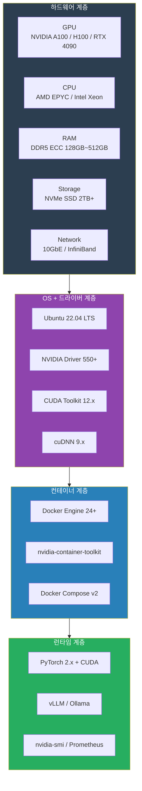

## 소개

02화에서 "그래서 온프레미스 하기로 했다"는 결론을 내셨다면 — 축하합니다. 이제부터 **진짜 삽질**이 시작됩니다.

GPU 사면 끝이라고요? 천만에요. GPU는 그냥 시작점이고, 거기서부터 CUDA 버전 지옥, Docker GPU 연동 안 되는 미스터리, 드라이버 충돌, cuDNN 호환성 문제, 그리고 "분명 nvidia-smi는 되는데 왜 컨테이너에서 안 잡히지?"라는 세계관이 펼쳐집니다.

이 회차는 **"처음 GPU 서버 만지는 사람"**이 읽고 따라할 수 있도록 정리했습니다. 하드웨어 선택부터 소프트웨어 스택 설치, 폐쇄망 대응, 네트워킹, 모니터링까지 — 서버에 전원 꽂는 순간부터 `docker run --gpus all`이 정상 동작하는 순간까지의 모든 과정입니다.

제가 지금까지 겪은 인프라 삽질의 80%는 이 단계에서 벌어졌습니다. 나머지 20%는 10화(운영편)에서 다룹니다.

> **이건 꼭 알아두세요:** 이 회차에서 다루는 내용은 **한 번 세팅하면 거의 안 바뀌는 기반 인프라**입니다. 그래서 처음에 제대로 잡는 게 중요해요. 여기서 대충 하면 04화(모델 서빙)부터 매번 이상한 에러와 마주치게 됩니다. 시간 좀 들이더라도 이 단계를 꼼꼼하게 하세요.

---

## 전체 인프라 스택 구조

먼저 우리가 쌓아 올릴 인프라 스택을 한눈에 봅시다. 아래에서 위로 올라가는 구조입니다.



각 계층이 제대로 세팅되어야 그 위 계층이 정상 동작합니다. 하드웨어에서 문제가 있으면 위에 뭘 올려도 안 되고, 드라이버가 틀어지면 Docker에서 GPU를 못 잡고, Docker 설정이 잘못되면 vLLM이 안 뜹니다.

이 글에서는 **아래에서부터 위로** 순서대로 다룹니다.

---

## GPU 선택 가이드

### NVIDIA GPU 라인업 총정리

2025~2026년 기준으로 LLM 서빙에 쓸 수 있는 NVIDIA GPU를 전부 정리합니다. AMD는 뒤에서 별도로 다룹니다.

| GPU | VRAM | 메모리 대역폭 | FP16 성능 | TDP | 가격대 (한국) | NVLink | 주 용도 |
|-----|------|-------------|----------|-----|------------|--------|---------|
| **H100 SXM** | 80GB HBM3 | 3.35 TB/s | 1,979 TFLOPS | 700W | 5,000~7,000만원 | 4세대 지원 | 학습+추론 최강. 돈이 남으면 이거 |
| **H100 PCIe** | 80GB HBM3 | 2.0 TB/s | 1,513 TFLOPS | 350W | 4,000~5,500만원 | 미지원 | H100인데 PCIe 폼팩터. SXM 대비 성능 약간 낮음 |
| **A100 SXM** | 80GB HBM2e | 2.0 TB/s | 624 TFLOPS | 400W | 2,000~3,000만원 | 3세대 지원 | 데이터센터 표준. 중고 가성비 최고 |
| **A100 PCIe** | 80GB HBM2e | 2.0 TB/s | 624 TFLOPS | 300W | 1,800~2,500만원 | 미지원 | 워크스테이션에 넣을 수 있는 A100 |
| **L40S** | 48GB GDDR6X | 864 GB/s | 733 TFLOPS | 350W | 1,200~1,800만원 | 미지원 | A100 대체재. 추론 특화 |
| **A6000 Ada** | 48GB GDDR6 | 960 GB/s | 1,457 TFLOPS | 300W | 800~1,100만원 | NVLink Bridge | 워크스테이션급. 48GB가 매력 |
| **RTX 4090** | 24GB GDDR6X | 1,008 GB/s | 661 TFLOPS | 450W | 250~350만원 | **미지원** | 가성비 왕. 24GB가 한계 |
| **RTX 4080 SUPER** | 16GB GDDR6X | 736 GB/s | 408 TFLOPS | 320W | 150~200만원 | 미지원 | 입문용. 7B 모델 가능 |
| **RTX 3090** | 24GB GDDR6X | 936 GB/s | 285 TFLOPS | 350W | 80~120만원 (중고) | NVLink Bridge | 중고 시장 가성비. 전력 효율 낮음 |
| **RTX A5000** | 24GB GDDR6 | 768 GB/s | 222 TFLOPS | 230W | 60~90만원 (중고) | NVLink Bridge | 중고 가성비. 발열 낮음 |

### GPU별 현실적인 코멘트

**H100** — "왕" 이긴 한데 가격도 왕입니다. H100 SXM 8장 서버 풀 세트가 1.5~2억인데, 이건 대기업이나 연구소 레벨입니다. 중소기업이 이걸 사면 CFO가 기절합니다. 다만 학습까지 할 거면 H100의 FP8 성능이 압도적이라 장기적으로는 가성비가 나옵니다.

**A100** — 2024~2025 기준으로 **가장 현실적인 선택**입니다. 중고 시장에서 80GB 모델이 1,500~2,000만원대로 내려왔어요. LLM 추론 용도로는 H100 대비 성능 차이가 생각보다 크지 않습니다 (학습은 차이 큼). NVLink 지원하니까 멀티 GPU 세팅도 깔끔하고요.

**L40S** — A100 대체재로 나온 건데, VRAM 48GB에 추론 성능이 꽤 좋습니다. 다만 HBM이 아니라 GDDR6X라 메모리 대역폭이 A100의 절반 이하예요. 대형 모델 서빙할 때 메모리 대역폭이 병목이 되면 체감 성능이 확 떨어집니다.

**RTX 4090** — 개인이나 소규모 팀의 **가성비 끝판왕**. 300만원 안팎으로 24GB VRAM에 추론 성능이 엄청납니다. 문제는 **24GB**라는 VRAM 한계. 7B~13B 모델은 OK인데 70B는 양자화해도 혼자 못 올립니다. 그리고 **NVLink 미지원**이라 멀티 GPU 세팅 시 PCIe 대역폭으로 통신해야 해서 효율이 떨어져요. 서버 케이스에 넣기도 애매합니다 (3슬롯 크기, 발열).

**RTX 3090 (중고)** — 2024년 후반부터 중고 시장에 80~120만원대로 풀리기 시작했습니다. 24GB VRAM에 가격 대비 괜찮은 성능. 다만 전력 소모가 350W에 발열이 심하고, CUDA 아키텍처가 Ampere라서 최신 최적화의 혜택을 못 받는 경우가 있어요.

### NVIDIA vs AMD: 현실

"AMD GPU가 더 싸지 않나요?" — 네, 하드웨어 가격은 쌉니다. MI300X가 192GB HBM3라서 VRAM만 보면 환상적이에요. 근데 **소프트웨어 생태계**가 문제입니다.

| 비교 항목 | NVIDIA | AMD |
|----------|--------|-----|
| CUDA / ROCm | CUDA (사실상 표준) | ROCm (아직 불안정) |
| PyTorch 지원 | 완벽 | 공식 지원이지만 이슈 빈번 |
| vLLM 지원 | 완벽 | 실험적 수준 |
| Docker GPU 연동 | nvidia-container-toolkit | 별도 설정 필요, 문서 부족 |
| 커뮤니티 레퍼런스 | 압도적 | 매우 적음 |
| 드라이버 안정성 | 안정적 | 간헐적 이슈 |
| 트러블슈팅 자료 | StackOverflow, 블로그 다수 | 찾기 어려움 |

솔직히 2025~2026 시점에서 프로덕션 LLM 서빙에 AMD GPU를 추천하기는 어렵습니다. ROCm이 빠르게 발전하고 있고, 대형 클라우드(Azure, AWS)에서 MI300X 인스턴스를 내놓고 있지만, **직접 온프레미스에서 운영**하려면 삽질 각오를 해야 합니다.

특히 폐쇄망 환경이면 ROCm 관련 이슈를 인터넷 없이 해결해야 하는데... 그건 진짜 고난의 행군입니다. 선택지가 있다면 NVIDIA 가세요.

### 구매 전략: 신품 vs 중고 vs 클라우드 렌탈

| 전략 | 장점 | 단점 | 추천 상황 |
|------|------|------|----------|
| **신품 구매** | 보증, 최신 아키텍처, 안정성 | 비쌈, 감가상각 | 프로덕션, 장기 운영 |
| **중고 구매** | 가성비 최고, 빠른 조달 | 보증 없음, 상태 리스크 | PoC, 개발/테스트 환경 |
| **클라우드 렌탈** | 초기비용 0, 유연한 스케일 | 월 비용 높음, 종속성 | 단기 프로젝트, 학습 용도 |
| **IDC 코로케이션** | 전력/냉각 해결, 네트워크 인프라 | 상면비 월 수십만원, 물리 접근 불편 | 자체 서버실 없는 경우 |

**중고 시장 팁:**
- A100 80GB 중고가 1,500~2,000만원대로 형성 (2025 하반기 기준). 채굴 시장 붕괴 이후 3090도 많이 풀렸음
- eBay, 국내 중고나라/번개장터, 서버 전문 중고 업체 확인
- **반드시 확인할 것**: GPU 메모리 에러 테스트 (`nvidia-smi -q | grep "Correctable"` 확인), 쿨러 상태, 시리얼 넘버 검증
- 채굴에 사용된 GPU는 24시간 풀로드 상태였으니 팬 베어링 마모, 메모리 칩 수명 주의

**클라우드 GPU 렌탈 옵션:**

| 서비스 | A100 80GB 시간당 | H100 시간당 | 최소 단위 | 특이사항 |
|--------|-----------------|------------|----------|---------|
| AWS (p4d/p5) | $32.77/hr (8x A100) | $98.32/hr (8x H100) | 시간 | 온디맨드 가격 기준 |
| GCP | $3.67/hr (1x A100) | $11.24/hr (1x H100) | 시간 | Spot이면 60~70% 할인 |
| Lambda Labs | $1.29/hr (1x A100) | $2.49/hr (1x H100) | 시간 | GPU 전문, 가격 경쟁력 |
| RunPod | $1.64/hr (1x A100) | $3.29/hr (1x H100) | 분 | Spot 가격 더 쌈 |
| Vast.ai | ~$0.80/hr (1x A100) | ~$2.00/hr (1x H100) | 시간 | P2P, 가격 최저 but 불안정 |

PoC 단계에서는 Lambda Labs나 RunPod로 시작하고, 확신이 생기면 하드웨어 구매로 전환하는 게 현명한 전략입니다.

---

## VRAM 요구사항 상세

GPU 선택에서 **VRAM이 사실상 전부**입니다. 컴퓨팅 성능(TFLOPS)은 추론 속도에 영향을 주지만, VRAM이 부족하면 모델을 아예 못 올립니다. "들어는 가는데 좀 느린" 것과 "아예 OOM(Out of Memory)으로 죽는" 것은 차원이 다릅니다.

### 왜 VRAM이 컴퓨팅보다 중요한가

LLM 추론의 병목은 대부분 **메모리 대역폭**입니다. 모델 파라미터를 GPU 메모리에서 읽어와야 연산을 할 수 있는데, 이 "읽기" 속도가 연산 속도보다 느리거든요. 이걸 **memory-bound**라고 합니다.

결론적으로:
1. VRAM이 충분해야 모델이 올라감 (필수 조건)
2. 메모리 대역폭이 높아야 빨리 읽음 (추론 속도)
3. 컴퓨팅 성능은 그 다음 (배치 처리 시 중요)

### 모델 크기별 VRAM 요구사항

| 모델 크기 | 파라미터 수 | FP16 VRAM | INT8 VRAM | INT4 (GPTQ/AWQ) | INT4 (GGUF Q4_K_M) | 대표 모델 |
|----------|-----------|----------|----------|----------------|---------------------|----------|
| **1~3B** | 1~3B | 2~6 GB | 1~3 GB | 0.8~2 GB | 1~2.5 GB | Llama 3.2 1B/3B, Phi-3 Mini |
| **7~8B** | 7~8B | 14~16 GB | 7~8 GB | 4~5 GB | 5~6 GB | Llama 3.1 8B, Mistral 7B |
| **13~14B** | 13~14B | 26~28 GB | 13~14 GB | 7~8 GB | 9~10 GB | Llama 2 13B, Qwen2.5 14B |
| **32~34B** | 32~34B | 64~68 GB | 32~34 GB | 18~20 GB | 22~24 GB | Qwen2.5 32B, CodeLlama 34B |
| **70~72B** | 70~72B | 140~144 GB | 70~72 GB | 38~42 GB | 44~48 GB | Llama 3.1 70B, Qwen2.5 72B |
| **405B** | 405B | 810 GB | 405 GB | 210~220 GB | 250~270 GB | Llama 3.1 405B |

> **VRAM 공식 (대략)**: FP16 VRAM ≈ 파라미터 수(B) × 2 bytes. INT8은 × 1, INT4는 × 0.5~0.6. 여기에 KV cache, activation 메모리가 추가되니 실제로는 **+20~30%** 여유를 두세요.

### GPU 조합별 서빙 가능한 모델

이게 실제로 가장 궁금하실 표입니다.

| GPU 구성 | 총 VRAM | FP16 가능 모델 | INT4 양자화 시 가능 모델 |
|---------|---------|-------------|---------------------|
| RTX 4080 SUPER × 1 | 16GB | 7B~8B (빠듯) | 13B |
| RTX 4090 × 1 | 24GB | 7B~8B (여유) | 13B~34B (빠듯) |
| RTX 4090 × 2 | 48GB | 13B~14B | 70B (빠듯) |
| A100 80GB × 1 | 80GB | 34B | 70B (여유) |
| A100 80GB × 2 | 160GB | 70B | 405B (빠듯) |
| H100 80GB × 2 | 160GB | 70B | 405B (빠듯) |
| H100 80GB × 4 | 320GB | 405B (FP8) | 405B (여유) |
| H100 80GB × 8 | 640GB | 405B (FP16) | 아무거나 |

**주의**: RTX 4090 멀티 GPU는 NVLink 미지원이라 PCIe 통신을 사용합니다. Tensor parallelism의 효율이 NVLink 대비 절반 이하로 떨어질 수 있어요. A100/H100은 NVLink로 고속 통신이 가능해서 멀티 GPU 스케일링이 훨씬 효율적입니다.

---

## 서버 구성 가이드

GPU만 좋다고 되는 게 아닙니다. CPU, RAM, 스토리지, 네트워크까지 밸런스가 맞아야 합니다.

### 규모별 추천 구성

#### 개인 / 학습용

| 항목 | 추천 사양 | 예산 |
|------|---------|------|
| GPU | RTX 4090 × 1 | 300만원 |
| CPU | AMD Ryzen 7 7700X 또는 Intel i7-13700K | 40~50만원 |
| RAM | DDR5 64GB (32GB × 2) | 20~30만원 |
| Storage | NVMe SSD 2TB | 15~25만원 |
| PSU | 1000W 80+ Gold | 15~20만원 |
| **합계** | | **~450만원** |

7B~13B 모델 서빙, 개인 개발 환경으로 충분합니다.

#### 소규모 팀 (5~20명)

| 항목 | 추천 사양 | 예산 |
|------|---------|------|
| GPU | RTX 4090 × 2 또는 A100 80GB × 1 | 600만 ~ 2,500만원 |
| CPU | AMD EPYC 7313P (16C) 또는 Intel Xeon w5-3425 | 100~200만원 |
| RAM | DDR5 ECC 128GB | 60~100만원 |
| Storage | NVMe SSD 4TB (모델용) + SATA SSD 2TB (로그/데이터) | 50~80만원 |
| Network | 10GbE NIC | 10~20만원 |
| 서버 케이스 | 4U 라크마운트 (GPU 냉각 고려) | 30~50만원 |
| PSU | 1600W 80+ Platinum (이중화 권장) | 30~50만원 |
| **합계** | | **900만 ~ 3,000만원** |

13B~70B 모델 양자화 서빙 가능. 동시 사용자 10~20명 처리.

#### 프로덕션 (50명+)

| 항목 | 추천 사양 | 예산 |
|------|---------|------|
| GPU | A100 80GB × 4 또는 H100 80GB × 2+ | 8,000만 ~ 1.5억원 |
| CPU | AMD EPYC 9354 (32C) 듀얼 | 400~600만원 |
| RAM | DDR5 ECC 512GB | 200~400만원 |
| Storage | NVMe SSD 8TB RAID (모델) + NAS 연결 (데이터) | 200~400만원 |
| Network | InfiniBand HDR 200Gbps (멀티 노드 시) | 100~300만원 |
| 서버 | Dell PowerEdge / Supermicro GPU 서버 | 본체만 1,000~2,000만원 |
| **합계** | | **1억 ~ 3억원** |

70B~405B 모델 서빙 가능. 동시 사용자 50명+ 처리. HA(고가용성) 구성 가능.

### CPU 선택 기준

LLM 추론에서 CPU는 주역이 아니지만, **전처리(토큰화), KV cache 관리, API 서버 운영**에 관여합니다.

- **코어 수**: GPU 1장당 최소 4~8 코어 확보. 4GPU면 32코어 이상 추천
- **클럭**: 토큰화는 싱글 스레드 성능이 중요. 3.5GHz 이상 추천
- **PCIe 레인**: GPU 멀티 장 시 PCIe 레인 수 확인. A100/H100은 PCIe 5.0 x16 필요
- **AMD vs Intel**: 서버용은 AMD EPYC이 PCIe 레인 수와 가성비에서 유리

### RAM 선택 기준

- **최소**: GPU VRAM과 동일 용량 (A100 80GB → RAM 80GB+)
- **권장**: GPU VRAM의 1.5~2배 (모델 로딩 시 CPU RAM 거쳐 가기 때문)
- **ECC 필수**: 프로덕션에서는 메모리 에러로 인한 추론 결과 오염 방지
- **채널 수**: 듀얼 채널 이상. 서버급은 옥타 채널

### 스토리지: NVMe vs SATA SSD

| 항목 | NVMe SSD | SATA SSD | HDD |
|------|---------|---------|-----|
| 순차 읽기 | 3,500~7,000 MB/s | 500~550 MB/s | 150~200 MB/s |
| 모델 로딩 시간 (70B, FP16) | ~20초 | ~3분 | ~15분 |
| 가격 (2TB) | 15~30만원 | 10~20만원 | 5~8만원 |
| 추천 용도 | 모델 파일 저장 | 로그, 중간 데이터 | 백업, 아카이브 |

**모델 파일은 반드시 NVMe에 두세요.** 70B FP16 모델이 ~140GB인데, SATA SSD로 로딩하면 3분, NVMe면 20초입니다. vLLM 재시작할 때마다 이 차이를 체감합니다.

### 네트워크 대역폭 (멀티 GPU / 멀티 노드)

| 구성 | 필요 대역폭 | 추천 |
|------|-----------|------|
| 단일 서버, 단일 GPU | 1GbE 충분 | 일반 이더넷 |
| 단일 서버, 멀티 GPU | PCIe/NVLink (서버 내부) | NVLink 지원 GPU 추천 |
| 멀티 서버, Tensor Parallel | 100GbE 이상 | InfiniBand HDR 추천 |
| 멀티 서버, Pipeline Parallel | 25~100GbE | 25GbE 이더넷 가능 |

Tensor parallelism은 GPU 간 통신량이 매우 많아서 InfiniBand가 사실상 필수입니다. Pipeline parallelism은 레이어 단위로 데이터를 넘기기 때문에 상대적으로 대역폭 요구가 낮습니다.

---

## CUDA 환경 구성

여기가 **삽질의 메인 스테이지**입니다. "왜 이 조합이 안 되지?"를 3시간 동안 구글링하게 되는 구간이에요.

### Step 1: NVIDIA 드라이버 설치

Ubuntu 22.04 기준입니다. 다른 OS면 세부 커맨드가 달라질 수 있습니다.

```bash
# 기존 드라이버 제거 (깨끗하게 시작하는 게 정신건강에 좋습니다)
sudo apt-get purge nvidia-* -y
sudo apt-get autoremove -y
sudo reboot

# Ubuntu 드라이버 유틸리티로 추천 드라이버 확인
ubuntu-drivers devices
# 출력 예시:
# vendor   : NVIDIA Corporation
# driver   : nvidia-driver-550 - distro non-free recommended
# driver   : nvidia-driver-535 - distro non-free

# 추천 드라이버 설치 (보통 최신 안정 버전이 추천됨)
sudo apt-get install -y nvidia-driver-550
sudo reboot

# 설치 확인
nvidia-smi
```

`nvidia-smi` 출력이 나오면 성공입니다. 출력이 안 나오면:
- Secure Boot가 켜져 있는지 확인 (`mokutil --sb-state`). 켜져 있으면 끄거나 MOK 등록
- nouveau 드라이버가 로드되었는지 확인 (`lsmod | grep nouveau`). 있으면 블랙리스트 처리
- 서버에 GPU가 물리적으로 잘 꽂혀 있는지 확인 (`lspci | grep -i nvidia`)

### Step 2: CUDA Toolkit 설치

여기서부터 **버전 지옥**이 시작됩니다.

```bash
# CUDA 12.4 설치 (2025~2026 기준 추천 버전)
# 방법 1: deb (local) - 오프라인/폐쇄망에 유리
wget https://developer.download.nvidia.com/compute/cuda/repos/ubuntu2204/x86_64/cuda-ubuntu2204.pin
sudo mv cuda-ubuntu2204.pin /etc/apt/preferences.d/cuda-repository-pin-600
wget https://developer.download.nvidia.com/compute/cuda/12.4.0/local_installers/cuda-repo-ubuntu2204-12-4-local_12.4.0-550.54.14-1_amd64.deb
sudo dpkg -i cuda-repo-ubuntu2204-12-4-local_12.4.0-550.54.14-1_amd64.deb
sudo cp /var/cuda-repo-ubuntu2204-12-4-local/cuda-*-keyring.gpg /usr/share/keyrings/
sudo apt-get update
sudo apt-get -y install cuda-toolkit-12-4

# 환경변수 설정 (.bashrc 또는 .zshrc에 추가)
echo 'export PATH=/usr/local/cuda-12.4/bin${PATH:+:${PATH}}' >> ~/.bashrc
echo 'export LD_LIBRARY_PATH=/usr/local/cuda-12.4/lib64${LD_LIBRARY_PATH:+:${LD_LIBRARY_PATH}}' >> ~/.bashrc
source ~/.bashrc

# 확인
nvcc --version
# cuda_12.4.r12.4/compiler.34097967_0 이런 식으로 나오면 성공
```

### Step 3: cuDNN 설치

```bash
# cuDNN 9.x 설치 (CUDA 12.x 호환)
sudo apt-get install -y libcudnn9-cuda-12 libcudnn9-dev-cuda-12

# 확인
cat /usr/include/cudnn_version.h | grep CUDNN_MAJOR -A 2
# CUDNN_MAJOR 9
# CUDNN_MINOR 0 (또는 그 이상)
```

### Step 4: 전체 검증

```bash
# 1. 드라이버 확인
nvidia-smi
# Driver Version: 550.54.14    CUDA Version: 12.4

# 2. CUDA 컴파일러 확인
nvcc --version
# release 12.4

# 3. PyTorch에서 CUDA 사용 가능한지 확인
python3 -c "import torch; print(torch.cuda.is_available()); print(torch.version.cuda)"
# True
# 12.4

# 4. GPU 메모리 확인
python3 -c "import torch; print(torch.cuda.get_device_name(0)); print(f'{torch.cuda.get_device_properties(0).total_mem / 1024**3:.1f} GB')"
# NVIDIA A100-SXM4-80GB
# 79.2 GB
```

### 버전 호환성 매트릭스 (이거 진짜 중요합니다)

**NVIDIA 드라이버 ↔ CUDA Toolkit:**

| CUDA Toolkit | 최소 드라이버 버전 | 권장 드라이버 버전 |
|-------------|-----------------|-----------------|
| CUDA 12.6 | 560.28+ | 560.35+ |
| CUDA 12.4 | 550.54+ | 550.90+ |
| CUDA 12.2 | 535.86+ | 535.104+ |
| CUDA 12.1 | 530.30+ | 530.41+ |
| CUDA 11.8 | 520.61+ | 525.85+ |

**CUDA Toolkit ↔ PyTorch:**

| PyTorch 버전 | 지원 CUDA | 추천 CUDA |
|-------------|----------|----------|
| 2.5.x | 11.8, 12.1, 12.4 | 12.4 |
| 2.4.x | 11.8, 12.1, 12.4 | 12.4 |
| 2.3.x | 11.8, 12.1 | 12.1 |
| 2.2.x | 11.8, 12.1 | 12.1 |
| 2.1.x | 11.8, 12.1 | 11.8 |

**핵심 포인트**: PyTorch가 지원하는 CUDA 버전과 시스템에 설치된 CUDA 버전이 일치해야 합니다. 가장 흔한 실수가 **CUDA 12.4를 설치해놓고 PyTorch는 CUDA 12.1 빌드를 pip install**하는 겁니다.

```bash
# PyTorch 설치할 때 CUDA 버전 명시적으로 지정
pip install torch torchvision torchaudio --index-url https://download.pytorch.org/whl/cu124
# ↑ cu124 = CUDA 12.4 빌드. cu121이면 CUDA 12.1 빌드
```

**CUDA ↔ vLLM:**

| vLLM 버전 | 지원 CUDA | 비고 |
|----------|----------|------|
| 0.6.x | 12.1, 12.4 | CUDA 11.x 미지원 |
| 0.5.x | 11.8, 12.1 | |
| 0.4.x | 11.8, 12.1 | |

### 흔한 버전 충돌과 해결법

**증상 1**: `nvidia-smi`는 되는데 `nvcc --version`이 안 됨
```bash
# 원인: CUDA Toolkit이 안 설치되었거나 PATH가 안 잡힘
# nvidia-smi의 "CUDA Version"은 드라이버가 지원하는 최대 CUDA 버전이지,
# 실제 설치된 CUDA Toolkit 버전이 아닙니다!
# 해결:
ls /usr/local/ | grep cuda
# cuda-12.4 가 있는지 확인. 없으면 CUDA Toolkit 설치 필요
```

**증상 2**: PyTorch에서 `torch.cuda.is_available()` → `False`
```bash
# 원인 후보들:
# 1. PyTorch가 CPU-only 빌드로 설치됨
pip show torch  # version 확인
python3 -c "import torch; print(torch.__version__)"
# 2.5.0+cu124 처럼 cu 가 붙어야 함. 안 붙어 있으면 CPU 빌드

# 2. CUDA 버전 미스매치
python3 -c "import torch; print(torch.version.cuda)"
nvcc --version
# 두 버전이 일치하는지 확인

# 해결: 정확한 CUDA 버전 빌드로 재설치
pip uninstall torch torchvision torchaudio -y
pip install torch torchvision torchaudio --index-url https://download.pytorch.org/whl/cu124
```

**증상 3**: `CUDA error: no kernel image is available for execution on the device`
```bash
# 원인: GPU 아키텍처와 CUDA/PyTorch 빌드가 안 맞음
# RTX 4090 (Ada Lovelace, SM 8.9) 인데 오래된 PyTorch 빌드를 쓰면 발생
# 해결: 최신 PyTorch 설치
pip install torch --upgrade --index-url https://download.pytorch.org/whl/cu124
```

---

## Docker GPU 환경 구성

CUDA 직접 설치가 끝났으면 Docker 환경을 잡습니다. 프로덕션에서는 **컨테이너 기반 배포가 사실상 표준**입니다. 환경 재현성, 롤백, 멀티 모델 서빙 등 모든 면에서 유리해요.

### nvidia-container-toolkit 설치

이게 없으면 Docker에서 GPU를 못 잡습니다. 제가 처음 GPU 서버 세팅할 때 이걸 빠뜨려서 2시간을 날렸어요.

```bash
# NVIDIA Container Toolkit 리포지토리 추가
curl -fsSL https://nvidia.github.io/libnvidia-container/gpgkey | sudo gpg --dearmor -o /usr/share/keyrings/nvidia-container-toolkit-keyring.gpg \
  && curl -s -L https://nvidia.github.io/libnvidia-container/stable/deb/nvidia-container-toolkit.list | \
    sed 's#deb https://#deb [signed-by=/usr/share/keyrings/nvidia-container-toolkit-keyring.gpg] https://#g' | \
    sudo tee /etc/apt/sources.list.d/nvidia-container-toolkit.list

# 설치
sudo apt-get update
sudo apt-get install -y nvidia-container-toolkit

# Docker 런타임 설정
sudo nvidia-ctk runtime configure --runtime=docker
sudo systemctl restart docker

# GPU Docker 테스트
docker run --rm --gpus all nvidia/cuda:12.4.0-base-ubuntu22.04 nvidia-smi
```

마지막 명령어에서 `nvidia-smi` 출력이 나오면 성공입니다. 안 나오면:

```bash
# 디버깅 순서
# 1. Docker 데몬 설정 확인
cat /etc/docker/daemon.json
# "default-runtime": "nvidia" 또는 "runtimes" 섹션에 nvidia가 있어야 함

# 2. nvidia-container-toolkit 서비스 상태
systemctl status nvidia-container-toolkit

# 3. Docker 재시작 했는지 (자주 빠뜨리는 부분)
sudo systemctl restart docker
```

### Docker Compose GPU 설정

실제 서비스 배포 시에는 Docker Compose를 사용합니다. GPU 설정이 좀 특이합니다.

```yaml
# docker-compose.yml - LLM 서빙 기본 구성
version: '3.8'

services:
  vllm:
    image: vllm/vllm-openai:latest
    container_name: vllm-server
    ports:
      - "8000:8000"
    volumes:
      - ./models:/models
      - ./logs:/logs
    environment:
      - HUGGING_FACE_HUB_TOKEN=${HF_TOKEN}
    command: >
      --model /models/Llama-3.1-8B-Instruct
      --served-model-name llama-3.1-8b
      --max-model-len 8192
      --gpu-memory-utilization 0.90
      --dtype auto
      --api-key ${VLLM_API_KEY}
    deploy:
      resources:
        reservations:
          devices:
            - driver: nvidia
              count: 1          # GPU 1장 사용
              capabilities: [gpu]
    restart: unless-stopped
    healthcheck:
      test: ["CMD", "curl", "-f", "http://localhost:8000/health"]
      interval: 30s
      timeout: 10s
      retries: 3

  # (옵션) 모니터링
  nvidia-exporter:
    image: utkuozdemir/nvidia_gpu_exporter:1.2.0
    container_name: gpu-exporter
    ports:
      - "9835:9835"
    volumes:
      - /usr/lib/x86_64-linux-gnu/libnvidia-ml.so.1:/usr/lib/x86_64-linux-gnu/libnvidia-ml.so.1
      - /usr/bin/nvidia-smi:/usr/bin/nvidia-smi
    deploy:
      resources:
        reservations:
          devices:
            - driver: nvidia
              count: all
              capabilities: [gpu]
    restart: unless-stopped
```

### 멀티 GPU Docker 설정

GPU 여러 장을 쓸 때의 Compose 설정입니다.

```yaml
# docker-compose.multi-gpu.yml
services:
  vllm-70b:
    image: vllm/vllm-openai:latest
    container_name: vllm-70b
    ports:
      - "8000:8000"
    volumes:
      - ./models:/models
    command: >
      --model /models/Llama-3.1-70B-Instruct-AWQ
      --served-model-name llama-3.1-70b
      --tensor-parallel-size 2
      --max-model-len 4096
      --gpu-memory-utilization 0.92
      --quantization awq
    deploy:
      resources:
        reservations:
          devices:
            - driver: nvidia
              device_ids: ['0', '1']  # GPU 0번, 1번 지정
              capabilities: [gpu]
    # 또는 count: 2 로 자동 배정
    ipc: host  # 멀티 GPU 통신에 필요
    ulimits:
      memlock:
        soft: -1
        hard: -1
    restart: unless-stopped
```

**주의사항**:
- `ipc: host`는 NCCL(GPU 간 통신 라이브러리)이 shared memory를 쓰기 때문에 필요합니다. 빼먹으면 NCCL 에러 납니다
- `device_ids`로 특정 GPU를 지정하거나, `count: 2`로 자동 배정 가능
- `tensor-parallel-size`는 실제 할당된 GPU 수와 일치해야 합니다

### LLM 서빙용 Dockerfile 예시

커스텀 이미지가 필요한 경우를 위한 Dockerfile입니다.

```dockerfile
# Dockerfile.llm-server
FROM nvidia/cuda:12.4.0-devel-ubuntu22.04

# 타임존 설정 (빌드 시 interactive prompt 방지)
ENV DEBIAN_FRONTEND=noninteractive
ENV TZ=Asia/Seoul

# 시스템 패키지
RUN apt-get update && apt-get install -y \
    python3.11 \
    python3.11-venv \
    python3-pip \
    git \
    curl \
    wget \
    && rm -rf /var/lib/apt/lists/*

# Python 기본 설정
RUN update-alternatives --install /usr/bin/python3 python3 /usr/bin/python3.11 1

# pip 패키지 설치
RUN pip install --no-cache-dir \
    torch --index-url https://download.pytorch.org/whl/cu124

RUN pip install --no-cache-dir \
    vllm \
    transformers \
    accelerate \
    sentencepiece \
    protobuf

# 모델 디렉토리
RUN mkdir -p /models /logs

# 비root 사용자 (보안)
RUN useradd -m -s /bin/bash llmuser
USER llmuser

WORKDIR /app

# 헬스체크
HEALTHCHECK --interval=30s --timeout=10s --retries=3 \
    CMD curl -f http://localhost:8000/health || exit 1

# 기본 포트
EXPOSE 8000

# 엔트리포인트
ENTRYPOINT ["python3", "-m", "vllm.entrypoints.openai.api_server"]
CMD ["--host", "0.0.0.0", "--port", "8000"]
```

```bash
# 빌드 및 실행
docker build -t llm-server:latest -f Dockerfile.llm-server .

docker run -d \
  --name vllm \
  --gpus all \
  -p 8000:8000 \
  -v /data/models:/models \
  llm-server:latest \
  --model /models/Llama-3.1-8B-Instruct \
  --served-model-name llama-3.1-8b
```

---

## 폐쇄망 환경 구축

금융권, 공공기관, 국방 등 **인터넷이 없는 환경**에서 세팅해야 하는 경우입니다. 이게 난이도가 확 올라갑니다.

### 오프라인 설치 전략

인터넷 되는 PC에서 필요한 것들을 전부 다운받아서, USB/외장하드에 담아 들고 가는 방식입니다. 농담 같지만 현실입니다.

```bash
# ========================================
# [인터넷 되는 PC에서] 필요한 파일 수집
# ========================================

# 1. NVIDIA 드라이버 .run 파일 다운로드
wget https://us.download.nvidia.com/XFree86/Linux-x86_64/550.90.07/NVIDIA-Linux-x86_64-550.90.07.run

# 2. CUDA Toolkit .run 파일 다운로드 (deb보다 .run이 오프라인에서 편함)
wget https://developer.download.nvidia.com/compute/cuda/12.4.0/local_installers/cuda_12.4.0_550.54.14_linux.run

# 3. Docker 오프라인 패키지
# Docker 공식 static binary 다운로드
wget https://download.docker.com/linux/static/stable/x86_64/docker-25.0.3.tgz

# 4. nvidia-container-toolkit deb 패키지들 (의존성 포함)
mkdir -p offline-packages/nvidia-ctk
cd offline-packages/nvidia-ctk
apt-get download nvidia-container-toolkit nvidia-container-toolkit-base libnvidia-container-tools libnvidia-container1
cd ../..

# 5. Docker 이미지 export
docker pull vllm/vllm-openai:latest
docker save vllm/vllm-openai:latest -o vllm-openai-latest.tar

docker pull nvidia/cuda:12.4.0-base-ubuntu22.04
docker save nvidia/cuda:12.4.0-base-ubuntu22.04 -o cuda-base.tar

# 6. Python 패키지 오프라인 다운로드
mkdir -p offline-packages/pip
pip download torch --index-url https://download.pytorch.org/whl/cu124 -d offline-packages/pip/
pip download vllm transformers accelerate -d offline-packages/pip/

# 7. 모델 파일 다운로드 (이게 제일 큼)
# Hugging Face에서 모델 다운로드
pip install huggingface_hub
huggingface-cli download meta-llama/Llama-3.1-8B-Instruct --local-dir ./models/Llama-3.1-8B-Instruct

# 전부 USB/외장하드에 복사
```

```bash
# ========================================
# [폐쇄망 서버에서] 오프라인 설치
# ========================================

# 1. NVIDIA 드라이버 설치
chmod +x NVIDIA-Linux-x86_64-550.90.07.run
sudo ./NVIDIA-Linux-x86_64-550.90.07.run --silent
sudo reboot
nvidia-smi  # 확인

# 2. CUDA Toolkit 설치
chmod +x cuda_12.4.0_550.54.14_linux.run
sudo ./cuda_12.4.0_550.54.14_linux.run --toolkit --silent
# PATH 설정은 위와 동일

# 3. Docker 설치 (static binary 방식)
tar xzvf docker-25.0.3.tgz
sudo cp docker/* /usr/bin/
sudo dockerd &  # 또는 systemd 서비스 등록

# 4. nvidia-container-toolkit 설치
cd offline-packages/nvidia-ctk
sudo dpkg -i *.deb
sudo nvidia-ctk runtime configure --runtime=docker
sudo systemctl restart docker

# 5. Docker 이미지 로드
docker load -i vllm-openai-latest.tar
docker load -i cuda-base.tar

# 6. Python 패키지 오프라인 설치
pip install --no-index --find-links=offline-packages/pip/ torch
pip install --no-index --find-links=offline-packages/pip/ vllm transformers accelerate

# 7. 모델 파일 복사
cp -r models/Llama-3.1-8B-Instruct /data/models/

# 8. 테스트
docker run --rm --gpus all nvidia/cuda:12.4.0-base-ubuntu22.04 nvidia-smi
```

### 폐쇄망 팁

- **USB 크기 주의**: 70B 모델 하나가 FP16으로 140GB+. 양자화 버전(AWQ/GPTQ)이면 40~50GB. USB 3.0 외장하드 1TB짜리를 준비하세요
- **의존성 지옥**: `pip download`가 의존성을 다 안 받아오는 경우가 있음. `--no-deps` 쓰지 말고 전체 의존성을 받을 것
- **버전 고정**: 폐쇄망에서 "최신 버전으로 업데이트"는 불가능. requirements.txt에 버전을 정확히 고정하세요
- **Docker 이미지 사이즈**: vLLM 공식 이미지가 8~10GB. cuda devel 이미지가 4~5GB. 이것만 해도 USB 공간이 빠르게 참
- **검증용 스크립트 미리 작성**: 폐쇄망에 들어간 후 "아 이 스크립트 안 가져왔네" 하면 다시 나와야 합니다. 테스트 스크립트를 미리 만들어서 같이 가져가세요

---

## 네트워킹

LLM 서버가 떠도 외부에서 접근할 수 있어야 의미가 있죠. 포트 설정, 리버스 프록시, SSL까지 다룹니다.

### 포트 구성

| 서비스 | 기본 포트 | 용도 |
|--------|---------|------|
| vLLM API | 8000 | OpenAI 호환 API 엔드포인트 |
| Ollama | 11434 | Ollama API |
| Prometheus | 9090 | 메트릭 수집 |
| Grafana | 3000 | 대시보드 |
| GPU Exporter | 9835 | GPU 메트릭 |
| nginx | 80/443 | 리버스 프록시 |

### nginx 리버스 프록시

직접 8000 포트를 노출하지 말고 nginx를 앞에 두세요. SSL 종료, 로드밸런싱, rate limiting 등을 처리할 수 있습니다.

```nginx
# /etc/nginx/sites-available/llm-api
upstream vllm_backend {
    server 127.0.0.1:8000;
    # 멀티 서버면 여기에 추가
    # server 192.168.1.101:8000;
    # server 192.168.1.102:8000;
}

server {
    listen 443 ssl http2;
    server_name llm-api.internal.company.com;

    # SSL 인증서 (사내 CA 또는 self-signed)
    ssl_certificate     /etc/nginx/ssl/llm-api.crt;
    ssl_certificate_key /etc/nginx/ssl/llm-api.key;
    ssl_protocols       TLSv1.2 TLSv1.3;

    # 요청 크기 제한 (긴 프롬프트 고려)
    client_max_body_size 10m;

    # 타임아웃 설정 (LLM 응답이 느릴 수 있음)
    proxy_connect_timeout 60s;
    proxy_read_timeout 300s;    # 5분 - 긴 생성 요청 고려
    proxy_send_timeout 60s;

    # API 엔드포인트
    location /v1/ {
        proxy_pass http://vllm_backend;
        proxy_set_header Host $host;
        proxy_set_header X-Real-IP $remote_addr;
        proxy_set_header X-Forwarded-For $proxy_add_x_forwarded_for;
        proxy_set_header X-Forwarded-Proto $scheme;

        # Streaming 응답 지원 (SSE)
        proxy_buffering off;
        proxy_cache off;
        chunked_transfer_encoding on;
    }

    # 헬스체크 (인증 없이 접근 가능)
    location /health {
        proxy_pass http://vllm_backend/health;
    }

    # 기본 rate limiting
    limit_req_zone $binary_remote_addr zone=llm:10m rate=30r/m;
    location /v1/chat/completions {
        limit_req zone=llm burst=10 nodelay;
        proxy_pass http://vllm_backend;
        proxy_buffering off;
    }
}

# HTTP → HTTPS 리다이렉트
server {
    listen 80;
    server_name llm-api.internal.company.com;
    return 301 https://$host$request_uri;
}
```

### 사내 SSL 인증서 생성 (self-signed)

외부 인터넷이 안 되는 환경이면 Let's Encrypt 못 씁니다. Self-signed 인증서를 만들어야 해요.

```bash
# Root CA 생성 (한 번만)
openssl genrsa -out ca.key 4096
openssl req -x509 -new -nodes -key ca.key -sha256 -days 3650 \
    -out ca.crt -subj "/C=KR/ST=Gyeonggi/L=Seongnam/O=MyCompany/CN=MyCompany Root CA"

# 서버 인증서 생성
openssl genrsa -out llm-api.key 2048
openssl req -new -key llm-api.key \
    -out llm-api.csr \
    -subj "/C=KR/ST=Gyeonggi/L=Seongnam/O=MyCompany/CN=llm-api.internal.company.com"

# CA로 서명
openssl x509 -req -in llm-api.csr -CA ca.crt -CAkey ca.key \
    -CAcreateserial -out llm-api.crt -days 365 -sha256

# 인증서 배포
sudo cp llm-api.crt llm-api.key /etc/nginx/ssl/
sudo systemctl reload nginx

# 클라이언트에 CA 인증서 신뢰 등록
sudo cp ca.crt /usr/local/share/ca-certificates/mycompany-ca.crt
sudo update-ca-certificates
```

---

## 모니터링 기초

GPU 서버는 **방치하면 죽습니다.** 온도 올라가면 쓰로틀링 걸리고, 메모리 누수 나면 OOM으로 서비스 중단되고, 디스크 꽉 차면 로그도 못 씁니다.

### nvidia-smi 출력 해석

```bash
$ nvidia-smi
+-----------------------------------------------------------------------------------------+
| NVIDIA-SMI 550.90.07    Driver Version: 550.90.07    CUDA Version: 12.4                |
|-----------------------------------------+------------------------+----------------------+
| GPU  Name                 Persistence-M | Bus-Id          Disp.A | Volatile Uncorr. ECC |
| Fan  Temp   Perf          Pwr:Usage/Cap |           Memory-Usage | GPU-Util  Compute M. |
|=========================================+========================+======================|
|   0  NVIDIA A100-SXM4-80GB         On  | 00000000:07:00.0   Off |                    0 |
| N/A   42C    P0              73W / 400W |   45231MiB / 81920MiB  |     32%      Default |
+-----------------------------------------+------------------------+----------------------+
```

각 필드가 의미하는 것:

| 필드 | 의미 | 정상 범위 | 주의 필요 |
|------|------|----------|---------|
| **Temp** | GPU 코어 온도 | 30~70°C | 80°C+ → 쓰로틀링 시작 |
| **Perf** | 성능 상태 (P0~P12) | P0 (최대 성능) | P2+ → 쓰로틀링 |
| **Pwr:Usage/Cap** | 전력 소비 / 한계 | Usage < Cap | Cap 근처 → 전력 쓰로틀링 |
| **Memory-Usage** | VRAM 사용량 | 용도에 따라 다름 | 90%+ → OOM 위험 |
| **GPU-Util** | GPU 연산 사용률 | 요청 시 80~100% | idle 시 0% 정상 |
| **ECC** | 메모리 에러 수 | 0 | 0 초과 → 하드웨어 점검 |

### 실시간 모니터링 명령어

```bash
# 2초마다 갱신
nvidia-smi -l 2

# 간결한 출력 (여러 GPU 한눈에)
nvidia-smi --query-gpu=index,name,temperature.gpu,utilization.gpu,utilization.memory,memory.used,memory.total,power.draw --format=csv -l 5

# 프로세스별 GPU 사용 확인
nvidia-smi pmon -s um -d 1

# GPU 온도 이력 (로그용)
nvidia-smi --query-gpu=timestamp,temperature.gpu,power.draw,utilization.gpu,memory.used --format=csv -l 10 >> /var/log/gpu-metrics.csv
```

### GPU 온도/전력 알림 스크립트

서버실에서 에어컨 고장나면 10분 안에 GPU가 80도를 넘기고 쓰로틀링에 들어갑니다. 간단한 알림이라도 달아두세요.

```bash
#!/bin/bash
# /usr/local/bin/gpu-monitor.sh
# crontab에 등록: */5 * * * * /usr/local/bin/gpu-monitor.sh

TEMP_THRESHOLD=78
POWER_THRESHOLD=95  # TDP 대비 퍼센트
SLACK_WEBHOOK="https://hooks.slack.com/services/YOUR/WEBHOOK/URL"

GPU_COUNT=$(nvidia-smi --query-gpu=count --format=csv,noheader,nounits | head -1)

for i in $(seq 0 $(($GPU_COUNT - 1))); do
    TEMP=$(nvidia-smi --query-gpu=temperature.gpu --format=csv,noheader,nounits -i $i)
    POWER=$(nvidia-smi --query-gpu=power.draw --format=csv,noheader,nounits -i $i)
    POWER_LIMIT=$(nvidia-smi --query-gpu=power.limit --format=csv,noheader,nounits -i $i)
    MEM_USED=$(nvidia-smi --query-gpu=memory.used --format=csv,noheader,nounits -i $i)
    MEM_TOTAL=$(nvidia-smi --query-gpu=memory.total --format=csv,noheader,nounits -i $i)

    POWER_PCT=$(echo "$POWER $POWER_LIMIT" | awk '{printf "%.0f", ($1/$2)*100}')
    MEM_PCT=$(echo "$MEM_USED $MEM_TOTAL" | awk '{printf "%.0f", ($1/$2)*100}')

    if [ "$TEMP" -ge "$TEMP_THRESHOLD" ]; then
        curl -s -X POST -H 'Content-type: application/json' \
            --data "{\"text\":\"GPU $i 온도 경고: ${TEMP}°C (임계값: ${TEMP_THRESHOLD}°C)\"}" \
            "$SLACK_WEBHOOK"
    fi

    if [ "$MEM_PCT" -ge 95 ]; then
        curl -s -X POST -H 'Content-type: application/json' \
            --data "{\"text\":\"GPU $i VRAM 경고: ${MEM_USED}MiB / ${MEM_TOTAL}MiB (${MEM_PCT}%)\"}" \
            "$SLACK_WEBHOOK"
    fi
done
```

### Prometheus + Grafana (프로덕션)

프로덕션이면 제대로 된 모니터링 스택을 갖추세요. DCGM Exporter가 NVIDIA 공식 모니터링 도구입니다.

```yaml
# docker-compose.monitoring.yml
services:
  dcgm-exporter:
    image: nvcr.io/nvidia/k8s/dcgm-exporter:3.3.5-3.4.1-ubuntu22.04
    container_name: dcgm-exporter
    deploy:
      resources:
        reservations:
          devices:
            - driver: nvidia
              count: all
              capabilities: [gpu]
    ports:
      - "9400:9400"
    restart: unless-stopped

  prometheus:
    image: prom/prometheus:v2.51.0
    container_name: prometheus
    volumes:
      - ./prometheus.yml:/etc/prometheus/prometheus.yml
      - prometheus_data:/prometheus
    ports:
      - "9090:9090"
    restart: unless-stopped

  grafana:
    image: grafana/grafana:10.4.0
    container_name: grafana
    volumes:
      - grafana_data:/var/lib/grafana
    ports:
      - "3000:3000"
    environment:
      - GF_SECURITY_ADMIN_PASSWORD=your-secure-password
    restart: unless-stopped

volumes:
  prometheus_data:
  grafana_data:
```

```yaml
# prometheus.yml
global:
  scrape_interval: 15s

scrape_configs:
  - job_name: 'dcgm'
    static_configs:
      - targets: ['dcgm-exporter:9400']

  - job_name: 'vllm'
    static_configs:
      - targets: ['vllm:8000']
    metrics_path: /metrics
```

Grafana에서 NVIDIA DCGM 대시보드(ID: 12239)를 import하면 GPU 온도, 전력, VRAM, 사용률을 한눈에 볼 수 있습니다.

---

## 실무에서 겪는 현실 (삽질 포인트 확장판)

이론은 여기까지고, 실제로 겪는 일들을 공유합니다. 이 중 최소 3개는 여러분도 겪을 겁니다.

### 삽질 1: nvidia-smi는 되는데 Docker에서 GPU 안 잡히는 미스터리

이거 GPU 서버 처음 세팅하는 사람 10명 중 8명이 겪습니다. `nvidia-smi`는 잘 되는데 `docker run --gpus all nvidia/cuda:12.4.0-base-ubuntu22.04 nvidia-smi`를 치면 에러가 나는 거예요.

**원인 90%**: `nvidia-container-toolkit` 설치를 빠뜨렸거나, 설치 후 Docker 데몬을 재시작 안 한 것.

```bash
# 체크리스트
dpkg -l | grep nvidia-container  # 패키지 설치 확인
cat /etc/docker/daemon.json      # runtime 설정 확인
sudo systemctl restart docker    # 혹시 재시작 안 했으면
docker info | grep -i runtime    # nvidia 런타임 등록 확인
```

### 삽질 2: CUDA 12.4 설치했는데 PyTorch가 CUDA 12.1까지만 지원

2024년 중반까지 PyTorch 안정 버전이 CUDA 12.1까지만 지원했습니다. CUDA 12.4를 설치하고 `pip install torch`를 했더니 CUDA 12.1 빌드가 깔리면서, 미묘한 호환성 이슈가 발생.

**해결**: PyTorch 2.4+ 부터 CUDA 12.4 공식 지원. `pip install torch --index-url https://download.pytorch.org/whl/cu124` 처럼 명시적으로 CUDA 버전 지정.

**교훈**: `pip install torch` 기본 설치는 CUDA 버전을 자동으로 맞춰주지 않습니다. **항상 명시적으로 CUDA 빌드 지정**하세요.

### 삽질 3: RTX 4090 두 장인데 NVLink 안 됨

RTX 4090은 NVLink를 **지원하지 않습니다.** 4090 두 장 사서 NVLink 브릿지까지 준비해뒀는데, 끼울 데가 없어서 허탈했다는 사례를 직접 들었습니다.

4090 멀티 GPU는 PCIe 대역폭(x16 Gen4 = 32 GB/s)으로 통신하는데, NVLink(A100 3세대 = 600 GB/s)에 비해 20배 이하입니다. Tensor parallelism 효율이 확 떨어져서, 4090 2장이 A100 1장보다 못한 경우도 있어요.

**교훈**: 멀티 GPU 계획이라면 NVLink 지원 여부를 반드시 확인. RTX 4090은 "강력한 싱글 GPU"로 쓰는 게 맞습니다.

### 삽질 4: 서버실 에어컨 고장 → GPU 쓰로틀링 → 추론 성능 반토막

여름에 서버실 에어컨이 고장 났습니다. A100이 83°C까지 올라가면서 자동으로 클럭을 낮춰버리더라고요. 추론 속도가 평소의 절반으로 떨어졌는데, 모니터링이 없어서 "왜 갑자기 느리지?" 하면서 3시간 동안 소프트웨어 쪽만 뒤졌습니다.

**교훈**: GPU 온도 모니터링은 Day 1부터 달아두세요. 위에 소개한 알림 스크립트라도 돌리세요.

### 삽질 5: 폐쇄망에서 Docker 이미지 가져가기

금융권 프로젝트에서 폐쇄망 서버에 환경을 세팅해야 했습니다. Docker 이미지, 모델 파일, Python 패키지를 전부 USB에 담아서 보안 검색대를 통과시켜야 했어요.

vLLM 이미지(8GB) + CUDA 이미지(5GB) + 모델 파일(45GB) + Python 패키지(3GB) = **61GB**를 USB 3.0으로 옮기는 데 2시간. 그런데 도착해서 보니 모델 파일 하나가 깨져있어서 다시 가져와야 했습니다.

**교훈**: `sha256sum`으로 파일 무결성을 반드시 검증. 전송 전후로 체크섬을 비교하세요.

```bash
# 전송 전
sha256sum models/Llama-3.1-8B-Instruct/* > checksums.txt

# 전송 후 (폐쇄망에서)
sha256sum -c checksums.txt
# 모든 파일이 OK면 정상
```

### 삽질 6: Docker 컨테이너 내부 시간대 이슈

컨테이너 안에서 시간이 UTC로 찍혀서 로그 분석할 때 헷갈렸습니다. 사소한 건데 의외로 디버깅할 때 시간 맞추느라 시간을 낭비해요.

```bash
# Docker Compose에 추가
environment:
  - TZ=Asia/Seoul
volumes:
  - /etc/localtime:/etc/localtime:ro
```

### 삽질 7: 모델 파일 경로 권한 문제

Docker 볼륨 마운트한 모델 디렉토리를 컨테이너 내부 사용자가 읽지 못하는 경우. Dockerfile에서 비root 사용자를 만들었는데, 호스트의 모델 파일이 root 소유여서 permission denied.

```bash
# 해결
sudo chown -R 1000:1000 /data/models/
# 또는 Docker Compose에서
user: "${UID}:${GID}"
```

### 삽질 8: OOM Killer가 GPU 프로세스를 죽임

리눅스 OOM Killer가 시스템 메모리(RAM)가 부족하면 가장 메모리를 많이 쓰는 프로세스를 죽입니다. vLLM이 모델 로딩할 때 시스템 RAM도 상당량 사용하는데, RAM이 부족한 서버에서 OOM Killer가 vLLM을 죽여버린 적이 있어요.

```bash
# dmesg에서 OOM Killer 로그 확인
dmesg | grep -i "out of memory"

# 해결: swap 추가 (임시) 또는 RAM 증설 (근본)
sudo fallocate -l 32G /swapfile
sudo chmod 600 /swapfile
sudo mkswap /swapfile
sudo swapon /swapfile
# /etc/fstab에 영구 등록
echo '/swapfile none swap sw 0 0' | sudo tee -a /etc/fstab
```

---

## 인프라 준비 체크리스트

서버에 모델을 올리기 전, 이 체크리스트를 전부 통과하는지 확인하세요.

### 하드웨어

- [ ] GPU가 `lspci | grep -i nvidia` 로 인식됨
- [ ] GPU VRAM이 목표 모델 요구사항을 충족 (INT4 양자화 포함 고려)
- [ ] RAM이 GPU VRAM의 1.5배 이상
- [ ] NVMe SSD에 모델 파일을 저장할 충분한 공간 (모델 크기 × 2 이상 여유)
- [ ] 전원 공급 용량이 GPU TDP × 장수 + 시스템 전력 이상
- [ ] 쿨링이 충분한지 확인 (GPU 온도 idle 시 40°C 이하)

### 소프트웨어 — OS/드라이버

- [ ] Ubuntu 22.04 LTS (또는 호환 OS) 설치됨
- [ ] `nvidia-smi` 정상 출력 (드라이버 버전, GPU 목록 확인)
- [ ] CUDA Toolkit 설치 확인: `nvcc --version`
- [ ] cuDNN 설치 확인
- [ ] NVIDIA 드라이버 ↔ CUDA Toolkit 버전 호환성 확인

### 소프트웨어 — Docker

- [ ] Docker Engine 설치 및 동작: `docker --version`
- [ ] nvidia-container-toolkit 설치됨
- [ ] Docker GPU 테스트 통과: `docker run --rm --gpus all nvidia/cuda:12.4.0-base-ubuntu22.04 nvidia-smi`
- [ ] Docker Compose v2 설치됨: `docker compose version`
- [ ] 비root 사용자가 docker 그룹에 추가됨 (보안)

### 소프트웨어 — 런타임

- [ ] PyTorch CUDA 빌드 설치: `python3 -c "import torch; print(torch.cuda.is_available())"`가 `True`
- [ ] PyTorch CUDA 버전과 시스템 CUDA 버전 일치 확인
- [ ] vLLM 또는 Ollama 설치 확인

### 네트워크

- [ ] API 포트 (8000 등) 방화벽에서 허용
- [ ] (프로덕션) nginx 리버스 프록시 설정
- [ ] (프로덕션) SSL/TLS 인증서 설치
- [ ] (폐쇄망) 오프라인 패키지 무결성 검증 완료

### 모니터링

- [ ] `nvidia-smi` 또는 GPU 모니터링 스크립트 동작
- [ ] GPU 온도 알림 설정 (78°C 이상 시)
- [ ] 디스크 용량 알림 설정 (90% 이상 시)
- [ ] (프로덕션) Prometheus + Grafana 대시보드 구성

---

## 마치며

정리하겠습니다. 이 회차에서 다룬 내용의 핵심 요약입니다.

**GPU 선택**: VRAM이 가장 중요합니다. RTX 4090(24GB)은 가성비 왕이지만 멀티 GPU에 약하고, A100(80GB)은 프로덕션 표준, H100은 예산이 넉넉할 때. 중고 A100도 좋은 선택입니다.

**CUDA 환경**: 드라이버 → CUDA Toolkit → cuDNN → PyTorch 순서로 설치하되, **버전 호환성 매트릭스를 반드시 확인**하세요. `pip install torch` 할 때 CUDA 빌드를 명시적으로 지정하는 습관을 들이세요.

**Docker**: nvidia-container-toolkit은 필수입니다. 설치 후 Docker 재시작 잊지 마세요. Docker Compose에서 GPU 설정은 `deploy.resources.reservations.devices` 섹션입니다.

**폐쇄망**: USB/외장하드에 모든 걸 담아가야 합니다. 체크섬 검증 필수. 빠뜨린 파일 하나 때문에 왕복하는 일이 없도록 체크리스트를 만드세요.

**모니터링**: Day 1부터 GPU 온도와 VRAM 사용량은 확인할 수 있어야 합니다. 모니터링 없이 프로덕션 운영하는 건 계기판 없이 운전하는 겁니다.

인프라 세팅은 한 번 잘 해두면 당분간 손댈 일이 없습니다. 대신 한 번 잘못하면 그 위에 올리는 모든 것에 영향을 줍니다. 시간을 충분히 들여서 제대로 세팅하시길 바랍니다.

> **다음 회차 예고**: 04화에서는 드디어 **모델을 올립니다.** Llama 3.1 모델 선택 기준, Ollama로 빠르게 테스트하기, vLLM으로 프로덕션 서빙하기, 양자화 전략, 그리고 "Ollama는 편한데 왜 vLLM을 써야 하나"에 대한 현실적인 답을 다룹니다.

---

*시리즈: 온프레미스 LLM 구축 (3/10)*
