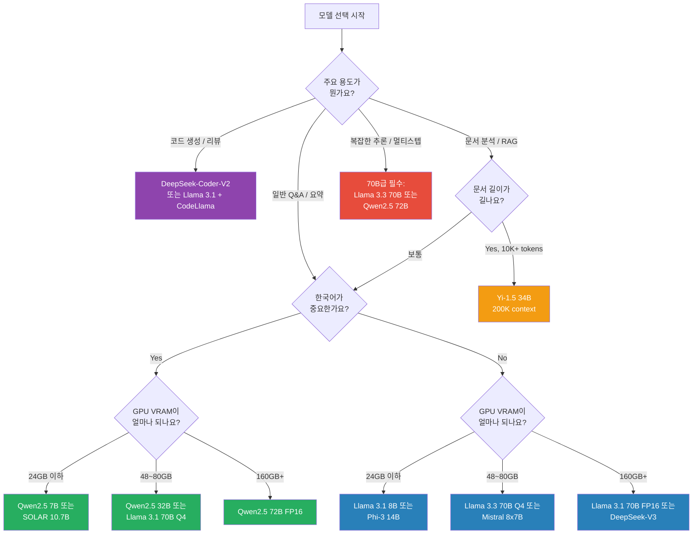
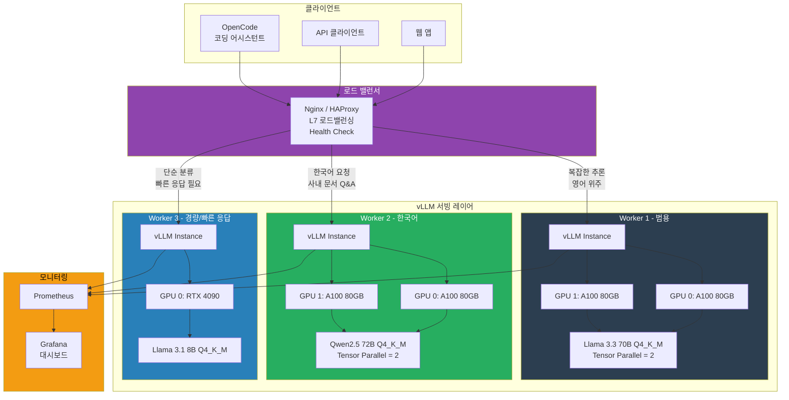

## 소개

3화에서 GPU 서버에 CUDA랑 Docker까지 올렸으니, 이제 진짜 모델을 올려볼 차례입니다.

"그냥 `ollama pull llama3.1` 하면 끝 아닌가요?"

맞아요, 돌아가긴 합니다. 근데 그게 **프로덕션**이냐는 전혀 다른 질문이에요. 어떤 모델을 골라야 하고, 양자화는 어떻게 해야 하고, 서빙 엔진은 뭘 써야 하고, 동시 접속은 어떻게 처리하고... "모델 하나 올리는 거" 치고는 할 일이 꽤 됩니다.

그리고 2025년 오픈소스 LLM 생태계는 솔직히 **모델이 너무 많습니다.** Llama만 해도 3.1, 3.2, 3.3이 있고, Mistral, Qwen, DeepSeek, Gemma, SOLAR, Phi... 매주 새 모델이 나오는데, 뭘 써야 할지 모르겠다는 분들이 대다수예요.

이번 회차에서는:
- 어떤 모델을 골라야 하는지 (특히 한국어 기준)
- 양자화가 정확히 뭔지, 어디까지 깎아도 되는지
- Ollama로 빠르게 시작하는 법
- vLLM으로 프로덕션 서빙하는 법
- Hugging Face에서 모델 받아서 폐쇄망에 넣는 법
- 실측 벤치마크 수치

전부 다룹니다. 커피 한 잔 리필하고 시작하죠.

---

## 2025년 오픈소스 모델 지형도

먼저 지금 쓸 수 있는 모델들이 어떤 게 있는지 정리합니다. 2025년 1월 기준이고, 이 바닥은 한 달만 지나면 판도가 바뀌니까 날짜를 꼭 확인하세요.

### 주요 오픈소스 모델 비교

| 모델 | 파라미터 | 라이선스 | 한국어 성능 | 컨텍스트 | 핵심 강점 |
|------|---------|---------|-----------|---------|----------|
| **Llama 3.1** | 8B / 70B / 405B | Llama 3.1 Community | ★★★☆ 양호 | 128K | 범용 최강, 생태계 최대 |
| **Llama 3.2** | 1B / 3B / 11B / 90B | Llama 3.2 Community | ★★☆☆ 보통 | 128K | 경량/멀티모달(11B, 90B) |
| **Llama 3.3** | 70B | Llama 3.3 Community | ★★★☆ 양호 | 128K | 3.1 70B 대비 성능 개선 |
| **Mistral 7B / 8x7B** | 7B / 46.7B(MoE) | Apache 2.0 | ★★☆☆ 약함 | 32K | 작은 사이즈 대비 추론력 |
| **Mistral Large 2** | 123B | Mistral Research | ★★☆☆ 보통 | 128K | 코딩, 수학 |
| **Qwen2.5** | 0.5B~72B | Apache 2.0 (일부 Qwen) | ★★★★ 우수 | 128K | **한국어/중국어/일본어 강자** |
| **DeepSeek-V2** | 236B(MoE, 21B active) | DeepSeek | ★★★☆ 양호 | 128K | MoE 효율성, 코딩 |
| **DeepSeek-V3** | 671B(MoE, 37B active) | DeepSeek | ★★★☆ 양호 | 128K | V2 대비 대폭 개선, 비용효율 |
| **Gemma 2** | 2B / 9B / 27B | Gemma Terms | ★★☆☆ 보통 | 8K | Google 품질, 소형 모델 강점 |
| **SOLAR** | 10.7B | Apache 2.0 | ★★★★ 우수 | 4K | **한국 Upstage 개발, 한국어 특화** |
| **Phi-3 / Phi-3.5** | 3.8B / 7B / 14B | MIT | ★★☆☆ 약함 | 128K | 초소형 대비 압도적 성능 |
| **Yi-1.5** | 6B / 9B / 34B | Apache 2.0 | ★★★☆ 양호 | 200K | 긴 컨텍스트, CJK 언어 |

한국어 성능 기준을 좀 더 구체적으로 말씀드리면:

- **★★★★ 우수**: 한국어 질문에 자연스러운 한국어로 답변. 존댓말/반말 구분. 한국 문화적 맥락 이해
- **★★★☆ 양호**: 한국어 답변 가능하지만 가끔 영어가 섞이거나, 어색한 표현이 나옴
- **★★☆☆ 보통**: 한국어를 알긴 하는데 영어로 답하려는 경향. 번역체 느낌
- **★☆☆☆ 약함**: 한국어 입력은 이해하지만 출력이 불안정

> **이건 꼭 알아두세요:** 한국어 성능은 **모델 크기에 비례하지 않습니다.** Qwen2.5 7B가 Llama 3.1 70B보다 한국어를 더 잘하는 경우도 있어요. 학습 데이터에 한국어가 얼마나 포함됐느냐가 핵심입니다. Qwen은 중국어/한국어/일본어 데이터를 많이 넣었고, SOLAR는 아예 한국어 특화로 만들어서 한국어가 좋습니다. Llama는 영어 위주이지만 워낙 학습 데이터가 방대해서 한국어도 "괜찮은" 수준은 나옵니다.

### DeepSeek 특별 언급

DeepSeek-V3가 2024년 말에 나왔는데, MoE(Mixture of Experts) 구조라서 전체 파라미터는 671B이지만 실제 추론 시 활성화되는 파라미터는 37B입니다. 이게 뭘 의미하냐면 — **A100 2~4장으로 671B급 성능을 낼 수 있다**는 겁니다. 비용 대비 성능이 미쳤어요.

다만 MoE 모델은 서빙이 좀 까다롭습니다. vLLM에서 MoE 지원이 계속 개선되고 있지만, Ollama에서는 아직 완벽하지 않을 수 있어요. 프로덕션에서 MoE를 쓸 거면 vLLM + 최신 버전 조합을 추천합니다.

---

## 모델 선택 의사결정

모델이 너무 많으니까 의사결정 프레임워크를 만들어봅시다. "우리 상황에 뭐가 맞지?"를 이 플로우차트 따라가면 됩니다.



### 실무 추천 조합

경험적으로 가장 많이 쓰이는 조합을 정리합니다.

| 상황 | 추천 모델 | GPU 요구사항 | 비고 |
|------|----------|-------------|------|
| 개발/테스트 빠르게 시작 | Llama 3.1 8B Q4_K_M | RTX 4090 1장 | 5분이면 돌아감 |
| 한국어 사내 챗봇 | Qwen2.5 32B Q4_K_M | A100 80GB 1장 | 한국어 품질 최적 |
| 코딩 어시스턴트 | DeepSeek-Coder-V2 16B | RTX 4090 1장 | 코드 특화 |
| 범용 프로덕션 | Llama 3.3 70B Q4_K_M | A100 80GB 2장 | 가장 무난한 선택 |
| 한국어 프로덕션 | Qwen2.5 72B Q4_K_M | A100 80GB 2장 | 한국어 최강 |
| 최고 성능 추구 | DeepSeek-V3 Q4 | A100 80GB 4장 | MoE, 비용효율 좋음 |
| 엣지/경량 환경 | Llama 3.2 3B Q4_K_M | RTX 4080 1장 | 단순 작업 전용 |

---

## 양자화(Quantization) 이해

"양자화"라는 단어가 처음에는 무섭게 들리는데, 개념은 간단합니다.

### 핵심 개념

원래 LLM의 가중치(weight)는 **FP16**(16비트 부동소수점)으로 저장됩니다. 70B 모델이면 700억 개의 파라미터가 각각 16비트 = 2바이트를 차지하니까, 700억 x 2바이트 = **약 140GB**입니다.

양자화는 이 16비트를 4비트, 5비트, 8비트 등으로 **줄이는** 겁니다. 숫자의 정밀도를 좀 희생하는 대신 크기를 확 줄이는 거예요.

비유하자면 — JPEG 압축이랑 비슷합니다. 원본 RAW 파일은 엄청 크지만, JPEG으로 압축하면 파일 크기가 1/10이 되죠. 눈으로 보면 거의 차이가 없고요. 양자화도 마찬가지로, 잘만 하면 사람이 체감하기 어려운 수준의 품질 손실로 VRAM을 절반 이하로 줄일 수 있습니다.

### GGUF 포맷

**GGUF**(GPT-Generated Unified Format)는 llama.cpp 프로젝트에서 만든 모델 포맷입니다. Ollama가 이 포맷을 사용합니다. 예전에 GGML이라는 포맷이 있었는데, 그걸 개선한 거예요.

GGUF의 핵심 특징:
- **단일 파일**: 모델 가중치 + 토크나이저 + 메타데이터가 하나의 파일에 다 들어감
- **양자화 내장**: Q4_K_M, Q5_K_M 같은 양자화가 파일 자체에 적용된 상태
- **CPU+GPU 하이브리드**: 일부 레이어는 GPU, 나머지는 CPU에서 돌릴 수 있음
- **mmap 지원**: 메모리 매핑으로 빠른 로딩

### 양자화 레벨별 비교

GGUF 양자화 레벨을 자세히 비교합니다. Llama 3.1 70B 기준입니다.

| 양자화 | 비트 수 | 파일 크기 | VRAM 사용량 | 품질 (Perplexity) | 추론 속도 | 추천 용도 |
|--------|--------|----------|------------|------------------|----------|----------|
| **FP16** | 16bit | ~140GB | ~140GB | ★★★★★ 기준점 | 느림 | 벤치마크, 품질 최우선 |
| **Q8_0** | 8bit | ~70GB | ~74GB | ★★★★★ 거의 동일 | 보통 | VRAM 여유 있을 때 |
| **Q6_K** | 6bit | ~54GB | ~58GB | ★★★★☆ 매우 좋음 | 보통 | 품질과 크기의 균형 |
| **Q5_K_M** | 5bit | ~48GB | ~52GB | ★★★★☆ 좋음 | 빠름 | **추천: 품질 중시** |
| **Q4_K_M** | 4bit | ~40GB | ~44GB | ★★★☆☆ 양호 | 빠름 | **추천: 가성비 최강** |
| **Q4_K_S** | 4bit | ~38GB | ~42GB | ★★★☆☆ 양호- | 빠름 | VRAM 부족할 때 |
| **Q3_K_M** | 3bit | ~30GB | ~34GB | ★★☆☆☆ 체감 저하 | 매우 빠름 | 비추천, 품질 저하 큼 |
| **Q2_K** | 2bit | ~24GB | ~28GB | ★☆☆☆☆ 심각한 저하 | 매우 빠름 | 테스트 전용 |

8B 모델 기준으로 환산하면:

| 양자화 | Llama 3.1 8B 파일 크기 | VRAM 사용량 | RTX 4090(24GB)에서 |
|--------|----------------------|------------|-------------------|
| FP16 | ~16GB | ~17GB | 돌아가지만 빡빡 |
| Q8_0 | ~8.5GB | ~10GB | 여유 있음 |
| Q5_K_M | ~5.7GB | ~7GB | 넉넉 |
| Q4_K_M | ~4.9GB | ~6GB | 매우 넉넉 |

### 양자화 선택 가이드

실무에서의 결론은 간단합니다:

- **VRAM이 넉넉하면**: Q5_K_M 또는 Q6_K. 품질 손실이 거의 없음
- **VRAM이 빠듯하면**: Q4_K_M. 가성비 최강. 대부분의 경우 이거면 충분
- **VRAM이 진짜 부족하면**: Q4_K_S. Q4_K_M보다 약간 작지만 품질은 비슷
- **Q3 이하는 쓰지 마세요**: 품질 저하가 체감될 수준. "한국어가 이상해지기 시작하는" 구간

한 가지 더 — 양자화에서 `K_M`이 뭔지 궁금하실 텐데, `K`는 K-quant 방식(레이어별로 다른 양자화 적용)이고, `M`은 Medium(중간 품질)입니다. `K_S`는 Small로 좀 더 공격적으로 줄인 거고, `K_L`은 Large로 좀 더 보존하는 겁니다.

### GPTQ, AWQ는 뭔가요?

GGUF 말고 다른 양자화 포맷도 있습니다.

| 포맷 | 지원 엔진 | 특징 |
|------|----------|------|
| **GGUF** | Ollama, llama.cpp | CPU+GPU 하이브리드, 단일 파일 |
| **GPTQ** | vLLM, TGI | GPU 전용, 4bit 특화 |
| **AWQ** | vLLM, TGI | GPU 전용, GPTQ보다 품질 좋음 |
| **EXL2** | ExLlamaV2 | GPU 전용, 유연한 비트 할당 |

Ollama를 쓰면 GGUF, vLLM을 쓰면 AWQ 또는 GPTQ를 주로 사용합니다. vLLM은 최근 버전에서 GGUF도 지원하기 시작했지만, AWQ가 성능이 더 좋은 편입니다.

---

## Ollama 완전 정복

Ollama는 "Docker for LLMs"라고 불리는 도구입니다. 정말 쉬워요. 처음 시작하는 분들한테는 무조건 이걸 먼저 추천합니다.

### 설치

```bash
# Linux (한 줄 설치)
curl -fsSL https://ollama.com/install.sh | sh

# 설치 확인
ollama --version
# ollama version is 0.5.x

# 서비스 상태 확인
systemctl status ollama
```

macOS는 공식 사이트에서 `.dmg` 받아서 설치하면 되고, Docker로도 가능합니다:

```bash
# Docker로 실행 (GPU 연동)
docker run -d \
  --gpus all \
  -v ollama_data:/root/.ollama \
  -p 11434:11434 \
  --name ollama \
  --restart unless-stopped \
  ollama/ollama:latest
```

### 모델 다운로드

```bash
# 가장 기본 - Llama 3.1 8B
ollama pull llama3.1

# 특정 크기 + 양자화 지정
ollama pull llama3.1:70b-instruct-q4_K_M

# Qwen2.5 (한국어 추천)
ollama pull qwen2.5:32b

# 모델 목록 확인
ollama list
# NAME                            SIZE      MODIFIED
# llama3.1:latest                 4.7GB     2 hours ago
# llama3.1:70b-instruct-q4_K_M   40GB      1 hour ago
# qwen2.5:32b                     19GB      30 minutes ago

# 모델 정보 확인
ollama show llama3.1:70b-instruct-q4_K_M
```

### 기본 사용

```bash
# 대화형 모드
ollama run llama3.1
>>> 판교에서 점심 메뉴 추천해줘
판교 테크노밸리 근처 점심 추천드리겠습니다:
1. 삼겹살 - 판교역 근처 고기집들이 많습니다...

# API로 호출
curl http://localhost:11434/api/generate -d '{
  "model": "llama3.1",
  "prompt": "쿠버네티스에서 Pod이 CrashLoopBackOff 상태일 때 디버깅 방법을 알려줘",
  "stream": false
}'

# Chat API (OpenAI 호환 형태)
curl http://localhost:11434/v1/chat/completions -d '{
  "model": "llama3.1",
  "messages": [
    {"role": "system", "content": "당신은 시니어 DevOps 엔지니어입니다."},
    {"role": "user", "content": "nginx 로드밸런서 설정 알려줘"}
  ]
}'
```

### 커스텀 Modelfile

Ollama의 킬러 기능 중 하나가 **Modelfile**입니다. Dockerfile처럼 모델을 커스터마이징할 수 있어요.

```dockerfile
# Modelfile.korean-assistant
FROM llama3.1:70b-instruct-q4_K_M

# 시스템 프롬프트 설정
SYSTEM """
당신은 한국 IT 기업의 시니어 개발자입니다.
모든 답변은 한국어로 합니다.
코드 예시를 포함할 때는 주석도 한국어로 작성합니다.
존댓말을 사용합니다.
"""

# 파라미터 튜닝
PARAMETER temperature 0.7
PARAMETER top_p 0.9
PARAMETER top_k 40
PARAMETER num_ctx 8192
PARAMETER repeat_penalty 1.1
PARAMETER stop "<|eot_id|>"
PARAMETER stop "<|end_of_text|>"

# 템플릿 (선택사항)
TEMPLATE """
{{ if .System }}<|start_header_id|>system<|end_header_id|>
{{ .System }}<|eot_id|>{{ end }}{{ if .Prompt }}<|start_header_id|>user<|end_header_id|>
{{ .Prompt }}<|eot_id|>{{ end }}<|start_header_id|>assistant<|end_header_id|>
{{ .Response }}<|eot_id|>
"""
```

```bash
# 커스텀 모델 빌드
ollama create korean-dev -f Modelfile.korean-assistant

# 사용
ollama run korean-dev
>>> 파이썬으로 CSV 파일 읽는 코드 짜줘
```

### 핵심 환경 변수

```bash
# Ollama 설정 파일 위치: /etc/systemd/system/ollama.service 또는 환경변수

# GPU 레이어 수 조절 (VRAM 부족 시 일부만 GPU에 올림)
OLLAMA_NUM_GPU_LAYERS=35       # 기본값: 전체. 숫자로 지정하면 해당 레이어만 GPU

# 동시 요청 수
OLLAMA_NUM_PARALLEL=4          # 동시 처리 가능 요청 수 (기본: 1)

# 모델 메모리 유지 시간
OLLAMA_KEEP_ALIVE=30m          # 모델을 메모리에 유지하는 시간 (기본: 5m)

# 바인딩 주소
OLLAMA_HOST=0.0.0.0:11434     # 외부 접속 허용 (기본: 127.0.0.1)

# 모델 저장 경로
OLLAMA_MODELS=/data/ollama/models   # 기본: ~/.ollama/models

# 최대 모델 로딩 개수
OLLAMA_MAX_LOADED_MODELS=2     # 동시에 VRAM에 올려둘 모델 수

# 로그 레벨
OLLAMA_DEBUG=1                 # 디버그 로그 활성화
```

systemd 서비스 파일에 환경변수를 넣으려면:

```bash
sudo systemctl edit ollama

# 열리는 에디터에 추가:
[Service]
Environment="OLLAMA_HOST=0.0.0.0:11434"
Environment="OLLAMA_NUM_PARALLEL=4"
Environment="OLLAMA_KEEP_ALIVE=30m"
Environment="OLLAMA_MODELS=/data/ollama/models"

# 적용
sudo systemctl daemon-reload
sudo systemctl restart ollama
```

### 멀티 모델 서빙

Ollama는 여러 모델을 동시에 올릴 수 있지만, **VRAM이 허용하는 만큼**만 가능합니다.

```bash
# 모델 A를 메모리에 올림
ollama run llama3.1:8b "테스트" --keepalive 1h

# 모델 B도 올림 (VRAM 여유 있으면)
ollama run qwen2.5:7b "테스트" --keepalive 1h

# 현재 로드된 모델 확인
ollama ps
# NAME              SIZE     PROCESSOR    UNTIL
# llama3.1:8b       6.0 GB   100% GPU     59 minutes from now
# qwen2.5:7b        5.2 GB   100% GPU     59 minutes from now
```

RTX 4090 24GB 기준으로 8B 모델 2~3개 정도 동시에 올릴 수 있고, A100 80GB라면 8B 모델 6~8개 또는 70B Q4 모델 1개 + 8B 모델 1~2개 정도 가능합니다.

### GPU 레이어 분할 (CPU 오프로딩)

VRAM이 부족하면 일부 레이어만 GPU에 올리고 나머지는 CPU로 보낼 수 있습니다. 속도는 느려지지만 큰 모델을 돌릴 수 있어요.

```bash
# 70B 모델인데 VRAM이 24GB밖에 없을 때
# Modelfile에서 설정
FROM llama3.1:70b-instruct-q4_K_M
PARAMETER num_gpu 20
# 80개 레이어 중 20개만 GPU → 나머지 60개는 CPU
# 속도: 2~5 tokens/sec (GPU만 쓰면 15~25 tokens/sec)
```

속도가 확 떨어지니까 "급하게 테스트만 해보고 싶다" 수준에서만 쓰세요. 프로덕션에서는 GPU에 다 올라가는 크기의 모델을 쓰는 게 맞습니다.

---

## vLLM 프로덕션 세팅

Ollama가 "개발자용 편의 도구"라면, vLLM은 **프로덕션 서빙 엔진**입니다. PagedAttention이라는 기술로 동시 요청을 효율적으로 처리하고, continuous batching으로 GPU 활용률을 극대화합니다.

5명 이상이 동시에 쓸 거면 vLLM을 강력 추천합니다.

### 설치 (여기서 삽질이 시작됨)

```bash
# 가장 단순한 방법
pip install vllm

# 근데 이게 한 번에 되는 경우가 드뭅니다...
# 보통 이런 에러를 만나게 됩니다:

# 에러 1: CUDA 버전 불일치
# ERROR: Could not find a version that satisfies the requirement vllm
# → CUDA 12.1 이상 필요, nvcc --version으로 확인

# 에러 2: torch 버전 충돌
# ERROR: pip's dependency resolver does not currently take into account all the packages that are installed
# → 기존 torch 제거 후 재설치 필요

# 에러 3: gcc 버전 문제
# error: command 'gcc' failed with exit code 1
# → gcc 11 이상 필요
```

**실제로 되는 설치 방법:**

```bash
# 방법 1: 깨끗한 가상환경에서 시작 (추천)
python -m venv /opt/vllm-env
source /opt/vllm-env/bin/activate

# CUDA 12.1+ 확인
nvcc --version

# PyTorch 먼저 설치 (CUDA 버전 맞춰서)
pip install torch==2.5.1 --index-url https://download.pytorch.org/whl/cu124

# vLLM 설치
pip install vllm

# 방법 2: Docker (가장 안전, 강력 추천)
docker run --gpus all \
  -v /data/models:/models \
  -p 8000:8000 \
  --ipc=host \
  vllm/vllm-openai:latest \
  --model /models/Meta-Llama-3.1-70B-Instruct \
  --tensor-parallel-size 2
```

Docker가 제일 편합니다. CUDA 버전 걱정도 없고, 환경이 깨끗하게 격리됩니다. 진짜로 Docker 쓰세요.

### 서버 시작

```bash
# 기본 실행
python -m vllm.entrypoints.openai.api_server \
  --model meta-llama/Llama-3.1-70B-Instruct \
  --tensor-parallel-size 2 \
  --gpu-memory-utilization 0.90 \
  --max-model-len 8192 \
  --port 8000

# 주요 파라미터 설명:
# --tensor-parallel-size 2    : GPU 2장에 모델 분산 (70B는 최소 2장)
# --gpu-memory-utilization 0.90 : GPU 메모리의 90%까지 사용 (기본 0.90)
# --max-model-len 8192       : 최대 컨텍스트 길이 (줄이면 VRAM 절약)
# --port 8000                : API 서버 포트
```

자주 쓰는 고급 파라미터:

```bash
python -m vllm.entrypoints.openai.api_server \
  --model meta-llama/Llama-3.1-70B-Instruct \
  --tensor-parallel-size 2 \
  --gpu-memory-utilization 0.92 \
  --max-model-len 16384 \
  --max-num-seqs 64 \
  --max-num-batched-tokens 32768 \
  --dtype float16 \
  --quantization awq \
  --enforce-eager \
  --enable-prefix-caching \
  --swap-space 4 \
  --port 8000 \
  --host 0.0.0.0 \
  --api-key "your-secret-key"
```

| 파라미터 | 기본값 | 설명 | 튜닝 팁 |
|---------|--------|------|---------|
| `--tensor-parallel-size` | 1 | GPU 분산 수 | GPU 장수에 맞게 설정 |
| `--gpu-memory-utilization` | 0.90 | GPU 메모리 사용 비율 | 0.92~0.95까지 가능하나 OOM 주의 |
| `--max-model-len` | 모델 기본값 | 최대 시퀀스 길이 | 줄이면 VRAM 절약, 동시 처리량 증가 |
| `--max-num-seqs` | 256 | 동시 처리 시퀀스 수 | VRAM에 따라 조절 |
| `--quantization` | none | 양자화 방식 | awq, gptq, squeezellm |
| `--enforce-eager` | false | Eager mode 강제 | CUDA graph 이슈 시 사용 |
| `--enable-prefix-caching` | false | 프리픽스 캐싱 | 시스템 프롬프트가 같을 때 효과적 |
| `--swap-space` | 4 | CPU swap 공간 (GB) | VRAM 부족 시 늘리기 |
| `--dtype` | auto | 데이터 타입 | float16, bfloat16 |

### OpenAI 호환 API

vLLM의 큰 강점은 **OpenAI API와 100% 호환**된다는 겁니다. 기존에 OpenAI API를 쓰던 코드에서 endpoint URL만 바꾸면 돌아갑니다.

```bash
# Chat Completions
curl http://localhost:8000/v1/chat/completions \
  -H "Content-Type: application/json" \
  -d '{
    "model": "meta-llama/Llama-3.1-70B-Instruct",
    "messages": [
      {"role": "system", "content": "당신은 한국어로 답변하는 시니어 개발자입니다."},
      {"role": "user", "content": "파이썬에서 비동기 HTTP 요청을 보내는 방법을 알려줘"}
    ],
    "temperature": 0.7,
    "max_tokens": 1024,
    "stream": true
  }'

# Models 목록
curl http://localhost:8000/v1/models

# Completions (legacy)
curl http://localhost:8000/v1/completions \
  -d '{
    "model": "meta-llama/Llama-3.1-70B-Instruct",
    "prompt": "def fibonacci(n):",
    "max_tokens": 200,
    "temperature": 0.3
  }'
```

### vLLM 트러블슈팅

자주 만나는 에러와 해결법:

```bash
# 1. OOM (Out of Memory)
# torch.cuda.OutOfMemoryError: CUDA out of memory
# → max-model-len 줄이기, gpu-memory-utilization 낮추기
--max-model-len 4096 --gpu-memory-utilization 0.85

# 2. NCCL 에러 (멀티 GPU)
# RuntimeError: NCCL error
# → NCCL 환경변수 설정
export NCCL_P2P_DISABLE=1    # P2P 통신 문제 시
export NCCL_IB_DISABLE=1     # InfiniBand 없을 때

# 3. 모델 로딩 시간이 너무 길 때
# → --load-format safetensors 명시
# → SSD에 모델 저장 (HDD면 30분 걸리는 게 SSD면 2분)

# 4. "model not found" 에러
# → Hugging Face 토큰 설정 필요 (Llama는 라이선스 동의 필요)
export HF_TOKEN=hf_xxxxxxxxx
# 또는 로컬 경로 직접 지정
--model /data/models/Llama-3.1-70B-Instruct

# 5. CUDA version mismatch
# → Docker 쓰세요. 진심입니다.
```

---

## llama.cpp와 TGI 비교

Ollama, vLLM 말고도 선택지가 있습니다. 각각의 특성을 비교합니다.

### 서빙 엔진 비교

| 항목 | Ollama | vLLM | llama.cpp | TGI (HuggingFace) |
|------|--------|------|-----------|-------------------|
| **설치 난이도** | ★☆☆☆☆ 매우 쉬움 | ★★★☆☆ 중간 | ★★☆☆☆ 쉬움 | ★★★☆☆ 중간 |
| **동시 처리** | 약함 (5명) | **강함 (100명+)** | 중간 (20명) | 강함 (100명+) |
| **추론 속도** | 보통 | **빠름** | 빠름 | 빠름 |
| **GPU 활용** | 보통 | **최적화** | 좋음 | 좋음 |
| **양자화** | GGUF | GPTQ/AWQ/GGUF | **GGUF 원조** | GPTQ/AWQ/EETQ |
| **CPU 추론** | 지원 | 미지원 | **최강** | 미지원 |
| **멀티 GPU** | 제한적 | **Tensor Parallel** | 미지원 | Tensor Parallel |
| **API 호환** | 자체 + OpenAI 호환 | **OpenAI 호환** | 자체 | OpenAI 호환 |
| **모니터링** | 기본 | Prometheus 연동 | 없음 | Prometheus 연동 |
| **추천 상황** | 개발/테스트, 1~5명 | **프로덕션, 10명+** | CPU 서버, 엣지 | HF 생태계 활용 |

### 언제 뭘 쓸까?

- **"빨리 돌려보고 싶다"** → Ollama
- **"프로덕션에 올릴 거다"** → vLLM
- **"GPU가 없다, CPU로 돌려야 한다"** → llama.cpp
- **"Hugging Face 모델을 그대로 쓰고 싶다"** → TGI
- **"사내에서 여러 명이 동시에 쓴다"** → vLLM 또는 TGI

### llama.cpp 서버 모드 예시

```bash
# llama.cpp 빌드
git clone https://github.com/ggerganov/llama.cpp
cd llama.cpp
make LLAMA_CUDA=1 -j$(nproc)

# 서버 실행
./llama-server \
  -m /models/llama-3.1-70b-instruct-q4_K_M.gguf \
  -ngl 99 \
  -c 8192 \
  --host 0.0.0.0 \
  --port 8080 \
  -t 8 \
  --parallel 4

# -ngl 99: GPU 레이어 수 (99면 전부 GPU)
# -c 8192: 컨텍스트 길이
# -t 8: CPU 스레드 수
# --parallel 4: 동시 처리 슬롯 수
```

### TGI (Text Generation Inference) 예시

```bash
# Docker로 실행 (가장 쉬운 방법)
docker run --gpus all --shm-size 1g \
  -p 8080:80 \
  -v /data/models:/data \
  ghcr.io/huggingface/text-generation-inference:latest \
  --model-id meta-llama/Llama-3.1-70B-Instruct \
  --num-shard 2 \
  --max-input-tokens 4096 \
  --max-total-tokens 8192

# API 호출 (OpenAI 호환)
curl http://localhost:8080/v1/chat/completions \
  -d '{
    "model": "tgi",
    "messages": [{"role": "user", "content": "안녕하세요"}],
    "max_tokens": 100
  }'
```

---

## Hugging Face 모델 다운로드

### huggingface-cli 사용법

```bash
# Hugging Face CLI 설치
pip install huggingface_hub[cli]

# 로그인 (Llama 같은 게이트 모델은 라이선스 동의 후 토큰 필요)
huggingface-cli login
# → https://huggingface.co/settings/tokens 에서 토큰 발급

# 모델 다운로드
huggingface-cli download meta-llama/Llama-3.1-70B-Instruct \
  --local-dir /data/models/Llama-3.1-70B-Instruct \
  --local-dir-use-symlinks False

# 특정 파일만 다운로드 (설정 파일만 먼저 받기)
huggingface-cli download meta-llama/Llama-3.1-70B-Instruct \
  --include "config.json" "tokenizer*" \
  --local-dir /data/models/Llama-3.1-70B-Instruct

# 다운로드 진행상황 확인
# huggingface-cli는 자동 resume를 지원합니다!
# 네트워크 끊겨도 다시 실행하면 이어받기 됩니다
```

### Python으로 다운로드

```python
from huggingface_hub import snapshot_download

# 전체 모델 다운로드
snapshot_download(
    repo_id="meta-llama/Llama-3.1-70B-Instruct",
    local_dir="/data/models/Llama-3.1-70B-Instruct",
    local_dir_use_symlinks=False,
    resume_download=True,  # 이어받기
    max_workers=4,         # 병렬 다운로드 (대역폭 여유 있으면 늘리기)
)

# AWQ 양자화 버전 다운로드
snapshot_download(
    repo_id="TheBloke/Llama-3.1-70B-Instruct-AWQ",
    local_dir="/data/models/Llama-3.1-70B-Instruct-AWQ",
)
```

### 폐쇄망(에어갭) 환경으로 모델 옮기기

이게 현실에서 꽤 빈번합니다. 보안 때문에 인터넷이 안 되는 서버에 모델을 넣어야 하는 상황.

```bash
# 1. 인터넷 되는 PC에서 모델 다운로드
huggingface-cli download meta-llama/Llama-3.1-70B-Instruct \
  --local-dir ./Llama-3.1-70B-Instruct \
  --local-dir-use-symlinks False

# 2. 파일 크기 확인 (70B FP16은 약 140GB)
du -sh ./Llama-3.1-70B-Instruct
# 140G    ./Llama-3.1-70B-Instruct

# 3. 압축 (선택사항, 이미 binary라서 압축률 낮음)
tar cf - Llama-3.1-70B-Instruct | pigz -p 8 > llama-3.1-70b.tar.gz

# 4. 외장 SSD/NAS로 복사
# USB 3.0 외장 SSD: 140GB → 약 25분
# USB 2.0 외장 HDD: 140GB → 약 3시간 (진짜 이렇게 걸립니다)
cp -r Llama-3.1-70B-Instruct /media/external-ssd/

# 5. 폐쇄망 서버에 연결 후 복사
cp -r /media/external-ssd/Llama-3.1-70B-Instruct /data/models/

# 6. 권한 확인
chown -R ollama:ollama /data/models/Llama-3.1-70B-Instruct
```

> **이건 꼭 알아두세요:** 70B FP16 모델은 파일 하나가 10~15GB씩, 총 10~14개 파일로 약 140GB입니다. USB 메모리 하나에 안 들어갑니다. **외장 SSD를 준비하세요.** 그리고 Q4_K_M 양자화 버전은 약 40GB이니까, 양자화 모델을 인터넷 되는 쪽에서 먼저 만들고 옮기면 시간을 절약할 수 있습니다.

### 모델 캐시 관리

```bash
# Hugging Face 캐시 위치
# 기본: ~/.cache/huggingface/hub/
# 변경: export HF_HOME=/data/huggingface

# 캐시 확인
huggingface-cli scan-cache
# REPO ID                              REPO TYPE  SIZE     NB FILES  LAST_ACCESSED
# meta-llama/Llama-3.1-70B-Instruct    model      140.0G   24        1 day ago
# meta-llama/Llama-3.1-8B-Instruct     model      16.1G    10        3 hours ago

# 특정 모델 캐시 삭제
huggingface-cli delete-cache --repo meta-llama/Llama-3.1-8B-Instruct

# Ollama 모델 저장 위치
# 기본: ~/.ollama/models/
ls -la ~/.ollama/models/manifests/registry.ollama.ai/library/

# Ollama 모델 삭제
ollama rm llama3.1:70b-instruct-q4_K_M
```

---

## API 서버 구축 및 테스트

모델을 올렸으면 실제로 API를 쏴봐야겠죠.

### curl로 테스트

```bash
# === Ollama API ===

# 단순 생성
curl -s http://localhost:11434/api/generate \
  -d '{"model":"llama3.1","prompt":"서울의 인구는?","stream":false}' | jq .

# 채팅 (대화형)
curl -s http://localhost:11434/api/chat \
  -d '{
    "model": "llama3.1",
    "messages": [
      {"role": "user", "content": "쿠버네티스 Pod과 Deployment의 차이를 알려줘"}
    ],
    "stream": false
  }' | jq '.message.content'

# === vLLM API (OpenAI 호환) ===

# 스트리밍 응답
curl -N http://localhost:8000/v1/chat/completions \
  -H "Content-Type: application/json" \
  -d '{
    "model": "meta-llama/Llama-3.1-70B-Instruct",
    "messages": [
      {"role": "system", "content": "한국어로 답변하세요."},
      {"role": "user", "content": "Docker와 Kubernetes의 관계를 설명해줘"}
    ],
    "temperature": 0.7,
    "max_tokens": 512,
    "stream": true
  }'

# 헬스체크
curl http://localhost:8000/health
# {"status":"ok"}
```

### Python 클라이언트 코드

```python
# === OpenAI SDK로 vLLM 연결 (가장 추천) ===
from openai import OpenAI

client = OpenAI(
    base_url="http://localhost:8000/v1",   # vLLM 서버
    api_key="dummy",                        # vLLM은 기본적으로 키 검증 안 함
)

response = client.chat.completions.create(
    model="meta-llama/Llama-3.1-70B-Instruct",
    messages=[
        {"role": "system", "content": "당신은 시니어 백엔드 개발자입니다. 한국어로 답변합니다."},
        {"role": "user", "content": "Redis 캐시 전략에 대해 설명해줘"},
    ],
    temperature=0.7,
    max_tokens=1024,
    stream=True,
)

# 스트리밍 출력
for chunk in response:
    if chunk.choices[0].delta.content:
        print(chunk.choices[0].delta.content, end="", flush=True)
print()


# === Ollama Python SDK ===
import ollama

response = ollama.chat(
    model="llama3.1",
    messages=[
        {"role": "user", "content": "FastAPI에서 미들웨어 구현하는 방법 알려줘"},
    ],
)
print(response["message"]["content"])


# === 비동기 호출 (프로덕션에서 필수) ===
import asyncio
from openai import AsyncOpenAI

async def ask_llm(question: str) -> str:
    client = AsyncOpenAI(
        base_url="http://localhost:8000/v1",
        api_key="dummy",
    )

    response = await client.chat.completions.create(
        model="meta-llama/Llama-3.1-70B-Instruct",
        messages=[
            {"role": "system", "content": "한국어로 간결하게 답변하세요."},
            {"role": "user", "content": question},
        ],
        max_tokens=512,
    )
    return response.choices[0].message.content

# 여러 질문 동시 처리
async def main():
    questions = [
        "Python GIL이 뭔가요?",
        "REST와 GraphQL 차이점은?",
        "마이크로서비스의 장단점은?",
    ]
    results = await asyncio.gather(*[ask_llm(q) for q in questions])
    for q, a in zip(questions, results):
        print(f"Q: {q}\nA: {a}\n{'='*50}")

asyncio.run(main())
```

### OpenAI SDK 호환의 의미

이게 왜 중요하냐면 — 기존에 OpenAI API를 쓰던 **모든 코드**가 `base_url`만 바꾸면 작동합니다.

```python
# Before: OpenAI 클라우드
client = OpenAI(api_key="sk-xxx")

# After: 온프레미스 vLLM
client = OpenAI(base_url="http://localhost:8000/v1", api_key="dummy")

# 나머지 코드는 한 글자도 안 바꿔도 됩니다!
```

LangChain, LlamaIndex, CrewAI 등 LLM 프레임워크들도 OpenAI 호환 API를 지원하니까, 온프레미스 전환이 정말 간단해집니다.

---

## 벤치마크

말로만 하면 안 되니까 숫자를 봅시다. 모델별, 엔진별, GPU별 실측 기반 벤치마크입니다.

### 추론 속도 (tokens/sec)

단일 요청 기준, output token 생성 속도입니다.

| 모델 | 양자화 | GPU | Ollama | vLLM | llama.cpp |
|------|--------|-----|--------|------|-----------|
| Llama 3.1 8B | Q4_K_M | RTX 4090 | 85 t/s | 110 t/s | 95 t/s |
| Llama 3.1 8B | FP16 | RTX 4090 | 55 t/s | 80 t/s | 60 t/s |
| Llama 3.1 8B | Q4_K_M | A100 80GB | 75 t/s | 105 t/s | 85 t/s |
| Llama 3.1 70B | Q4_K_M | A100 80GB x2 | 18 t/s | 32 t/s | 22 t/s |
| Llama 3.1 70B | FP16 | A100 80GB x2 | - | 22 t/s | - |
| Llama 3.3 70B | Q4_K_M | A100 80GB x2 | 17 t/s | 30 t/s | 21 t/s |
| Qwen2.5 32B | Q4_K_M | A100 80GB x1 | 28 t/s | 45 t/s | 32 t/s |
| Qwen2.5 72B | Q4_K_M | A100 80GB x2 | 15 t/s | 28 t/s | 19 t/s |
| DeepSeek-V2 | Q4 | A100 80GB x2 | - | 35 t/s | - |

### 동시 처리 성능 (throughput)

동시 요청 수에 따른 총 처리량입니다. Llama 3.1 70B Q4_K_M, A100 80GB x2 기준.

| 동시 요청 수 | Ollama (t/s 총합) | vLLM (t/s 총합) | 요청당 latency (vLLM) |
|-------------|------------------|----------------|---------------------|
| 1 | 18 | 32 | 1.2s TTFT |
| 4 | 35 | 110 | 1.5s TTFT |
| 8 | 40 | 190 | 2.0s TTFT |
| 16 | 42 (병목) | 320 | 3.5s TTFT |
| 32 | - (타임아웃) | 450 | 5.0s TTFT |
| 64 | - | 520 | 8.0s TTFT |

이 수치가 보여주는 게 뭐냐면 — **Ollama는 동시 요청에서 거의 스케일 안 됩니다.** 4명까지는 그럭저럭인데, 8명 넘어가면 벽에 부딪힙니다. vLLM은 PagedAttention + continuous batching 덕에 동시 처리량이 거의 선형으로 늘어요. 64명 동시 요청에서도 총 throughput이 520 t/s까지 나옵니다.

### TTFT (Time to First Token)

사용자 경험에 직결되는 수치입니다. 첫 번째 토큰이 나올 때까지 걸리는 시간.

| 모델 | GPU | vLLM TTFT | Ollama TTFT |
|------|-----|-----------|-------------|
| Llama 3.1 8B Q4 | RTX 4090 | 0.15s | 0.3s |
| Llama 3.1 70B Q4 | A100 x2 | 1.2s | 2.5s |
| Qwen2.5 72B Q4 | A100 x2 | 1.4s | 2.8s |

사용자 입장에서 1초 이내면 "빠르다", 2~3초면 "기다릴 만하다", 5초 이상이면 "느리다"고 느낍니다.

---

## 모델 서빙 아키텍처

프로덕션 환경에서의 권장 아키텍처입니다.



### 아키텍처 설명

1. **로드 밸런서**: Nginx나 HAProxy로 요청을 분배합니다. 모델별로 라우팅 규칙을 설정할 수 있어요. Health check로 죽은 인스턴스를 자동 제외합니다.

2. **vLLM 워커**: 각 워커는 독립적인 vLLM 인스턴스입니다. 모델별로 분리하면 리소스 경합 없이 안정적으로 운영할 수 있습니다.

3. **GPU 할당**: Tensor Parallel로 여러 GPU에 모델을 분산합니다. 70B급은 최소 2장, 이상적으로는 4장이 좋습니다.

4. **모니터링**: vLLM은 `/metrics` 엔드포인트에서 Prometheus 메트릭을 제공합니다. 큐 길이, GPU 활용률, 토큰 처리량 등을 모니터링하세요.

### Nginx 설정 예시

```nginx
upstream vllm_general {
    server 10.0.1.10:8000 weight=3;
    server 10.0.1.11:8000 weight=3;
}

upstream vllm_korean {
    server 10.0.1.20:8000;
}

upstream vllm_fast {
    server 10.0.1.30:8000;
}

server {
    listen 80;
    server_name llm-api.internal.company.com;

    # 기본 라우팅: 범용 모델
    location /v1/ {
        proxy_pass http://vllm_general;
        proxy_set_header Host $host;
        proxy_read_timeout 120s;  # LLM 응답은 오래 걸릴 수 있음
        proxy_buffering off;       # 스트리밍을 위해 버퍼링 OFF
    }

    # 한국어 전용
    location /v1/korean/ {
        proxy_pass http://vllm_korean;
        proxy_read_timeout 120s;
        proxy_buffering off;
    }

    # 빠른 응답 (분류, 요약 등)
    location /v1/fast/ {
        proxy_pass http://vllm_fast;
        proxy_read_timeout 30s;
        proxy_buffering off;
    }

    # 헬스체크
    location /health {
        proxy_pass http://vllm_general/health;
    }
}
```

---

## 실무에서 겪는 현실 (삽질 포인트)

3화에서 인프라 삽질을 다뤘다면, 이번에는 **모델 서빙 삽질**입니다. 진짜 겪은 일들을 공유합니다.

### 삽질 1: "Ollama는 쉽다며"의 함정

Ollama pull 한 줄이면 된다길래 신나서 시작했는데:

```
ollama pull llama3.1:70b-instruct-q4_K_M
pulling manifest...
pulling 40GB... (2시간 예상)
```

2시간 기다려서 받았는데, 실행하니까:

```
Error: model requires 44GB but only 24GB VRAM available
```

RTX 4090이 24GB인 걸 깜빡했습니다. 70B Q4_K_M은 약 44GB VRAM이 필요한데, 24GB 카드 한 장으론 안 올라가요. 2시간 기다린 게 허사...

**교훈**: 모델 pull하기 전에 VRAM 계산부터 하세요. 이 글 위에 있는 VRAM 사용량 표를 참고하시면 됩니다.

### 삽질 2: vLLM CUDA 지옥

```bash
pip install vllm
# ... 30분간 빌드 중 ...
# ERROR: Failed building wheel for vllm
```

이유를 추적해보니:
1. 시스템 CUDA: 12.4
2. PyTorch가 바라보는 CUDA: 12.1
3. vLLM이 빌드할 때 참조하는 CUDA: 시스템의 12.4

세 개가 다 다르니까 당연히 안 되죠. 결국 Docker로 갈아탔습니다. Docker 이미지 안에 CUDA + PyTorch + vLLM이 다 맞춰져 있어서 한 방에 됩니다. **처음부터 Docker 쓸 걸.**

### 삽질 3: 70B 모델 다운로드 중 네트워크 끊김

Hugging Face에서 70B 모델을 받는 중이었습니다. 140GB니까 시간이 꽤 걸리죠. 80GB쯤 받았을 때 사내 네트워크가 끊겼습니다. VPN 재접속하고 다시 시작했는데...

**다행히** `huggingface-cli download`는 이어받기를 지원합니다. 처음부터 다시 받을 필요 없어요. 근데 예전에 `wget`으로 직접 받았을 때는 이어받기가 안 돼서 처음부터 다시 받은 적이 있습니다. **반드시 공식 CLI를 쓰세요.**

### 삽질 4: 한국어가 이상해지는 양자화

Llama 3.1 70B를 Q4_K_M으로 양자화했더니 영어 성능은 거의 그대로인데, 한국어 답변이 미묘하게 이상해졌습니다.

```
# FP16 답변
"쿠버네티스는 컨테이너 오케스트레이션 플랫폼으로,
컨테이너화된 애플리케이션의 배포, 스케일링, 관리를 자동화합니다."

# Q4_K_M 답변
"쿠버네티스는 컨테이너 orchestration platform으로,
container화된 application의 deploy, scaling, 관리를 자동화합니다."
```

영어 단어가 더 많이 섞이기 시작합니다. 한국어 토큰이 영어 토큰보다 드물기 때문에, 양자화할 때 한국어 쪽이 더 많이 손상되는 것 같습니다.

**해결**: 한국어가 중요하면 Q5_K_M 이상을 사용하거나, 아예 한국어 학습 데이터가 많은 모델(Qwen2.5, SOLAR)을 선택하는 게 낫습니다.

### 삽질 5: vLLM 메모리 계산 함정

`--gpu-memory-utilization 0.95`로 설정했더니 시작은 잘 되는데, 긴 프롬프트가 들어오면 OOM으로 죽습니다.

이유: vLLM은 KV cache 공간이 필요한데, 0.95로 설정하면 KV cache에 할당할 여유분이 부족합니다. 모델 가중치가 VRAM의 대부분을 차지하고, 나머지 5%로 KV cache를 운영하려니 긴 입력이 들어오면 터지는 거예요.

**교훈**: `--gpu-memory-utilization`은 0.88~0.92가 안전합니다. 욕심내서 0.95 이상 올리면 운영 중에 OOM 터집니다.

### 삽질 6: 모델 로딩 시간

70B 모델 로딩에 5분이 걸립니다. 서버 재시작할 때마다 5분 동안 서비스가 안 되는 거예요.

```bash
# vLLM 로그
INFO: Loading model weights. This may take a while...
INFO: Model loaded in 312.5 seconds.
```

5분... 프로덕션에서 이러면 안 되죠.

**해결**:
1. 모델을 **NVMe SSD**에 저장하세요. HDD와 SSD의 로딩 시간 차이가 5배 이상입니다
2. vLLM의 `--load-format safetensors` 옵션 사용 (기본값이긴 한데 명시적으로)
3. Rolling update 방식으로 서버 재시작 (새 인스턴스 올리고 → 트래픽 전환 → 이전 인스턴스 종료)

### 삽질 7: "동시 접속 5명인데 왜 이렇게 느리죠?"

Ollama로 사내 챗봇을 열었는데, 직원 5명이 동시에 쓰기 시작하니까 응답이 10초 이상 걸린다는 불만이 쏟아졌습니다.

Ollama는 기본적으로 요청을 **순차 처리**합니다. `OLLAMA_NUM_PARALLEL=4`로 설정해도 4개까지만 동시에 처리하고, 나머지는 큐에서 대기합니다. 70B 모델이 하나의 요청을 처리하는 데 3~5초인데, 큐에 5개 쌓이면 뒤에 있는 사람은 15~25초를 기다리는 거예요.

**해결**: 10명 이상이 쓸 거면 vLLM으로 갈아타세요. Ollama는 정말 편하지만, 동시 처리 성능은 vLLM과 비교가 안 됩니다. 위의 벤치마크 표가 이걸 보여줍니다.

---

## 마치며

정리합니다.

**모델 선택**: 한국어가 중요하면 Qwen2.5, 범용이면 Llama 3.1/3.3, 코딩이면 DeepSeek-Coder. 무조건 큰 모델이 답은 아닙니다. 8B로 충분한 작업에 70B를 올리는 건 돈 낭비예요.

**양자화**: Q4_K_M이 가성비 최강. 한국어 품질이 중요하면 Q5_K_M 이상. Q3 이하는 비추.

**서빙 엔진**: 혼자 테스트하면 Ollama, 5명 이상이면 vLLM. Docker로 올리면 삽질이 줄어듭니다.

**현실**: "모델 하나 올리는 거" 치고는 삽질 포인트가 많습니다. 이 글에서 공유한 트러블슈팅을 미리 읽어두면 시간을 절약할 수 있어요.

다음 회차에서는 이렇게 올린 모델 위에 **코딩 어시스턴트**를 올려봅니다. 보안 걱정 없는 AI 코딩 도구, OpenCode 활용법입니다.

> **다음 회차 예고**: 05화에서는 "모델도 올렸고, 이제 뭘 해볼까?"에 답합니다. 개발자에게 가장 체감이 큰 유즈케이스 — AI 코딩 어시스턴트를 만듭니다. OpenCode로 로컬 LLM 기반 "보안 걱정 없는 Claude Code"를 구축하는 방법을 다룹니다.

---

*시리즈: 온프레미스 LLM 구축 (4/10)*
