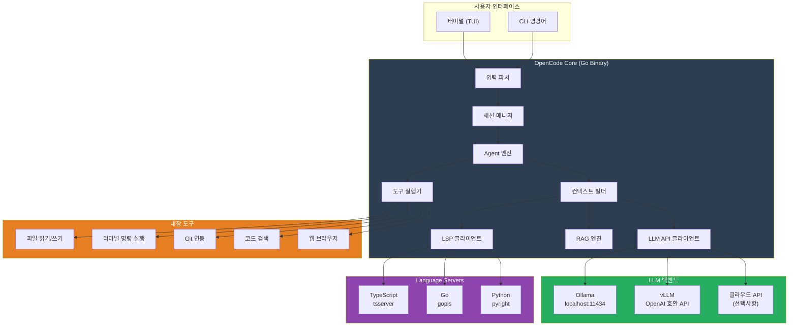

## 소개

4회차까지 GPU 사고, CUDA 깔고, 모델 올려서 서빙까지 했습니다. 자, 이제 진짜 중요한 질문이 남았어요.

**"이걸로 뭘 할 건데?"**

온프레미스 LLM 프로젝트를 진행하면서 제가 발견한 사실이 하나 있습니다. 임원진 앞에서 "우리가 자체 LLM 인프라를 구축했습니다"라고 하면 반응이 "아, 그래요?" 정도인데, **"개발자들이 AI로 코드를 짜고 있는데 소스코드가 밖으로 안 나갑니다"**라고 하면 눈이 반짝입니다. 보안팀장은 고개를 끄덕이고, CTO는 "다른 팀도 쓸 수 있어?"라고 물어보고, CFO는 "GitHub Copilot 구독료 얼마나 아낄 수 있는데?"를 계산하기 시작합니다.

코딩 어시스턴트가 온프레미스 LLM의 **킬러 유즈케이스**인 이유는 명확합니다:

1. **체감이 즉각적입니다.** 개발자가 매일 쓰는 도구니까요
2. **ROI 계산이 쉽습니다.** "개발자 1인당 하루 30분 절약 x 인원 수 x 일당" — 숫자가 나옵니다
3. **보안 어필이 확실합니다.** 소스코드가 외부로 안 나간다는 건 보안팀이 좋아할 수밖에 없어요
4. **확장성이 좋습니다.** 코딩 어시스턴트로 시작해서 문서 검색, 코드 리뷰, 테스트 생성까지 자연스럽게 확장됩니다

이번 회차에서는 오픈소스 AI 코딩 어시스턴트인 **OpenCode**를 로컬 LLM과 연동해서, **보안 걱정 없는 사내 코딩 어시스턴트**를 만드는 전 과정을 다룹니다. 설치부터 실전 활용, 그리고 "솔직히 상용 대비 어느 정도냐"까지 적나라하게 공유하겠습니다.

---

## AI 코딩 어시스턴트 시장 현황

2025~2026년 기준으로 AI 코딩 어시스턴트 시장은 그야말로 전국시대입니다. 주요 플레이어를 정리해봅시다.

### 상용 서비스

| 도구 | 형태 | 가격 (월) | 특징 | 데이터 전송 |
|------|------|----------|------|------------|
| **GitHub Copilot** | IDE 플러그인 | $19/인 (Business) | 코드 자동완성의 원조. VS Code, JetBrains 통합 | GitHub/Microsoft 서버 |
| **Cursor** | 포크된 IDE | $20/인 (Pro) | VS Code 포크. AI-first 에디터. 컨텍스트 관리 탁월 | Cursor 서버 (Anthropic/OpenAI 중계) |
| **Claude Code** | CLI | Anthropic API 종량제 | 터미널 기반 에이전트. 파일 수정, git 연동. 가장 높은 코드 품질 | Anthropic 서버 |
| **Windsurf** | IDE | $15/인 | Codeium에서 만든 AI IDE. Flow 기능으로 멀티스텝 작업 | Codeium 서버 |

### 오픈소스 / 로컬 연동 가능

| 도구 | 형태 | 로컬 LLM 지원 | 특징 | 라이선스 |
|------|------|-------------|------|---------|
| **Continue** | IDE 확장 | O | VS Code/JetBrains 플러그인. Ollama 직접 연동 | Apache 2.0 |
| **Cline** | IDE 확장 | O | VS Code 확장. Agent 모드. 다양한 LLM 백엔드 지원 | Apache 2.0 |
| **Aider** | CLI | O | Git 친화적. 페어 프로그래밍 느낌 | Apache 2.0 |
| **OpenCode** | CLI | O | Go 기반. Agent 모드 + LSP + RAG. Claude Code 대안 | MIT |
| **avante.nvim** | Neovim 플러그인 | O | Neovim 유저용. Cursor-like 경험 | Apache 2.0 |

### 왜 오픈소스가 중요한가

엔터프라이즈 환경에서 오픈소스 코딩 어시스턴트가 중요한 이유는 단순히 "무료"라서가 아닙니다:

- **데이터 주권**: 코드가 어디로 가는지 100% 통제 가능
- **폐쇄망 배포**: 인터넷 없는 환경에서도 동작
- **감사 추적(Audit Trail)**: 어떤 데이터가 모델에 전달되는지 로깅 가능
- **커스터마이징**: 사내 코딩 컨벤션, 아키텍처 패턴을 시스템 프롬프트에 주입 가능
- **벤더 락인 없음**: 모델을 바꿔도 도구를 바꿀 필요 없음

특히 금융, 의료, 국방 분야에서는 "소스코드가 외부 서버로 전송된다"는 것 자체가 보안 심사에서 걸립니다. 2회차에서 다뤘던 보안팀과의 대화, 기억나시죠? 코딩 어시스턴트에서도 똑같은 일이 벌어집니다.

> **이건 꼭 알아두세요:** GitHub Copilot Business 플랜에서 "코드가 학습에 사용되지 않는다"고 약속하지만, 데이터가 Microsoft/GitHub 서버를 경유하는 것 자체를 허용하지 않는 보안 정책이 있는 회사가 꽤 많습니다. 이런 환경에서 오픈소스 + 로컬 LLM 조합이 유일한 선택지예요.

---

## OpenCode를 선택한 이유

로컬 LLM과 연동 가능한 오픈소스 도구가 여러 개 있는데, 왜 OpenCode인가? 솔직히 말하면 **정답은 없고 취향 차이**입니다. 그래도 제가 OpenCode를 메인으로 쓰는 이유를 몇 가지 들자면:

1. **CLI 기반이라 어디서든 동작합니다.** SSH로 서버 접속해서도 쓸 수 있어요. IDE 의존성이 없습니다
2. **Go 바이너리라 설치가 간단합니다.** Node.js 런타임, Python 가상환경 따위 필요 없음. 바이너리 하나 다운받으면 끝
3. **Agent 모드가 Claude Code와 비슷합니다.** 파일 읽기/쓰기, 터미널 명령 실행, git 연동까지 자동화
4. **LSP 통합으로 코드 이해도가 높습니다.** 단순 텍스트가 아니라 코드 구조를 이해하고 제안합니다
5. **OpenAI 호환 API를 지원합니다.** Ollama든 vLLM이든, OpenAI 호환 엔드포인트만 있으면 연결됩니다

Continue나 Cline이 IDE 플러그인 형태라 "VS Code 안에서 다 해결하고 싶다"는 분에게는 더 편할 수 있습니다. Aider는 git 중심 워크플로우가 좋고요. 각자 장단점이 있으니, 아래 비교표를 참고해서 팀 상황에 맞는 걸 고르시면 됩니다.

---

## OpenCode 아키텍처 상세

OpenCode가 내부적으로 어떻게 동작하는지 알면 설정과 트러블슈팅이 훨씬 수월합니다. 전체 아키텍처를 그려봤습니다.



### 핵심 컴포넌트 설명

**1. Agent 엔진**

사용자 요청을 받아서 "어떤 도구를 써야 하는지" 판단하는 핵심 모듈입니다. LLM에게 사용 가능한 도구 목록을 알려주고, LLM이 tool call을 반환하면 실제로 실행합니다. 이른바 **ReAct (Reasoning + Acting) 패턴**이에요.

예를 들어 "이 함수에 에러 핸들링 추가해줘"라고 하면:
1. Agent가 먼저 `파일 읽기` 도구로 해당 파일을 읽고
2. LSP를 통해 함수 시그니처, 호출하는 곳 등 컨텍스트를 수집하고
3. LLM에게 코드와 컨텍스트를 보내서 수정안을 받고
4. `파일 쓰기` 도구로 코드를 수정합니다

**2. LSP 클라이언트**

Language Server Protocol을 통해 실시간으로 코드 정보를 가져옵니다. 단순히 파일 텍스트를 읽는 것과는 차원이 다릅니다:

- **Go to Definition**: 함수가 어디서 정의됐는지 추적
- **Find References**: 이 함수를 누가 호출하는지 파악
- **Hover**: 타입 정보, 문서화 주석 확인
- **Diagnostics**: 현재 에러/워닝 목록

이 정보들이 LLM의 컨텍스트에 들어가면 코드 수정 품질이 확 올라갑니다. "이 변수 타입이 뭔지 모르겠는데 일단 수정해볼게" 수준에서 "이 변수는 `UserResponse` 타입이고, 3곳에서 참조되고 있으니 이렇게 수정하겠습니다" 수준으로 올라가는 거죠.

**3. 컨텍스트 빌더**

LLM에게 보내는 프롬프트를 조립하는 모듈입니다. 여기서 **컨텍스트 윈도우 관리**가 핵심이에요:

- 시스템 프롬프트 (코딩 컨벤션, 프로젝트 설명 등)
- 현재 파일 내용
- LSP에서 가져온 타입/참조 정보
- RAG로 검색한 관련 코드 조각
- 대화 히스토리

이걸 전부 합쳤을 때 모델의 컨텍스트 윈도우 안에 들어가야 합니다. 8K 모델이면 이 중 일부를 잘라야 하고, 32K 모델이면 여유가 있고, 128K 모델이면 거의 다 넣을 수 있습니다. 이래서 **코딩 어시스턴트에는 컨텍스트 윈도우가 긴 모델이 유리**한 겁니다.

**4. RAG 엔진**

프로젝트의 코드베이스를 인덱싱해서 관련 코드를 검색하는 모듈입니다. 자세한 내용은 아래 RAG 연동 섹션에서 다루겠습니다.

---

## 설치 및 초기 설정

### 설치 방법

OpenCode는 Go 바이너리라서 설치가 정말 간단합니다.

```bash
# 방법 1: Go로 직접 설치 (Go 1.23+ 필요)
go install github.com/opencode-ai/opencode@latest

# 방법 2: Homebrew (macOS / Linux)
brew install opencode-ai/tap/opencode

# 방법 3: 바이너리 직접 다운로드
# GitHub Releases에서 OS/아키텍처에 맞는 바이너리 다운로드
curl -L https://github.com/opencode-ai/opencode/releases/latest/download/opencode_linux_amd64.tar.gz | tar xz
sudo mv opencode /usr/local/bin/

# 설치 확인
opencode --version
```

폐쇄망이라면 방법 3이 유일한 선택입니다. 바이너리를 USB로 옮기세요. Go 바이너리라 외부 의존성이 없어서 이게 가능한 거예요. Python 도구였으면 `pip install`에 의존성 100개... 생각만 해도 끔찍하죠.

### 설정 파일 구조

OpenCode는 프로젝트 루트에 `opencode.json` 파일로 설정합니다. 최초 실행 시 자동으로 생성되기도 하지만, 직접 만드는 게 더 낫습니다.

```json
{
  "provider": {
    "name": "ollama",
    "baseURL": "http://localhost:11434/v1",
    "apiKey": "not-needed"
  },
  "model": {
    "id": "qwen2.5-coder:32b",
    "maxTokens": 8192,
    "temperature": 0.1
  },
  "agent": {
    "model": "qwen2.5-coder:32b",
    "maxIterations": 25
  },
  "context": {
    "maxFiles": 20,
    "excludePatterns": [
      "node_modules/**",
      ".git/**",
      "dist/**",
      "build/**",
      "*.min.js",
      "package-lock.json",
      "yarn.lock"
    ]
  },
  "lsp": {
    "enabled": true
  },
  "safety": {
    "allowFileWrite": true,
    "allowTerminalExec": true,
    "allowGitOps": false,
    "blockedCommands": [
      "rm -rf",
      "sudo",
      "chmod 777",
      "curl | bash"
    ]
  }
}
```

각 섹션을 살펴봅시다:

**`provider`**: LLM 백엔드 설정입니다. Ollama를 쓸 때는 `baseURL`을 `http://localhost:11434/v1`으로 잡으면 됩니다. vLLM이면 해당 서버 주소로 변경하세요. `apiKey`는 Ollama에서는 의미 없지만, OpenAI 호환 API 형식을 맞추기 위해 아무 값이나 넣어줘야 합니다.

**`model`**: 사용할 모델 ID와 생성 파라미터. `temperature`는 코딩 작업에서 **0.0~0.2**를 권장합니다. 코드 생성은 창의성보다 정확성이 중요하니까요. `maxTokens`는 한 번 응답에 생성할 최대 토큰 수입니다.

**`agent`**: Agent 모드 전용 설정. `maxIterations`는 Agent가 도구를 몇 번까지 호출할 수 있는지 제한합니다. 무한루프 방지용이에요. 25가 적당한데, 복잡한 작업이면 50까지 올려도 됩니다.

**`safety`**: 이거 정말 중요합니다. Agent 모드에서 LLM이 터미널 명령을 실행할 수 있는데, `rm -rf /`를 실행하면 큰일나잖아요. `blockedCommands`에 위험한 명령어 패턴을 등록하세요. `allowGitOps`는 처음에 `false`로 두고, 익숙해지면 `true`로 바꾸는 걸 추천합니다.

### 프로젝트별 설정 오버라이드

전역 설정은 `~/.config/opencode/config.json`에, 프로젝트별 설정은 프로젝트 루트의 `opencode.json`에 둡니다. 프로젝트별 설정이 전역 설정을 오버라이드합니다.

```bash
# 전역 설정 (모든 프로젝트 공통)
~/.config/opencode/config.json

# 프로젝트별 설정 (이 프로젝트에서만)
/path/to/your/project/opencode.json

# 프로젝트 시작
cd /path/to/your/project
opencode
```

---

## 로컬 LLM 연동 실전

이제 핵심입니다. 4회차에서 세팅한 Ollama 또는 vLLM 서버를 OpenCode에 연결합니다.

### Ollama 연동

가장 간단한 방법입니다. Ollama가 이미 돌고 있다면 설정 하나면 끝입니다.

```bash
# 1. 코딩용 모델 다운로드
ollama pull qwen2.5-coder:32b

# 2. Ollama 서버 확인
curl http://localhost:11434/v1/models
# 응답에 qwen2.5-coder:32b가 보이면 OK

# 3. OpenCode 실행
cd /path/to/your/project
opencode
```

`opencode.json` 설정:

```json
{
  "provider": {
    "name": "ollama",
    "baseURL": "http://localhost:11434/v1",
    "apiKey": "ollama"
  },
  "model": {
    "id": "qwen2.5-coder:32b",
    "maxTokens": 8192,
    "temperature": 0.1
  }
}
```

Ollama가 다른 서버에 있으면 `baseURL`만 바꾸면 됩니다:

```json
{
  "provider": {
    "baseURL": "http://gpu-server.internal:11434/v1"
  }
}
```

### vLLM 연동

프로덕션 환경에서는 vLLM이 더 적합합니다. 동시 요청 처리가 월등히 좋거든요.

```bash
# vLLM 서버 시작 (4회차에서 설치한 상태)
python -m vllm.entrypoints.openai.api_server \
  --model Qwen/Qwen2.5-Coder-32B-Instruct \
  --tensor-parallel-size 2 \
  --gpu-memory-utilization 0.9 \
  --max-model-len 32768 \
  --port 8000

# API 동작 확인
curl http://localhost:8000/v1/models
```

`opencode.json` 설정:

```json
{
  "provider": {
    "name": "openai",
    "baseURL": "http://localhost:8000/v1",
    "apiKey": "not-needed"
  },
  "model": {
    "id": "Qwen/Qwen2.5-Coder-32B-Instruct",
    "maxTokens": 8192,
    "temperature": 0.1
  }
}
```

vLLM은 OpenAI 호환 API를 제공하니까, provider를 `"openai"`로 설정하고 `baseURL`만 로컬 서버로 잡으면 됩니다. 깔끔하죠.

### 코딩용 모델 선택 가이드

모든 LLM이 코딩에 좋은 건 아닙니다. 코딩 특화 모델이 따로 있고, 같은 파라미터 수라도 코딩 성능 차이가 큽니다.

| 모델 | 파라미터 | VRAM 요구 (Q4) | 코딩 성능 | 한국어 | 추천 용도 |
|------|---------|--------------|----------|--------|----------|
| **Qwen2.5-Coder 7B** | 7B | ~5GB | ★★★☆☆ | ★★★★☆ | 가벼운 자동완성, 간단한 함수 생성 |
| **Qwen2.5-Coder 32B** | 32B | ~20GB | ★★★★☆ | ★★★★☆ | **가성비 최강.** 대부분의 코딩 작업 소화 |
| **DeepSeek-Coder-V2 16B** | 16B (MoE) | ~10GB | ★★★★☆ | ★★★☆☆ | MoE 구조로 효율적. 빠른 응답 |
| **CodeLlama 34B** | 34B | ~22GB | ★★★☆☆ | ★★☆☆☆ | Meta 공식. 영문 코딩에 안정적 |
| **DeepSeek-Coder-V2 236B** | 236B (MoE) | ~100GB | ★★★★★ | ★★★☆☆ | 최강이지만 H100 2~4장 필요 |
| **Qwen2.5-Coder 72B** | 72B | ~45GB | ★★★★★ | ★★★★★ | GPU 여유 있으면 이거. 한국어 코딩 최강 |

제 경험상 **Qwen2.5-Coder 32B**가 가성비 면에서 가장 좋습니다. RTX 4090 한 장(24GB)에 Q4 양자화로 올릴 수 있고, 코드 품질도 꽤 준수합니다. A100 80GB가 있으면 72B를 FP16으로 올리는 게 이상적이고요.

```bash
# 추천 세팅: Ollama + Qwen2.5-Coder 32B (양자화)
ollama pull qwen2.5-coder:32b-instruct-q4_K_M

# GPU 여유 있으면: 72B
ollama pull qwen2.5-coder:72b-instruct-q4_K_M
```

### Temperature와 컨텍스트 설정 팁

```json
{
  "model": {
    "temperature": 0.1,
    "maxTokens": 8192,
    "topP": 0.95,
    "repeatPenalty": 1.1
  }
}
```

- **temperature 0.0~0.2**: 코드 생성, 버그 수정, 리팩토링. 정확성이 중요한 작업
- **temperature 0.3~0.5**: 테스트 케이스 생성, 대안 구현. 약간의 다양성이 필요할 때
- **temperature 0.7+**: 거의 쓸 일 없음. 코딩에서 "창의적인" 코드는 보통 나쁜 코드입니다
- **repeatPenalty 1.1**: 같은 코드 패턴 반복 방지. 모델이 동일 라인을 무한 반복하는 현상이 간혹 있어서

---

## Agent 모드 활용

OpenCode의 진짜 가치는 Agent 모드에 있습니다. 단순 코드 자동완성이 아니라, **파일을 읽고, 수정하고, 터미널 명령을 실행하고, git까지 조작**하는 자율적인 코딩 에이전트입니다.

### Agent가 할 수 있는 것들

```
사용자: "auth 미들웨어에 rate limiting 추가해줘"

Agent 동작:
1. [파일 검색] → "auth"가 들어간 파일 검색
2. [파일 읽기] → middleware/auth.ts 읽기
3. [LSP 조회] → 관련 타입, 의존성 확인
4. [코드 생성] → rate limiting 로직 작성
5. [파일 쓰기] → middleware/auth.ts 수정
6. [터미널 실행] → npm run typecheck (타입 에러 확인)
7. [에러 수정] → 타입 에러 있으면 수정
8. [터미널 실행] → npm test (테스트 실행)
```

이게 한 번의 프롬프트로 자동으로 진행됩니다. 사람이 "파일 열어 → 코드 보고 → 수정하고 → 테스트 돌리고" 하는 과정을 Agent가 대신 하는 거예요.

### Agent 모드 실행

```bash
# 기본 실행 (대화형)
opencode

# 프롬프트 직접 전달
opencode "이 프로젝트에 ESLint 설정 추가해줘"

# Agent 모드 명시적 활성화 (설정에서도 가능)
opencode --agent "src/api/users.ts에 입력 validation 추가해줘"
```

### 실전 워크플로우 예시

**예시 1: 새 API 엔드포인트 추가**

```
> 사용자: POST /api/projects 엔드포인트 추가해줘.
> 기존 /api/users 패턴을 따르고, title과 description 필드가 필요해.
> Zod로 validation하고 테스트도 작성해줘.

Agent가 실제로 하는 일:
1. src/api/users.ts를 읽어서 기존 패턴 파악
2. src/api/projects.ts 새 파일 생성
3. src/schemas/project.ts에 Zod 스키마 작성
4. src/routes/index.ts에 라우트 등록
5. tests/api/projects.test.ts에 테스트 작성
6. npm run typecheck 실행
7. npm test 실행해서 테스트 통과 확인
```

**예시 2: 버그 수정**

```
> 사용자: 로그인 후 리다이렉트가 안 되는 버그가 있어.
> 에러 로그에 "redirect_uri is undefined"가 나옴.

Agent가 실제로 하는 일:
1. "redirect_uri"를 코드베이스에서 검색
2. 관련 파일 읽기 (auth/callback.ts, config/auth.ts)
3. 환경변수 설정 파일 확인 (.env.example)
4. 원인 분석: config에서 REDIRECT_URI를 읽어오는 부분에서 undefined
5. 코드 수정 + fallback 값 추가
6. 테스트 실행
```

### 안전 설정 (이거 중요합니다)

Agent 모드는 강력하지만, LLM이 터미널 명령을 실행한다는 건 위험할 수도 있습니다.

```json
{
  "safety": {
    "allowFileWrite": true,
    "allowTerminalExec": true,
    "allowGitOps": false,
    "requireConfirmation": true,
    "blockedCommands": [
      "rm -rf",
      "rm -r /",
      "sudo rm",
      "sudo chmod",
      "sudo chown",
      "curl | bash",
      "wget | bash",
      "dd if=",
      "> /dev/sda",
      "mkfs",
      "shutdown",
      "reboot"
    ],
    "allowedDirectories": [
      "./src",
      "./tests",
      "./config"
    ]
  }
}
```

핵심 설정:

- **`requireConfirmation: true`**: 파일 수정이나 명령 실행 전에 사용자 확인을 받습니다. 처음에는 반드시 켜두세요
- **`blockedCommands`**: 절대 실행하면 안 되는 명령어 패턴. 이건 화이트리스트가 아니라 블랙리스트이므로, 위험한 것들을 빠짐없이 등록해야 합니다
- **`allowedDirectories`**: 파일 읽기/쓰기를 특정 디렉토리로 제한. 프로젝트 밖의 파일을 건드리는 걸 방지합니다
- **`allowGitOps: false`**: git commit, push 같은 건 사람이 직접 하는 게 좋습니다. 적어도 처음에는요

> **이건 꼭 알아두세요:** 실제로 Agent 모드에서 LLM이 `rm -rf node_modules`를 실행한 적이 있습니다. "깨끗하게 다시 설치하겠습니다"라고 하면서요. node_modules야 다시 install하면 되지만, `rm -rf src/`를 했으면... 네, safety 설정은 첫날에 세팅하세요. 나중에 하겠다고 미루지 마세요.

---

## RAG 연동 - 코드베이스 인덱싱

OpenCode를 그냥 쓰면 현재 열린 파일만 컨텍스트로 들어갑니다. 근데 실제 프로젝트에서는 "다른 파일에 정의된 타입", "비슷한 패턴을 쓰는 다른 모듈", "프로젝트의 코딩 컨벤션" 같은 맥락이 필요하거든요. 이걸 해결하는 게 **RAG(Retrieval-Augmented Generation)**입니다.

### 동작 원리

```
1. 코드베이스의 모든 파일을 청크(chunk)로 분할
2. 각 청크를 임베딩 모델로 벡터화
3. 벡터 DB에 저장 (인덱싱)
4. 사용자 쿼리가 들어오면, 관련 코드 청크를 검색
5. 검색된 코드를 LLM 컨텍스트에 추가
```

### 설정 방법

```json
{
  "rag": {
    "enabled": true,
    "embeddingModel": "nomic-embed-text",
    "chunkSize": 512,
    "chunkOverlap": 64,
    "maxResults": 10,
    "includePatterns": [
      "**/*.ts",
      "**/*.tsx",
      "**/*.js",
      "**/*.jsx",
      "**/*.go",
      "**/*.py",
      "**/*.java",
      "**/*.md"
    ],
    "excludePatterns": [
      "node_modules/**",
      ".git/**",
      "dist/**",
      "build/**",
      "*.min.js",
      "*.map",
      "package-lock.json",
      "yarn.lock",
      "*.generated.*",
      "vendor/**",
      "__pycache__/**"
    ]
  }
}
```

**`embeddingModel`**: 코드를 벡터로 변환할 임베딩 모델. `nomic-embed-text`가 가볍고 성능 괜찮습니다. Ollama에서 바로 쓸 수 있어요.

```bash
# 임베딩 모델 다운로드
ollama pull nomic-embed-text
```

**`chunkSize`와 `chunkOverlap`**: 코드를 몇 줄 단위로 자를 건지, 겹치는 부분을 얼마나 둘 건지. 코드는 자연어와 다르게 함수/클래스 단위로 의미가 있어서, 너무 작게 자르면 맥락이 끊깁니다. 512 토큰에 64 토큰 오버랩이면 무난합니다.

**`excludePatterns`**: 이거 제대로 안 하면 인덱싱에 시간이 엄청 걸립니다. `node_modules`에만 파일이 수만 개인데, 이걸 다 인덱싱하면 벡터 DB가 쓸데없는 데이터로 가득 차요. 프로젝트 코드만 인덱싱하세요.

### 인덱싱 실행

```bash
# 프로젝트 디렉토리에서
cd /path/to/your/project

# 인덱싱 실행 (첫 실행 시 시간이 좀 걸림)
opencode index

# 인덱싱 상태 확인
opencode index --status
# 출력 예시:
# Indexed files: 342
# Total chunks: 2,847
# Last indexed: 2026-02-06 14:30:22
# Index size: 48MB
```

중간 규모 프로젝트(파일 300~500개)에서 첫 인덱싱에 1~3분 정도 걸립니다. 이후에는 변경된 파일만 증분 인덱싱하니까 금방 끝나요.

### RAG가 실제로 도움되는 순간

RAG 없이 "UserService 클래스에 메서드 추가해줘"라고 하면, LLM은 일반적인 패턴으로 코드를 생성합니다. **우리 프로젝트의 컨벤션과 다를 수 있어요.**

RAG가 있으면:
- 기존 `UserService`의 다른 메서드 패턴을 참조
- 프로젝트에서 쓰는 에러 핸들링 방식을 참조
- 관련 타입 정의, DTO, 인터페이스를 참조

결과적으로 "우리 프로젝트 스타일에 맞는 코드"가 나옵니다. 이게 RAG의 진짜 가치예요.

---

## Claude Code vs Cursor vs OpenCode 솔직 비교

여기서부터가 진짜 솔직한 이야기입니다. 세 도구를 실제로 써본 경험을 바탕으로 비교합니다.

### 상세 비교표

| 항목 | Claude Code | Cursor | OpenCode + 로컬 LLM |
|------|------------|--------|---------------------|
| **코드 품질** | ★★★★★ 최상급. 복잡한 리팩토링도 정확 | ★★★★☆ 우수. 컨텍스트 관리가 좋음 | ★★★☆☆ 70B 기준 60~70% 수준 |
| **응답 속도** | ★★★★☆ 빠름 (클라우드) | ★★★★☆ 빠름 (클라우드) | ★★☆☆☆ 느림 (로컬 GPU 의존) |
| **Agent 기능** | ★★★★★ 파일수정, git, 터미널 완벽 | ★★★★☆ Composer로 멀티파일 수정 | ★★★★☆ Agent 모드 유사 기능 |
| **컨텍스트 이해** | ★★★★★ 200K 토큰. 대형 프로젝트 OK | ★★★★★ 코드베이스 인덱싱 강력 | ★★★☆☆ 모델 컨텍스트에 의존 |
| **보안** | ★★☆☆☆ 코드가 Anthropic으로 전송 | ★★☆☆☆ 코드가 Cursor 서버로 전송 | ★★★★★ 사내망 밖으로 안 나감 |
| **비용 (월, 10명 기준)** | $200~500 (종량제) | $200 (Pro x 10) | GPU 서버 고정비. 인당 추가 비용 0 |
| **오프라인** | ✗ 불가 | ✗ 불가 | ✓ 완전 오프라인 가능 |
| **커스터마이징** | △ 시스템 프롬프트 정도 | △ Rules 파일 | ✓ 모델 교체, 파인튜닝, RAG 자유 |
| **IDE 통합** | CLI only | 전용 IDE (VS Code 포크) | CLI only |
| **멀티 언어 지원** | ★★★★★ 모든 언어 | ★★★★★ 모든 언어 | ★★★☆☆ 모델에 따라 다름 |
| **학습 곡선** | 중간 (CLI 익숙해야) | 낮음 (IDE라 직관적) | 중간~높음 (설정 + CLI) |

### 솔직한 평가

**Claude Code의 장점**: 코드 품질이 압도적입니다. 특히 복잡한 리팩토링, 아키텍처 변경, 대규모 코드베이스 이해에서 다른 도구와 체감 차이가 큽니다. "이 코드 전체 구조를 TypeScript에서 Go로 바꿔줘" 같은 요청도 처리합니다.

**Claude Code의 단점**: 비용이 종량제라 많이 쓰면 비쌉니다. 그리고 소스코드가 Anthropic 서버로 나갑니다. 보안팀이 이걸 허용하느냐가 관건이에요.

**Cursor의 장점**: IDE 통합이 가장 좋습니다. VS Code 포크라서 기존 확장 그대로 쓸 수 있고, 코드 참조하면서 대화하는 UX가 직관적입니다. Composer 기능으로 여러 파일을 한 번에 수정하는 것도 편합니다.

**Cursor의 단점**: IDE에 종속됩니다. Neovim이나 JetBrains 쓰는 사람은 Cursor를 위해 에디터를 바꿔야 해요. 그리고 역시 코드가 외부로 나갑니다.

**OpenCode + 로컬 LLM의 장점**: 보안. 이게 전부이자 핵심입니다. 코드가 사내망 밖으로 안 나가고, 인터넷 없이도 동작하고, 사용량에 따른 추가 비용이 없습니다.

**OpenCode + 로컬 LLM의 단점**: 코드 품질이 떨어집니다. 솔직히 말씀드리면, Qwen2.5-Coder 32B(Q4 양자화) 기준으로 Claude 3.5 Sonnet의 **50~65% 체감**입니다. 72B 모델을 FP16으로 돌리면 70~80%까지 올라가지만, 그래도 격차가 있어요. 그리고 응답이 느립니다. Claude Code가 2초 만에 답하는 걸, 로컬 32B 모델은 10~30초 걸리거든요.

### 그래서 뭘 써야 합니까?

| 상황 | 추천 |
|------|------|
| 보안 제약 없음, 최고 품질 원함 | **Claude Code** |
| 보안 제약 없음, IDE 통합 원함 | **Cursor** |
| 보안 제약 있음 (금융/의료/국방) | **OpenCode + 로컬 LLM** |
| 폐쇄망 환경 | **OpenCode + 로컬 LLM** (유일한 선택지) |
| 보안 제약 + 최고 품질 둘 다 필요 | **OpenCode + 로컬 LLM + 파인튜닝** (타협안) |
| 팀 도입 파일럿 | **Continue** (VS Code 플러그인이라 진입 장벽 낮음) |

---

## 사내 도입 전략

"좋은 건 알겠는데, 팀에 어떻게 도입하지?" 이게 실무에서 제일 어려운 부분입니다. 기술보다 **사람**이 문제예요.

### Phase 1: 혼자 써보기 (1~2주)

이 단계가 제일 중요합니다. 남한테 추천하기 전에 본인이 먼저 충분히 써봐야 합니다.

```bash
# 개인 개발 환경에서 OpenCode 설치하고 실사용
# 최소 1주일은 매일 써보세요

# 기록할 것:
# - 어떤 작업에 유용했는지
# - 어떤 작업에서 실망했는지
# - 평균 응답 시간
# - 코드 품질 만족도 (1~10)
```

### Phase 2: 팀 파일럿 (2~4주)

관심 있는 동료 2~3명에게 소개합니다. **강제하지 마세요.** "이거 좋던데, 한번 써볼래?" 정도면 됩니다.

```
파일럿 그룹 구성:
- 본인 (이미 사용 중)
- 시니어 개발자 1명 (품질 평가 가능)
- 주니어 개발자 1명 (학습 효과 검증)

측정 항목:
- 일일 사용 빈도
- 작업 완료 시간 (Before/After)
- 코드 리뷰 수정 사항 수 (줄었는지)
- 주관적 만족도
```

### Phase 3: 팀 전체 도입 (1~2개월)

파일럿 결과가 긍정적이면, 팀 전체에 공식 도입합니다.

이때 필요한 것들:
1. **사내 LLM 서버 안정화** (4회차 내용)
2. **팀 공통 `opencode.json` 설정** (코딩 컨벤션 포함)
3. **RAG 인덱싱** (팀 코드베이스)
4. **가이드 문서** (설치 방법, 기본 사용법, 효과적인 프롬프트)
5. **Q&A 채널** (Slack 등에서 사용 팁 공유)

### 예산 승인 받기

임원진에게 보고할 때 쓸 수 있는 프레임워크입니다.

```
=== AI 코딩 어시스턴트 도입 제안 ===

[현재 상황]
- 개발자 20명, 하루 8시간 코딩
- GitHub Copilot Business 도입 시: $19 x 20명 = $380/월
  → 그런데 보안팀에서 승인 불가 (소스코드 외부 전송)

[제안]
- 이미 구축된 온프레미스 LLM 인프라 활용
- OpenCode + Qwen2.5-Coder 32B 기반 코딩 어시스턴트
- 추가 비용: GPU 서버 이미 있으므로 $0 (추가 비용 없음)

[기대 효과]
- 개발자 생산성 15~25% 향상 (보수적 추정)
- 개발자 1인 연봉 8,000만원 기준
  → 20명 x 8,000만원 x 20% = 연 3.2억원 생산성 향상 효과
- 보안 리스크 제로 (코드 외부 전송 없음)
- GitHub Copilot 구독료 절감: $380/월 x 12 = $4,560/년

[리스크]
- 코드 품질이 상용 대비 60~70% 수준
  → 파인튜닝과 RAG로 점진적 개선 계획
- 응답 속도 느림
  → GPU 추가 증설 or vLLM 최적화로 개선 가능
```

---

## 프롬프트 엔지니어링 - 로컬 LLM에서 효과 극대화하기

상용 모델(GPT-4, Claude)은 프롬프트를 대충 써도 의도를 잘 파악합니다. 근데 **로컬 모델은 프롬프트 품질에 따라 결과 차이가 큽니다.** 같은 32B 모델이라도 프롬프트를 어떻게 쓰느냐에 따라 체감이 달라져요.

### 시스템 프롬프트 설정

OpenCode 설정에 시스템 프롬프트를 넣을 수 있습니다. 여기에 **코딩 컨벤션과 프로젝트 맥락**을 넣으면 일관된 코드가 나옵니다.

```json
{
  "systemPrompt": "You are a senior TypeScript developer working on a Next.js 14 project.\n\nCoding conventions:\n- Use functional components with hooks\n- Use Zod for all input validation\n- Error handling: always use Result<T, E> pattern, never throw\n- Naming: camelCase for variables, PascalCase for types/interfaces\n- All functions must have JSDoc comments\n- Use 'const' by default, 'let' only when reassignment is needed\n- Prefer early returns over nested if/else\n- All API responses follow { success: boolean, data?: T, error?: string } format\n\nProject structure:\n- src/app/ - Next.js App Router pages\n- src/components/ - React components\n- src/lib/ - Utility functions and shared logic\n- src/api/ - API route handlers\n- src/types/ - TypeScript type definitions\n- src/schemas/ - Zod validation schemas"
}
```

혹은 프로젝트 루트에 `.opencode/system-prompt.md` 파일을 만들어두면 더 관리하기 편합니다:

```markdown
# 시스템 프롬프트

당신은 시니어 TypeScript 개발자입니다.

## 코딩 컨벤션
- 함수형 컴포넌트 + hooks 사용
- 모든 입력은 Zod로 validation
- 에러는 throw 대신 Result<T, E> 패턴 사용
- 변수명: camelCase, 타입명: PascalCase
- 모든 함수에 JSDoc 주석 필수
- const 기본, let은 재할당 필요 시에만
- 중첩 if/else 대신 early return 선호
- API 응답 형식: { success: boolean, data?: T, error?: string }

## 프로젝트 구조
- src/app/ → Next.js App Router
- src/components/ → React 컴포넌트
- src/lib/ → 유틸리티
- src/api/ → API 핸들러
- src/types/ → 타입 정의
- src/schemas/ → Zod 스키마

## 금지 사항
- any 타입 사용 금지
- console.log 대신 logger 사용
- 하드코딩된 문자열 대신 상수 파일 사용
```

### 효과적인 프롬프트 패턴

**패턴 1: 구체적인 지시**

```
❌ 나쁜 예: "이 코드 고쳐줘"
✅ 좋은 예: "src/api/users.ts의 createUser 함수에서
    email 중복 체크가 빠져있어.
    기존 findByEmail 메서드를 사용해서 중복 체크 로직을 추가하고,
    중복이면 409 Conflict를 반환해줘."
```

**패턴 2: 기존 코드 참조**

```
❌ 나쁜 예: "프로젝트 목록 API 만들어줘"
✅ 좋은 예: "src/api/users.ts의 listUsers 패턴을 참고해서
    src/api/projects.ts에 listProjects 엔드포인트를 만들어줘.
    페이지네이션, 정렬, 필터링도 같은 방식으로 구현해줘."
```

**패턴 3: 단계별 작업 분할**

```
❌ 나쁜 예: "인증 시스템 전체를 리팩토링해줘"
✅ 좋은 예: "인증 시스템 리팩토링을 단계별로 진행하자.
    1단계: 먼저 src/auth/types.ts에 새로운 타입 정의 추가
    2단계: src/auth/jwt.ts에서 토큰 생성/검증 로직 분리
    지금은 1단계부터 시작해줘."
```

로컬 모델은 **한 번에 너무 많은 것을 요청하면 품질이 떨어집니다.** 큰 작업은 쪼개서 단계별로 요청하는 게 훨씬 결과가 좋아요. Claude Code에서는 "이거 전부 해줘"가 되지만, 로컬 32B 모델에서는 "이것부터 해줘 → 다음 이거 해줘"가 낫습니다.

### 프롬프트 팁 정리

| 팁 | 설명 |
|---|------|
| **컨텍스트 최소화** | 필요한 파일만 참조. 파일 20개 다 넣으면 오히려 혼란 |
| **출력 형식 지정** | "TypeScript로 작성해줘", "Jest 테스트로 작성해줘" 명시 |
| **네거티브 프롬프트** | "any 타입 쓰지 마", "class 대신 함수형으로" |
| **예시 제공** | 원하는 코드 스타일의 예시를 짧게 보여주기 |
| **한국어 vs 영어** | 코딩 프롬프트는 **영어**가 결과물 품질이 더 좋음 |

마지막 포인트가 중요합니다. Qwen2.5-Coder가 한국어를 어느 정도 이해하지만, 코딩 관련 프롬프트는 **영어로 쓰는 게 결과물이 더 좋습니다.** 학습 데이터의 대부분이 영문 코드 + 영문 주석이니까요. 설명은 한국어로 해도 되는데, "이렇게 수정해줘"라는 지시는 영어가 효과적입니다.

---

## 실무에서 겪는 현실 (삽질 포인트 확장)

여기서부터 진짜 삽질기입니다. 마케팅 자료에는 안 나오는 이야기들이에요.

### 삽질 1: 8B vs 32B vs 72B 품질 격차

체감 비교입니다. 같은 프롬프트("React 컴포넌트에 pagination 추가해줘")로 테스트한 결과:

| 모델 | 결과 |
|------|------|
| **Qwen2.5-Coder 7B** | 기본 구조는 맞는데 타입이 틀림. useEffect 의존성 배열 빠짐. 에러 핸들링 없음. 50% 확률로 쓸 수 있는 코드 |
| **Qwen2.5-Coder 32B** | 전체적으로 괜찮음. 타입도 맞고 hooks 사용도 적절. 가끔 import 경로가 틀리거나 deprecated API 사용. 80% 확률로 바로 쓸 수 있는 코드 |
| **Qwen2.5-Coder 72B** | 32B보다 확실히 좋음. 에지케이스 핸들링, 접근성(a11y), 성능 최적화까지 고려. 90% 확률로 바로 쓸 수 있는 코드 |
| **Claude 3.5 Sonnet** | 위 모든 것 + 기존 코드 스타일에 맞춤 + 테스트 코드까지 제안. 95%+ 확률로 바로 쓸 수 있는 코드 |

**교훈**: 8B로 "코딩 어시스턴트 만들었습니다"라고 하면 개발자들이 한 번 써보고 안 씁니다. **최소 32B**, 가능하면 72B를 쓰세요. 첫인상이 중요합니다.

### 삽질 2: 응답 속도 문제

"AI가 코드 짜준다"고 해서 기대에 차 있다가, 실제로 써보면:

```
Claude Code: "이 함수 리팩토링해줘" → 2~3초 후 답변 시작
OpenCode + 32B (RTX 4090): 같은 질문 → 10~20초 후 답변 시작
OpenCode + 72B (A100 x 2): 같은 질문 → 15~30초 후 답변 시작
```

10초가 별거 아닌 것 같지만, **개발자 경험(DX) 측면에서 10초는 엄청 길어요.** 코드 자동완성에서 10초를 기다리면 "차라리 내가 치는 게 빫겠다" 싶어집니다.

**현실적인 대응:**
- Agent 모드처럼 "큰 작업"을 시킬 때는 30초도 참을 만함
- 인라인 자동완성(한 줄 제안)에는 로컬 모델이 부적합. 너무 느림
- **타협안**: 자동완성은 작은 모델(7B)로, Agent 작업은 큰 모델(32B+)로 분리

### 삽질 3: 컨텍스트 윈도우 제한

Qwen2.5-Coder 32B의 컨텍스트 윈도우는 32K 토큰입니다. 많아 보이지만:

```
시스템 프롬프트: ~500 토큰
대화 히스토리: ~2,000 토큰
현재 파일 (500줄): ~3,000 토큰
RAG 검색 결과 (5개 청크): ~2,500 토큰
= 이미 8,000 토큰 사용

남은 공간: 24,000 토큰 (입력 + 출력 합쳐서)
```

큰 파일(1,000줄 이상)을 통째로 넣으면 그것만으로 컨텍스트가 반 이상 차버립니다. 그래서 **RAG가 중요**한 거예요. 파일 전체가 아니라 관련 부분만 검색해서 넣으면 컨텍스트를 효율적으로 쓸 수 있습니다.

**대응 방법:**
1. 큰 파일은 함수/클래스 단위로 RAG 인덱싱
2. 대화가 길어지면 새 세션 시작 (히스토리 초기화)
3. 불필요한 컨텍스트 줄이기 (관련 없는 파일 참조 제거)
4. vLLM에서 `--max-model-len`을 모델 최대치로 설정

### 삽질 4: 양자화의 대가

VRAM을 아끼려고 Q4_K_M 양자화를 적용하면 코딩 성능이 떨어집니다. 특히:

- **변수명 생성이 이상해짐**: `handleUserUpdate` 대신 `doThing` 같은 이름이 나오기도
- **들여쓰기가 불규칙해짐**: 탭/스페이스가 섞이거나 indent level이 틀림
- **논리 오류 증가**: 조건문 방향이 반대이거나 off-by-one 에러

FP16(비양자화) 대비 Q4_K_M은 코딩 벤치마크에서 대략 10~15% 성능 하락이 보고됩니다. 실체감은 그보다 더 클 수 있어요.

**추천**: VRAM이 허용하면 **Q5_K_M 이상**을 쓰세요. Q4와 Q5 사이에 체감 차이가 있습니다. Q6이면 FP16과 거의 차이 없고요.

### 삽질 5: 모델이 "확신에 찬 틀린 코드"를 생성

이게 제일 위험합니다. LLM이 틀린 코드를 생성하면서 **자신감 있게** 설명합니다.

```
사용자: "bcrypt로 비밀번호 해싱해줘"

로컬 모델 응답 (예시):
import { hash } from 'bcrypt';
const hashedPassword = hash(password, 10);  // ← 동기 함수처럼 호출

실제로는:
const hashedPassword = await bcrypt.hash(password, 10);  // ← 비동기 함수
```

이런 미묘한 실수가 코드 리뷰에서 안 걸리면 프로덕션에 나갑니다. **AI가 생성한 코드도 반드시 리뷰해야 합니다.** "AI가 짰으니까 맞겠지"는 위험한 생각이에요.

**대응:**
- TypeScript strict mode + ESLint 강화로 정적 분석 보강
- AI 생성 코드에 대한 코드 리뷰 프로세스 수립
- 중요한 로직은 테스트 코드 먼저 작성 (TDD)

---

## 생산성 측정 - 숫자로 보여주기

"AI 코딩 어시스턴트 도입했더니 좋습니다"는 보고가 아닙니다. **숫자**로 말해야 임원진이 납득합니다.

### 측정해야 할 지표들

| 지표 | 측정 방법 | 목표 |
|------|----------|------|
| **코드 작성 속도** | 동일 과제를 AI 유무로 비교 (시간 측정) | 20~40% 향상 |
| **PR 생성~머지 시간** | Git 로그 분석 (도입 전/후 비교) | 15~30% 단축 |
| **버그 발생률** | 버그 티켓 수 / 코드 변경량 (도입 전/후) | 10~20% 감소 |
| **코드 리뷰 리턴 횟수** | PR당 리뷰 코멘트 수 (도입 전/후) | 감소 추세 |
| **개발자 만족도** | 월 1회 설문 (1~10점) | 7점 이상 유지 |
| **AI 사용 빈도** | OpenCode 사용 로그 | 일 10회 이상/인 |

### Before/After 비교 프레임워크

실제 팀에서 쓸 수 있는 비교 방법입니다.

```
=== 생산성 측정 보고서 ===

기간: 2026년 1월 (도입 전) vs 2026년 2월 (도입 후)
대상: 개발팀 15명

[코드 작성]
- 평균 일일 커밋 수: 3.2건 → 4.1건 (28% 증가)
- 평균 PR 크기: 변경 없음 (145 LOC)
- 새 기능 개발 평균 소요일: 4.2일 → 3.1일 (26% 단축)

[코드 품질]
- PR 리뷰 코멘트 수 (평균): 5.3개 → 4.8개 (9% 감소)
  → AI가 기본적인 실수를 줄여줌
- 프로덕션 버그 (월간): 12건 → 11건 (8% 감소)
  → 아직 유의미한 차이는 아님. 장기 추적 필요

[개발자 경험]
- AI 어시스턴트 만족도: 7.2/10
- "가장 유용한 기능": 보일러플레이트 코드 생성 (68%)
- "가장 불만인 점": 응답 속도 (45%), 코드 품질 (32%)
- 일일 평균 사용 횟수: 18회/인

[비용]
- 추가 비용: $0 (기존 GPU 인프라 활용)
- GitHub Copilot 대비 절감: $285/월 ($19 x 15명)
```

### 보고서 작성 팁

1. **보수적으로 측정하세요.** "50% 향상"보다 "20% 향상"이 더 신뢰감 있습니다. 과장하면 나중에 검증당할 때 곤란해져요
2. **단점도 같이 보고하세요.** "응답 속도 불만이 45%"를 숨기면 신뢰를 잃습니다. 솔직하게 보고하되, 개선 계획을 같이 제시하세요
3. **비교 대상을 명확히 하세요.** "도입 전"과 "도입 후"를 같은 조건에서 비교해야 합니다. 프로젝트 특성이 다르면 비교가 무의미해요
4. **장기 트렌드로 보세요.** 1개월 데이터만으로 결론 내지 마세요. 최소 3개월은 추적해야 트렌드가 보입니다

---

## 자주 묻는 질문

**Q: 팀에서 VS Code를 쓰는데, OpenCode(CLI) 대신 Continue를 쓰는 게 낫지 않나요?**

A: 맞을 수 있습니다. IDE 안에서 쓰는 게 더 편하다는 개발자가 많아요. Continue도 Ollama 연동이 잘 되고, 자동완성 + 채팅 기능이 있습니다. OpenCode의 강점은 Agent 모드(멀티파일 자율 수정)와 CLI 환경(SSH 서버 작업)인데, 이게 필요 없으면 Continue가 진입 장벽이 낮습니다. 두 가지를 같이 쓰는 것도 방법이에요 — 자동완성은 Continue, 복잡한 작업은 OpenCode.

**Q: 32B 모델이면 GPU 뭐가 필요해요?**

A: Q4 양자화 기준으로 RTX 4090(24GB) 한 장에 올라갑니다. Q5면 빠듯하고, FP16이면 A100 80GB가 필요합니다. 4회차에서 다룬 VRAM 계산을 참고하세요.

**Q: Ollama와 vLLM 중 뭘 써야 하나요?**

A: 사용자 5명 이하 → Ollama. 5명 이상 동시 사용 → vLLM. Ollama는 설치/관리가 쉽지만 동시 요청 처리가 약합니다. vLLM은 설치가 까다롭지만 동시 요청에 강해요. 파일럿은 Ollama로 시작하고, 팀 확대 시 vLLM으로 전환하는 게 현실적입니다.

**Q: 파인튜닝하면 코드 품질이 올라가나요?**

A: 네, 특정 도메인에서는 확실히 올라갑니다. 사내 코드 스타일, 프레임워크 사용 패턴, 도메인 특화 로직 등을 학습시키면 범용 모델보다 해당 프로젝트에 맞는 코드를 생성합니다. 다만 파인튜닝 자체가 별도의 큰 작업이에요. 이건 9회차에서 자세히 다루겠습니다.

**Q: 폐쇄망에서 RAG의 임베딩 모델은 어떻게 해요?**

A: Ollama에서 `nomic-embed-text` 같은 임베딩 모델도 로컬에서 돌릴 수 있습니다. 모델 파일을 USB로 옮기면 돼요. 외부 API 호출 없이 완전히 오프라인으로 동작합니다.

---

## 마치며

솔직히 정리하겠습니다.

**로컬 LLM 기반 코딩 어시스턴트는 Claude Code나 Cursor를 대체하지 못합니다.** 코드 품질, 응답 속도, 컨텍스트 이해 — 모든 면에서 상용 서비스가 압도적으로 좋습니다. 이건 부정할 수 없는 사실이에요.

**그런데요.** 보안 때문에 상용 서비스를 못 쓰는 환경에서는 이게 **유일한 선택지**입니다. "아무것도 안 쓰는 것"과 "60~70% 수준이라도 AI 어시스턴트를 쓰는 것" 사이의 차이는 엄청납니다. 60%짜리라도 보일러플레이트 코드 생성, 테스트 작성, 간단한 리팩토링에서는 충분히 개발자 시간을 절약해줍니다.

그리고 오픈소스 모델은 빠르게 발전하고 있습니다. 1년 전만 해도 로컬 모델로 코딩 어시스턴트를 만든다는 건 웃기는 소리였는데, 지금은 32B 모델이면 실무에서 쓸만한 수준이 됐어요. 1년 후에는 어떻게 될지 모릅니다.

지금 할 일은:
1. **인프라를 세팅하고** (이미 했죠? 3~4회차)
2. **코딩 어시스턴트를 올리고** (이번 회차)
3. **파일럿을 돌리고**
4. **데이터를 모으는 것**

이 데이터가 있어야 다음 단계(파인튜닝, RAG 고도화)를 결정할 수 있습니다.

> **다음 회차 예고**: 6회차에서는 코딩 어시스턴트를 넘어서, **RAG 파이프라인**을 본격적으로 구축합니다. 사내 문서, 위키, Confluence를 LLM이 검색하게 만드는 거예요. "사내 정보 검색" — 이게 코딩 어시스턴트 다음으로 임팩트가 큰 유즈케이스입니다. 벡터 DB 선택, 임베딩 모델, 청킹 전략까지 프로덕션 수준으로 다룹니다.

---

*시리즈: 온프레미스 LLM 구축 (5/10)*
