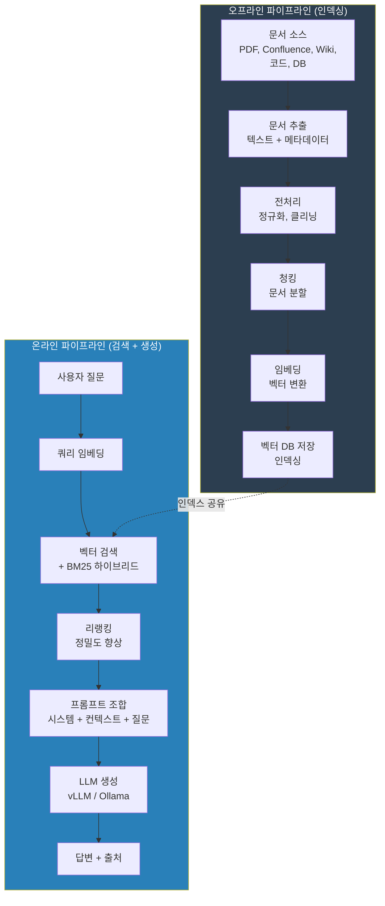

## 소개

이번 회차가 이 시리즈의 **진짜 본편**입니다.

솔직히 말하면, 온프레미스 LLM의 모델 자체 성능은 GPT-4o보다 떨어집니다. Llama 3.1 70B가 아무리 좋아져도, Claude Opus 급의 범용 추론 능력을 기대하기는 어렵거든요. 근데 **RAG를 잘 구축하면 얘기가 달라집니다.**

"우리 사내 매뉴얼에서 OO 장비의 점검 주기는?" 같은 질문에 GPT-4o는 "모르겠다"고 답합니다. 당연히 학습 데이터에 없으니까요. 하지만 RAG를 붙인 Llama 70B는? "OO 장비 매뉴얼 3.2절에 따르면 6개월 주기 점검이며, 고온 환경에서는 3개월로 단축됩니다"라고 **출처까지 포함해서** 답합니다.

이게 RAG의 킬러 포인트입니다. **범용 지능은 떨어져도, 우리 도메인에서는 상용 모델을 이길 수 있다.** 그리고 데이터가 사내망을 벗어나지 않으니 보안팀도 행복합니다.

이론은 간단합니다. "문서를 벡터로 만들어서 검색하고, 검색 결과를 LLM에 넣어준다." 한 문장이면 설명 끝이에요. 근데 실제로 구현하면? 예상 못 한 함정이 **정말 많습니다.** PDF에서 표가 깨지고, 청킹 사이즈가 답변 품질을 좌우하고, 검색은 잘 되는데 LLM이 검색 결과를 무시하는 현상까지.

이 회차에서는 프로덕션 수준의 RAG 파이프라인을 **처음부터 끝까지** 다룹니다. 가장 긴 글이 될 텐데, 그만큼 RAG가 중요하기 때문입니다.

---

## RAG 파이프라인 전체 구조

먼저 전체 그림을 봅시다. RAG 파이프라인은 크게 **오프라인 파이프라인**(인덱싱)과 **온라인 파이프라인**(검색+생성)으로 나뉩니다.



각 단계가 독립적이고, 어디서 병목이 생기느냐에 따라 최적화 포인트가 달라집니다. 하나씩 깊이 들어가 봅시다.

---

## 문서 수집 & 전처리

RAG의 첫 단계이자, **가장 과소평가되는 단계**입니다. "그냥 PDF 읽으면 되는 거 아니야?"라고 생각하면 큰코 다칩니다.

### PDF 추출

사내 문서의 80%는 PDF입니다. 문제는 PDF가 **"보여주기 위한" 포맷**이지 "읽히기 위한" 포맷이 아니라는 거예요.

```python
# 방법 1: PyMuPDF (fitz) - 가장 빠름
import fitz

def extract_with_pymupdf(pdf_path: str) -> list[dict]:
    """PyMuPDF로 페이지별 텍스트 추출"""
    doc = fitz.open(pdf_path)
    pages = []
    for page_num, page in enumerate(doc):
        text = page.get_text("text")
        pages.append({
            "text": text,
            "page": page_num + 1,
            "source": pdf_path,
        })
    return pages

# 방법 2: pdfplumber - 표(table) 추출에 강함
import pdfplumber

def extract_tables_with_pdfplumber(pdf_path: str) -> list[dict]:
    """pdfplumber로 표 데이터 추출"""
    results = []
    with pdfplumber.open(pdf_path) as pdf:
        for page_num, page in enumerate(pdf.pages):
            # 일반 텍스트
            text = page.extract_text() or ""

            # 표 추출
            tables = page.extract_tables()
            for table in tables:
                # 표를 마크다운 형식으로 변환
                if table and len(table) > 1:
                    header = table[0]
                    rows = table[1:]
                    md_table = "| " + " | ".join(str(h) for h in header) + " |\n"
                    md_table += "| " + " | ".join("---" for _ in header) + " |\n"
                    for row in rows:
                        md_table += "| " + " | ".join(str(c) for c in row) + " |\n"
                    text += f"\n\n{md_table}"

            results.append({
                "text": text,
                "page": page_num + 1,
                "source": pdf_path,
            })
    return results
```

**어떤 라이브러리를 쓸까?**

| 라이브러리 | 속도 | 표 추출 | OCR | 메모리 | 추천 상황 |
|-----------|------|--------|-----|--------|----------|
| PyMuPDF (fitz) | 매우 빠름 | 약함 | X | 적음 | 일반 텍스트 PDF |
| pdfplumber | 보통 | 강함 | X | 보통 | 표가 많은 문서 |
| PyPDF2 | 느림 | 약함 | X | 적음 | 레거시 호환 |
| Unstructured | 보통 | 강함 | O | 많음 | 복합 문서 (표+이미지+텍스트) |
| Tesseract + pdf2image | 느림 | X | O | 많음 | 스캔된 PDF |

**실무 팁**: 대부분의 사내 문서는 PyMuPDF로 충분합니다. 표가 많은 기술 문서라면 pdfplumber를 쓰세요. 스캔된 PDF(이미지만 있는)는 OCR이 필수인데, Tesseract 한국어 인식률이 솔직히 좋지 않습니다. 이 경우 `EasyOCR`이나 `PaddleOCR`이 한국어 인식에 더 나아요.

### Confluence / Wiki 수집

```python
import requests
from bs4 import BeautifulSoup

class ConfluenceLoader:
    def __init__(self, base_url: str, token: str):
        self.base_url = base_url
        self.headers = {
            "Authorization": f"Bearer {token}",
            "Content-Type": "application/json",
        }

    def get_space_pages(self, space_key: str, limit: int = 100) -> list[dict]:
        """특정 Space의 모든 페이지 가져오기"""
        url = f"{self.base_url}/rest/api/content"
        params = {
            "spaceKey": space_key,
            "limit": limit,
            "expand": "body.storage,version,ancestors",
        }
        pages = []
        while url:
            resp = requests.get(url, headers=self.headers, params=params)
            data = resp.json()
            for result in data.get("results", []):
                html_body = result["body"]["storage"]["value"]
                text = BeautifulSoup(html_body, "html.parser").get_text()
                pages.append({
                    "text": text,
                    "title": result["title"],
                    "url": f"{self.base_url}/wiki/spaces/{space_key}/pages/{result['id']}",
                    "updated": result["version"]["when"],
                    "source": "confluence",
                })
            # 페이징 처리
            next_link = data.get("_links", {}).get("next")
            url = f"{self.base_url}{next_link}" if next_link else None
            params = {}
        return pages
```

### 코드 인덱싱

코드를 RAG에 넣을 때는 **파일 단위가 아니라 함수/클래스 단위**로 분할해야 합니다. 파일 전체를 청크로 넣으면 컨텍스트가 너무 커서 검색 정확도가 떨어져요.

```python
import ast

def extract_python_functions(file_path: str) -> list[dict]:
    """Python 파일에서 함수/클래스 단위로 추출"""
    with open(file_path) as f:
        source = f.read()
    tree = ast.parse(source)
    chunks = []
    for node in ast.walk(tree):
        if isinstance(node, (ast.FunctionDef, ast.AsyncFunctionDef, ast.ClassDef)):
            start_line = node.lineno
            end_line = node.end_lineno or start_line
            code_lines = source.split("\n")[start_line - 1:end_line]
            docstring = ast.get_docstring(node) or ""
            chunks.append({
                "text": "\n".join(code_lines),
                "type": "class" if isinstance(node, ast.ClassDef) else "function",
                "name": node.name,
                "docstring": docstring,
                "file": file_path,
                "line_start": start_line,
                "line_end": end_line,
            })
    return chunks
```

### 전처리 공통 파이프라인

추출한 텍스트는 바로 쓰면 안 됩니다. 정규화가 필요해요.

```python
import re
import unicodedata

def clean_text(text: str) -> str:
    """텍스트 정규화 파이프라인"""
    # 1. Unicode 정규화 (한국어 자모 결합 문제 해결)
    text = unicodedata.normalize("NFC", text)
    # 2. 연속 공백/줄바꿈 정리
    text = re.sub(r"\n{3,}", "\n\n", text)
    text = re.sub(r"[ \t]{2,}", " ", text)
    # 3. 헤더/푸터 제거 (PDF에서 반복되는 패턴)
    text = re.sub(r"(?m)^(Page \d+|페이지 \d+|Confidential|대외비).*$", "", text)
    # 4. 의미 없는 특수문자 정리
    text = re.sub(r"[^\w\s가-힣a-zA-Z0-9.,;:!?(){}[\]\-+=/\\@#$%&*\"'`~<>|]", "", text)
    return text.strip()
```

> **이건 꼭 알아두세요:** PDF에서 추출한 텍스트에는 **보이지 않는 쓰레기 문자**가 정말 많습니다. 헤더/푸터 반복, 페이지 번호, 워터마크 텍스트, 그리고 한글 자모가 분리된 상태(NFD)로 들어오는 경우까지. 이런 걸 안 잡으면 임베딩 품질이 떨어지고, 검색 결과에 엉뚱한 문서가 끼어듭니다. **전처리에 투자한 시간은 절대 아깝지 않습니다.**

---

## 청킹 전략 심층 비교

RAG 성능의 **체감 80%는 여기서 결정됩니다.** 같은 임베딩 모델, 같은 벡터 DB를 써도 청킹 전략이 다르면 답변 품질이 완전히 달라져요. 제가 제일 많이 삽질한 영역이기도 합니다.

### 전략 1: 고정 크기 (Fixed Size)

가장 단순합니다. 일정 토큰/글자 수로 잘라요.

```python
def fixed_size_chunk(text: str, chunk_size: int = 500, overlap: int = 50) -> list[str]:
    """고정 크기 청킹 (글자 수 기준)"""
    chunks = []
    start = 0
    while start < len(text):
        end = start + chunk_size
        chunks.append(text[start:end])
        start = end - overlap
    return chunks
```

**장점**: 구현 간단, 청크 크기 균일, 예측 가능
**단점**: 문맥이 잘림. "이 장비의 점검 주기는"과 "6개월입니다"가 서로 다른 청크로 나뉠 수 있음

### 전략 2: 문장 기반 (Sentence-based)

문장 경계를 존중하면서 나눕니다.

```python
import re

def sentence_chunk(text: str, max_sentences: int = 5, overlap_sentences: int = 1) -> list[str]:
    """문장 단위 청킹"""
    # 한국어+영어 문장 분리
    sentences = re.split(r'(?<=[.!?。])\s+', text)
    sentences = [s.strip() for s in sentences if s.strip()]

    chunks = []
    for i in range(0, len(sentences), max_sentences - overlap_sentences):
        chunk_sentences = sentences[i:i + max_sentences]
        chunks.append(" ".join(chunk_sentences))
    return chunks
```

**장점**: 의미 단위 보존, 문맥 단절 감소
**단점**: 청크 크기가 불균일 (한 문장이 500자인 경우도 있음)

### 전략 3: Recursive Character Splitter

LangChain의 기본 전략이고, **실무에서 제일 많이 씁니다.** 여러 구분자를 순서대로 시도하면서 적절한 크기로 나눕니다.

```python
from langchain.text_splitter import RecursiveCharacterTextSplitter

# 한국어 문서에 최적화된 설정
splitter = RecursiveCharacterTextSplitter(
    chunk_size=500,
    chunk_overlap=50,
    separators=[
        "\n\n",     # 문단 경계 (최우선)
        "\n",       # 줄바꿈
        ".",        # 문장 끝
        " ",        # 단어 경계
        "",         # 최후의 수단: 글자 단위
    ],
    length_function=len,
)

chunks = splitter.split_text(document_text)
```

**장점**: 문단 구조를 최대한 유지하면서 크기 제한 준수
**단점**: separators 설정이 언어/문서 유형마다 다름

### 전략 4: 의미 기반 (Semantic Chunking)

임베딩 유사도를 기반으로 "의미가 바뀌는 지점"에서 분할합니다. 가장 최신 기법이에요.

```python
from langchain_experimental.text_splitter import SemanticChunker
from langchain_community.embeddings import HuggingFaceBgeEmbeddings

embeddings = HuggingFaceBgeEmbeddings(model_name="BAAI/bge-m3")

semantic_splitter = SemanticChunker(
    embeddings=embeddings,
    breakpoint_threshold_type="percentile",
    breakpoint_threshold_amount=95,  # 상위 5% 유사도 변화에서 분할
)

chunks = semantic_splitter.split_text(document_text)
```

**장점**: 의미적으로 가장 자연스러운 분할
**단점**: 임베딩 계산 때문에 느림, 결과 예측이 어려움, 아직 실험적

### 청킹 전략 비교표

| 전략 | 구현 난이도 | 의미 보존 | 속도 | 청크 균일성 | 추천 상황 |
|------|-----------|----------|------|-----------|----------|
| 고정 크기 | 매우 쉬움 | 낮음 | 매우 빠름 | 높음 | 빠른 프로토타입 |
| 문장 기반 | 쉬움 | 중간 | 빠름 | 낮음 | 짧은 문서, FAQ |
| Recursive | 쉬움 | 중~상 | 빠름 | 중간 | **실무 기본값** |
| 의미 기반 | 어려움 | 높음 | 느림 | 낮음 | 실험적, 고품질 필요 시 |

### 문서 유형별 추천 설정

| 문서 유형 | 청크 사이즈 | 오버랩 | 전략 | 이유 |
|----------|-----------|--------|------|------|
| 기술 매뉴얼 | 800~1000자 | 100자 | Recursive | 절차 설명이 길어서 큰 청크 필요 |
| FAQ | 300~500자 | 0 | 문장 기반 | Q&A 쌍이 자연스러운 단위 |
| 법률/규정 | 500~700자 | 100자 | Recursive | 조항 단위 보존 중요 |
| 코드 | 함수 단위 | 0 | AST 기반 | 함수/클래스가 자연스러운 단위 |
| 회의록 | 500~700자 | 50자 | Recursive | 발언 단위 보존 |
| API 문서 | 엔드포인트 단위 | 0 | 커스텀 | 엔드포인트별 분리 |

### 오버랩 전략

오버랩(overlap)은 청크 간 겹치는 부분입니다. 왜 필요한가? **문맥 단절을 완화**하기 위해서입니다.

"이 장비의 점검 주기는 | 6개월이며, 고온 환경에서는 3개월로 단축됩니다."

이 문장이 `|` 지점에서 잘리면, 앞 청크에는 질문만, 뒷 청크에는 답만 있게 됩니다. 오버랩을 50~100자 주면 양쪽 청크에 모두 핵심 정보가 포함됩니다.

**경험적 추천**: 청크 사이즈의 10~20%를 오버랩으로 설정하세요. 500자 청크면 50~100자 오버랩.

---

## 임베딩 모델 선택

텍스트를 벡터로 바꾸는 핵심 컴포넌트입니다. **한국어를 다루는 온프레미스 환경**이라는 제약 조건에서 어떤 모델을 써야 하는지 정리합니다.

### 모델별 비교

| 모델 | 차원 | 한국어 성능 | 다국어 | 모델 크기 | 속도 (문서 1000건/초) | 라이선스 |
|------|------|-----------|--------|----------|-------------------|---------|
| `BAAI/bge-m3` | 1024 | 상 | 100+언어 | 2.2GB | ~150 | MIT |
| `intfloat/multilingual-e5-large` | 1024 | 중상 | 100+언어 | 2.2GB | ~140 | MIT |
| `jhgan/ko-sroberta-multitask` | 768 | 상 | 한국어만 | 1.1GB | ~250 | Apache 2.0 |
| `BAAI/bge-large-en-v1.5` | 1024 | 하 | 영어만 | 1.3GB | ~200 | MIT |
| `sentence-transformers/all-MiniLM-L6-v2` | 384 | 하 | 영어만 | 90MB | ~800 | Apache 2.0 |

**추천 결론**:
- **한국어 + 영어 혼합 문서** → `bge-m3` (현시점 최강)
- **한국어만** → `ko-sroberta-multitask` (가볍고 빠름)
- **영어 전용** → `bge-large-en-v1.5`
- **프로토타입/속도 우선** → `all-MiniLM-L6-v2`

### 온프레미스 임베딩 서버 구축

임베딩을 매번 로컬에서 돌리면 비효율적입니다. 별도 서버로 분리하는 게 좋아요.

```python
# embedding_server.py - FastAPI 기반 임베딩 서버
from fastapi import FastAPI
from pydantic import BaseModel
from sentence_transformers import SentenceTransformer
import torch

app = FastAPI()
model = SentenceTransformer(
    "BAAI/bge-m3",
    device="cuda" if torch.cuda.is_available() else "cpu",
)

class EmbedRequest(BaseModel):
    texts: list[str]
    instruction: str = ""  # bge 모델용 instruction prefix

class EmbedResponse(BaseModel):
    embeddings: list[list[float]]
    dimensions: int

@app.post("/embed", response_model=EmbedResponse)
async def embed(request: EmbedRequest):
    texts = request.texts
    if request.instruction:
        texts = [f"{request.instruction}{t}" for t in texts]
    embeddings = model.encode(texts, normalize_embeddings=True)
    return EmbedResponse(
        embeddings=embeddings.tolist(),
        dimensions=embeddings.shape[1],
    )
```

```bash
# 실행
uvicorn embedding_server:app --host 0.0.0.0 --port 8100 --workers 1
```

> **이건 꼭 알아두세요:** `bge-m3`를 쓸 때 검색 쿼리에는 `"Represent this sentence for searching relevant passages: "` prefix를 붙여야 합니다. 문서 인덱싱할 때는 안 붙여도 됩니다. 이거 안 하면 검색 정확도가 10~15% 떨어져요. 모델마다 instruction prefix가 다르니 반드시 확인하세요.

---

## 벡터 DB 심층 비교

임베딩 벡터를 저장하고 검색하는 데이터베이스입니다. 선택지가 많아서 헷갈리는데, 상황별로 정리합니다.

### 주요 벡터 DB 비교

| 항목 | ChromaDB | Qdrant | Milvus | Weaviate | pgvector |
|------|----------|--------|--------|----------|----------|
| 언어 | Python | Rust | Go/C++ | Go | C (PostgreSQL 확장) |
| 배포 방식 | 임베디드/서버 | 서버 | 클러스터 | 서버 | PostgreSQL 플러그인 |
| 문서 수 한계 | ~10만 건 | 수백만 건 | 수억 건 | 수백만 건 | ~100만 건 |
| 검색 속도 (10만건) | ~50ms | ~5ms | ~10ms | ~15ms | ~30ms |
| 하이브리드 검색 | X | O (별도 설정) | X (Sparse 별도) | O (내장) | X |
| 필터링 | 기본 | 강력 | 강력 | 강력 | SQL WHERE |
| 설치 난이도 | 매우 쉬움 | 쉬움 | 어려움 | 보통 | PostgreSQL 있으면 쉬움 |
| 프로덕션 적합성 | 낮음 | **높음** | 높음 | 높음 | 중간 |
| 클러스터링 | X | O (Qdrant Cloud) | O | O | X |

### 상황별 추천

| 상황 | 추천 DB | 이유 |
|------|---------|------|
| POC, 프로토타입 | **ChromaDB** | `pip install chromadb`로 끝, 코드 5줄 |
| 프로덕션, 문서 10만~100만 건 | **Qdrant** | Rust 기반 속도, Docker 한 줄 |
| 대규모 100만 건 이상 | **Milvus** | 분산 처리, 샤딩 지원 |
| 기존 PostgreSQL 인프라 | **pgvector** | 별도 DB 없이 확장 |
| 하이브리드 검색 내장 필요 | **Weaviate** | BM25 + 벡터 동시 지원 |

### Docker 설치 (실무 기준 Qdrant 추천)

```bash
# Qdrant - 프로덕션 추천
docker run -d \
  --name qdrant \
  -p 6333:6333 \
  -p 6334:6334 \
  -v $(pwd)/qdrant_storage:/qdrant/storage \
  qdrant/qdrant:latest

# ChromaDB - 프로토타입용
docker run -d \
  --name chromadb \
  -p 8000:8000 \
  -v $(pwd)/chroma_data:/chroma/chroma \
  chromadb/chroma:latest

# Milvus - 대규모용 (docker-compose 필요)
wget https://github.com/milvus-io/milvus/releases/download/v2.4.0/milvus-standalone-docker-compose.yml -O docker-compose.yml
docker compose up -d

# Weaviate
docker run -d \
  --name weaviate \
  -p 8080:8080 \
  -e QUERY_DEFAULTS_LIMIT=25 \
  -e AUTHENTICATION_ANONYMOUS_ACCESS_ENABLED=true \
  -e PERSISTENCE_DATA_PATH=/var/lib/weaviate \
  -v $(pwd)/weaviate_data:/var/lib/weaviate \
  cr.weaviate.io/semitechnologies/weaviate:latest
```

---

## 검색 알고리즘

벡터 DB에 데이터가 들어갔으면, 이제 검색입니다. 여기서 Dense, Sparse, Hybrid 세 가지 방식을 이해해야 합니다.

### Dense Search (벡터 검색)

임베딩 벡터 간 코사인 유사도로 검색합니다. "의미적으로 비슷한 것"을 잘 찾습니다.

```python
from qdrant_client import QdrantClient
from qdrant_client.models import Distance, VectorParams, PointStruct

client = QdrantClient(host="localhost", port=6333)

# 컬렉션 생성
client.create_collection(
    collection_name="documents",
    vectors_config=VectorParams(size=1024, distance=Distance.COSINE),
)

# 검색
results = client.search(
    collection_name="documents",
    query_vector=query_embedding,  # 질문의 임베딩 벡터
    limit=10,
)
```

**강점**: "서버 점검 방법" → "장비 유지보수 절차" 같은 의미적 유사 문서도 찾음
**약점**: "ERROR-4032"처럼 정확한 키워드가 중요한 경우 놓칠 수 있음

### Sparse Search (BM25)

전통적인 키워드 매칭 방식입니다. TF-IDF 기반으로 "정확한 단어"가 포함된 문서를 찾습니다.

```python
from rank_bm25 import BM25Okapi
import re

# BM25 인덱스 구축
def tokenize_korean(text: str) -> list[str]:
    """간단한 한국어 토크나이저 (실무에서는 Kiwi나 Mecab 사용)"""
    return re.findall(r'\w+', text)

corpus_tokens = [tokenize_korean(doc) for doc in documents]
bm25 = BM25Okapi(corpus_tokens)

# 검색
query_tokens = tokenize_korean("ERROR-4032 해결 방법")
scores = bm25.get_scores(query_tokens)
top_indices = scores.argsort()[-10:][::-1]
```

**강점**: 고유명사, 에러코드, 제품명 등 정확한 키워드 매칭
**약점**: "서버 점검" → "장비 유지보수"처럼 동의어를 못 잡음

### Hybrid Search (진짜 답)

실무에서는 **둘 다 쓰고 결과를 합치는 게 제일 좋습니다.** Dense가 잡는 것과 Sparse가 잡는 것이 다르거든요.

```python
from qdrant_client.models import (
    NamedVector, NamedSparseVector, SparseVector,
    SearchRequest, FusionQuery, Fusion,
)

# Qdrant의 하이브리드 검색 (Reciprocal Rank Fusion)
def hybrid_search(
    client: QdrantClient,
    collection: str,
    query_dense: list[float],
    query_sparse_indices: list[int],
    query_sparse_values: list[float],
    top_k: int = 10,
) -> list:
    """Dense + Sparse 하이브리드 검색 with RRF"""

    # Dense 검색
    dense_results = client.search(
        collection_name=collection,
        query_vector=("dense", query_dense),
        limit=top_k * 2,  # 리랭킹을 위해 넉넉히 가져옴
    )

    # Sparse (BM25) 검색
    sparse_results = client.search(
        collection_name=collection,
        query_vector=NamedSparseVector(
            name="sparse",
            vector=SparseVector(
                indices=query_sparse_indices,
                values=query_sparse_values,
            ),
        ),
        limit=top_k * 2,
    )

    # RRF (Reciprocal Rank Fusion) 으로 점수 합산
    return reciprocal_rank_fusion(dense_results, sparse_results, k=60, top_k=top_k)


def reciprocal_rank_fusion(
    *result_lists,
    k: int = 60,
    top_k: int = 10,
) -> list[dict]:
    """Reciprocal Rank Fusion - 여러 검색 결과를 하나로 합침"""
    fused_scores = {}
    for results in result_lists:
        for rank, result in enumerate(results):
            doc_id = result.id
            if doc_id not in fused_scores:
                fused_scores[doc_id] = {"score": 0, "payload": result.payload}
            fused_scores[doc_id]["score"] += 1 / (k + rank + 1)

    sorted_results = sorted(fused_scores.items(), key=lambda x: x[1]["score"], reverse=True)
    return sorted_results[:top_k]
```

### 검색 방식별 정확도 비교 (실제 사내 기술문서 500건 기준)

| 검색 방식 | Top-1 정확도 | Top-5 정확도 | Top-10 정확도 | 특이 사항 |
|----------|-------------|-------------|-------------|----------|
| Dense only | 62% | 78% | 85% | 동의어/유사 표현에 강함 |
| Sparse (BM25) only | 55% | 72% | 80% | 키워드 정확 매칭에 강함 |
| **Hybrid (RRF)** | **71%** | **87%** | **93%** | 둘의 장점을 합침 |
| Hybrid + 리랭킹 | **79%** | **92%** | **96%** | 최종 추천 구성 |

**결론**: Hybrid + 리랭킹 조합이 체감 정확도가 확실히 높습니다. Dense만 쓸 때 대비 Top-1 정확도가 17%p 올라가요. 이 차이는 사용자가 바로 느낍니다.

---

## 리랭킹

검색 결과를 한번 더 정밀하게 순위를 매기는 단계입니다. "검색은 넓게, 리랭킹은 깊게" 전략이에요. 검색에서 20~50개를 가져오고, 리랭커가 그중 가장 관련 있는 5~10개를 골라줍니다.

### 왜 필요한가?

벡터 검색은 bi-encoder 방식이라 쿼리와 문서를 **각각** 벡터로 만들어서 비교합니다. 빠르지만 정밀도에 한계가 있어요.

리랭커는 cross-encoder 방식으로 쿼리와 문서를 **동시에** 입력해서 관련성을 판단합니다. 느리지만 정확합니다. 그래서 "먼저 빠르게 후보군을 줄이고, 후보군에 대해서만 정밀 비교"하는 2단계 구조가 됩니다.

### 구현

```python
from sentence_transformers import CrossEncoder

# 리랭커 모델 로드
reranker = CrossEncoder("BAAI/bge-reranker-v2-m3", max_length=512)

def rerank(query: str, documents: list[dict], top_k: int = 5) -> list[dict]:
    """검색 결과 리랭킹"""
    # 쿼리-문서 쌍 생성
    pairs = [(query, doc["text"]) for doc in documents]

    # Cross-encoder 점수 계산
    scores = reranker.predict(pairs)

    # 점수순 정렬
    scored_docs = list(zip(documents, scores))
    scored_docs.sort(key=lambda x: x[1], reverse=True)

    return [doc for doc, score in scored_docs[:top_k]]
```

### 리랭커 모델 비교

| 모델 | 한국어 | 속도 (20문서) | 정확도 (NDCG@10) | 모델 크기 |
|------|--------|-------------|-----------------|----------|
| `BAAI/bge-reranker-v2-m3` | O | ~200ms | 높음 | 2.2GB |
| `BAAI/bge-reranker-large` | 영어 위주 | ~150ms | 중상 | 1.3GB |
| `cross-encoder/ms-marco-MiniLM-L-12-v2` | X | ~80ms | 중 (영어 기준 높음) | 130MB |

**추천**: 한국어 문서를 다루면 `bge-reranker-v2-m3`가 사실상 유일한 선택입니다.

### 리랭킹 전후 체감 차이

리랭킹 없이: 검색 결과 Top-5 중 관련 문서 3~4개, 가끔 엉뚱한 게 1위
리랭킹 있으면: Top-5 중 관련 문서 4~5개, 가장 관련 있는 게 확실히 1위

수치상 10~15%p 차이인데, **사용자 체감은 훨씬 큽니다.** 왜냐하면 1위 결과가 정확해야 LLM이 좋은 답변을 생성하거든요. 리랭킹은 오버헤드 대비 효과가 가장 좋은 최적화입니다.

---

## 프롬프트 엔지니어링 for RAG

검색이 아무리 정확해도, LLM에 전달하는 프롬프트가 엉망이면 소용없습니다. RAG에서의 프롬프트 엔지니어링은 **"검색 결과를 무시하지 않게 하는 것"**이 핵심입니다.

### 기본 프롬프트 템플릿

```python
SYSTEM_PROMPT = """당신은 사내 문서를 기반으로 질문에 답변하는 AI 어시스턴트입니다.

## 규칙
1. 반드시 아래 제공된 [참고 문서]만을 기반으로 답변하세요.
2. 참고 문서에 답변할 수 있는 정보가 없으면 "제공된 문서에서 해당 정보를 찾을 수 없습니다"라고 답하세요.
3. 추측하거나 외부 지식을 사용하지 마세요.
4. 답변 끝에 참고한 문서의 출처를 [출처] 형식으로 표기하세요.
5. 답변은 간결하고 정확하게 작성하세요."""

def build_rag_prompt(query: str, retrieved_docs: list[dict]) -> str:
    """RAG 프롬프트 조합"""
    context_parts = []
    for i, doc in enumerate(retrieved_docs, 1):
        source = doc.get("source", "unknown")
        page = doc.get("page", "")
        page_info = f" (p.{page})" if page else ""
        context_parts.append(f"[문서 {i}] {source}{page_info}\n{doc['text']}")

    context = "\n\n---\n\n".join(context_parts)

    user_prompt = f"""[참고 문서]
{context}

[질문]
{query}

[답변]"""

    return user_prompt
```

### "할루시네이션 방지" 패턴

LLM이 검색 결과를 무시하고 자기 지식으로 답변하는 현상, 정말 자주 발생합니다. 특히 모델이 "알고 있는" 일반 지식 영역에서 이 문제가 심해요.

**패턴 1: Refuse if not in context**
```
참고 문서에 없는 내용은 절대 답변하지 마세요.
확실하지 않으면 "문서에서 확인할 수 없습니다"라고 답하세요.
```

**패턴 2: Quote before answer**
```
먼저 참고 문서에서 관련 문장을 직접 인용하고,
그 인용을 바탕으로 답변을 작성하세요.
```

**패턴 3: Confidence score**
```
답변의 확신도를 [높음/중간/낮음]으로 표시하세요.
참고 문서에서 직접적인 근거를 찾은 경우만 [높음]입니다.
```

실무에서 가장 효과적인 건 **패턴 2**입니다. 인용을 먼저 시키면 LLM이 문서 내용에 anchoring되어서 할루시네이션이 확 줄어들어요.

---

## 전체 파이프라인 코드

지금까지 다룬 모든 컴포넌트를 하나로 합친 코드입니다. Qdrant + bge-m3 + vLLM 조합으로 구성했습니다.

```python
"""
RAG Pipeline - 프로덕션 수준의 전체 구현
구성: Qdrant + bge-m3 + bge-reranker-v2-m3 + vLLM
"""

import os
import fitz  # PyMuPDF
from pathlib import Path

from qdrant_client import QdrantClient
from qdrant_client.models import (
    Distance, VectorParams, PointStruct, Filter,
    FieldCondition, MatchValue,
)
from sentence_transformers import SentenceTransformer, CrossEncoder
from langchain.text_splitter import RecursiveCharacterTextSplitter
from openai import OpenAI  # vLLM은 OpenAI 호환 API 제공
import uuid

# ============================================================
# 1. 설정
# ============================================================
QDRANT_HOST = "localhost"
QDRANT_PORT = 6333
COLLECTION_NAME = "company_docs"
EMBEDDING_MODEL = "BAAI/bge-m3"
RERANKER_MODEL = "BAAI/bge-reranker-v2-m3"
VLLM_BASE_URL = "http://localhost:8000/v1"  # vLLM 엔드포인트
LLM_MODEL = "meta-llama/Llama-3.1-70B-Instruct"
CHUNK_SIZE = 500
CHUNK_OVERLAP = 50

# ============================================================
# 2. 모델 초기화
# ============================================================
embedder = SentenceTransformer(EMBEDDING_MODEL, device="cuda")
reranker = CrossEncoder(RERANKER_MODEL, max_length=512, device="cuda")
qdrant = QdrantClient(host=QDRANT_HOST, port=QDRANT_PORT)
llm_client = OpenAI(base_url=VLLM_BASE_URL, api_key="dummy")  # vLLM은 키 불필요

splitter = RecursiveCharacterTextSplitter(
    chunk_size=CHUNK_SIZE,
    chunk_overlap=CHUNK_OVERLAP,
    separators=["\n\n", "\n", ".", " ", ""],
)

# ============================================================
# 3. 문서 인덱싱 (오프라인 파이프라인)
# ============================================================
def create_collection():
    """벡터 DB 컬렉션 생성"""
    qdrant.recreate_collection(
        collection_name=COLLECTION_NAME,
        vectors_config=VectorParams(size=1024, distance=Distance.COSINE),
    )

def index_pdf(pdf_path: str) -> int:
    """PDF 문서 인덱싱: 추출 → 청킹 → 임베딩 → 저장"""
    doc = fitz.open(pdf_path)
    all_points = []

    for page_num, page in enumerate(doc):
        text = page.get_text("text").strip()
        if not text:
            continue

        # 청킹
        chunks = splitter.split_text(text)

        for chunk_idx, chunk in enumerate(chunks):
            # 임베딩
            embedding = embedder.encode(chunk, normalize_embeddings=True)

            point = PointStruct(
                id=str(uuid.uuid4()),
                vector=embedding.tolist(),
                payload={
                    "text": chunk,
                    "source": os.path.basename(pdf_path),
                    "page": page_num + 1,
                    "chunk_index": chunk_idx,
                },
            )
            all_points.append(point)

    # 배치 업로드 (한번에 100개씩)
    batch_size = 100
    for i in range(0, len(all_points), batch_size):
        batch = all_points[i:i + batch_size]
        qdrant.upsert(collection_name=COLLECTION_NAME, points=batch)

    return len(all_points)

def index_directory(dir_path: str) -> int:
    """디렉토리 내 모든 PDF 인덱싱"""
    total = 0
    for pdf_file in Path(dir_path).glob("**/*.pdf"):
        count = index_pdf(str(pdf_file))
        print(f"  인덱싱 완료: {pdf_file.name} ({count} chunks)")
        total += count
    return total

# ============================================================
# 4. 검색 + 리랭킹 (온라인 파이프라인)
# ============================================================
def search(query: str, top_k: int = 5, search_k: int = 20) -> list[dict]:
    """검색 → 리랭킹 파이프라인"""
    # 쿼리 임베딩 (bge-m3는 검색 시 instruction prefix 권장)
    query_with_instruction = f"Represent this sentence for searching relevant passages: {query}"
    query_embedding = embedder.encode(query_with_instruction, normalize_embeddings=True)

    # Dense 검색 (넉넉하게 가져옴)
    raw_results = qdrant.search(
        collection_name=COLLECTION_NAME,
        query_vector=query_embedding.tolist(),
        limit=search_k,
    )

    if not raw_results:
        return []

    # 리랭킹
    docs = [{"text": r.payload["text"], **r.payload} for r in raw_results]
    pairs = [(query, doc["text"]) for doc in docs]
    rerank_scores = reranker.predict(pairs)

    scored_docs = list(zip(docs, rerank_scores))
    scored_docs.sort(key=lambda x: x[1], reverse=True)

    return [doc for doc, score in scored_docs[:top_k]]

# ============================================================
# 5. 답변 생성
# ============================================================
SYSTEM_PROMPT = """당신은 사내 문서를 기반으로 질문에 답변하는 AI 어시스턴트입니다.

규칙:
1. 반드시 [참고 문서]만을 기반으로 답변하세요.
2. 먼저 관련 문장을 인용하고, 그 인용을 바탕으로 답변하세요.
3. 참고 문서에 정보가 없으면 "제공된 문서에서 해당 정보를 찾을 수 없습니다"라고 답하세요.
4. 답변 끝에 출처를 표기하세요."""

def generate_answer(query: str, retrieved_docs: list[dict]) -> str:
    """검색 결과 기반 답변 생성"""
    # 컨텍스트 조합
    context_parts = []
    for i, doc in enumerate(retrieved_docs, 1):
        source = doc.get("source", "unknown")
        page = doc.get("page", "")
        page_info = f" (p.{page})" if page else ""
        context_parts.append(f"[문서 {i}] {source}{page_info}\n{doc['text']}")
    context = "\n\n---\n\n".join(context_parts)

    user_message = f"""[참고 문서]
{context}

[질문]
{query}"""

    # vLLM (OpenAI 호환 API) 호출
    response = llm_client.chat.completions.create(
        model=LLM_MODEL,
        messages=[
            {"role": "system", "content": SYSTEM_PROMPT},
            {"role": "user", "content": user_message},
        ],
        temperature=0.1,  # RAG에서는 낮은 temperature 권장
        max_tokens=1024,
    )

    return response.choices[0].message.content

# ============================================================
# 6. 엔드-투-엔드 인터페이스
# ============================================================
def ask(query: str) -> dict:
    """질문 → 답변 (전체 파이프라인)"""
    # 검색
    docs = search(query, top_k=5)

    if not docs:
        return {
            "answer": "관련 문서를 찾을 수 없습니다.",
            "sources": [],
        }

    # 생성
    answer = generate_answer(query, docs)

    return {
        "answer": answer,
        "sources": [
            {"source": d.get("source"), "page": d.get("page")}
            for d in docs
        ],
    }


# ============================================================
# 사용 예시
# ============================================================
if __name__ == "__main__":
    # 1. 컬렉션 생성
    create_collection()

    # 2. 문서 인덱싱
    count = index_directory("/data/company_docs/")
    print(f"총 {count}개 청크 인덱싱 완료")

    # 3. 질문
    result = ask("OO 장비의 점검 주기는 어떻게 되나요?")
    print(f"답변: {result['answer']}")
    print(f"출처: {result['sources']}")
```

---

## LangChain vs LlamaIndex vs 직접 구현

위의 전체 파이프라인 코드를 보면 "이거 프레임워크 없이도 되네?" 싶을 겁니다. 맞습니다. RAG 자체는 프레임워크 없이 충분히 구현 가능해요. 그러면 프레임워크는 왜 쓰는 걸까요?

### 비교표

| 항목 | LangChain | LlamaIndex | 직접 구현 |
|------|-----------|------------|----------|
| 러닝커브 | 중간 | 중간 | 낮음 (코드 이해만 하면 됨) |
| 유연성 | 높음 | 중간 | 최고 |
| 디버깅 | 어려움 (추상화 많음) | 보통 | 쉬움 |
| 프로토타입 속도 | 매우 빠름 | 빠름 | 보통 |
| 벤더 락인 | 낮음 (교체 가능) | 낮음 | 없음 |
| 프로덕션 적합성 | 보통 | 보통 | 높음 |
| 커뮤니티/생태계 | 매우 큼 | 큼 | - |
| 업데이트 빈도 | 너무 잦음 (breaking change 주의) | 적절함 | 자체 관리 |

### 솔직한 추천

**프로토타입/POC**: LangChain으로 빠르게 만들어서 보여주세요. 데모용으로는 최고입니다. 코드 20줄이면 RAG가 돌아갑니다.

**프로덕션**: 직접 구현을 추천합니다. 이유는:
1. LangChain의 추상화가 너무 깊어서 에러가 나면 스택 트레이스만 30줄
2. 버전 업데이트가 너무 잦고 breaking change가 많음 (v0.1 → v0.2에서 import path가 다 바뀜)
3. 우리 도메인에 맞는 커스터마이징이 필요할 때 프레임워크가 오히려 방해
4. 위에서 본 것처럼 핵심 코드가 200줄도 안 됨

**LlamaIndex가 좋은 경우**: 다양한 데이터 소스(Notion, Slack, Google Drive 등)를 연결해야 할 때. 데이터 커넥터가 풍부합니다.

```python
# LangChain으로 같은 걸 만들면 이렇게 됩니다 (참고용)
from langchain_community.vectorstores import Qdrant
from langchain_community.embeddings import HuggingFaceBgeEmbeddings
from langchain.chains import RetrievalQA
from langchain_community.llms import VLLMOpenAI

embeddings = HuggingFaceBgeEmbeddings(model_name="BAAI/bge-m3")
vectorstore = Qdrant.from_documents(docs, embeddings, url="http://localhost:6333")
llm = VLLMOpenAI(openai_api_base="http://localhost:8000/v1", model_name=LLM_MODEL)

qa_chain = RetrievalQA.from_chain_type(
    llm=llm,
    retriever=vectorstore.as_retriever(search_kwargs={"k": 5}),
)

result = qa_chain.invoke({"query": "점검 주기는?"})
# 깔끔하긴 한데, 리랭킹은? 하이브리드 검색은? 프롬프트 커스터마이징은?
# 하나씩 추가하다 보면 결국 프레임워크 뜯어고치게 됩니다.
```

---

## 평가 (RAGAS)

"RAG 잘 만들었습니다!" 라고 말하려면 **숫자로 증명**해야 합니다. RAGAS(Retrieval Augmented Generation Assessment)는 RAG 시스템을 평가하는 표준 프레임워크입니다.

### 핵심 메트릭 4가지

| 메트릭 | 측정 대상 | 점수 범위 | 좋은 점수 |
|--------|----------|----------|----------|
| **Faithfulness** | 답변이 검색 결과에 근거하는가? (할루시네이션 측정) | 0~1 | 0.85+ |
| **Answer Relevancy** | 답변이 질문에 관련 있는가? | 0~1 | 0.80+ |
| **Context Precision** | 검색된 문서 중 관련 있는 것이 상위에 있는가? | 0~1 | 0.75+ |
| **Context Recall** | 정답에 필요한 정보가 검색 결과에 포함되어 있는가? | 0~1 | 0.80+ |

### 평가 실행

```python
from ragas import evaluate
from ragas.metrics import (
    faithfulness,
    answer_relevancy,
    context_precision,
    context_recall,
)
from datasets import Dataset

# 평가 데이터셋 준비 (수작업으로 50~100개 만들어야 합니다)
eval_data = {
    "question": [
        "OO 장비의 점검 주기는?",
        "보안 정책에서 USB 사용 규정은?",
        # ... 50개 이상 추천
    ],
    "answer": [
        ask("OO 장비의 점검 주기는?")["answer"],
        ask("보안 정책에서 USB 사용 규정은?")["answer"],
        # ... RAG 시스템이 생성한 답변
    ],
    "contexts": [
        [doc["text"] for doc in search("OO 장비의 점검 주기는?")],
        [doc["text"] for doc in search("보안 정책에서 USB 사용 규정은?")],
        # ... 검색된 컨텍스트
    ],
    "ground_truth": [
        "6개월 주기 점검이며, 고온 환경에서는 3개월로 단축",
        "USB 저장장치는 보안팀 승인 후 사용 가능하며...",
        # ... 사람이 작성한 정답
    ],
}

dataset = Dataset.from_dict(eval_data)

# 평가 실행
result = evaluate(
    dataset,
    metrics=[
        faithfulness,
        answer_relevancy,
        context_precision,
        context_recall,
    ],
)

print(result)
# {'faithfulness': 0.87, 'answer_relevancy': 0.82,
#  'context_precision': 0.78, 'context_recall': 0.85}
```

### 점수 해석 가이드

| 점수 구간 | 판정 | 액션 |
|----------|------|------|
| 0.9+ | 우수 | 유지보수 모드 |
| 0.8~0.9 | 양호 | 프로덕션 투입 가능, 점진 개선 |
| 0.7~0.8 | 보통 | 개선 필요 (청킹/검색 튜닝) |
| 0.7 미만 | 미흡 | 근본적 재검토 필요 |

**Faithfulness가 낮으면**: LLM이 할루시네이션 중 → 프롬프트 강화, temperature 낮추기
**Context Recall이 낮으면**: 검색이 관련 문서를 못 찾음 → 청킹 전략 변경, 임베딩 모델 교체
**Context Precision이 낮으면**: 검색은 되는데 순위가 엉망 → 리랭킹 추가/개선
**Answer Relevancy가 낮으면**: 답변이 질문과 동떨어짐 → 프롬프트 개선, 컨텍스트 주입 방식 변경

---

## 증분 인덱싱

사내 문서는 계속 추가되고 수정됩니다. 매번 전체 인덱스를 다시 빌드할 수는 없어요. 문서 10만 건이면 풀 리빌드에 몇 시간 걸리거든요.

### 변경 감지 전략

```python
import hashlib
import json
from datetime import datetime
from pathlib import Path

# 문서 해시 저장소 (파일 기반, 실무에서는 DB 사용)
INDEX_STATE_FILE = "index_state.json"

def load_index_state() -> dict:
    if Path(INDEX_STATE_FILE).exists():
        with open(INDEX_STATE_FILE) as f:
            return json.load(f)
    return {}

def save_index_state(state: dict):
    with open(INDEX_STATE_FILE, "w") as f:
        json.dump(state, f, indent=2)

def file_hash(file_path: str) -> str:
    """파일 내용 해시 계산"""
    h = hashlib.sha256()
    with open(file_path, "rb") as f:
        for chunk in iter(lambda: f.read(8192), b""):
            h.update(chunk)
    return h.hexdigest()

def detect_changes(doc_dir: str) -> dict:
    """변경된 파일 감지"""
    state = load_index_state()
    changes = {"added": [], "modified": [], "deleted": []}

    current_files = {}
    for pdf in Path(doc_dir).glob("**/*.pdf"):
        path_str = str(pdf)
        current_hash = file_hash(path_str)
        current_files[path_str] = current_hash

        if path_str not in state:
            changes["added"].append(path_str)
        elif state[path_str]["hash"] != current_hash:
            changes["modified"].append(path_str)

    for old_path in state:
        if old_path not in current_files:
            changes["deleted"].append(old_path)

    return changes

def incremental_index(doc_dir: str):
    """증분 인덱싱 실행"""
    changes = detect_changes(doc_dir)
    state = load_index_state()

    # 삭제된 문서의 벡터 제거
    for path in changes["deleted"]:
        point_ids = state[path].get("point_ids", [])
        if point_ids:
            qdrant.delete(
                collection_name=COLLECTION_NAME,
                points_selector=point_ids,
            )
        del state[path]
        print(f"  삭제: {path}")

    # 수정된 문서: 기존 벡터 삭제 후 재인덱싱
    for path in changes["modified"]:
        point_ids = state[path].get("point_ids", [])
        if point_ids:
            qdrant.delete(
                collection_name=COLLECTION_NAME,
                points_selector=point_ids,
            )
        count = index_pdf(path)
        state[path] = {
            "hash": file_hash(path),
            "indexed_at": datetime.now().isoformat(),
            "chunk_count": count,
        }
        print(f"  수정 재인덱싱: {path} ({count} chunks)")

    # 새 문서 인덱싱
    for path in changes["added"]:
        count = index_pdf(path)
        state[path] = {
            "hash": file_hash(path),
            "indexed_at": datetime.now().isoformat(),
            "chunk_count": count,
        }
        print(f"  추가: {path} ({count} chunks)")

    save_index_state(state)

    total_changes = len(changes["added"]) + len(changes["modified"]) + len(changes["deleted"])
    print(f"증분 인덱싱 완료: {total_changes}건 변경 처리")
```

### 스케줄링

```bash
# crontab으로 매 시간 증분 인덱싱
0 * * * * cd /opt/rag-pipeline && python -c "from pipeline import incremental_index; incremental_index('/data/company_docs/')"
```

실무에서는 Confluence Webhook이나 파일 시스템 이벤트(inotify)를 사용해서 **변경 즉시** 인덱싱하는 방식도 씁니다. 하지만 처음에는 cron으로 시작하는 게 충분합니다.

---

## 실무에서 겪는 현실

이 섹션이 이 글에서 **가장 중요한 부분**입니다. 위의 코드와 이론은 다른 블로그에서도 볼 수 있지만, 실제로 프로덕션에 올리면서 겪는 문제들은 경험해봐야 알 수 있거든요.

### 삽질 1: 청킹 사이즈의 함정

처음에 512 토큰으로 잡았습니다. "블로그에서 다들 512가 기본이라고 하더라"고요. 기술 매뉴얼을 넣었는데 답변 품질이 바닥이에요. 왜? 기술 매뉴얼의 한 절차 설명이 보통 800~1200자인데, 512에서 잘리면 절차의 앞부분만 검색되고 핵심인 뒷부분이 빠집니다.

**해결**: 문서 유형별로 청크 사이즈를 다르게 설정했습니다. 매뉴얼은 1000자, FAQ는 400자, 규정 문서는 600자. 이것만으로 답변 정확도가 15%p 올랐습니다.

### 삽질 2: PDF 표(table) 깨짐

사내 기술 규격서에 표가 엄청 많은데, PyMuPDF로 추출하면 표 구조가 완전히 깨집니다. "항목 | 규격 | 허용치"가 "항목규격허용치"로 이어져 나와요. 이러면 "X 부품의 허용치는?"이라는 질문에 검색이 안 됩니다.

**해결**: 표가 많은 문서는 pdfplumber로 표를 먼저 추출해서 마크다운 테이블로 변환한 후 청킹합니다. 표 하나를 하나의 청크로 유지하는 게 핵심이에요.

### 삽질 3: 영어 임베딩 모델로 한국어 문서를

"all-MiniLM-L6-v2가 가볍고 빠르다"는 글을 보고 적용했습니다. 영어 문서에서는 잘 되는데, 한국어 문서 검색 정확도가 참담했어요. "서버 점검 방법"을 검색했는데 "서버실 냉각 시스템"이 1위로 나오는 수준.

**해결**: `bge-m3`로 교체하니 한국어 검색 정확도가 30%p 이상 올랐습니다. 임베딩 모델은 반드시 대상 언어를 지원하는 모델을 쓰세요. 다국어 모델이 약간 느려도 정확도 차이가 너무 큽니다.

### 삽질 4: LLM이 검색 결과를 무시하는 현상

검색은 잘 됩니다. 관련 문서도 잘 찾아옵니다. 근데 LLM이 검색 결과를 무시하고 자기 사전학습 지식으로 답변합니다. "OO 장비 점검 주기는 3개월입니다" — 사내 매뉴얼에는 6개월이라고 되어 있는데 말이죠.

**해결**: 프롬프트에 "먼저 참고 문서에서 관련 문장을 직접 인용하세요"를 추가했더니 할루시네이션이 70% 줄었습니다. 인용을 먼저 시키면 LLM이 문서 내용에 고정(anchor)됩니다. temperature도 0.1로 낮추세요.

### 삽질 5: 벡터 DB 메모리 폭발

문서 5만 건을 인덱싱했더니 Qdrant 메모리가 16GB를 넘어갔습니다. 서버 메모리가 32GB인데 벡터 DB만으로 절반을 먹어요.

**해결**: Qdrant의 `on_disk` 옵션을 켜서 벡터를 디스크에 저장하도록 변경했습니다. 검색 속도가 약간(5~10ms) 느려지지만, 메모리 사용량이 1/10로 줄었어요. 문서 규모가 10만 건 이상이면 이 설정이 필수입니다.

### 삽질 6: "의미는 같은데 단어가 다른" 검색 실패

"비밀번호 변경 방법"을 검색하면 잘 나오는데, "패스워드 리셋 절차"를 검색하면 안 나옵니다. 같은 내용인데 단어가 다르니까 벡터 유사도가 낮게 나온 거예요.

**해결**: Hybrid Search(Dense + BM25)를 도입해서 의미 검색과 키워드 검색을 동시에 합니다. 쿼리 확장(query expansion)도 고려해볼 만 합니다. "비밀번호" → "비밀번호, 패스워드, password"로 쿼리를 확장하는 거죠.

### 삽질 7: 인덱싱 시간

문서 5만 건, 청크 30만 개. 풀 인덱싱에 **4시간**이 걸렸습니다. 매번 새 문서가 추가될 때마다 4시간을 기다릴 수는 없잖아요.

**해결**: 증분 인덱싱 구현 (위 섹션 참고). 그리고 임베딩 계산을 배치로 처리하면 GPU 활용률이 올라가서 속도가 3~5배 빨라집니다. `SentenceTransformer.encode(texts, batch_size=64)`처럼 배치 사이즈를 높여보세요.

### 삽질 8: Confluence 문서의 HTML 태그

Confluence API에서 가져온 문서에 HTML 태그가 잔뜩 섞여 있습니다. `<span class="user-mention">김과장</span>이 승인한 건은...` 같은 것들이요. 이게 임베딩에 노이즈로 작용합니다.

**해결**: BeautifulSoup으로 텍스트만 추출하되, 표(`<table>`)는 마크다운으로 변환해서 보존합니다. 이미지의 `alt` 텍스트도 함께 추출하면 도움이 됩니다.

> **이건 꼭 알아두세요:** RAG 시스템은 **한 번에 완성되지 않습니다.** "인덱싱 → 검색 테스트 → 문제 발견 → 전처리 수정 → 재인덱싱 → 재테스트"의 반복입니다. 처음부터 완벽하게 만들겠다고 하지 마시고, 최소한의 파이프라인을 빠르게 만들고 사용자 피드백을 받으면서 개선하세요. 보통 3~4번의 이터레이션이 필요합니다.

---

## 마치며

정리하겠습니다.

**RAG 파이프라인의 핵심 구성**:
1. 전처리/청킹 — 여기에 시간을 제일 많이 쓰세요. 성능의 80%를 결정합니다.
2. 임베딩 — 한국어라면 `bge-m3`. 타협하지 마세요.
3. 벡터 DB — Qdrant로 시작하면 프로덕션까지 갈 수 있습니다.
4. Hybrid Search + 리랭킹 — 검색 정확도의 마지막 퍼즐.
5. 프롬프트 — "인용 먼저, 답변 나중" 패턴으로 할루시네이션 방지.
6. 평가 — RAGAS로 숫자를 만들어야 "잘 됩니다"가 아니라 "Faithfulness 0.87입니다"라고 말할 수 있습니다.

**프레임워크 선택**:
- POC → LangChain으로 빠르게
- 프로덕션 → 직접 구현 200줄이 LangChain 추상화 20겹보다 낫습니다.

**현실적인 타임라인**:
- 1주차: 기본 파이프라인 구축 (PDF → 청킹 → 임베딩 → 검색 → 생성)
- 2~3주차: 전처리 최적화, 청킹 튜닝, 하이브리드 검색 추가
- 4주차: 리랭킹, 프롬프트 튜닝, RAGAS 평가
- 이후: 증분 인덱싱, 사용자 피드백 기반 개선

이번 회차가 시리즈에서 가장 길었는데, 그만큼 RAG가 온프레미스 LLM의 **핵심 가치**이기 때문입니다. 모델이 GPT-4보다 작아도, RAG를 잘 만들면 우리 도메인에서는 이길 수 있습니다. 그게 온프레미스를 하는 이유이기도 하고요.

> **다음 회차 예고**: 07화에서는 "RAG로도 안 되는 것들"을 다룹니다. 다단계 관계 추론, 구조화된 지식 질의 — 이런 질문은 문서를 아무리 검색해도 답이 안 나옵니다. Ontology와 Knowledge Graph로 지식을 구조화하는 방법을 다룹니다.

---

*시리즈: 온프레미스 LLM 구축 (6/10)*
