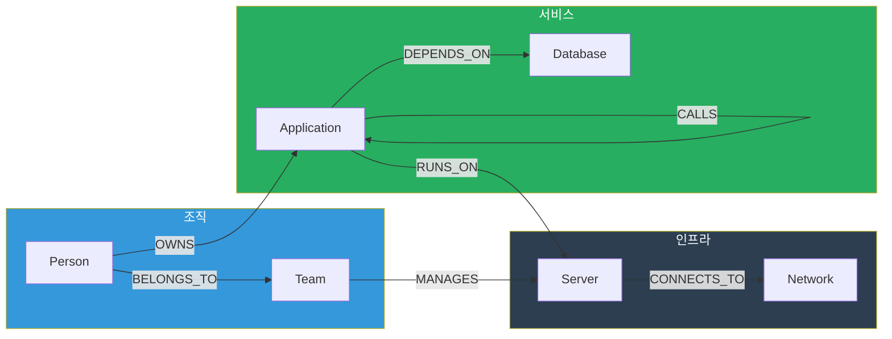

## 소개

솔직히 얘기하면, RAG만 잘 만들어도 80% 유즈케이스는 커버됩니다. 지난 6화에서 벡터 검색, 청킹, 리랭킹까지 다 얘기했잖아요. 그걸로 사내 문서 검색, 코드 어시스턴트, FAQ 챗봇 — 다 됩니다.

근데 **나머지 20%**가 문제입니다.

"B팀이 관리하는 서버에서 돌아가는 애플리케이션 중에 PostgreSQL에 의존하는 것만 알려줘."

이 질문을 RAG로 풀어보세요. 문서를 아무리 뒤져도 답이 안 나옵니다. 왜? **관계가 여러 단계를 거쳐야 하거든요.** 팀 → 서버 → 애플리케이션 → 데이터베이스. 이걸 벡터 유사도로 찾는 건 불가능합니다. 문서에 "B팀이 관리하는 서버에서 돌아가는 앱 중 PostgreSQL 의존성이 있는 것은 X, Y, Z입니다"라고 친절하게 써놓지 않는 이상요. 그런 문서가 있을 리가 없잖아요.

이런 **다단계 관계 추론**이 필요한 순간, 온톨로지(Ontology)가 등장합니다.

"온톨로지"라는 단어가 무섭게 느껴지는 거 압니다. 철학에서 온 용어인 데다, 시맨틱 웹이니 RDF니 OWL이니 W3C 표준이니 — 학계 논문에서나 보던 얘기거든요. 근데 실무에서 쓸 때는 그렇게 거창할 필요가 없습니다.

**핵심은 이겁니다: "우리 도메인의 지식을 구조화해서 컴퓨터가 관계를 탐색할 수 있게 만드는 것."**

이번 회차에서는 학술 용어 최소화하고, 개발자 관점에서 실용적으로 풀어보겠습니다. Neo4j 설치부터 Cypher 쿼리, Python ETL 스크립트까지 — 다음 주 월요일에 바로 써먹을 수 있는 수준으로요.

---

## 온톨로지가 필요한 순간

먼저 감을 잡읍시다. RAG로 안 되는 질문 유형들입니다.

| 질문 유형 | 왜 RAG로 안 되나 | 필요한 것 |
|-----------|-----------------|----------|
| "B팀이 관리하는 모든 서버에서 돌아가는 앱 목록" | 다단계 관계 탐색 (팀→서버→앱) | 관계 그래프 |
| "이 서버 장애가 영향을 미치는 다운스트림 서비스 전체" | 의존성 그래프 순회 | 연결 탐색 |
| "A 제품과 호환되는 부품 중 재고 있는 것" | 교차 도메인 조인 | 구조화된 지식 |
| "퇴사한 김OO이 관리하던 시스템 인수인계 현황" | 사람-시스템 관계 추적 | 엔티티 관계 |
| "이 라이브러리 버전 올리면 영향받는 서비스가 뭐야?" | 역방향 의존성 탐색 | 의존성 그래프 |

공통점이 보이시나요? 전부 **"A는 B와 관계가 있고, B는 C와 관계가 있는데, 그 조건을 만족하는 C를 찾아라"** 패턴입니다. 이건 검색이 아니라 **탐색(traversal)**이에요.

RAG는 "비슷한 문서 찾기"를 잘합니다. 하지만 "관계를 따라가며 추론하기"는 못합니다. 그래서 온톨로지가 필요한 겁니다.

---

## 온톨로지 기초 — 데이터베이스 스키마의 확장판

온톨로지를 처음 접하는 개발자에게 가장 와닿는 설명은 이겁니다:

**"온톨로지는 데이터베이스 스키마인데, 테이블 간 관계에 의미(semantics)를 부여한 것이다."**

RDB 설계할 때 ERD 그리잖아요? 엔티티 정의하고, 관계 선 긋고, 속성 넣고. 온톨로지도 거의 똑같습니다. 다만 관계에 이름과 방향이 있고, 계층(hierarchy)을 표현할 수 있다는 차이가 있어요.

### 핵심 구성 요소 4가지

| 구성 요소 | RDB 비유 | 설명 | 예시 |
|-----------|---------|------|------|
| **Entity (개체)** | 테이블의 Row | 실세계의 사물이나 개념 | `서버-001`, `B팀`, `PostgreSQL` |
| **Relation (관계)** | Foreign Key + JOIN | 개체 간의 연결. 방향과 이름이 있음 | `MANAGES`, `RUNS_ON`, `DEPENDS_ON` |
| **Attribute (속성)** | Column | 개체의 특성값 | `ip: 10.0.1.5`, `cpu: 32core`, `version: 15.2` |
| **Class (클래스/분류)** | 테이블 이름 | 개체의 유형. 계층 구조를 가짐 | `인프라 > 서버 > GPU서버` |

### Entity (개체)

세상에 존재하는 "것들"입니다. 서버, 사람, 팀, 애플리케이션, 데이터베이스 — 명사로 표현할 수 있는 것들이에요.

```
서버-001 (Server)
B팀 (Team)
주문관리시스템 (Application)
PostgreSQL-main (Database)
```

### Relation (관계)

개체와 개체를 잇는 선입니다. **방향이 있고**, **이름이 있습니다.** 여기가 RDB의 FK와 다른 점이에요.

```
(B팀) -[MANAGES]-> (서버-001)
(주문관리시스템) -[RUNS_ON]-> (서버-001)
(주문관리시스템) -[DEPENDS_ON]-> (PostgreSQL-main)
```

"B팀이 서버-001을 관리한다", "주문관리시스템이 서버-001 위에서 돌아간다" — 이렇게 자연어로 읽을 수 있습니다. RDB에서 `team_id = server.managed_by` 같은 FK로는 이 의미가 잘 드러나지 않죠.

### Attribute (속성)

개체에 붙는 키-값 쌍입니다. RDB의 컬럼이랑 같습니다.

```
서버-001 {ip: "10.0.1.5", cpu: "32core", ram: "128GB", os: "Ubuntu 22.04"}
PostgreSQL-main {version: "15.2", port: 5432, storage: "2TB"}
```

### Class Hierarchy (클래스 계층)

이게 RDB에 없는 개념입니다. 개체를 분류하는 계층 트리예요.

```
인프라
├── 서버
│   ├── GPU 서버
│   │   ├── A100 서버
│   │   └── H100 서버
│   ├── 웹 서버
│   └── DB 서버
├── 네트워크
│   ├── 스위치
│   └── 방화벽
└── 스토리지
    ├── NAS
    └── SAN
```

왜 유용하냐면, "모든 GPU 서버를 보여줘"라고 하면 A100 서버와 H100 서버가 자동으로 포함됩니다. **is-a 관계**를 표현할 수 있어서, 질의할 때 추상화 수준을 자유롭게 조절할 수 있거든요.

---

## 왜 그래프인가 — RDBMS vs Graph DB

"관계를 저장하는 거면 그냥 RDB에 JOIN 걸면 되는 거 아니에요?"

좋은 질문입니다. 실제로 관계가 1~2단계면 RDB로 충분합니다. 근데 3단계 이상 넘어가면 이야기가 달라져요.

### SQL JOIN 지옥

"B팀이 관리하는 서버에서 돌아가는 앱 중에 PostgreSQL에 의존하는 것" — 이걸 SQL로 쓰면:

```sql
SELECT DISTINCT a.name AS app_name
FROM teams t
JOIN team_server_mapping tsm ON t.id = tsm.team_id
JOIN servers s ON tsm.server_id = s.id
JOIN app_server_mapping asm ON s.id = asm.server_id
JOIN applications a ON asm.app_id = a.id
JOIN app_db_dependency add ON a.id = add.app_id
JOIN databases d ON add.db_id = d.id
WHERE t.name = 'B팀'
  AND d.type = 'PostgreSQL';
```

JOIN이 6개입니다. 매핑 테이블만 3개. 그리고 여기서 "그 PostgreSQL이 돌아가는 서버의 네트워크 정보도 알려줘"를 추가하면 JOIN이 2~3개 더 붙습니다. 테이블 8~9개를 한 쿼리에서 JOIN하면 어떻게 되는지 아시죠? 성능은 둘째치고, 쿼리 작성하다가 사람이 먼저 죽습니다.

### Cypher의 우아함

같은 질문을 Cypher(Neo4j 쿼리 언어)로 쓰면:

```cypher
MATCH (t:Team {name: 'B팀'})-[:MANAGES]->(s:Server)<-[:RUNS_ON]-(a:Application)-[:DEPENDS_ON]->(d:Database {type: 'PostgreSQL'})
RETURN a.name AS app_name
```

한 줄입니다. 그리고 읽어보면 **자연어처럼 읽힙니다.** "B팀이 관리하는 서버에서 돌아가고, PostgreSQL에 의존하는 애플리케이션." 쿼리 자체가 설명서예요.

### 성능 비교

관계 탐색 깊이에 따른 성능 차이입니다. 엔티티 100만 개, 관계 500만 개 기준 벤치마크 (대략적인 수치):

| 탐색 깊이 | RDBMS (PostgreSQL) | Graph DB (Neo4j) | 비고 |
|-----------|-------------------|-----------------|------|
| 1 hop (직접 관계) | 2ms | 1ms | 비슷함 |
| 2 hops | 50ms | 3ms | 차이 나기 시작 |
| 3 hops | 800ms | 5ms | 10배 이상 차이 |
| 4 hops | 15초+ | 8ms | RDB는 사실상 불가 |
| 5 hops | 타임아웃 | 12ms | 비교 불가 |

왜 이런 차이가 나냐면, 구조가 근본적으로 다르기 때문입니다:
- **RDBMS**: 매 단계마다 인덱스 탐색 + JOIN 연산. 깊이가 깊어질수록 기하급수적으로 느려짐
- **Graph DB**: 노드에서 연결된 엣지를 바로 따라감 (index-free adjacency). 깊이와 무관하게 일정한 시간

정리하면 — 관계가 단순하고 1~2단계면 RDB로 충분합니다. 근데 다단계 관계 탐색, 경로 찾기, 의존성 분석 같은 게 필요하면 **그래프 DB가 압도적**입니다.

---

## 도메인 온톨로지 설계 실전 — IT 인프라 예시

이론은 충분합니다. 실제로 설계해봅시다. 가장 흔한 기업 내 유즈케이스인 **IT 인프라 도메인**으로 진행합니다.

### Step 1: 도메인 범위 정하기

첫 번째로 할 일은 **"어디까지 구조화할 것인가"** 결정하는 겁니다. 이게 진짜 중요해요. 너무 넓게 잡으면 6개월이 설계만 하다 끝나고, 너무 좁으면 쓸모없어집니다.

처음에는 이렇게 시작하세요:

```
핵심 질문 5개를 먼저 적는다.
→ 이 질문에 답하려면 어떤 엔티티와 관계가 필요한가?
→ 그것만 구조화한다.
```

우리의 핵심 질문:
1. "이 서버를 누가 관리하나?"
2. "이 애플리케이션이 어떤 서버에서 돌아가나?"
3. "이 DB에 의존하는 서비스가 뭐가 있나?"
4. "이 장애가 영향 주는 다운스트림 전체 목록은?"
5. "특정 팀이 관리하는 인프라 전체 현황은?"

### Step 2: Entity 도출

질문에서 명사를 뽑아봅시다.

| Entity | 설명 | 예시 인스턴스 |
|--------|------|-------------|
| `Server` | 물리/가상 서버 | web-prod-01, gpu-train-01 |
| `Application` | 서비스/앱 | 주문관리, 재고관리, 인증서비스 |
| `Database` | DB 인스턴스 | pg-main, redis-cache-01 |
| `Team` | 조직 단위 | 인프라팀, 백엔드팀, 데이터팀 |
| `Network` | 네트워크 세그먼트 | prod-vlan-100, dev-vlan-200 |
| `Person` | 담당자 | 김OO, 이OO |

6개면 충분합니다. 처음부터 50개 엔티티 만들지 마세요.

### Step 3: Relation 정의

엔티티 간 관계를 정합니다. **방향이 중요합니다.**

| Relation | From → To | 설명 |
|----------|-----------|------|
| `MANAGES` | Team → Server | 팀이 서버를 관리 |
| `BELONGS_TO` | Person → Team | 사람이 팀에 소속 |
| `RUNS_ON` | Application → Server | 앱이 서버 위에서 실행 |
| `DEPENDS_ON` | Application → Database | 앱이 DB에 의존 |
| `CONNECTS_TO` | Server → Network | 서버가 네트워크에 연결 |
| `CALLS` | Application → Application | 앱이 다른 앱을 호출 (MSA) |
| `OWNS` | Person → Application | 사람이 앱의 오너 |

7개. 핵심 질문 5개에 모두 답할 수 있습니다.

### Step 4: Attribute 설계

```
Server:    {name, ip, cpu, ram, os, location, status}
Application: {name, version, language, deploy_date, status}
Database:  {name, type, version, port, storage_gb}
Team:      {name, department, slack_channel}
Network:   {name, vlan_id, subnet, gateway}
Person:    {name, email, role, join_date}
```

### Step 5: 온톨로지 다이어그램

전체 구조를 시각화하면 이렇습니다:



이게 우리 도메인 온톨로지의 초안입니다. 엔티티 6개, 관계 7개. 이 정도로 시작해서 운영하면서 점점 확장하는 거예요.

---

## Neo4j 실전 가이드

### Docker로 설치

가장 빠른 방법은 Docker입니다. 5분이면 됩니다.

```bash
# Neo4j Community Edition (무료)
docker run -d \
  --name neo4j \
  -p 7474:7474 \
  -p 7687:7687 \
  -e NEO4J_AUTH=neo4j/your-password-here \
  -e NEO4J_PLUGINS='["apoc"]' \
  -v neo4j_data:/data \
  -v neo4j_logs:/logs \
  neo4j:5.26-community

# 브라우저에서 http://localhost:7474 접속
# 로그인: neo4j / your-password-here
```

APOC 플러그인은 필수입니다. 데이터 import, 유틸리티 함수 등이 들어있어요. 안 깔면 나중에 "이 함수 왜 안 돼?" 하고 한참 삽질합니다.

### 초기 데이터 생성 — Cypher 기초

Neo4j 브라우저에서 바로 실행할 수 있습니다. 위에서 설계한 온톨로지를 데이터로 만들어봅시다.

```cypher
// === 팀 생성 ===
CREATE (infra:Team {name: '인프라팀', department: 'Engineering', slack: '#infra-team'})
CREATE (backend:Team {name: '백엔드팀', department: 'Engineering', slack: '#backend-team'})
CREATE (data:Team {name: '데이터팀', department: 'Engineering', slack: '#data-team'})

// === 서버 생성 ===
CREATE (web01:Server {name: 'web-prod-01', ip: '10.0.1.10', cpu: '16core', ram: '64GB', os: 'Ubuntu 22.04', status: 'active'})
CREATE (web02:Server {name: 'web-prod-02', ip: '10.0.1.11', cpu: '16core', ram: '64GB', os: 'Ubuntu 22.04', status: 'active'})
CREATE (api01:Server {name: 'api-prod-01', ip: '10.0.2.10', cpu: '32core', ram: '128GB', os: 'Ubuntu 22.04', status: 'active'})
CREATE (gpu01:Server {name: 'gpu-train-01', ip: '10.0.3.10', cpu: '64core', ram: '256GB', os: 'Ubuntu 22.04', status: 'active'})
CREATE (db01:Server {name: 'db-prod-01', ip: '10.0.4.10', cpu: '32core', ram: '256GB', os: 'Ubuntu 22.04', status: 'active'})

// === 애플리케이션 생성 ===
CREATE (order:Application {name: '주문관리', version: '3.2.1', language: 'Java', status: 'production'})
CREATE (inventory:Application {name: '재고관리', version: '2.1.0', language: 'Python', status: 'production'})
CREATE (auth:Application {name: '인증서비스', version: '5.0.3', language: 'Go', status: 'production'})
CREATE (recommend:Application {name: '추천엔진', version: '1.4.0', language: 'Python', status: 'production'})

// === 데이터베이스 생성 ===
CREATE (pgMain:Database {name: 'pg-main', type: 'PostgreSQL', version: '15.2', port: 5432, storage_gb: 2000})
CREATE (redis01:Database {name: 'redis-cache-01', type: 'Redis', version: '7.2', port: 6379, storage_gb: 64})
CREATE (mongo01:Database {name: 'mongo-logs', type: 'MongoDB', version: '7.0', port: 27017, storage_gb: 500})

// === 네트워크 생성 ===
CREATE (prodNet:Network {name: 'prod-vlan-100', vlan_id: 100, subnet: '10.0.0.0/16', gateway: '10.0.0.1'})
CREATE (devNet:Network {name: 'dev-vlan-200', vlan_id: 200, subnet: '172.16.0.0/16', gateway: '172.16.0.1'})

// === 사람 생성 ===
CREATE (kim:Person {name: '김영수', email: 'kim@company.com', role: 'Senior SRE'})
CREATE (lee:Person {name: '이지은', email: 'lee@company.com', role: 'Backend Lead'})
CREATE (park:Person {name: '박민수', email: 'park@company.com', role: 'Data Engineer'})
```

이제 관계를 연결합니다:

```cypher
// === 관계 연결 ===
// 소속
MATCH (kim:Person {name: '김영수'}), (infra:Team {name: '인프라팀'})
CREATE (kim)-[:BELONGS_TO]->(infra)

MATCH (lee:Person {name: '이지은'}), (backend:Team {name: '백엔드팀'})
CREATE (lee)-[:BELONGS_TO]->(backend)

MATCH (park:Person {name: '박민수'}), (data:Team {name: '데이터팀'})
CREATE (park)-[:BELONGS_TO]->(data)

// 팀 → 서버 관리
MATCH (infra:Team {name: '인프라팀'}), (s:Server)
WHERE s.name IN ['web-prod-01', 'web-prod-02', 'db-prod-01']
CREATE (infra)-[:MANAGES]->(s)

MATCH (backend:Team {name: '백엔드팀'}), (s:Server {name: 'api-prod-01'})
CREATE (backend)-[:MANAGES]->(s)

MATCH (data:Team {name: '데이터팀'}), (s:Server {name: 'gpu-train-01'})
CREATE (data)-[:MANAGES]->(s)

// 앱 → 서버
MATCH (order:Application {name: '주문관리'}), (s:Server {name: 'api-prod-01'})
CREATE (order)-[:RUNS_ON]->(s)

MATCH (inventory:Application {name: '재고관리'}), (s:Server {name: 'api-prod-01'})
CREATE (inventory)-[:RUNS_ON]->(s)

MATCH (auth:Application {name: '인증서비스'}), (s:Server {name: 'web-prod-01'})
CREATE (auth)-[:RUNS_ON]->(s)

MATCH (recommend:Application {name: '추천엔진'}), (s:Server {name: 'gpu-train-01'})
CREATE (recommend)-[:RUNS_ON]->(s)

// 앱 → DB 의존성
MATCH (order:Application {name: '주문관리'}), (db:Database {name: 'pg-main'})
CREATE (order)-[:DEPENDS_ON]->(db)

MATCH (order:Application {name: '주문관리'}), (db:Database {name: 'redis-cache-01'})
CREATE (order)-[:DEPENDS_ON]->(db)

MATCH (inventory:Application {name: '재고관리'}), (db:Database {name: 'pg-main'})
CREATE (inventory)-[:DEPENDS_ON]->(db)

MATCH (recommend:Application {name: '추천엔진'}), (db:Database {name: 'mongo-logs'})
CREATE (recommend)-[:DEPENDS_ON]->(db)

// 앱 간 호출 (MSA)
MATCH (order:Application {name: '주문관리'}), (auth:Application {name: '인증서비스'})
CREATE (order)-[:CALLS]->(auth)

MATCH (order:Application {name: '주문관리'}), (inventory:Application {name: '재고관리'})
CREATE (order)-[:CALLS]->(inventory)

MATCH (inventory:Application {name: '재고관리'}), (auth:Application {name: '인증서비스'})
CREATE (inventory)-[:CALLS]->(auth)

// 서버 → 네트워크
MATCH (s:Server), (net:Network {name: 'prod-vlan-100'})
WHERE s.name STARTS WITH 'web-' OR s.name STARTS WITH 'api-' OR s.name STARTS WITH 'db-'
CREATE (s)-[:CONNECTS_TO]->(net)

MATCH (s:Server {name: 'gpu-train-01'}), (net:Network {name: 'dev-vlan-200'})
CREATE (s)-[:CONNECTS_TO]->(net)

// 오너십
MATCH (lee:Person {name: '이지은'}), (order:Application {name: '주문관리'})
CREATE (lee)-[:OWNS]->(order)

MATCH (lee:Person {name: '이지은'}), (inventory:Application {name: '재고관리'})
CREATE (lee)-[:OWNS]->(inventory)

MATCH (park:Person {name: '박민수'}), (recommend:Application {name: '추천엔진'})
CREATE (park)-[:OWNS]->(recommend)
```

### Cypher 쿼리 실전 — 10가지 핵심 패턴

데이터가 들어갔으니 이제 진짜 쿼리를 돌려봅시다.

**1. 기본 조회 — 모든 서버 목록**

```cypher
MATCH (s:Server)
RETURN s.name, s.ip, s.status
ORDER BY s.name
```

**2. 관계 탐색 — 인프라팀이 관리하는 서버**

```cypher
MATCH (t:Team {name: '인프라팀'})-[:MANAGES]->(s:Server)
RETURN s.name, s.ip, s.cpu, s.ram
```

**3. 2-hop 탐색 — 인프라팀 서버 위의 애플리케이션**

```cypher
MATCH (t:Team {name: '인프라팀'})-[:MANAGES]->(s:Server)<-[:RUNS_ON]-(a:Application)
RETURN t.name AS team, s.name AS server, collect(a.name) AS apps
```

**4. 3-hop 탐색 — 인프라팀 서버의 앱이 의존하는 DB**

```cypher
MATCH (t:Team {name: '인프라팀'})-[:MANAGES]->(s:Server)<-[:RUNS_ON]-(a:Application)-[:DEPENDS_ON]->(d:Database)
RETURN a.name AS app, d.name AS database, d.type AS db_type
```

**5. 역방향 탐색 — PostgreSQL에 의존하는 모든 앱**

```cypher
MATCH (a:Application)-[:DEPENDS_ON]->(d:Database {type: 'PostgreSQL'})
RETURN a.name, a.version, a.language
```

**6. 영향도 분석 — api-prod-01 서버 장애 시 영향받는 앱과 DB**

```cypher
MATCH (s:Server {name: 'api-prod-01'})<-[:RUNS_ON]-(a:Application)-[:DEPENDS_ON]->(d:Database)
RETURN s.name AS server,
       collect(DISTINCT a.name) AS affected_apps,
       collect(DISTINCT d.name) AS affected_dbs
```

**7. 경로 탐색 — 주문관리와 추천엔진 사이의 모든 경로**

```cypher
MATCH path = shortestPath(
  (a1:Application {name: '주문관리'})-[*]-(a2:Application {name: '추천엔진'})
)
RETURN path
```

**8. 집계 — 팀별 관리 서버 수**

```cypher
MATCH (t:Team)-[:MANAGES]->(s:Server)
RETURN t.name AS team, count(s) AS server_count
ORDER BY server_count DESC
```

**9. 패턴 매칭 — 2개 이상의 앱이 의존하는 DB (장애 임팩트 큰 DB)**

```cypher
MATCH (a:Application)-[:DEPENDS_ON]->(d:Database)
WITH d, count(a) AS dep_count, collect(a.name) AS dependent_apps
WHERE dep_count >= 2
RETURN d.name, d.type, dep_count, dependent_apps
```

**10. 서비스 호출 체인 — 주문관리의 전체 다운스트림**

```cypher
MATCH (start:Application {name: '주문관리'})-[:CALLS*1..5]->(downstream:Application)
RETURN start.name, collect(DISTINCT downstream.name) AS downstream_services
```

이 10개 패턴을 조합하면 대부분의 인프라 관련 질의에 답할 수 있습니다. SQL로 이걸 하려면... 생각만 해도 머리가 아프죠.

---

## 데이터 ETL — 기존 데이터를 그래프로

현실에서는 데이터가 이미 어딘가에 있습니다. Excel 스프레드시트, RDBMS 테이블, Confluence 위키, CMDB(Configuration Management Database). 이걸 Neo4j로 옮겨야 해요.

### Python + neo4j 드라이버로 RDBMS 데이터 마이그레이션

가장 흔한 시나리오입니다. PostgreSQL에 서버/앱/팀 정보가 테이블로 있는 상태.

```python
from neo4j import GraphDatabase
import psycopg2

# 연결 설정
neo4j_driver = GraphDatabase.driver(
    "bolt://localhost:7687",
    auth=("neo4j", "your-password-here")
)
pg_conn = psycopg2.connect(
    host="localhost", dbname="cmdb",
    user="readonly", password="password"
)

def import_servers(session, pg_cursor):
    """서버 데이터를 PostgreSQL에서 Neo4j로"""
    pg_cursor.execute("SELECT name, ip, cpu, ram, os, status FROM servers")
    rows = pg_cursor.fetchall()

    for row in rows:
        session.run("""
            MERGE (s:Server {name: $name})
            SET s.ip = $ip, s.cpu = $cpu,
                s.ram = $ram, s.os = $os, s.status = $status
        """, {
            "name": row[0], "ip": row[1], "cpu": row[2],
            "ram": row[3], "os": row[4], "status": row[5]
        })
    print(f"서버 {len(rows)}건 import 완료")

def import_relations(session, pg_cursor):
    """관계 데이터를 매핑 테이블에서 가져오기"""
    pg_cursor.execute("""
        SELECT t.name AS team_name, s.name AS server_name
        FROM team_server_mapping tsm
        JOIN teams t ON tsm.team_id = t.id
        JOIN servers s ON tsm.server_id = s.id
    """)
    rows = pg_cursor.fetchall()

    for row in rows:
        session.run("""
            MATCH (t:Team {name: $team_name})
            MATCH (s:Server {name: $server_name})
            MERGE (t)-[:MANAGES]->(s)
        """, {"team_name": row[0], "server_name": row[1]})
    print(f"팀-서버 관계 {len(rows)}건 import 완료")

# 실행
pg_cursor = pg_conn.cursor()
with neo4j_driver.session() as session:
    import_servers(session, pg_cursor)
    import_relations(session, pg_cursor)

pg_cursor.close()
pg_conn.close()
neo4j_driver.close()
```

여기서 포인트는 `MERGE`입니다. `CREATE`가 아니라 `MERGE`. 같은 데이터를 두 번 넣어도 중복이 안 생깁니다. ETL은 보통 여러 번 돌리게 되거든요.

### Excel/CSV에서 import

Excel에서 서버 목록 관리하는 팀 많잖아요. CSV로 변환한 다음 Neo4j의 LOAD CSV를 쓰면 됩니다.

```cypher
// servers.csv: name,ip,cpu,ram,os,status
LOAD CSV WITH HEADERS FROM 'file:///servers.csv' AS row
MERGE (s:Server {name: row.name})
SET s.ip = row.ip,
    s.cpu = row.cpu,
    s.ram = row.ram,
    s.os = row.os,
    s.status = row.status
```

파일 위치는 Neo4j의 `import` 디렉토리에 넣어야 합니다. Docker라면:

```bash
# CSV 파일을 Neo4j import 디렉토리로 복사
docker cp servers.csv neo4j:/var/lib/neo4j/import/
docker cp relations.csv neo4j:/var/lib/neo4j/import/
```

### 대량 데이터 — neo4j-admin import

데이터가 수십만 건 이상이면 `LOAD CSV`로는 느립니다. `neo4j-admin database import`를 쓰세요. 초기 로딩 속도가 10배 이상 빠릅니다.

```bash
# 노드 파일과 관계 파일을 분리해서 준비
# nodes_servers.csv: serverId:ID,name,ip,:LABEL
# rels_manages.csv: :START_ID,:END_ID,:TYPE

neo4j-admin database import full \
  --nodes=Server=import/nodes_servers.csv \
  --nodes=Team=import/nodes_teams.csv \
  --nodes=Application=import/nodes_apps.csv \
  --relationships=MANAGES=import/rels_manages.csv \
  --relationships=RUNS_ON=import/rels_runs_on.csv \
  --relationships=DEPENDS_ON=import/rels_depends_on.csv \
  neo4j

# 주의: 기존 DB를 완전히 덮어쓰므로, 초기 로딩 때만 사용
```

### ETL 자동화 팁

실무에서는 일회성 import가 아니라 **주기적 동기화**가 필요합니다. CMDB나 RDB의 데이터가 계속 바뀌거든요.

```python
# cron_etl.py - 매일 새벽 2시에 돌리는 ETL
import schedule
import time
from datetime import datetime

def run_etl():
    """증분 ETL: 변경된 데이터만 동기화"""
    last_sync = get_last_sync_time()  # 마지막 동기화 시각

    # 변경된 서버만 가져오기
    pg_cursor.execute("""
        SELECT name, ip, cpu, ram, os, status
        FROM servers
        WHERE updated_at > %s
    """, (last_sync,))

    rows = pg_cursor.fetchall()
    with neo4j_driver.session() as session:
        for row in rows:
            session.run("""
                MERGE (s:Server {name: $name})
                SET s.ip = $ip, s.cpu = $cpu, s.ram = $ram,
                    s.os = $os, s.status = $status,
                    s.last_synced = datetime()
            """, dict(zip(['name','ip','cpu','ram','os','status'], row)))

    save_sync_time(datetime.now())
    print(f"[{datetime.now()}] 증분 동기화 완료: {len(rows)}건")

schedule.every().day.at("02:00").do(run_etl)

while True:
    schedule.run_pending()
    time.sleep(60)
```

---

## RDF/OWL vs Property Graph — 뭘 써야 하나

온톨로지를 구현하는 기술이 크게 두 갈래입니다. 어느 쪽을 선택할지는 상황에 따라 다르지만, 먼저 차이를 정확히 알아야 합니다.

| 비교 항목 | RDF/OWL (Semantic Web) | Property Graph (Neo4j) |
|-----------|----------------------|----------------------|
| **표준** | W3C 국제 표준 | 사실상 표준 (de facto) |
| **데이터 모델** | Subject-Predicate-Object 트리플 | Node-Relationship-Property |
| **쿼리 언어** | SPARQL | Cypher |
| **스키마** | OWL로 엄격한 정의 가능 | 유연, 스키마리스도 가능 |
| **추론(Reasoning)** | 내장 (OWL reasoner) | 별도 구현 필요 |
| **러닝 커브** | 가파름 (2~4주) | 완만함 (2~3일) |
| **도구 생태계** | Protege, Apache Jena, Blazegraph | Neo4j Desktop, Bloom, Python 드라이버 |
| **성능** | 대규모에서 느릴 수 있음 | 관계 탐색에 최적화 |
| **데이터 교환** | 표준 포맷 (Turtle, JSON-LD) | 자체 포맷 |
| **커뮤니티** | 학계 중심 | 산업계 중심 |

### SPARQL vs Cypher 예시

같은 질문: "B팀이 관리하는 서버에서 돌아가는 앱"

**SPARQL:**
```sparql
PREFIX infra: <http://example.org/infra#>

SELECT ?appName WHERE {
  ?team a infra:Team ;
        infra:name "B팀" .
  ?team infra:manages ?server .
  ?app infra:runsOn ?server ;
       infra:name ?appName .
}
```

**Cypher:**
```cypher
MATCH (t:Team {name: 'B팀'})-[:MANAGES]->(s:Server)<-[:RUNS_ON]-(a:Application)
RETURN a.name
```

보이시나요? Cypher가 훨씬 직관적입니다. SPARQL은 프리픽스 선언도 필요하고, 트리플 패턴 구문에 익숙해져야 해요.

### 실무 추천

| 상황 | 추천 | 이유 |
|------|------|------|
| 빠르게 시작하고 싶다 | **Neo4j** | 설치 5분, Cypher 30분이면 기본 쿼리 가능 |
| 표준 준수가 필수 (정부, 연구기관) | **RDF/OWL** | W3C 표준, 기관 간 데이터 교환 |
| 외부 Linked Data와 연동 필요 | **RDF/OWL** | DBpedia, Wikidata 등과 호환 |
| 자동 추론이 필요 | **RDF/OWL** | OWL reasoner가 새로운 관계를 자동 도출 |
| 팀에 시맨틱 웹 전문가가 없다 | **Neo4j** | 개발자 친화적 |
| 프로덕션 성능이 중요 | **Neo4j** | 관계 탐색 최적화 |

**결론: 90%의 기업 프로젝트에서는 Neo4j로 시작하는 게 맞습니다.** RDF/OWL은 표준 준수가 강제되거나, 자동 추론이 핵심일 때만 고려하세요. 두 개를 동시에 하겠다는 건 삽을 두 자루 들겠다는 것과 같습니다. 하나를 먼저 제대로 하세요.

---

## Protege 활용 — 시각적 온톨로지 설계

Protege는 Stanford에서 만든 무료 온톨로지 편집기입니다. OWL 온톨로지를 GUI로 설계할 수 있어요. "코드 말고 그림으로 먼저 그려보고 싶다"면 이 도구가 좋습니다.

### 어떻게 생겼나

Protege를 열면 왼쪽에 **Class Hierarchy** 패널이 있습니다. 트리 구조로 클래스를 정의할 수 있어요:

```
Thing
├── Infrastructure
│   ├── Server
│   │   ├── GPUServer
│   │   └── WebServer
│   ├── Network
│   └── Storage
├── Organization
│   ├── Team
│   └── Person
└── Service
    ├── Application
    └── Database
```

오른쪽에는 선택한 클래스의 **속성(Properties)**과 **제약조건(Restrictions)**을 설정하는 패널이 있습니다. "Server 클래스는 반드시 ip 속성을 가져야 한다" 같은 제약을 걸 수 있어요.

중앙 상단에는 **Object Properties** 탭이 있어서 관계를 정의합니다:
- `manages`: domain=Team, range=Server
- `runsOn`: domain=Application, range=Server
- `dependsOn`: domain=Application, range=Database

**OntoGraf** 탭을 클릭하면 온톨로지를 네트워크 그래프로 시각화해서 볼 수 있습니다. 여기서 전체 구조가 한눈에 보여서, 도메인 전문가랑 리뷰할 때 유용합니다.

### Protege에서 설계 → Neo4j로 옮기기

Protege에서 설계한 온톨로지를 Neo4j에서 쓰려면 직접 변환이 필요합니다. OWL 파일을 파싱해서 Cypher로 바꾸는 스크립트:

```python
from owlready2 import get_ontology
from neo4j import GraphDatabase

# OWL 파일 로딩
onto = get_ontology("file://infra-ontology.owl").load()

driver = GraphDatabase.driver("bolt://localhost:7687", auth=("neo4j", "password"))

with driver.session() as session:
    # 클래스를 Neo4j 레이블로
    for cls in onto.classes():
        session.run("""
            MERGE (c:OntologyClass {name: $name})
        """, {"name": cls.name})

        # 부모 클래스 관계
        for parent in cls.is_a:
            if hasattr(parent, 'name'):
                session.run("""
                    MATCH (child:OntologyClass {name: $child})
                    MATCH (parent:OntologyClass {name: $parent})
                    MERGE (child)-[:SUBCLASS_OF]->(parent)
                """, {"child": cls.name, "parent": parent.name})

    # Object Property를 관계 타입으로
    for prop in onto.object_properties():
        print(f"관계 타입: {prop.name}")
        print(f"  domain: {prop.domain}")
        print(f"  range: {prop.range}")

driver.close()
```

솔직히 말하면, Protege는 **초기 설계 단계에서 도메인 전문가와 소통할 때** 가장 유용합니다. "이 관계가 맞나요?"를 그래프를 보면서 논의할 수 있거든요. 실제 데이터 운영은 Neo4j에서 하는 거고요. Protege로 설계 → OWL export → 검토 → Neo4j에 스키마 반영. 이 흐름이면 됩니다.

---

## LLM과 Knowledge Graph 연동

이제 진짜 핵심입니다. Knowledge Graph를 만든 이유가 뭐겠어요? **LLM이 이 지식을 활용해서 답변하게 하려는 겁니다.**

### 방법 1: Natural Language → Cypher 변환

사용자가 자연어로 질문하면, LLM이 Cypher 쿼리로 변환해서 Neo4j에서 결과를 가져옵니다.

```python
from neo4j import GraphDatabase
import requests
import json

NEO4J_URI = "bolt://localhost:7687"
NEO4J_AUTH = ("neo4j", "password")
LLM_ENDPOINT = "http://localhost:11434/api/generate"  # Ollama

# 온톨로지 스키마 설명 (LLM에게 컨텍스트로 줌)
SCHEMA_DESCRIPTION = """
Neo4j Graph Schema:
- Nodes: Server(name,ip,cpu,ram,os,status), Application(name,version,language,status),
  Database(name,type,version,port), Team(name,department), Person(name,email,role), Network(name,vlan_id,subnet)
- Relationships: (Team)-[:MANAGES]->(Server), (Application)-[:RUNS_ON]->(Server),
  (Application)-[:DEPENDS_ON]->(Database), (Application)-[:CALLS]->(Application),
  (Person)-[:BELONGS_TO]->(Team), (Person)-[:OWNS]->(Application),
  (Server)-[:CONNECTS_TO]->(Network)
"""

def nl_to_cypher(question: str) -> str:
    """자연어 질문을 Cypher 쿼리로 변환"""
    prompt = f"""{SCHEMA_DESCRIPTION}

Convert this natural language question to a Cypher query.
Return ONLY the Cypher query, nothing else.

Question: {question}
Cypher:"""

    response = requests.post(LLM_ENDPOINT, json={
        "model": "llama3.1:70b",
        "prompt": prompt,
        "stream": False,
        "options": {"temperature": 0.0}  # 정확도를 위해 temperature 0
    })
    return response.json()["response"].strip()

def query_graph(cypher: str) -> list:
    """Cypher 쿼리 실행"""
    driver = GraphDatabase.driver(NEO4J_URI, auth=NEO4J_AUTH)
    with driver.session() as session:
        result = session.run(cypher)
        records = [dict(record) for record in result]
    driver.close()
    return records

def answer_with_graph(question: str) -> str:
    """전체 파이프라인: 질문 → Cypher → 결과 → 자연어 답변"""
    # Step 1: 질문 → Cypher
    cypher = nl_to_cypher(question)
    print(f"[Generated Cypher]: {cypher}")

    # Step 2: Cypher 실행
    try:
        results = query_graph(cypher)
    except Exception as e:
        return f"쿼리 실행 실패: {e}\n생성된 Cypher: {cypher}"

    # Step 3: 결과 → 자연어 답변
    answer_prompt = f"""Based on the following data from our infrastructure graph database,
answer the user's question in Korean.

Question: {question}
Data: {json.dumps(results, ensure_ascii=False, default=str)}

Answer:"""

    response = requests.post(LLM_ENDPOINT, json={
        "model": "llama3.1:70b",
        "prompt": answer_prompt,
        "stream": False
    })
    return response.json()["response"]

# 사용 예시
print(answer_with_graph("인프라팀이 관리하는 서버 목록 알려줘"))
print(answer_with_graph("주문관리 시스템에 장애가 나면 어디에 영향이 가?"))
```

### 방법 2: Graph Context Injection

Cypher 변환이 불안정할 때 쓰는 방법입니다. 질문과 관련된 그래프 컨텍스트를 미리 뽑아서 프롬프트에 넣어주는 거예요.

```python
def get_graph_context(entity_name: str, depth: int = 2) -> str:
    """특정 엔티티 주변의 그래프 컨텍스트를 텍스트로 추출"""
    driver = GraphDatabase.driver(NEO4J_URI, auth=NEO4J_AUTH)

    with driver.session() as session:
        # 엔티티 주변 depth hop까지의 관계를 가져옴
        result = session.run("""
            MATCH path = (start)-[*1..$depth]-(connected)
            WHERE start.name = $name
            RETURN start, relationships(path) AS rels, nodes(path) AS nodes
            LIMIT 50
        """, {"name": entity_name, "depth": depth})

        context_lines = []
        for record in result:
            nodes = record["nodes"]
            rels = record["rels"]
            for rel in rels:
                start = rel.start_node
                end = rel.end_node
                context_lines.append(
                    f"({start['name']}) -[{rel.type}]-> ({end['name']})"
                )

    driver.close()
    return "\n".join(set(context_lines))

def answer_with_context(question: str, entity: str) -> str:
    """그래프 컨텍스트를 프롬프트에 주입"""
    context = get_graph_context(entity)

    prompt = f"""다음은 우리 인프라의 관계 정보입니다:

{context}

위 정보를 바탕으로 다음 질문에 답해주세요:
{question}"""

    response = requests.post(LLM_ENDPOINT, json={
        "model": "llama3.1:70b",
        "prompt": prompt,
        "stream": False
    })
    return response.json()["response"]
```

### 어떤 방법을 쓸까?

| 방법 | 장점 | 단점 | 추천 상황 |
|------|------|------|----------|
| NL → Cypher | 정확한 구조적 쿼리 가능 | LLM이 Cypher를 잘못 생성할 수 있음 | 정형화된 질의, 대규모 그래프 |
| Context Injection | 안정적, 구현 간단 | 컨텍스트 크기 제한, 깊은 탐색 어려움 | 프로토타입, 소규모 그래프 |
| 하이브리드 | 둘의 장점 결합 | 복잡도 증가 | 프로덕션 |

프로덕션에서는 **하이브리드**를 추천합니다. 먼저 NL → Cypher를 시도하고, 실패하면 Context Injection으로 폴백하는 방식이요. 이건 다음 회차(08화)에서 RAG와 결합할 때 자세히 다룹니다.

---

## 온톨로지 거버넌스 — 누가, 어떻게 관리할 것인가

Knowledge Graph는 만드는 것보다 **유지하는 게 더 어렵습니다.** 서버가 추가되고, 팀 구조가 바뀌고, 앱이 은퇴하고. 그래프가 현실과 달라지는 순간 쓸모없어져요.

### 역할 정의

| 역할 | 담당 | 업무 |
|------|------|------|
| **온톨로지 오너** | 아키텍트 or 시니어 엔지니어 1명 | 스키마 변경 승인, 전체 구조 관리 |
| **도메인 스튜어드** | 각 팀의 테크 리드 | 자기 팀 데이터 정확성 책임 |
| **ETL 엔지니어** | 데이터 엔지니어 | 자동 동기화 파이프라인 운영 |

**핵심: 전담 인력을 두지 마세요.** 기존 역할에 책임을 추가하는 겁니다. "온톨로지 팀"을 따로 만들면 사일로가 생기고, 도메인 지식과 괴리가 생깁니다.

### 스키마 변경 관리

온톨로지 스키마도 코드처럼 버전 관리해야 합니다.

```
ontology/
├── schema/
│   ├── v1.0.0/
│   │   └── schema.cypher      # 초기 스키마
│   ├── v1.1.0/
│   │   └── migration.cypher   # 변경 사항
│   └── v1.2.0/
│       └── migration.cypher
├── constraints/
│   └── indexes.cypher          # 인덱스 및 제약조건
├── seed/
│   └── initial-data.cypher     # 초기 데이터
└── README.md
```

마이그레이션 스크립트 예시:

```cypher
// v1.1.0 migration: Container 엔티티 추가
// 변경 사유: 쿠버네티스 도입으로 컨테이너 관리 필요

// 새 노드 레이블
CREATE CONSTRAINT container_name IF NOT EXISTS
FOR (c:Container) REQUIRE c.name IS UNIQUE;

// 새 관계
// (Container)-[:DEPLOYED_ON]->(Server)
// (Application)-[:PACKAGED_AS]->(Container)

// 기존 데이터 마이그레이션
// 현재 앱이 직접 서버에 RUNS_ON이면, 컨테이너 노드를 중간에 추가
MATCH (a:Application)-[r:RUNS_ON]->(s:Server)
WHERE a.deploy_type = 'container'
CREATE (c:Container {name: a.name + '-container', image: a.container_image})
CREATE (a)-[:PACKAGED_AS]->(c)
CREATE (c)-[:DEPLOYED_ON]->(s)
DELETE r;
```

Git으로 관리하면 PR 리뷰도 가능하고, 변경 이력도 추적됩니다. "왜 이 관계가 추가됐지?"를 6개월 후에도 알 수 있어요.

### 데이터 품질 체크

주기적으로 돌리는 품질 검사 쿼리들:

```cypher
// 1. 관리 팀이 없는 서버 (고아 노드)
MATCH (s:Server) WHERE NOT (s)<-[:MANAGES]-(:Team)
RETURN s.name AS orphan_server

// 2. 서버 없이 떠다니는 앱
MATCH (a:Application) WHERE NOT (a)-[:RUNS_ON]->(:Server)
RETURN a.name AS floating_app

// 3. 속성 누락 (IP 없는 서버)
MATCH (s:Server) WHERE s.ip IS NULL
RETURN s.name AS server_missing_ip

// 4. 양방향 관계 (보통 실수)
MATCH (a)-[r1]->(b)-[r2]->(a)
WHERE type(r1) = type(r2)
RETURN a.name, type(r1), b.name

// 5. 그래프 통계
CALL apoc.meta.stats() YIELD nodeCount, relCount, labels, relTypes
RETURN nodeCount, relCount, labels, relTypes
```

이걸 Jenkins나 GitHub Actions에서 매일 돌리고, 이상이 있으면 Slack 알림 보내는 거죠. 사람이 일일이 확인하면 안 합니다. 자동화가 답입니다.

---

## 실무에서 겪는 현실 (삽질 포인트)

이론이 아무리 예뻐도 현실은 다릅니다. 제가 겪은 것, 동료들이 겪은 것, 커뮤니티에서 공유된 것 다 모았습니다.

### 1. 범위 크리프 (Scope Creep)

"서버 관계만 정리하자"로 시작했는데, 누군가 "네트워크 장비도 넣자", "빌딩 정보도 넣자", "예산 정보도 연결하자" 하다 보면 6개월이 설계만 하다 끝납니다.

**대응법**: MVP를 먼저 정합니다. "엔티티 6개, 관계 7개로 핵심 질문 5개에 답할 수 있는 그래프"를 2주 안에 만드는 게 목표. 나머지는 v2.

### 2. 유지보수 부담

서버가 추가될 때마다 누가 그래프에 넣나요? 팀 구조가 바뀌면? 사람이 퇴사하면?

**대응법**: 자동화가 답입니다. CMDB, LDAP, AWS 같은 Source of Truth에서 자동 동기화. 수동 입력에 의존하면 3개월 후에 그래프는 현실과 30% 이상 달라져 있을 겁니다.

### 3. 도메인 전문가 부재

온톨로지 설계에는 도메인 지식이 필수인데, 그 전문가가 바쁘다고 미팅을 안 잡아줍니다. "그거 엑셀로 정리해서 보내줄게" 하고 2주 뒤에 보내주는 건 빈 파일이거나 반만 채워진 파일.

**대응법**: 전문가 미팅은 30분으로 짧게, 구체적인 질문 5개만 준비. "이 관계가 맞나요?" 수준으로. 그리고 기존 문서(위키, CMDB)에서 최대한 자동 추출하고, 전문가에게는 검증만 받으세요.

### 4. Neo4j Community vs Enterprise

Community Edition은 **무료**입니다. 근데 제약이 있어요:
- 클러스터링 없음 (단일 인스턴스만)
- Role-based access control 제한적
- 온라인 백업 불가 (오프라인 백업만)

소규모(노드 100만 이하)면 Community로 충분합니다. 근데 HA(High Availability)가 필요하거나, 사용자별 접근 제어가 필요하면 Enterprise가 필요한데 — **라이선스 비용이 상당합니다.** 대안으로 오픈소스 그래프 DB(Apache AGE, JanusGraph)를 검토할 수도 있어요.

### 5. "만들었는데 아무도 안 쓴다"

가장 흔한 실패 패턴입니다. 멋진 Knowledge Graph를 만들었는데, 질의하려면 Cypher를 알아야 합니다. 현업 담당자가 Cypher를 배울까요? 안 배웁니다.

**대응법**: LLM 연동이 답입니다. 자연어로 질문하면 그래프에서 답을 찾아주는 인터페이스. 이게 없으면 Knowledge Graph는 만든 사람만 쓰는 장난감이 됩니다. 다음 회차(08화)에서 이 부분을 집중적으로 다룹니다.

### 6. 온톨로지 설계 vs 실제 데이터 괴리

이론적으로 예쁘게 설계한 온톨로지가 실제 데이터와 안 맞는 경우가 많습니다. "서버 하나가 딱 하나의 팀에 의해 관리된다"고 설계했는데, 현실에서는 공유 서버가 있어서 3개 팀이 같이 관리하는 경우. "애플리케이션은 반드시 하나의 서버에서 돌아간다"고 했는데, MSA라 여러 서버에 분산 배포되는 경우.

**대응법**: 현실 데이터를 먼저 보고 설계하세요. 이론에서 시작하면 반드시 이런 괴리가 생깁니다. 기존 CMDB나 Excel을 먼저 분석하고, 그 데이터가 표현할 수 있는 구조로 온톨로지를 만드는 게 순서입니다.

> **이건 꼭 알아두세요:** 온톨로지는 **점진적으로 구축**해야 합니다. 처음부터 완벽하게 하겠다고 하면 6개월은 설계만 하다 끝납니다. 핵심 Entity 6~10개, Relation 5~7개 정도로 시작해서, 실제로 사용하면서 점점 확장하는 게 현실적입니다. 그리고 반드시 **자동화된 데이터 동기화**를 먼저 만들어놓으세요. 수동 관리로 시작하면 3개월 후에 그래프가 쓰레기 데이터로 가득 차 있을 겁니다.

---

## 마치며

정리하겠습니다.

**온톨로지가 필요한가?**
- RAG로 해결 안 되는 다단계 관계 질의가 있으면 → **Yes**
- 그냥 문서 검색이면 → **No, RAG로 충분**

**어떤 기술을 쓸까?**
- 90%의 경우 → **Neo4j + Cypher**로 시작
- W3C 표준 준수 필요 → **RDF/OWL**
- 초기 설계 시각화 → **Protege** 보조

**어떻게 시작할까?**
1. 핵심 질문 5개 정의
2. 질문에 답하는 데 필요한 Entity/Relation만 설계
3. Neo4j Docker로 올리고, 샘플 데이터 넣기 (1일)
4. Cypher 쿼리로 핵심 질문에 답하는 거 확인 (1일)
5. 기존 데이터 ETL 자동화 (1주)
6. LLM 연동 (다음 회차)

2주면 프로토타입이 나옵니다. 6개월 프로젝트로 만들지 마세요.

다음 08화에서는 이 Knowledge Graph와 RAG를 결합해서 **진짜 지능적인 검색 시스템**을 만듭니다. 벡터 검색의 의미 유사도 + 그래프 탐색의 관계 추론을 합치면, "아, 이제 좀 AI다운데?" 하는 순간이 올 겁니다.

---

*시리즈: 온프레미스 LLM 구축 (7/10)*
