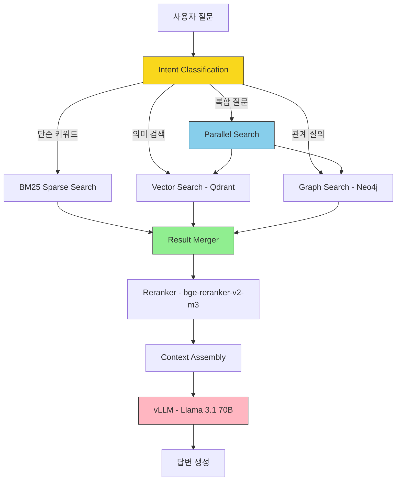
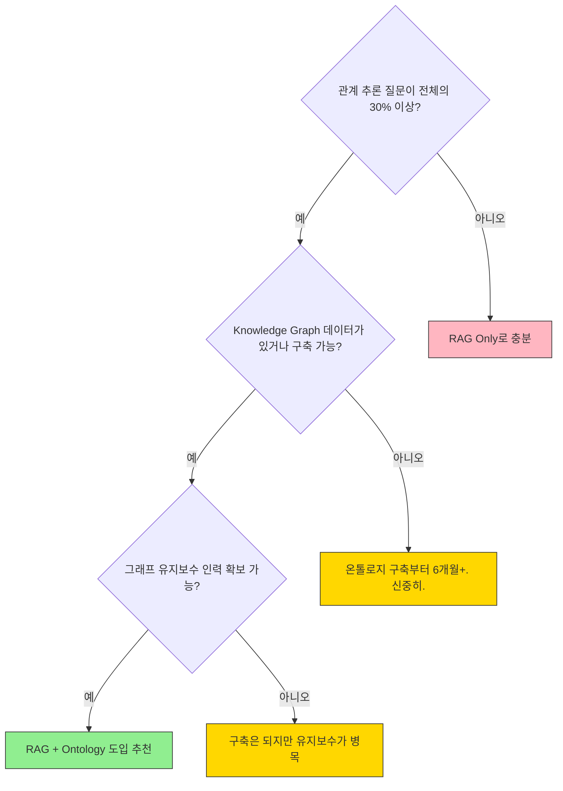
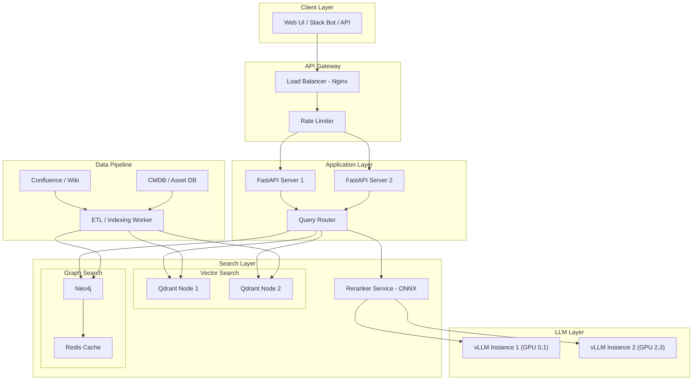

## 소개

드디어 이 연재의 **클라이막스**에 도달했습니다.

지난 두 회차에서 RAG 파이프라인과 온톨로지를 각각 구축했잖아요. 이번에는 이 둘을 합칩니다. 벡터 검색의 "의미적 유사도"와 Knowledge Graph의 "관계 추론"을 하나의 파이프라인에 녹이는 거예요.

솔직히 말하면, **이거 모든 프로젝트에 필요한 건 아닙니다.** 단순 문서 검색형 챗봇이면 RAG만으로 충분해요. 근데 "B팀이 관리하는 서버에서 돌아가는 앱 중에 최근 장애가 발생한 것은?"처럼 **다단계 관계 추론**이 필요한 질문이 나오기 시작하면, RAG만으로는 답이 안 나옵니다.

이런 질문이 전체의 20%라고요? 근데 그 20%가 보통 **경영진이 물어보는 질문**이라 무시할 수가 없습니다. 7회차에서 다뤘던 온톨로지 기반 Knowledge Graph를 RAG와 합치면, 이 까다로운 질문들에 대한 답을 만들어낼 수 있어요.

다만 미리 경고합니다. 파이프라인이 복잡해지는 만큼 **latency, 데이터 동기화, 유지보수 비용**이 같이 올라갑니다. "도입할 가치가 있는가?"에 대한 판단 기준도 이번 회차에서 같이 다루겠습니다.

---

## 하이브리드 검색 아키텍처 상세

먼저 전체 그림부터 봅시다. 사용자 질문이 들어오면 어떤 경로로 답변이 생성되는지.



핵심은 **Intent Classification** 단계입니다. 모든 질문을 하이브리드로 처리하면 불필요한 latency만 늘어나요. 질문을 분류해서 적절한 검색 경로로 라우팅하는 게 실무의 핵심입니다.

각 단계별 latency 목표치를 보면:

| 단계 | 목표 Latency | 비고 |
|------|-------------|------|
| Intent Classification | < 50ms | 경량 분류 모델 또는 룰 기반 |
| Vector Search (Qdrant) | < 80ms | Top-20 검색 |
| Graph Search (Neo4j) | < 150ms | depth 2 이내 |
| Result Merge | < 10ms | 인메모리 연산 |
| Reranking | < 200ms | Cross-encoder |
| LLM Generation | 1~3s | Streaming 적용 시 TTFT 기준 |
| **전체 (하이브리드)** | **< 3.5s** | 병렬 검색 적용 시 |

사용자가 체감하는 건 TTFT(Time To First Token)까지의 시간이에요. Streaming을 걸면 LLM이 토큰 생성을 시작하는 시점부터 글자가 올라오니까, 실제 대기 시간은 검색 + 리랭킹까지의 ~500ms 정도입니다.

---

## Graph-RAG 패턴

Graph-RAG는 이름 그대로 Knowledge Graph를 RAG의 추가 검색 소스로 활용하는 패턴입니다. 단순히 두 검색 결과를 합치는 게 아니라, **벡터 검색 결과를 기반으로 그래프를 탐색**하는 게 포인트예요.

### 동작 방식

1. 사용자 질문으로 벡터 검색 → 관련 문서 Top-K 추출
2. 추출된 문서에서 **Entity 인식** (NER 또는 사전 태깅)
3. 인식된 Entity를 Knowledge Graph에서 탐색
4. 그래프 탐색으로 **관련 Entity + Relation** 확장
5. 확장된 컨텍스트를 원래 검색 결과와 병합

예를 들어 "A 서버 장애 원인"을 검색하면:
- 벡터 검색: A 서버 관련 장애 보고서 3건
- Entity 인식: "A 서버" → Graph에서 탐색
- Graph 확장: A 서버 → (RUNS) → App-X → (DEPENDS_ON) → DB-Primary → (MANAGED_BY) → DBA팀
- 최종 컨텍스트: 장애 보고서 + A 서버의 의존성 맵 + 담당팀 정보

이렇게 하면 LLM이 "A 서버에서 App-X가 구동 중이며, 이 앱은 DB-Primary에 의존합니다. DBA팀에 DB 상태를 확인하세요"처럼 **관계를 기반으로 한 구체적인 답변**을 생성할 수 있습니다.

### Graph-RAG 구현

```python
from neo4j import GraphDatabase
from qdrant_client import QdrantClient
from sentence_transformers import SentenceTransformer
import re
from typing import Optional


class GraphRAG:
    """벡터 검색 결과를 기반으로 그래프 컨텍스트를 확장하는 Graph-RAG 구현"""

    def __init__(
        self,
        qdrant_url: str = "http://localhost:6333",
        neo4j_uri: str = "bolt://localhost:7687",
        neo4j_user: str = "neo4j",
        neo4j_password: str = "password",
    ):
        # 벡터 검색 클라이언트
        self.qdrant = QdrantClient(url=qdrant_url)
        self.embed_model = SentenceTransformer("BAAI/bge-m3")

        # 그래프 DB 클라이언트
        self.neo4j_driver = GraphDatabase.driver(
            neo4j_uri, auth=(neo4j_user, neo4j_password)
        )

        # Entity 사전 (실무에서는 NER 모델 또는 사전 태깅 사용)
        self._entity_cache: dict[str, str] = {}

    def vector_search(
        self, query: str, collection: str = "documents", top_k: int = 10
    ) -> list[dict]:
        """Qdrant 벡터 검색"""
        query_vector = self.embed_model.encode(query).tolist()

        results = self.qdrant.search(
            collection_name=collection,
            query_vector=query_vector,
            limit=top_k,
        )

        return [
            {
                "id": hit.id,
                "score": hit.score,
                "text": hit.payload.get("text", ""),
                "metadata": hit.payload.get("metadata", {}),
                "entities": hit.payload.get("entities", []),
            }
            for hit in results
        ]

    def extract_entities(self, search_results: list[dict]) -> list[str]:
        """검색 결과에서 Entity 추출.

        실무에서는 문서 인덱싱 시 Entity를 미리 태깅해두는 게 훨씬 좋습니다.
        실시간 NER은 latency가 너무 올라갑니다.
        """
        entities = set()
        for result in search_results:
            # 인덱싱 시 태깅해둔 Entity 사용
            if result.get("entities"):
                entities.update(result["entities"])
        return list(entities)

    def graph_expand(
        self,
        entities: list[str],
        max_depth: int = 2,
        max_neighbors: int = 10,
    ) -> list[dict]:
        """Entity 기반 그래프 탐색 - 관련 노드와 관계를 확장"""
        expanded_context = []

        with self.neo4j_driver.session() as session:
            for entity_name in entities:
                # depth 2까지 관련 노드 탐색
                query = """
                MATCH path = (start)-[*1..{depth}]-(connected)
                WHERE start.name = $entity_name
                WITH start, connected, relationships(path) AS rels,
                     length(path) AS dist
                ORDER BY dist ASC
                LIMIT $max_neighbors
                RETURN start.name AS source,
                       connected.name AS target,
                       labels(connected) AS target_labels,
                       [r IN rels | type(r)] AS rel_types,
                       connected AS target_props
                """.replace("{depth}", str(max_depth))

                records = session.run(
                    query,
                    entity_name=entity_name,
                    max_neighbors=max_neighbors,
                )

                for record in records:
                    expanded_context.append({
                        "source": record["source"],
                        "target": record["target"],
                        "target_type": record["target_labels"][0]
                            if record["target_labels"] else "Unknown",
                        "relations": record["rel_types"],
                    })

        return expanded_context

    def format_graph_context(self, graph_results: list[dict]) -> str:
        """그래프 탐색 결과를 LLM이 이해할 수 있는 텍스트로 변환"""
        if not graph_results:
            return ""

        lines = ["[관련 시스템 구조 정보]"]
        for item in graph_results:
            rel_chain = " -> ".join(item["relations"])
            lines.append(
                f"- {item['source']} --({rel_chain})--> "
                f"{item['target']} ({item['target_type']})"
            )
        return "\n".join(lines)

    def search(self, query: str, top_k: int = 5) -> dict:
        """Graph-RAG 통합 검색 파이프라인"""
        # Step 1: 벡터 검색
        vector_results = self.vector_search(query, top_k=top_k * 2)

        # Step 2: Entity 추출
        entities = self.extract_entities(vector_results[:top_k])

        # Step 3: 그래프 확장
        graph_context = []
        if entities:
            graph_context = self.graph_expand(entities, max_depth=2)

        # Step 4: 컨텍스트 조합
        doc_context = "\n\n".join(
            [r["text"] for r in vector_results[:top_k]]
        )
        graph_text = self.format_graph_context(graph_context)

        return {
            "documents": vector_results[:top_k],
            "graph_context": graph_context,
            "combined_context": f"{doc_context}\n\n{graph_text}",
            "entities_found": entities,
        }
```

코드에서 주목할 점이 몇 가지 있어요.

**첫째, Entity 추출은 실시간으로 하지 마세요.** 문서를 Qdrant에 인덱싱할 때 Entity를 미리 태깅해서 payload에 넣어두세요. 실시간 NER은 한 건당 100ms 이상 걸리고, Top-10 결과에 대해 하면 1초가 넘어갑니다.

**둘째, 그래프 탐색 depth는 2가 한계입니다.** depth 3부터는 관련 없는 Entity까지 딸려 옵니다. "A 서버 → App-X → DB → 다른 App → 다른 서버"처럼 너무 먼 관계가 포함되면 LLM이 오히려 혼동합니다. 이걸 "컨텍스트 오염"이라고 부르는데, 실무에서 제일 흔한 실수예요.

**셋째, `max_neighbors` 제한은 필수입니다.** 허브 노드(연결이 수백 개인 노드)를 만나면 그래프 탐색이 폭발합니다. 실무에서는 10~20개로 제한하고, 중요도 순으로 정렬하는 게 좋습니다.

---

## 쿼리 라우팅

모든 질문을 하이브리드로 처리하면 느리고 비효율적입니다. 질문 유형을 분류해서 적절한 검색 방식으로 보내는 게 훨씬 현실적이에요.

### 라우팅 전략

| 질문 유형 | 예시 | 라우팅 대상 | 이유 |
|-----------|------|------------|------|
| 단순 키워드 | "CUDA 12.4 설치 방법" | BM25 | 정확한 키워드 매칭이 유리 |
| 의미 검색 | "GPU 메모리가 부족할 때 대처법" | Vector Search | 의미적 유사도 필요 |
| 관계 질의 | "B팀이 관리하는 서버 목록" | Graph Search | 관계 탐색 필수 |
| 복합 질문 | "B팀 서버에서 최근 장애 원인" | Hybrid (Vector + Graph) | 문서 + 관계 모두 필요 |

### LLM 기반 라우터 구현

```python
import json
from openai import OpenAI
from enum import Enum


class SearchRoute(str, Enum):
    BM25 = "bm25"
    VECTOR = "vector"
    GRAPH = "graph"
    HYBRID = "hybrid"


class QueryRouter:
    """LLM 기반 쿼리 라우터.

    비용이 부담되면 keyword-rule 기반으로 시작해도 충분합니다.
    LLM 라우터는 정확도가 더 높지만 latency가 30~50ms 추가됩니다.
    """

    ROUTER_PROMPT = """당신은 검색 쿼리 라우터입니다.
사용자 질문을 분석해서 가장 적합한 검색 방식을 선택하세요.

검색 방식:
- bm25: 정확한 키워드/용어 검색 (명령어, 에러 메시지, 특정 이름)
- vector: 의미적 유사 문서 검색 (방법, 원인, 설명 요청)
- graph: 관계/구조 탐색 (X가 관리하는, X에 연결된, X의 하위)
- hybrid: 문서 검색 + 관계 탐색 모두 필요 (복합 질문)

JSON 형식으로 응답하세요:
{"route": "방식", "reasoning": "이유", "entities": ["추출된 엔티티"]}
"""

    def __init__(self, llm_base_url: str = "http://localhost:8000/v1"):
        # 라우팅에는 소형 모델(8B)이면 충분합니다
        self.client = OpenAI(
            base_url=llm_base_url,
            api_key="not-needed",
        )

    def route(self, query: str) -> dict:
        """질문을 분류하고 적절한 검색 경로를 결정"""
        response = self.client.chat.completions.create(
            model="llama-3.1-8b-instruct",
            messages=[
                {"role": "system", "content": self.ROUTER_PROMPT},
                {"role": "user", "content": query},
            ],
            temperature=0.0,
            max_tokens=200,
        )

        try:
            result = json.loads(response.choices[0].message.content)
        except json.JSONDecodeError:
            # 파싱 실패 시 hybrid로 fallback
            result = {
                "route": "hybrid",
                "reasoning": "classification failed, defaulting to hybrid",
                "entities": [],
            }

        return result

    def route_rule_based(self, query: str) -> dict:
        """규칙 기반 라우터 - latency 0ms, 정확도는 좀 낮지만 빠름.

        LLM 라우터 도입 전 초기 버전으로 쓰기 좋습니다.
        """
        query_lower = query.lower()

        # 관계 키워드 탐지
        graph_keywords = [
            "관리하는", "담당하는", "연결된", "의존하는", "하위",
            "소속", "호환되는", "영향받는", "관련된 팀",
        ]
        # 키워드 검색 패턴
        bm25_patterns = [
            "설치 방법", "명령어", "에러", "error", "how to",
            "설정 파일", "config",
        ]

        has_graph = any(kw in query_lower for kw in graph_keywords)
        has_bm25 = any(p in query_lower for p in bm25_patterns)

        if has_graph and not has_bm25:
            route = "graph"
        elif has_bm25 and not has_graph:
            route = "bm25"
        elif has_graph and has_bm25:
            route = "hybrid"
        else:
            route = "vector"  # default

        return {"route": route, "reasoning": "rule-based", "entities": []}
```

실무 팁 하나 드리면, **처음에는 규칙 기반 라우터로 시작하세요.** `route_rule_based()`가 그거예요. 키워드 패턴 매칭만으로도 70~80% 정확도가 나옵니다. LLM 라우터는 정확도가 90%+ 나오지만 latency가 추가되고, 라우팅용 모델을 하나 더 띄워야 해요.

라우터 정확도를 모니터링하다가 규칙 기반으로 부족할 때 LLM 라우터로 넘어가면 됩니다. 처음부터 LLM 라우터 쓰면 오버엔지니어링입니다.

---

## 결과 통합 전략

벡터 검색 결과와 그래프 검색 결과를 **어떻게 합칠 것인가** — 이게 하이브리드 RAG의 핵심 난제입니다. 세 가지 전략을 비교해봅시다.

### 전략 1: 단순 Concatenation

```python
def simple_concat(vector_results, graph_results, max_context=5):
    """그냥 합치기. 단순하지만 의외로 잘 동작합니다."""
    combined = []

    # 벡터 검색 결과 (상위)
    for r in vector_results[:max_context]:
        combined.append({
            "text": r["text"],
            "source": "vector",
            "score": r["score"],
        })

    # 그래프 결과 (하위에 추가)
    if graph_results:
        graph_text = format_graph_context(graph_results)
        combined.append({
            "text": graph_text,
            "source": "graph",
            "score": 1.0,  # 그래프 결과는 점수 개념이 다름
        })

    return combined
```

**장점**: 구현이 간단, 디버깅 쉬움
**단점**: 벡터와 그래프 결과의 중요도 밸런싱이 안 됨

### 전략 2: Weighted Scoring

```python
def weighted_merge(
    vector_results, graph_results,
    vector_weight=0.6, graph_weight=0.4,
    top_k=10,
):
    """가중합 방식. 벡터와 그래프 결과의 비중을 조절할 수 있습니다."""
    scored_items = []

    # 벡터 결과 정규화 및 가중치 적용
    if vector_results:
        max_v_score = max(r["score"] for r in vector_results)
        for r in vector_results:
            scored_items.append({
                "text": r["text"],
                "source": "vector",
                "final_score": (r["score"] / max_v_score) * vector_weight,
            })

    # 그래프 결과 - hop 거리 기반 점수
    for item in graph_results:
        hop_count = len(item["relations"])
        # hop이 가까울수록 높은 점수
        graph_score = 1.0 / (1.0 + hop_count)
        scored_items.append({
            "text": f"{item['source']} -> {item['target']}",
            "source": "graph",
            "final_score": graph_score * graph_weight,
        })

    # 점수 순 정렬
    scored_items.sort(key=lambda x: x["final_score"], reverse=True)
    return scored_items[:top_k]
```

**장점**: 벡터/그래프 비중 조절 가능
**단점**: 최적 weight를 찾는 게 또 하나의 삽질

### 전략 3: Reciprocal Rank Fusion (RRF)

```python
def reciprocal_rank_fusion(
    result_lists: list[list[dict]],
    k: int = 60,
    top_n: int = 10,
) -> list[dict]:
    """RRF - 여러 검색 결과의 순위를 결합하는 검증된 방식.

    각 결과 리스트에서의 순위를 기반으로 최종 점수를 계산합니다.
    k=60이 논문에서 제안한 기본값입니다.
    """
    fused_scores: dict[str, float] = {}
    item_map: dict[str, dict] = {}

    for result_list in result_lists:
        for rank, item in enumerate(result_list):
            item_id = item.get("id", item.get("text", "")[:100])
            if item_id not in item_map:
                item_map[item_id] = item
            # RRF 공식: 1 / (k + rank)
            fused_scores[item_id] = (
                fused_scores.get(item_id, 0.0) + 1.0 / (k + rank + 1)
            )

    # 점수 순 정렬
    sorted_ids = sorted(
        fused_scores, key=fused_scores.get, reverse=True
    )

    return [
        {**item_map[item_id], "rrf_score": fused_scores[item_id]}
        for item_id in sorted_ids[:top_n]
    ]
```

**장점**: weight 튜닝 불필요, 여러 검색 결과를 공정하게 결합
**단점**: 동일 문서가 다른 검색에서 어떻게 매칭되는지 ID 관리 필요

### 어떤 전략을 쓸까?

| 전략 | 구현 난이도 | 정확도 | 추천 상황 |
|------|-----------|--------|----------|
| 단순 Concatenation | 낮음 | 중간 | POC, 프로토타입 |
| Weighted Scoring | 중간 | 중~상 | 벡터/그래프 비중이 명확할 때 |
| **RRF** | 중간 | **상** | **프로덕션 추천** |

경험적으로, **RRF가 가장 안정적**입니다. weight 튜닝에 시간 낭비 안 하고도 괜찮은 결과가 나옵니다. Weighted Scoring은 도메인에 따라 최적값이 달라서 A/B 테스트를 계속 돌려야 하고, 그 리소스가 보통 없거든요.

---

## 전체 파이프라인 코드

자, 이제 앞에서 만든 컴포넌트들을 하나로 합칩니다. Qdrant + Neo4j + vLLM을 사용한 완전한 하이브리드 RAG 파이프라인입니다.

```python
import asyncio
from dataclasses import dataclass, field
from openai import OpenAI
from qdrant_client import QdrantClient
from neo4j import GraphDatabase
from sentence_transformers import SentenceTransformer, CrossEncoder


@dataclass
class SearchResult:
    text: str
    score: float
    source: str  # "vector", "graph", "bm25"
    metadata: dict = field(default_factory=dict)


class HybridRAGPipeline:
    """Qdrant + Neo4j + vLLM 하이브리드 RAG 파이프라인.

    전체 흐름:
    1. Query Router → 검색 방식 결정
    2. Parallel Search → 벡터 + 그래프 동시 검색
    3. Result Merger → RRF로 결과 통합
    4. Reranker → Cross-encoder로 리랭킹
    5. LLM Generation → 답변 생성
    """

    def __init__(self, config: dict | None = None):
        config = config or {}

        # 검색 엔진
        self.qdrant = QdrantClient(
            url=config.get("qdrant_url", "http://localhost:6333")
        )
        self.neo4j = GraphDatabase.driver(
            config.get("neo4j_uri", "bolt://localhost:7687"),
            auth=(
                config.get("neo4j_user", "neo4j"),
                config.get("neo4j_password", "password"),
            ),
        )

        # 모델
        self.embed_model = SentenceTransformer("BAAI/bge-m3")
        self.reranker = CrossEncoder("BAAI/bge-reranker-v2-m3")

        # LLM (vLLM OpenAI-compatible API)
        self.llm = OpenAI(
            base_url=config.get("llm_url", "http://localhost:8000/v1"),
            api_key="not-needed",
        )

        # 라우터
        self.router = QueryRouter(
            llm_base_url=config.get("router_url", "http://localhost:8001/v1")
        )

    async def _vector_search(
        self, query: str, top_k: int = 20
    ) -> list[SearchResult]:
        """벡터 검색 (async wrapper)"""
        query_vec = self.embed_model.encode(query).tolist()
        results = self.qdrant.search(
            collection_name="documents",
            query_vector=query_vec,
            limit=top_k,
        )
        return [
            SearchResult(
                text=hit.payload.get("text", ""),
                score=hit.score,
                source="vector",
                metadata=hit.payload.get("metadata", {}),
            )
            for hit in results
        ]

    async def _graph_search(
        self, entities: list[str], max_depth: int = 2
    ) -> list[SearchResult]:
        """그래프 검색 (async wrapper)"""
        results = []
        with self.neo4j.session() as session:
            for entity in entities:
                records = session.run(
                    """
                    MATCH path = (s {name: $name})-[*1..2]-(t)
                    RETURN s.name AS src, t.name AS tgt,
                           labels(t)[0] AS tgt_type,
                           [r IN relationships(path) | type(r)] AS rels
                    LIMIT 15
                    """,
                    name=entity,
                )
                for rec in records:
                    rel_desc = " -> ".join(rec["rels"])
                    text = (
                        f"{rec['src']} --({rel_desc})--> "
                        f"{rec['tgt']} [{rec['tgt_type']}]"
                    )
                    hop_count = len(rec["rels"])
                    results.append(SearchResult(
                        text=text,
                        score=1.0 / (1.0 + hop_count),
                        source="graph",
                    ))
        return results

    def _rerank(
        self, query: str, results: list[SearchResult], top_k: int = 5
    ) -> list[SearchResult]:
        """Cross-encoder 리랭킹"""
        if not results:
            return []

        pairs = [(query, r.text) for r in results]
        scores = self.reranker.predict(pairs)

        for result, score in zip(results, scores):
            result.score = float(score)

        results.sort(key=lambda x: x.score, reverse=True)
        return results[:top_k]

    def _rrf_merge(
        self, *result_lists: list[SearchResult], k: int = 60
    ) -> list[SearchResult]:
        """Reciprocal Rank Fusion으로 결과 병합"""
        scores: dict[str, float] = {}
        items: dict[str, SearchResult] = {}

        for result_list in result_lists:
            for rank, item in enumerate(result_list):
                key = item.text[:200]  # 텍스트 기반 dedup
                if key not in items:
                    items[key] = item
                scores[key] = scores.get(key, 0) + 1.0 / (k + rank + 1)

        sorted_keys = sorted(scores, key=scores.get, reverse=True)
        return [items[k] for k in sorted_keys]

    async def query(self, question: str) -> dict:
        """전체 파이프라인 실행"""

        # Step 1: 쿼리 라우팅
        route_info = self.router.route_rule_based(question)
        route = route_info["route"]

        # Step 2: 라우팅에 따른 검색
        vector_results = []
        graph_results = []

        if route in ("vector", "hybrid", "bm25"):
            vector_results = await self._vector_search(question)

        if route in ("graph", "hybrid"):
            # 질문에서 Entity 추출 (간단 버전)
            entities = route_info.get("entities", [])
            if not entities:
                # 벡터 검색 결과에서 Entity 추출
                entities = []
                for r in vector_results[:5]:
                    entities.extend(
                        r.metadata.get("entities", [])
                    )
            if entities:
                graph_results = await self._graph_search(entities)

        # Step 3: 결과 통합 (RRF)
        merged = self._rrf_merge(vector_results, graph_results)

        # Step 4: 리랭킹
        reranked = self._rerank(question, merged, top_k=5)

        # Step 5: LLM 답변 생성
        context = "\n\n".join([r.text for r in reranked])
        answer = self._generate(question, context, route)

        return {
            "answer": answer,
            "route": route,
            "sources": [
                {"text": r.text[:200], "source": r.source, "score": r.score}
                for r in reranked
            ],
        }

    def _generate(self, question: str, context: str, route: str) -> str:
        """LLM 답변 생성"""
        system_prompt = """당신은 사내 기술 문서 기반 Q&A 어시스턴트입니다.
주어진 컨텍스트만을 바탕으로 답변하세요.
컨텍스트에 없는 내용은 "해당 정보를 찾을 수 없습니다"라고 답하세요.

[관련 시스템 구조 정보]가 포함된 경우, 시스템 간 관계를 활용해서
구체적으로 답변하세요."""

        response = self.llm.chat.completions.create(
            model="llama-3.1-70b-instruct",
            messages=[
                {"role": "system", "content": system_prompt},
                {
                    "role": "user",
                    "content": f"컨텍스트:\n{context}\n\n질문: {question}",
                },
            ],
            temperature=0.1,
            max_tokens=1024,
        )

        return response.choices[0].message.content
```

이 코드에서 `async`를 쓰는 이유는 벡터 검색과 그래프 검색을 **병렬로 실행**하기 위해서입니다. 순차적으로 실행하면 80ms + 150ms = 230ms인데, 병렬이면 max(80, 150) = 150ms로 줄어듭니다. 이 차이가 수백 건 처리하면 꽤 커요.

---

## 답변 품질 비교 (RAGAS)

말로만 "좋아진다"고 하면 의미 없으니, RAGAS 프레임워크로 정량 비교해봅시다. 사내 IT 인프라 문서 기반으로 100건 질문셋을 만들어서 테스트한 결과입니다.

### 테스트 조건

- **문서**: 사내 위키 5,000건 + 장애 보고서 800건
- **Knowledge Graph**: Entity 2,500개, Relation 8,000개
- **질문셋**: 100건 (단순 검색 40건, 관계 추론 35건, 복합 질문 25건)
- **모델**: Llama 3.1 70B (vLLM, 4-bit quantization)
- **임베딩**: bge-m3, 리랭커: bge-reranker-v2-m3

### 전체 결과

| 지표 | RAG Only | RAG + Ontology | 개선율 |
|------|----------|---------------|--------|
| **Faithfulness** | 0.82 | 0.87 | +6.1% |
| **Answer Relevancy** | 0.78 | 0.85 | +9.0% |
| **Context Precision** | 0.71 | 0.83 | +16.9% |
| **Context Recall** | 0.74 | 0.88 | +18.9% |

전체로 보면 모든 지표가 올라갑니다. 근데 이건 평균이라 함정이 있어요. 질문 유형별로 뜯어봐야 진짜 의미가 보입니다.

### 질문 유형별 분석

| 질문 유형 | 지표 | RAG Only | RAG + Ontology | 차이 |
|-----------|------|----------|---------------|------|
| **단순 검색** (40건) | Answer Relevancy | 0.88 | 0.87 | **-1.1%** |
| | Context Precision | 0.85 | 0.84 | -1.2% |
| **관계 추론** (35건) | Answer Relevancy | 0.62 | 0.84 | **+35.5%** |
| | Context Precision | 0.51 | 0.82 | **+60.8%** |
| **복합 질문** (25건) | Answer Relevancy | 0.71 | 0.83 | **+16.9%** |
| | Context Precision | 0.63 | 0.81 | +28.6% |

여기서 핵심 인사이트:

1. **단순 검색에서는 온톨로지가 거의 도움이 안 됩니다.** 오히려 미세하게 떨어져요. 불필요한 그래프 컨텍스트가 노이즈로 작용하기 때문입니다.
2. **관계 추론에서 압도적 차이가 납니다.** Context Precision이 0.51 → 0.82로 뛰는 건, RAG만으로는 관련 Entity를 못 찾았다는 뜻이에요.
3. **복합 질문에서도 유의미한 개선**이 있지만, 관계 추론만큼 극적이진 않습니다.

결론: **관계 추론 질문이 전체의 30% 이상이면 온톨로지 도입 가치가 있습니다.** 10% 미만이면 ROI가 안 나옵니다. 이건 도입 전에 질문 로그 분석을 먼저 하라는 뜻이에요.

### RAGAS 평가 코드

```python
from ragas import evaluate
from ragas.metrics import (
    faithfulness,
    answer_relevancy,
    context_precision,
    context_recall,
)
from datasets import Dataset


def evaluate_pipeline(
    pipeline,  # HybridRAGPipeline 인스턴스
    test_questions: list[dict],
) -> dict:
    """RAGAS로 파이프라인 품질 평가.

    test_questions 형식:
    [{"question": "...", "ground_truth": "...", "contexts": ["..."]}]
    """
    questions = []
    answers = []
    contexts = []
    ground_truths = []

    for item in test_questions:
        result = asyncio.run(pipeline.query(item["question"]))

        questions.append(item["question"])
        answers.append(result["answer"])
        contexts.append([s["text"] for s in result["sources"]])
        ground_truths.append(item["ground_truth"])

    dataset = Dataset.from_dict({
        "question": questions,
        "answer": answers,
        "contexts": contexts,
        "ground_truth": ground_truths,
    })

    results = evaluate(
        dataset,
        metrics=[
            faithfulness,
            answer_relevancy,
            context_precision,
            context_recall,
        ],
    )

    return results
```

---

## Latency 최적화

하이브리드 파이프라인의 가장 큰 약점은 **latency**입니다. 컴포넌트가 많아질수록 응답 시간이 늘어나는데, 사용자는 3초 이상이면 "느리다"고 느낍니다.

### 최적화 전 vs 후

| 단계 | 최적화 전 | 최적화 후 | 기법 |
|------|----------|----------|------|
| Query Routing | 200ms (LLM) | 5ms (rule-based) | 규칙 기반 라우터 |
| Vector Search | 120ms | 60ms | HNSW 파라미터 튜닝 |
| Graph Search | 250ms | 80ms | 캐싱 + 인덱스 |
| ↳ 합계 (순차) | 370ms | 140ms | - |
| ↳ 합계 (병렬) | 250ms | 80ms | asyncio 병렬 실행 |
| Reranking | 350ms | 150ms | 배치 + ONNX 변환 |
| LLM (TTFT) | 800ms | 500ms | KV cache 최적화 |
| **전체** | **1,570ms** | **735ms** | **53% 감소** |

### 핵심 최적화 기법

**1. 병렬 검색 (가장 효과 큼)**

```python
async def parallel_search(self, query, entities):
    """벡터 검색과 그래프 검색을 동시 실행"""
    vector_task = asyncio.create_task(
        self._vector_search(query)
    )
    graph_task = asyncio.create_task(
        self._graph_search(entities)
    )

    vector_results, graph_results = await asyncio.gather(
        vector_task, graph_task
    )
    return vector_results, graph_results
```

**2. 그래프 쿼리 캐싱**

자주 조회되는 Entity의 그래프 탐색 결과를 Redis에 캐싱하면 됩니다. Entity 주변 구조는 자주 바뀌지 않으니까, TTL 1시간 정도면 적당합니다.

```python
import redis
import json
import hashlib


class GraphCache:
    def __init__(self, redis_url="redis://localhost:6379"):
        self.redis = redis.from_url(redis_url)
        self.default_ttl = 3600  # 1시간

    def get_or_query(self, entity: str, query_func) -> list[dict]:
        cache_key = f"graph:{hashlib.md5(entity.encode()).hexdigest()}"

        cached = self.redis.get(cache_key)
        if cached:
            return json.loads(cached)

        results = query_func(entity)
        self.redis.setex(
            cache_key, self.default_ttl, json.dumps(results)
        )
        return results
```

**3. Reranker ONNX 변환**

Cross-encoder를 ONNX로 변환하면 추론 속도가 2~3배 빨라집니다. GPU 없이 CPU에서도 쓸 만해져요.

```bash
# ONNX 변환
optimum-cli export onnx \
  --model BAAI/bge-reranker-v2-m3 \
  --task text-classification \
  bge-reranker-onnx/
```

**4. Pre-computed Graph Embeddings**

Graph의 각 Entity 설명을 미리 임베딩해서 벡터 DB에 같이 넣어두면, 그래프 탐색 없이 벡터 검색만으로 Entity를 찾을 수 있습니다. 정확도는 좀 떨어지지만 latency가 극적으로 줄어들어요.

---

## 도입 판단 기준

이쯤 되면 "우리 팀도 해야 하나?"라는 질문이 나올 거예요. 정직하게 판단 기준을 정리합니다.

### Decision Matrix



### 비용-효과 분석

| 항목 | RAG Only | RAG + Ontology |
|------|----------|---------------|
| **초기 구축** | 2~4주 | 8~16주 |
| **인력** | ML 엔지니어 1명 | ML 엔지니어 1 + 도메인 전문가 + 데이터 엔지니어 |
| **인프라** | Qdrant + vLLM | + Neo4j + Redis (캐싱) |
| **유지보수** | 문서 인덱싱 업데이트 | + 그래프 동기화, 데이터 정합성 |
| **답변 품질 (관계 추론)** | 0.62 (부족) | 0.84 (양호) |
| **답변 품질 (단순 검색)** | 0.88 (충분) | 0.87 (동일) |

**솔직한 평가:**

- 질문의 80%가 단순 문서 검색이면, **RAG만으로 충분합니다.** 온톨로지 추가해봐야 전체 지표가 5% 오르는 데 비용은 3배 듭니다.
- 관계 추론이 핵심 유즈케이스라면(예: IT 운영, 제조업 설비 관리, 바이오/의약), **온톨로지가 거의 필수입니다.** 이 영역에서는 RAG만으로는 답이 안 나옵니다.
- 중간 지대(관계 추론 20~30%)라면, **RAG 먼저 잘 만들고 나중에 온톨로지를 점진적으로 추가**하는 전략을 추천합니다. 처음부터 둘 다 하려면 팀이 지칩니다.

---

## 프로덕션 아키텍처 패턴

실제 운영 환경에서의 전체 아키텍처입니다. 개발 환경에서는 단일 서버로 돌려도 되지만, 프로덕션에서는 각 컴포넌트를 분리하고 스케일링할 수 있어야 합니다.



### 핵심 설계 포인트

**1. Stateless API 서버**: FastAPI 서버는 stateless로 설계해서 수평 확장이 가능하게. 세션이나 상태는 Redis에.

**2. 검색 레이어 분리**: Qdrant와 Neo4j는 별도 서버에 배포. 검색 부하가 올라가면 Qdrant 노드만 추가하면 됩니다.

**3. Reranker 서비스화**: Cross-encoder를 별도 마이크로서비스로 분리. ONNX Runtime으로 올리면 CPU 서버에서도 돌릴 수 있어요. GPU를 LLM에 몰아주는 전략.

**4. 캐싱 레이어**: 자주 조회되는 그래프 쿼리 결과를 Redis에 캐싱. 동일 Entity에 대한 반복 조회가 많으면 hit rate 60~70% 나옵니다.

**5. 비동기 데이터 파이프라인**: 문서 인덱싱과 그래프 업데이트는 비동기 워커로 처리. API 서버 성능에 영향 안 주도록.

---

## 실무에서 겪는 현실 (삽질 포인트)

여기가 이 글에서 제일 중요한 섹션입니다. 아키텍처 다이어그램은 예쁜데, 실제로 만들면 예상 못한 문제가 쏟아져요.

### 1. 데이터 정합성 - 가장 고통스러운 문제

위키는 업데이트됐는데 Knowledge Graph는 안 됐을 때. 예를 들어 "A 서버 담당자가 누구냐"고 물으면, 위키에는 김철수인데 그래프에는 전임자 이영희로 나오는 거예요. 두 소스의 답이 다르면 LLM이 둘 중 하나를 랜덤하게 선택하거나 "정보가 일치하지 않습니다"라고 답합니다.

**해결책**: 문서 인덱싱과 그래프 업데이트를 같은 ETL 파이프라인에서 처리하세요. Confluence webhook → ETL worker → (Qdrant 인덱싱 + Neo4j 업데이트) 동시에. 타이밍 차이를 줄이는 게 핵심이에요.

### 2. 그래프 탐색 depth 폭발

depth를 3으로 설정했더니 "A 서버"에서 시작해서 연결된 노드가 200개 넘게 나온 적 있습니다. 허브 노드(모든 서비스가 의존하는 공통 DB 같은) 때문인데, 이게 컨텍스트에 다 들어가면 LLM이 핵심을 못 찾아요.

**해결책**: max_depth=2, max_neighbors=10~15로 제한. 허브 노드는 별도 블랙리스트로 관리. "공통_인프라", "전사_AD" 같은 노드는 탐색에서 제외하세요.

### 3. "결국 RAG만 쓸 걸" 증후군

온톨로지까지 구축해놓고 6개월 쓴 팀에서 실제로 이런 피드백이 나옵니다:

- "관계 질문이 생각보다 안 들어와요" (전체의 5%도 안 됨)
- "그래프 유지보수에 인력이 계속 투입돼요"
- "RAG만 쓰는 팀이 우리보다 빨리 기능 추가하더라고요"

냉정하게 말해서, **50% 정도의 팀이 이 결론에 도달합니다.** 도입 전에 실제 질문 로그를 분석해서 관계 추론 질문 비율을 먼저 확인하세요. 감으로 "필요할 것 같다"로 시작하면 높은 확률로 오버엔지니어링이 됩니다.

### 4. Latency 체감 문제

기술적으로 3초 이내인데도 사용자가 "느리다"고 느끼는 케이스. RAG만 쓰면 1.5초인데 하이브리드는 2.5초. 절대값은 둘 다 괜찮은데, 기존 RAG를 쓰다가 하이브리드로 전환하면 **"왜 느려졌냐"**는 불만이 나옵니다.

**해결책**: Streaming을 적극 활용. 검색하는 동안 "검색 중..." UI를 보여주고, LLM 토큰이 생성되기 시작하면 바로 표시. 체감 대기 시간을 줄이는 게 실제 latency를 줄이는 것보다 효과적일 때가 많습니다.

### 5. 프롬프트 엔지니어링의 복잡도

RAG만 쓸 때는 프롬프트가 단순합니다. "주어진 문서를 참고해서 답하세요." 근데 그래프 컨텍스트가 추가되면:

```
[검색된 문서]
1. 장애 보고서 2024-001 ...
2. 서버 운영 매뉴얼 ...

[관련 시스템 구조]
- A서버 --(RUNS)--> App-X [Application]
- App-X --(DEPENDS_ON)--> DB-Primary [Database]
- DB-Primary --(MANAGED_BY)--> DBA팀 [Team]
```

이 두 종류의 컨텍스트를 LLM이 **어떻게 결합해서 활용할지**를 프롬프트로 잘 가이드해야 합니다. "시스템 구조 정보가 있으면 관계를 활용해서 답변하세요"라고만 쓰면 모델이 그래프 정보를 무시하는 경우가 많아요. 예시를 few-shot으로 넣어주는 게 효과적입니다.

### 6. 테스트 환경과 프로덕션의 괴리

개발 환경에서 Entity 500개, 문서 1,000건으로 테스트하면 모든 게 잘 됩니다. latency도 빠르고, 정확도도 높아요. 근데 프로덕션에서 Entity 10,000개, 문서 50,000건이 되면:

- 그래프 탐색이 느려짐 (인덱스 최적화 필요)
- 벡터 검색에서 노이즈 증가 (유사한 문서가 너무 많아서)
- RRF 결과가 불안정해짐 (결과 집합이 커지면서)

**해결책**: 프로덕션 데이터의 10% 샘플로 스테이징 환경을 구성하세요. 최소 Entity 1,000개, 문서 5,000건 이상에서 테스트해야 현실적인 성능이 나옵니다.

> **이건 꼭 알아두세요:** RAG + Ontology 통합은 **"기술적으로 할 수 있느냐"가 아니라 "비즈니스적으로 필요하느냐"**의 문제입니다. 관계 추론 질문이 정말 많고, 그래프 데이터가 이미 있거나 구축할 여력이 있을 때만 도입하세요. 그렇지 않으면 RAG 파이프라인을 더 정교하게 만드는 데 리소스를 집중하는 게 ROI가 높습니다.

---

## 다음 회차 예고

RAG + Ontology 파이프라인까지 구축했으니, 이제 **모델 자체를 우리 도메인에 맞게 튜닝**할 차례입니다. 9회차에서는 LoRA 기반 파인튜닝으로 모델의 도메인 지식을 강화하는 방법을 다룹니다. RAG가 "검색을 잘 하게 만드는 것"이라면, 파인튜닝은 "모델 자체가 똑똑해지는 것"입니다.

---

*시리즈: 온프레미스 LLM 구축 (8/10)*
