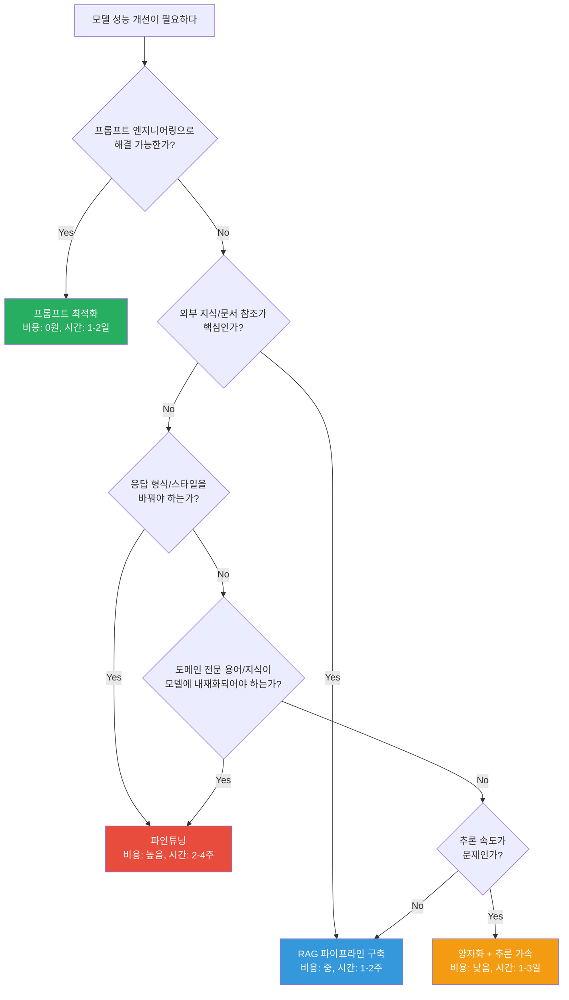

## 소개

"파인튜닝하면 성능 좋아진다면서요?" -- 네, 맞는데 **잘 해야** 좋아집니다.

솔직히 말하면, 파인튜닝은 LLM 프로젝트에서 **제일 과대평가된 기술**입니다. LinkedIn에서 "우리 모델 파인튜닝해서 GPT-4 뛰어넘었다!" 하는 포스팅 많이 보셨죠? 대부분은 체리픽한 벤치마크에서만 그렇고, 범용 성능은 오히려 떨어진 경우가 태반이에요.

제가 처음 파인튜닝 시도했을 때 일입니다. 사내 기술 문서 2,000건으로 Llama 2를 파인튜닝했는데, 결과가 어땠냐면... 기술 문서 스타일로는 대답을 잘 하는데, "안녕하세요"라고 인사하면 갑자기 기술 문서 형식으로 답변하더라고요. "1. 개요: 인사에 대한 응답..." 이런 식으로. 이게 바로 **catastrophic forgetting**입니다.

그래서 제가 **RAG First** 원칙을 강조하는 겁니다. 파인튜닝 전에 반드시 물어보세요:

- "이거 RAG로 해결 안 되나?"
- "프롬프트 엔지니어링으로 안 되나?"
- "few-shot example로 안 되나?"

이 세 가지 다 시도하고도 안 될 때, **그때 파인튜닝 카드를 꺼내세요.**

그리고 파인튜닝 못지않게 중요한 게 **모델 최적화**입니다. 양자화(quantization)와 추론 가속(inference optimization)을 잘하면, 이미 좋은 모델을 **더 빠르고 가볍게** 만들 수 있어요. ROI 따지면 이쪽이 훨씬 높은 경우가 많습니다.

이번 회차에서는 파인튜닝의 현실적인 판단 기준부터, LoRA/QLoRA 실습, 양자화 심층 분석, 추론 가속 테크닉까지 전부 다룹니다. 코드도 다 넣었으니 따라 해보실 수 있습니다.

---

## 파인튜닝 vs RAG 의사결정

"파인튜닝할까 RAG 할까" -- 이 질문을 매주 한 번은 받습니다. 간단한 의사결정 플로우차트를 만들었으니 이걸 기준으로 판단하세요.



### 각 접근법 비교

| 항목 | 프롬프트 엔지니어링 | RAG | 파인튜닝 |
|------|-------------------|-----|---------|
| **비용** | 거의 0 | 중간 (인프라) | 높음 (GPU 시간 + 데이터) |
| **소요 시간** | 1-2일 | 1-2주 | 2-4주 |
| **유지보수** | 쉬움 | 문서 업데이트만 | 모델 바뀔 때마다 재학습 |
| **최신 정보 반영** | 프롬프트에 넣으면 됨 | 문서 추가하면 됨 | 재학습 필요 |
| **응답 형식 제어** | 제한적 | 제한적 | **강력** |
| **도메인 지식** | few-shot으로 일부 | **문서 기반 강력** | 모델에 내재화 |
| **위험도** | 낮음 | 중간 | **높음** (forgetting) |

### 파인튜닝이 정말 필요한 경우

솔직히 말하면 실무에서 파인튜닝이 진짜 필요한 케이스는 생각보다 적습니다. 하지만 아래 경우에는 파인튜닝이 답입니다:

1. **응답 형식이 엄격하게 고정되어야 할 때** -- 항상 특정 JSON 스키마로만 답변해야 하거나, 의료 차트 형식으로만 출력해야 하는 경우. 프롬프트로 80%는 되는데 나머지 20%에서 자꾸 포맷이 깨진다면 파인튜닝으로 해결합니다.

2. **도메인 전문 용어를 정확히 써야 할 때** -- 법률 용어, 의학 용어, 금융 약어 등을 RAG 없이도 자연스럽게 구사해야 하는 경우. "비급여 진료"를 "보험 안 되는 치료"로 풀어 쓰면 안 되는 상황.

3. **추론 패턴 자체를 바꿔야 할 때** -- 코드 리뷰 시 우리 회사 컨벤션에 맞게 지적해야 하는 경우. 이건 RAG로 컨벤션 문서를 넣어도 한계가 있어요.

4. **latency가 극도로 중요할 때** -- RAG 파이프라인의 검색 오버헤드(100-500ms)가 용납 안 되는 경우. 파인튜닝된 모델은 바로 답변하니까 빠릅니다.

---

## LoRA 원리 -- 전체 모델을 건드리지 않는 마법

### 왜 Full Fine-tuning이 비현실적인가

Llama 3.1 70B 모델의 파라미터는 약 700억 개입니다. FP16으로 풀 파인튜닝하려면:

- 모델 가중치: ~140GB
- Optimizer states (Adam): ~280GB
- Gradients: ~140GB
- **총 필요 VRAM: ~560GB** = A100 80GB 7장

현실적으로 대부분의 팀에서는 불가능합니다. 여기서 LoRA가 등장합니다.

### LoRA(Low-Rank Adaptation)의 핵심 아이디어

LoRA의 아이디어는 놀라울 정도로 단순합니다.

"거대한 행렬의 변화량(delta W)은 사실 **저차원(low-rank)**으로 표현할 수 있다."

```
기존 Full Fine-tuning:
  W_new = W_original + delta_W
  (delta_W 크기 = 원래 W와 동일 = 엄청 큼)

LoRA:
  W_new = W_original + B * A
  (B: d x r 행렬, A: r x k 행렬)
  (r << d, r << k 이므로 파라미터 수가 극적으로 줄어듦)

예시 (Llama 70B의 한 layer):
  W_original: 8192 x 8192 = 67,108,864 파라미터
  LoRA (r=16): B(8192x16) + A(16x8192) = 262,144 파라미터
  → 원래의 0.4%만 학습!
```

시각적으로 표현하면 이렇습니다:

```
원래 가중치 행렬 (frozen, 학습 안 함)
┌─────────────────────────┐
│                         │
│    W (8192 x 8192)      │  ← 이건 그대로 둠
│    67M parameters       │
│                         │
└─────────────────────────┘
           +
LoRA 어댑터 (이것만 학습!)
┌──────┐   ┌──────────────┐
│ B    │ x │     A        │
│8192  │   │  16 x 8192   │
│  x   │   │              │
│ 16   │   │  131K params │
│      │   └──────────────┘
│131K  │
│params│
└──────┘
  Total LoRA: 262K params (원래의 0.4%)
```

### Rank(r) 파라미터의 의미

LoRA에서 가장 중요한 하이퍼파라미터가 `r`(rank)입니다.

| Rank (r) | 학습 파라미터 비율 | 특징 |
|----------|-------------------|------|
| 4 | ~0.1% | 매우 가벼움. 간단한 스타일 변경에 적합 |
| 8 | ~0.2% | 가벼운 태스크에 충분 |
| **16** | **~0.4%** | **대부분의 경우 이걸로 시작** |
| 32 | ~0.8% | 복잡한 도메인 적응. 데이터 많을 때 |
| 64 | ~1.6% | 거의 풀 파인튜닝 수준. 과적합 주의 |
| 128+ | ~3.2%+ | 특수한 경우만. 보통은 과적합 |

경험칙: **r=16으로 시작하고, 성능이 부족하면 올리고, 과적합이면 내리세요.** 데이터가 1,000개 이하면 r=8이 오히려 나을 수 있습니다.

### Target Modules -- 어디에 LoRA를 붙일 것인가

Transformer의 모든 레이어에 LoRA를 붙일 수 있지만, 보통 attention 레이어에만 붙입니다:

```python
# 일반적인 target modules
target_modules = [
    "q_proj",   # Query projection
    "k_proj",   # Key projection
    "v_proj",   # Value projection
    "o_proj",   # Output projection
]

# 좀 더 공격적으로 (성능↑, VRAM↑)
target_modules = [
    "q_proj", "k_proj", "v_proj", "o_proj",
    "gate_proj", "up_proj", "down_proj",  # MLP 레이어도 포함
]
```

MLP까지 포함하면 학습 파라미터가 2-3배 늘어나지만, 복잡한 도메인 적응에서는 성능이 확실히 올라갑니다.

---

## QLoRA 실전 -- RTX 4090 한 장으로 70B 파인튜닝

QLoRA는 LoRA의 진화형입니다. 핵심 아이디어는 간단해요:

**"기존 모델 가중치를 4-bit로 양자화 + LoRA 어댑터만 FP16으로 학습"**

이렇게 하면 70B 모델도 RTX 4090(24GB) 한 장에 올릴 수 있습니다. 느리지만 됩니다.

### VRAM 요구사항 비교

| 모델 | Full FT (FP16) | LoRA (FP16) | QLoRA (4-bit) |
|------|---------------|-------------|---------------|
| 7B | ~60GB | ~18GB | **~6GB** |
| 13B | ~104GB | ~32GB | **~10GB** |
| 34B | ~272GB | ~80GB | **~22GB** |
| 70B | ~560GB | ~160GB | **~40GB** |
| 70B (gradient checkpointing) | - | - | **~24GB** |

70B + QLoRA + gradient checkpointing = RTX 4090 한 장에 겨우 맞습니다. "겨우"라는 게 포인트예요. batch size 1에, gradient accumulation으로 effective batch size 맞추는 구조라 **학습 속도는 느립니다.** A100이면 batch size 4 정도 가능해서 체감 속도가 확 달라요.

### QLoRA의 기술적 핵심

```
1. NF4 (4-bit NormalFloat): 정규분포에 최적화된 4-bit 양자화
   - 일반 INT4보다 정보 손실이 적음
   - 신경망 가중치가 대체로 정규분포를 따르는 성질 이용

2. Double Quantization: 양자화 상수(quantization constants)도 양자화
   - 모델당 ~0.37GB 추가 절약
   - 큰 모델일수록 효과 체감

3. Paged Optimizers: GPU 메모리 부족 시 CPU로 일부 offload
   - OOM 방지 안전장치
   - 속도는 좀 느려지지만 학습이 안 터지는 게 중요
```

---

## 데이터셋 준비 -- 진짜 시간 잡아먹는 곳

파인튜닝 프로젝트 전체 일정에서 **데이터셋 준비가 60%**를 차지합니다. 과장이 아니에요.

"데이터는 있어요"라고 하길래 받아봤더니, Excel에 3만 행짜리 상담 로그가 있는데 정제하니까 쓸 만한 건 2,000개... 그것도 "쓸 만하다"의 기준을 좀 낮춰서요.

### 데이터 포맷

Instruction tuning의 표준 포맷입니다:

```json
{
  "instruction": "다음 코드의 보안 취약점을 분석해주세요.",
  "input": "def login(user, pw):\n    query = f\"SELECT * FROM users WHERE name='{user}' AND pass='{pw}'\"\n    return db.execute(query)",
  "output": "SQL Injection 취약점이 있습니다.\n\n1. **문제점**: f-string으로 직접 쿼리를 조합하고 있어 악의적 입력이 그대로 SQL에 삽입됩니다.\n2. **공격 예시**: user에 `' OR '1'='1' --`를 입력하면 모든 사용자 정보가 노출됩니다.\n3. **해결방안**: parameterized query를 사용하세요.\n```python\nquery = \"SELECT * FROM users WHERE name=? AND pass=?\"\ndb.execute(query, (user, pw))\n```"
}
```

ChatML 포맷도 많이 씁니다:

```json
{
  "conversations": [
    {"role": "system", "content": "당신은 보안 전문가입니다. 코드의 취약점을 분석합니다."},
    {"role": "user", "content": "이 코드 봐주세요:\ndef login(user, pw):..."},
    {"role": "assistant", "content": "SQL Injection 취약점이 발견되었습니다..."}
  ]
}
```

### 데이터 품질 > 수량

이건 아무리 강조해도 부족합니다. **1만 개 허접한 데이터보다 1,000개 고품질 데이터가 낫습니다.**

고품질 데이터의 기준:

1. **정확성** -- 답변에 사실 오류가 없어야 함. 당연한 것 같지만, 크라우드소싱 데이터에서 오류율 10-20%는 기본
2. **일관성** -- 같은 유형의 질문에 답변 스타일이 비슷해야 함. 어떤 건 구어체, 어떤 건 논문체면 모델이 혼란스러워함
3. **다양성** -- 같은 패턴만 반복하면 과적합. 다양한 케이스를 커버해야 함
4. **적절한 길이** -- 너무 짧으면 모델이 학습할 게 없고, 너무 길면 노이즈가 많아짐

### 태스크별 최소 데이터셋 크기

| 태스크 | 최소 권장 | 이상적 | 비고 |
|--------|----------|--------|------|
| 텍스트 분류 | 500개 | 2,000-5,000개 | 클래스당 100개 이상 |
| 요약 | 1,000개 | 3,000-5,000개 | 원문+요약 쌍 |
| Q&A | 1,000개 | 5,000-10,000개 | 질문 다양성이 핵심 |
| 코드 생성 | 2,000개 | 10,000개+ | 언어/프레임워크별로 |
| 형식 변환 (JSON 등) | 500개 | 1,000-2,000개 | 패턴이 명확하면 적어도 됨 |
| 대화/챗봇 | 3,000턴 | 10,000턴+ | 멀티턴 대화 포함 |

### 데이터 정제 파이프라인

```python
import json
import re
from collections import Counter

def clean_dataset(input_path: str, output_path: str):
    """데이터셋 정제 파이프라인"""
    raw_data = json.load(open(input_path, "r", encoding="utf-8"))
    cleaned = []
    rejected = {"too_short": 0, "too_long": 0, "duplicate": 0, "low_quality": 0}
    seen_instructions = set()

    for item in raw_data:
        instruction = item.get("instruction", "").strip()
        output = item.get("output", "").strip()

        # 1. 빈 값 체크
        if not instruction or not output:
            rejected["low_quality"] += 1
            continue

        # 2. 중복 제거 (instruction 기준)
        if instruction in seen_instructions:
            rejected["duplicate"] += 1
            continue
        seen_instructions.add(instruction)

        # 3. 길이 필터링
        if len(output) < 50:  # 답변이 너무 짧으면 학습 가치 낮음
            rejected["too_short"] += 1
            continue
        if len(output) > 4000:  # 너무 길면 노이즈 가능성
            rejected["too_long"] += 1
            continue

        # 4. 품질 휴리스틱
        # - 반복 패턴 감지
        words = output.split()
        if len(words) > 10:
            word_counts = Counter(words)
            most_common_ratio = word_counts.most_common(1)[0][1] / len(words)
            if most_common_ratio > 0.3:  # 한 단어가 30% 이상이면 의심
                rejected["low_quality"] += 1
                continue

        # 5. 포맷 정규화
        item["instruction"] = instruction
        item["output"] = output
        item["input"] = item.get("input", "").strip()
        cleaned.append(item)

    # 결과 저장
    with open(output_path, "w", encoding="utf-8") as f:
        json.dump(cleaned, f, ensure_ascii=False, indent=2)

    print(f"원본: {len(raw_data)}개")
    print(f"정제 후: {len(cleaned)}개 ({len(cleaned)/len(raw_data)*100:.1f}%)")
    print(f"제거 사유: {rejected}")

# 사용
clean_dataset("raw_data.json", "cleaned_data.json")
# 보통 결과: 원본 10,000개 → 정제 후 3,000~5,000개
```

### 데이터 수집 전략

1. **기존 로그 활용** -- 고객 상담 로그, Jira 티켓, 기술 문서. 이미 있는 데이터가 최고. 다만 개인정보 마스킹 필수
2. **GPT-4로 생성** -- seed 데이터 100개를 GPT-4에 넣고 변형 생성. 의외로 잘 됩니다. 비용은 좀 들지만 품질이 일정
3. **크라우드소싱** -- 도메인 전문가에게 직접 작성 요청. 품질은 최고인데 비용과 시간이 많이 듦
4. **공개 데이터셋 활용** -- HuggingFace Datasets에서 유사 태스크 데이터를 가져와 커스터마이징
5. **Self-Instruct** -- 기존 모델이 스스로 instruction-output 쌍을 생성. 품질 필터링이 관건

> 현실 팁: GPT-4로 시드 데이터 100-200개 만들고 → 이걸 기반으로 변형 생성해서 2,000개 만들고 → 사람이 품질 검수해서 1,500개 남기는 게 가성비 최고입니다.

---

## Axolotl 실습 -- 원스톱 파인튜닝 프레임워크

Axolotl은 YAML 하나로 파인튜닝 전체를 관리하는 프레임워크입니다. 직접 코드 짜는 것보다 훨씬 편하고, 다양한 모델/데이터 포맷을 지원합니다.

### 설치

```bash
# 가상환경 생성 (권장)
conda create -n axolotl python=3.11
conda activate axolotl

# Axolotl 설치
pip install axolotl[flash-attn]

# 또는 소스에서 (최신 기능 필요할 때)
git clone https://github.com/OpenAccess-AI-Collective/axolotl
cd axolotl
pip install -e ".[flash-attn,deepspeed]"
```

### YAML 설정 파일 (완전판)

```yaml
# config.yaml -- Llama 3.1 8B QLoRA 파인튜닝
base_model: meta-llama/Llama-3.1-8B-Instruct
model_type: LlamaForCausalLM
tokenizer_type: AutoTokenizer

# 데이터셋 설정
datasets:
  - path: ./data/my_dataset.json
    type: alpaca       # instruction/input/output 포맷
    # 또는 sharegpt (ChatML 형식), completion 등
  - path: ./data/general_chat.json
    type: alpaca
    # 범용 대화 데이터 섞기 (forgetting 방지, 10-20%)

# QLoRA 설정
load_in_4bit: true
adapter: qlora
lora_r: 16                  # LoRA rank. 시작점
lora_alpha: 32              # 보통 r의 2배
lora_dropout: 0.05          # 과적합 방지
lora_target_modules:
  - q_proj
  - k_proj
  - v_proj
  - o_proj
  - gate_proj
  - up_proj
  - down_proj
lora_target_linear: false

# 학습 파라미터
sequence_len: 4096           # 컨텍스트 길이
sample_packing: true         # 짧은 샘플 묶어서 효율 ↑
pad_to_sequence_len: true

# Optimizer
learning_rate: 2e-4          # QLoRA 기본값. 너무 높으면 forgetting
lr_scheduler: cosine         # cosine이 안정적
optimizer: paged_adamw_8bit  # 메모리 효율적인 Adam
weight_decay: 0.01

# 학습 스케줄
num_epochs: 3                # 보통 2-4 epoch
micro_batch_size: 2          # RTX 4090이면 2가 한계
gradient_accumulation_steps: 8  # effective batch = 2 * 8 = 16
warmup_steps: 100
eval_steps: 50
save_steps: 100

# 메모리 최적화
gradient_checkpointing: true    # VRAM 40% 절약. 속도 20% 감소
flash_attention: true           # Flash Attention 2. 무조건 켜세요
bf16: true                      # A100/4090은 bf16 지원

# 모니터링
wandb_project: my-finetune
wandb_run_id:                   # 비워두면 자동 생성
logging_steps: 10

# 출력
output_dir: ./outputs/my-model
hub_model_id:                   # HuggingFace에 올리려면 설정
```

### 핵심 파라미터 설명

| 파라미터 | 값 | 설명 |
|---------|-----|------|
| `lora_r` | 16 | LoRA 행렬의 rank. 높을수록 표현력 ↑, VRAM ↑ |
| `lora_alpha` | 32 | 스케일링 팩터. 보통 r의 2배 |
| `learning_rate` | 2e-4 | QLoRA에서 가장 많이 쓰는 값. Full FT의 10배 |
| `micro_batch_size` | 2 | GPU당 배치 크기. OOM 나면 1로 |
| `gradient_accumulation_steps` | 8 | effective batch = micro_batch * accumulation |
| `sample_packing` | true | 짧은 샘플을 묶어서 GPU 활용률 높임 |
| `gradient_checkpointing` | true | 메모리 줄이는 대신 속도 약간 손해 |

### 학습 실행

```bash
# 단일 GPU
accelerate launch -m axolotl.cli.train config.yaml

# 멀티 GPU (2장)
accelerate launch --num_processes 2 -m axolotl.cli.train config.yaml

# 학습 시간 예측 (대략)
# 8B + QLoRA + RTX 4090: 1,000 샘플 → ~1시간
# 8B + QLoRA + A100 80GB: 1,000 샘플 → ~20분
# 70B + QLoRA + RTX 4090: 1,000 샘플 → ~8시간

# 학습 완료 후 모델 병합 (LoRA 어댑터 → 단일 모델)
python -m axolotl.cli.merge_lora config.yaml --lora_model_dir="./outputs/my-model"
```

### wandb 모니터링

학습 중에 wandb 대시보드에서 확인해야 할 것들:

1. **train/loss** -- 꾸준히 내려가야 함. 갑자기 튀면 learning rate 문제
2. **eval/loss** -- train loss는 내려가는데 eval loss가 올라가면 과적합
3. **learning_rate** -- cosine 스케줄이 예쁘게 그려지는지 확인
4. **GPU memory** -- 80% 이상이면 OOM 위험. batch size 조절 필요

```bash
# wandb 없이 로컬에서 확인하려면 tensorboard도 가능
tensorboard --logdir ./outputs/my-model/runs
```

---

## Unsloth 가이드 -- 2-5x 빠른 파인튜닝

Unsloth는 최근 가장 핫한 파인튜닝 도구입니다. 자체적으로 커널을 최적화해서 **표준 방식 대비 2-5배 빠르고, VRAM도 50-70% 덜 씁니다.**

비결은 Triton 커널 수준의 최적화입니다. attention, MLP, loss 계산을 직접 CUDA 커널로 작성해서 HuggingFace Transformers의 오버헤드를 없앤 거예요.

### 설치

```bash
# pip으로 설치 (CUDA 12.x 기준)
pip install unsloth

# conda 환경이면
conda install -c conda-forge unsloth
```

### Unsloth로 QLoRA 파인튜닝

```python
from unsloth import FastLanguageModel
from trl import SFTTrainer
from transformers import TrainingArguments
from datasets import load_dataset

# 1. 모델 로드 (4-bit 양자화 자동 적용)
model, tokenizer = FastLanguageModel.from_pretrained(
    model_name="unsloth/Meta-Llama-3.1-8B-Instruct-bnb-4bit",
    max_seq_length=4096,
    dtype=None,       # auto detection
    load_in_4bit=True,
)

# 2. LoRA 어댑터 추가
model = FastLanguageModel.get_peft_model(
    model,
    r=16,
    lora_alpha=32,
    lora_dropout=0.05,
    target_modules=[
        "q_proj", "k_proj", "v_proj", "o_proj",
        "gate_proj", "up_proj", "down_proj",
    ],
    bias="none",
    use_gradient_checkpointing="unsloth",  # Unsloth 전용 옵션. 더 효율적
)

# 3. 데이터셋 준비
dataset = load_dataset("json", data_files="./data/my_dataset.json", split="train")

# Alpaca 포맷 프롬프트 템플릿
alpaca_template = """### Instruction:
{instruction}

### Input:
{input}

### Response:
{output}"""

def formatting_func(examples):
    texts = []
    for inst, inp, out in zip(
        examples["instruction"], examples["input"], examples["output"]
    ):
        text = alpaca_template.format(instruction=inst, input=inp, output=out)
        texts.append(text + tokenizer.eos_token)
    return {"text": texts}

dataset = dataset.map(formatting_func, batched=True)

# 4. 학습
trainer = SFTTrainer(
    model=model,
    tokenizer=tokenizer,
    train_dataset=dataset,
    dataset_text_field="text",
    max_seq_length=4096,
    packing=True,
    args=TrainingArguments(
        per_device_train_batch_size=2,
        gradient_accumulation_steps=8,
        warmup_steps=50,
        num_train_epochs=3,
        learning_rate=2e-4,
        fp16=not model.config.torch_dtype == "bfloat16",
        bf16=model.config.torch_dtype == "bfloat16",
        logging_steps=10,
        output_dir="./outputs",
        optim="adamw_8bit",
    ),
)

trainer.train()

# 5. 저장 (여러 포맷)
model.save_pretrained("./outputs/my-lora")           # LoRA 어댑터만
model.save_pretrained_merged("./outputs/my-merged",  # 병합된 전체 모델
                              tokenizer, save_method="merged_16bit")

# GGUF로 직접 변환도 가능!
model.save_pretrained_gguf("./outputs/my-gguf",
                            tokenizer, quantization_method="q5_k_m")
```

### Unsloth vs 표준 방식 비교

| 항목 | HuggingFace (표준) | Unsloth |
|------|-------------------|---------|
| 8B QLoRA 학습 속도 | 1x (기준) | **2.2x** |
| 70B QLoRA 학습 속도 | 1x (기준) | **2.8x** |
| VRAM 사용량 (8B) | ~7.5GB | **~4.5GB** |
| VRAM 사용량 (70B) | ~42GB | **~24GB** |
| GGUF 직접 변환 | 별도 도구 필요 | **내장** |
| 코드 복잡도 | 중간 | **낮음** |

단점도 있습니다. 지원 모델이 제한적이고(Llama, Mistral, Gemma 등 주요 모델은 다 되지만), 커스텀 아키텍처는 안 됩니다. 그리고 내부 최적화가 블랙박스라서 디버깅이 어려울 수 있어요.

---

## PEFT (HuggingFace) -- 세밀한 제어가 필요할 때

Axolotl이나 Unsloth가 편하긴 한데, 가끔 "이 부분만 커스텀하고 싶은데 프레임워크가 막고 있어" 하는 상황이 생깁니다. 그때 직접 PEFT 라이브러리를 쓰면 됩니다.

```python
import torch
from transformers import (
    AutoModelForCausalLM,
    AutoTokenizer,
    BitsAndBytesConfig,
    TrainingArguments,
)
from peft import LoraConfig, get_peft_model, prepare_model_for_kbit_training
from trl import SFTTrainer
from datasets import load_dataset

# 1. 4-bit 양자화 설정
bnb_config = BitsAndBytesConfig(
    load_in_4bit=True,
    bnb_4bit_quant_type="nf4",       # NormalFloat4
    bnb_4bit_compute_dtype=torch.bfloat16,
    bnb_4bit_use_double_quant=True,  # Double Quantization
)

# 2. 모델 로드
model = AutoModelForCausalLM.from_pretrained(
    "meta-llama/Llama-3.1-8B-Instruct",
    quantization_config=bnb_config,
    device_map="auto",
    torch_dtype=torch.bfloat16,
)
tokenizer = AutoTokenizer.from_pretrained("meta-llama/Llama-3.1-8B-Instruct")
tokenizer.pad_token = tokenizer.eos_token

# 3. LoRA 설정
lora_config = LoraConfig(
    r=16,
    lora_alpha=32,
    lora_dropout=0.05,
    target_modules=["q_proj", "k_proj", "v_proj", "o_proj",
                     "gate_proj", "up_proj", "down_proj"],
    bias="none",
    task_type="CAUSAL_LM",
)

# 4. PEFT 모델 생성
model = prepare_model_for_kbit_training(model)
model = get_peft_model(model, lora_config)

# 학습 가능한 파라미터 확인
model.print_trainable_parameters()
# 출력: trainable params: 83,886,080 || all params: 8,113,539,072 || trainable%: 1.034%

# 5. 데이터셋 로드
dataset = load_dataset("json", data_files="./data/my_dataset.json", split="train")

# 6. 학습
training_args = TrainingArguments(
    output_dir="./outputs/peft-model",
    num_train_epochs=3,
    per_device_train_batch_size=2,
    gradient_accumulation_steps=8,
    learning_rate=2e-4,
    warmup_steps=100,
    lr_scheduler_type="cosine",
    logging_steps=10,
    save_steps=100,
    eval_steps=50,
    bf16=True,
    optim="paged_adamw_8bit",
    gradient_checkpointing=True,
    report_to="wandb",
)

trainer = SFTTrainer(
    model=model,
    tokenizer=tokenizer,
    train_dataset=dataset,
    args=training_args,
    max_seq_length=4096,
    packing=True,
)

trainer.train()

# 7. 어댑터 저장
model.save_pretrained("./outputs/peft-model/adapter")

# 8. 나중에 어댑터 로드해서 추론
from peft import PeftModel

base_model = AutoModelForCausalLM.from_pretrained(
    "meta-llama/Llama-3.1-8B-Instruct",
    quantization_config=bnb_config,
    device_map="auto",
)
model = PeftModel.from_pretrained(base_model, "./outputs/peft-model/adapter")
```

PEFT를 직접 쓰면 좋은 점: 커스텀 데이터 로더, 커스텀 loss function, 커스텀 콜백 등을 자유롭게 넣을 수 있습니다. Axolotl의 YAML로는 표현이 안 되는 복잡한 학습 루프가 필요할 때 씁니다.

---

## 양자화 심층 -- GGUF, GPTQ, AWQ, EXL2

양자화(Quantization)는 모델의 가중치를 낮은 정밀도로 변환하는 기술입니다. FP16(16-bit) → INT4(4-bit)로 줄이면 모델 크기가 1/4이 됩니다.

### 양자화 포맷별 비교

| 포맷 | 개발자 | 대상 | 특징 |
|------|--------|------|------|
| **GGUF** | Georgi Gerganov | llama.cpp, Ollama | CPU+GPU 하이브리드. 가장 범용적 |
| **GPTQ** | IST-DASLab | GPU 전용 | 정적 양자화. 한번 변환하면 끝 |
| **AWQ** | MIT | GPU 전용 | 활성화 기반 양자화. 품질 좋음 |
| **EXL2** | turboderp | ExLlamaV2 | 혼합 정밀도. 레이어별 최적화 |

### GGUF 양자화 레벨별 벤치마크

GGUF가 가장 세분화된 양자화 옵션을 제공합니다. Llama 3.1 8B 기준 실측입니다.

| 양자화 | 모델 크기 | VRAM | 속도 (tok/s) | MMLU 점수 | 체감 품질 |
|--------|----------|------|-------------|-----------|----------|
| FP16 | 16.1GB | 17GB | 42 | 68.4 | 기준 (100%) |
| Q8_0 | 8.5GB | 9.5GB | 58 | 68.1 | 99% -- 차이 못 느낌 |
| Q6_K | 6.6GB | 7.5GB | 65 | 67.8 | 98% -- 거의 동일 |
| **Q5_K_M** | **5.7GB** | **6.5GB** | **72** | **67.2** | **96% -- 가성비 최고** |
| Q5_K_S | 5.5GB | 6.3GB | 74 | 66.8 | 95% |
| Q4_K_M | 4.9GB | 5.5GB | 81 | 65.9 | 93% -- 여기부터 느껴짐 |
| Q4_K_S | 4.7GB | 5.3GB | 83 | 65.1 | 91% |
| Q3_K_M | 4.0GB | 4.5GB | 89 | 62.3 | 85% -- 품질 하락 체감 |
| Q2_K | 3.2GB | 3.8GB | 95 | 56.7 | 72% -- 비추. 노답 |
| IQ4_XS | 4.4GB | 5.1GB | 79 | 65.5 | 92% -- importance matrix 양자화 |

**추천 기준:**

- VRAM 여유 있음 → **Q8_0 또는 Q6_K** (원본과 거의 동일)
- 가성비 → **Q5_K_M** (대부분의 경우 이걸 추천합니다)
- VRAM 빠듯 → **Q4_K_M** (여기까지는 쓸만합니다)
- Q3_K 이하 → 비추. 품질 하락이 체감됩니다

### GPTQ vs AWQ 비교

| 항목 | GPTQ | AWQ |
|------|------|-----|
| 양자화 방식 | 레이어별 역행렬 근사 | 활성화 기반 중요도 |
| 양자화 시간 (70B) | 4-6시간 | 1-2시간 |
| 추론 속도 | 빠름 | **더 빠름** |
| 품질 (Perplexity) | 좋음 | **약간 더 좋음** |
| vLLM 지원 | 지원 | **지원 (추천)** |
| Ollama 지원 | 미지원 | 미지원 |

vLLM으로 서빙한다면 **AWQ를 추천**합니다. 양자화 시간도 짧고, 추론 품질도 약간 더 낫습니다.

### GGUF 변환 방법

```bash
# llama.cpp 빌드
git clone https://github.com/ggerganov/llama.cpp
cd llama.cpp
make -j$(nproc)

# HuggingFace 모델 → GGUF 변환
python convert_hf_to_gguf.py \
    ../my-merged-model/ \
    --outfile ../my-model-f16.gguf \
    --outtype f16

# 양자화 적용
./llama-quantize \
    ../my-model-f16.gguf \
    ../my-model-q5_k_m.gguf \
    Q5_K_M

# 결과 확인
ls -lh ../my-model-q5_k_m.gguf
# 8B 모델 기준: 약 5.7GB
```

### AWQ 변환 방법

```python
from awq import AutoAWQForCausalLM
from transformers import AutoTokenizer

model_path = "./my-merged-model"
quant_path = "./my-model-awq"

# 모델 로드
model = AutoAWQForCausalLM.from_pretrained(model_path)
tokenizer = AutoTokenizer.from_pretrained(model_path)

# 양자화 설정
quant_config = {
    "zero_point": True,
    "q_group_size": 128,
    "w_bit": 4,
    "version": "GEMM",
}

# 양자화 실행 (calibration 데이터 필요)
model.quantize(tokenizer, quant_config=quant_config)

# 저장
model.save_quantized(quant_path)
tokenizer.save_pretrained(quant_path)

# vLLM으로 서빙
# python -m vllm.entrypoints.openai.api_server \
#   --model ./my-model-awq \
#   --quantization awq \
#   --max-model-len 8192
```

---

## 추론 가속 -- 모델 서빙 속도 올리기

양자화로 모델을 가볍게 만들었으면, 이제 추론 속도를 올릴 차례입니다.

### Flash Attention 2

**무조건 켜세요.** 안 켤 이유가 없습니다.

기존 Attention은 메모리 복잡도가 O(N^2)입니다. 시퀀스 길이가 4096이면 4096x4096 = 16M 크기의 attention matrix를 메모리에 올려야 해요. Flash Attention은 이걸 블록 단위로 처리해서 O(N) 수준으로 줄입니다.

| 항목 | 표준 Attention | Flash Attention 2 |
|------|---------------|-------------------|
| 메모리 사용 | O(N^2) | O(N) |
| 속도 (4K 컨텍스트) | 1x | **1.5-2x** |
| 속도 (32K 컨텍스트) | 1x | **3-5x** |
| 긴 컨텍스트 가능 여부 | OOM 위험 | 안정적 |

```python
# HuggingFace Transformers에서 켜기
model = AutoModelForCausalLM.from_pretrained(
    "meta-llama/Llama-3.1-8B-Instruct",
    torch_dtype=torch.bfloat16,
    attn_implementation="flash_attention_2",  # 이 한 줄이면 됨
)

# vLLM은 기본으로 켜져 있음 (별도 설정 불필요)
```

### PagedAttention (vLLM)

vLLM의 핵심 기술입니다. 운영체제의 가상 메모리 페이징에서 영감을 받았어요.

기존 방식은 각 요청마다 KV 캐시를 연속된 메모리 블록에 할당합니다. 최대 길이만큼 미리 할당하니까, 실제 사용량의 2-3배 메모리를 낭비합니다.

PagedAttention은 KV 캐시를 작은 블록(page)으로 쪼개서, 필요한 만큼만 비연속적으로 할당합니다.

```
기존 방식:
  요청 1: [████████░░░░░░░░] (반만 사용, 반은 낭비)
  요청 2: [██████░░░░░░░░░░] (3/8만 사용)
  요청 3: 메모리 부족! 대기...

PagedAttention:
  블록풀: [1][1][2][1][2][3][3][1][2][3][free][free][free]
  → 낭비 없이 꽉꽉 채워서, 동시 요청 2-4배 더 처리 가능
```

실제 효과: 동시 요청 처리량이 **2-4배** 증가합니다. 특히 요청 길이가 들쭉날쭉할 때 효과가 극적입니다.

### Speculative Decoding (투기적 디코딩)

아이디어가 기발합니다. **작은 모델(draft model)**로 빠르게 여러 토큰을 생성한 뒤, **큰 모델(target model)**로 한번에 검증하는 방식입니다.

```
기존 방식 (70B 모델):
  토큰 1 생성 (100ms) → 토큰 2 생성 (100ms) → 토큰 3 생성 (100ms)
  총 300ms for 3 tokens

Speculative Decoding:
  8B 모델: 토큰 1,2,3 생성 (30ms) → 70B 모델: 3개 한번에 검증 (120ms)
  → 검증 통과한 만큼 채택 (보통 70-80% 수락률)
  총 150ms for ~3 tokens → 2x 속도 향상
```

```bash
# vLLM에서 Speculative Decoding 설정
python -m vllm.entrypoints.openai.api_server \
    --model meta-llama/Llama-3.1-70B-Instruct \
    --speculative-model meta-llama/Llama-3.1-8B-Instruct \
    --num-speculative-tokens 5 \
    --tensor-parallel-size 2 \
    --gpu-memory-utilization 0.9
```

Draft 모델은 target 모델과 같은 패밀리를 써야 수락률이 높습니다. Llama 70B + Llama 8B 조합이 가장 일반적입니다.

### Continuous Batching

전통적인 배칭은 배치 안의 가장 긴 요청이 끝날 때까지 다른 요청이 대기합니다. Continuous batching은 각 요청이 끝나는 즉시 새 요청을 배치에 넣습니다.

```
Static Batching:
  요청 A: ████████████████ (긴 답변)
  요청 B: ████░░░░░░░░░░░░ (짧은 답변 → 나머지 시간 대기)
  요청 C: ░░░░░░░░░░░░░░░░ (A,B 다 끝날 때까지 대기)

Continuous Batching:
  요청 A: ████████████████
  요청 B: ████             (끝나면 즉시 빠짐)
  요청 C:     ████████████ (B 자리에 바로 투입)
  → 전체 처리량(throughput) 2-3배 증가
```

vLLM은 continuous batching이 기본입니다. Ollama는 지원하지 않아요. 이게 Ollama가 동시 요청에 약한 이유 중 하나입니다.

### 추론 가속 종합 비교

| 기법 | 속도 향상 | 적용 난이도 | 부작용 |
|------|----------|------------|--------|
| Flash Attention 2 | 1.5-5x | 매우 쉬움 | 없음 |
| PagedAttention | 동시처리 2-4x | vLLM 사용 시 자동 | 없음 |
| Speculative Decoding | 1.5-3x | 중간 | draft 모델 VRAM 추가 필요 |
| Continuous Batching | 처리량 2-3x | vLLM 사용 시 자동 | 없음 |
| 양자화 (Q5_K_M) | 1.5-2x | 쉬움 | 약간의 품질 저하 |

---

## 파인튜닝 후 평가 -- 정말 좋아졌는지 측정

파인튜닝하고 "오 잘 되는 것 같은데?" 하고 넘어가면 안 됩니다. 정량적으로 측정해야 합니다.

### A/B 테스트 셋 구성

평가용 데이터셋은 학습 데이터와 **절대 겹치면 안 됩니다.** 최소 100-200개의 테스트 셋을 따로 만드세요.

```python
import json
from openai import OpenAI

# 파인튜닝 전/후 모델 비교
client_base = OpenAI(base_url="http://localhost:8001/v1", api_key="dummy")  # base 모델
client_ft = OpenAI(base_url="http://localhost:8002/v1", api_key="dummy")    # 파인튜닝 모델

test_set = json.load(open("test_data.json"))
results = []

for item in test_set:
    prompt = item["instruction"]
    expected = item["output"]

    # Base 모델 답변
    resp_base = client_base.chat.completions.create(
        model="llama-3.1-8b-instruct",
        messages=[{"role": "user", "content": prompt}],
        max_tokens=1024,
    )

    # 파인튜닝 모델 답변
    resp_ft = client_ft.chat.completions.create(
        model="my-finetuned-model",
        messages=[{"role": "user", "content": prompt}],
        max_tokens=1024,
    )

    results.append({
        "prompt": prompt,
        "expected": expected,
        "base_response": resp_base.choices[0].message.content,
        "ft_response": resp_ft.choices[0].message.content,
    })

# LLM-as-Judge로 자동 평가 (GPT-4나 Claude 활용)
# 또는 사람이 직접 blind 평가 (더 정확하지만 시간 소모)
```

### 평가 메트릭

| 메트릭 | 측정 대상 | 도구 |
|--------|----------|------|
| MMLU | 범용 지식 유지 여부 | lm-eval-harness |
| Domain-specific accuracy | 도메인 태스크 정확도 | 자체 테스트셋 |
| Format compliance | 출력 형식 준수율 | 정규식/JSON 파싱 |
| Perplexity | 언어 모델 품질 | HuggingFace evaluate |
| LLM-as-Judge | 종합 품질 | GPT-4 / Claude |
| Human evaluation | 실사용 만족도 | Blind A/B 테스트 |

### Regression 테스트 -- 이게 핵심입니다

파인튜닝 후 도메인 성능은 올라갔는데, **범용 능력이 떨어지면 실패입니다.** regression 테스트를 반드시 돌리세요.

```bash
# lm-eval-harness로 범용 벤치마크
pip install lm-eval

lm_eval --model hf \
    --model_args pretrained=./outputs/my-merged-model \
    --tasks mmlu,hellaswag,arc_challenge,winogrande \
    --batch_size 8

# 결과 비교
# Base Llama 3.1 8B: MMLU 68.4 / HellaSwag 82.1 / ARC 79.3
# 내 파인튜닝 모델: MMLU 66.2 / HellaSwag 80.8 / ARC 78.1
# → MMLU 2.2% 하락은 수용 가능. 5% 이상 떨어지면 문제
```

**수용 가능한 하락 범위:**
- MMLU: 3% 이내
- HellaSwag/ARC: 2% 이내
- 5% 이상 떨어지면 → catastrophic forgetting 의심. 범용 데이터 비율 늘리기

---

## Catastrophic Forgetting 방지

파인튜닝의 최대 적입니다. 도메인 데이터만 때려넣으면, 모델이 "도메인 바보"가 됩니다. 기술 용어는 잘 쓰는데 일반 대화를 못 하는 괴물이 탄생해요.

### 방지 전략 1: 범용 데이터 혼합

**가장 중요한 전략입니다.** 파인튜닝 데이터셋에 범용 대화 데이터를 10-20% 섞으세요.

```yaml
# Axolotl config에서
datasets:
  - path: ./data/domain_data.json      # 도메인 데이터 80%
    type: alpaca
  - path: ./data/open_orca_sample.json  # 범용 데이터 20%
    type: alpaca
```

범용 데이터 소스:
- **Open Orca** -- 다양한 태스크를 커버하는 범용 instruction 데이터
- **Dolly 15K** -- Databricks에서 만든 instruction 데이터
- **LIMA** -- 적은 양이지만 품질이 매우 높은 대화 데이터

### 방지 전략 2: Learning Rate 스케줄링

```
높은 LR → 빠르게 배우지만 기존 지식을 잊음
낮은 LR → 천천히 배우고 기존 지식 유지

권장: 2e-4로 시작, cosine decay로 점진적 감소

Warmup이 중요합니다:
  step 0-100: LR을 0에서 2e-4까지 천천히 올림
  step 100-end: cosine으로 천천히 줄임

이렇게 하면 초반에 기존 가중치를 급격하게 바꾸는 걸 방지합니다.
```

### 방지 전략 3: LoRA Rank 조절

rank가 높을수록 모델을 많이 변형합니다. forgetting 위험도 올라가요.

```
forgetting이 심하다면:
  1. rank를 줄여보세요 (16 → 8)
  2. target_modules에서 MLP를 빼세요 (attention만)
  3. lora_alpha를 줄여보세요 (스케일링 줄이기)

이래도 forgetting이 있다면:
  4. 범용 데이터 비율을 30%까지 올려보세요
  5. epoch 수를 줄여보세요 (3 → 2)
```

### 방지 전략 4: EWC (Elastic Weight Consolidation)

고급 기법입니다. 기존 태스크에 중요한 파라미터를 식별하고, 그 파라미터가 크게 변하지 않도록 페널티를 줍니다. 구현이 좀 복잡해서 보통은 위 1-3번으로 충분합니다.

---

## 실무에서 겪는 현실 (삽질 포인트)

### 데이터 준비 지옥

"데이터는 있어요" -- 이 말을 믿으면 안 됩니다.

받아서 열어보면:
- Excel 파일인데 인코딩이 깨져 있음 (cp949와 utf-8 혼재)
- 같은 질문에 다른 답변이 3개씩 있음
- 답변 길이가 2글자부터 A4 10장까지 들쭉날쭉
- 개인정보(이름, 전화번호, 주민번호)가 마스킹 안 되어 있음
- "데이터 1만 건"이라고 했는데 중복 제거하면 3,000건

**경험칙: 예상 데이터 준비 기간에 3배를 곱하세요.** 1주 예상이면 3주 잡으세요.

### OOM (Out of Memory) 해결 체크리스트

학습 중에 `CUDA out of memory` 에러가 나면 순서대로 시도하세요:

```
1. micro_batch_size 줄이기 (2 → 1)
2. gradient_checkpointing: true 확인
3. sequence_len 줄이기 (4096 → 2048)
4. lora_r 줄이기 (16 → 8)
5. target_modules에서 MLP 빼기
6. optimizer를 paged_adamw_8bit으로
7. sample_packing: false로 (메모리 사용 패턴이 달라짐)
8. 그래도 안 되면 모델 크기를 줄이세요 (70B → 8B)
```

### 품질 회귀 문제

파인튜닝 후 도메인 성능은 올라갔는데, 이상한 부작용이 생기는 경우:

- **반복 생성**: 같은 문장을 반복해서 출력. repetition_penalty 조절 필요
- **답변 길이 변화**: 훈련 데이터의 평균 답변 길이에 맞춰지는 경향. 짧은 답변만 있으면 모델도 짧게만 답함
- **언어 혼합**: 한국어 데이터로 학습했는데 가끔 영어가 튀어나옴. 데이터에 영어가 섞여 있을 확률 높음
- **형식 고착**: 모든 답변을 "1. ... 2. ... 3. ..." 리스트 형식으로 함. 데이터에 리스트 형식이 너무 많았을 것

### 학습 안정성

- **Loss가 갑자기 튀는 현상**: learning rate이 너무 높거나, 데이터에 outlier가 있을 때. 해당 데이터 제거하고 재학습
- **Loss가 안 내려가는 현상**: learning rate이 너무 낮거나, 데이터 양이 부족할 때. LR을 올리거나 epoch 수를 늘리세요
- **NaN loss**: mixed precision 문제일 가능성. bf16 → fp16으로 바꾸거나, gradient clipping 적용

### 비용 현실

```
RTX 4090 1장으로 8B QLoRA 파인튜닝:
  - 5,000 샘플, 3 epoch: ~5시간
  - 전기세: ~2,000원
  - 총 비용: 거의 무시할 수준

A100 80GB 1장으로 70B QLoRA 파인튜닝:
  - 5,000 샘플, 3 epoch: ~40시간
  - 클라우드 비용 (A100 시간당 ~$3): ~$120
  - 데이터 준비 인건비: ??? (이게 진짜 비용)
```

파인튜닝 자체의 GPU 비용은 생각보다 싸요. 진짜 비용은 **데이터 준비 인건비**와 **실패 후 재시도**입니다. 첫 시도에 성공하는 경우는 드뭅니다. 보통 3-5번은 이터레이션합니다.

---

> **이건 꼭 알아두세요:** 파인튜닝 전에 반드시 **"RAG로 해결 안 되나?"**를 먼저 확인하세요. 파인튜닝은 데이터셋 준비, 학습, 평가, 배포까지 최소 2-4주가 걸리고, 기본 모델이 업그레이드될 때마다 다시 해야 합니다. RAG는 문서만 추가하면 됩니다. 양자화와 추론 가속은 **무조건 적용**하세요. Q5_K_M 양자화 + Flash Attention 2 + vLLM 조합이면, 추가 비용 없이 서빙 성능이 2-3배 올라갑니다. 투자 대비 효과가 제일 높은 최적화입니다.

---

*시리즈: 온프레미스 LLM 구축 (9/10)*
