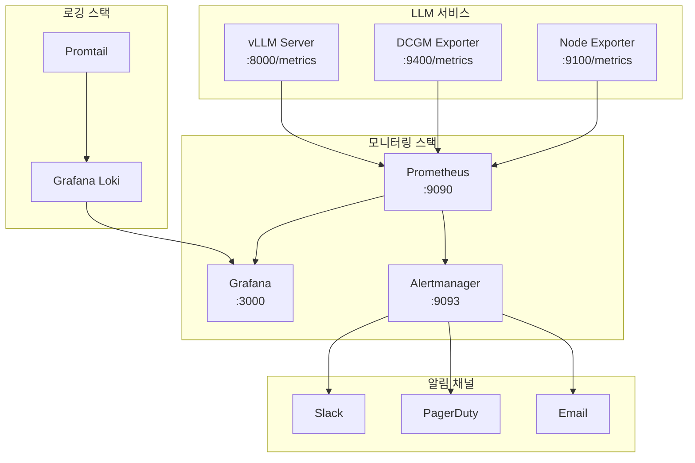

## 소개

시리즈 마지막 회차입니다. 드디어 프로덕션. 솔직히 여기서부터가 **진짜 시작**이에요.

**"만드는 건 20%, 운영이 80%"**라는 말 있잖아요. LLM도 정확히 그렇습니다. POC 때는 jupyter notebook에서 "와 답변 잘 나온다!" 하고 감동받았는데, 프로덕션에 올리는 순간 온갖 문제가 터집니다. 느려요, 죽어요, 메모리가 터져요, 로그가 디스크를 먹어요...

이 회차는 **생존 가이드**입니다. POC는 성공했는데 프로덕션 전환이 고민인 분, "서비스 오픈했는데 새벽마다 전화오는" 상황을 피하고 싶은 분들을 위한 글이에요.

9회차까지 열심히 만든 우리의 LLM 서비스가 프로덕션에서 **살아남을 수 있도록** — Prometheus, Grafana 모니터링부터 장애 대응, 스케일링, Blue-Green 배포까지 실전에서 검증된 내용을 다 담았습니다.

---

## 프로덕션 디플로이 체크리스트

서비스 오픈 전에 이 체크리스트를 한 번 쭉 훑으세요. 빠뜨리면 **새벽 3시에 전화**가 옵니다. 진짜로요.

### Health Check 엔드포인트

```python
# FastAPI 기준 health check 예시
@app.get("/health")
async def health_check():
    """GPU 상태, 모델 로딩 여부, VRAM 사용량까지 확인"""
    try:
        gpu_mem = torch.cuda.memory_allocated() / torch.cuda.max_memory_allocated()
        model_loaded = engine.model is not None
        return {
            "status": "healthy" if model_loaded else "degraded",
            "gpu_memory_usage": f"{gpu_mem:.1%}",
            "model_loaded": model_loaded,
            "uptime_seconds": time.time() - start_time
        }
    except Exception as e:
        return JSONResponse(status_code=503, content={"status": "unhealthy", "error": str(e)})

@app.get("/ready")
async def readiness_check():
    """K8s readinessProbe용 - 모델이 실제로 추론 가능한 상태인지"""
    if not engine.is_ready():
        return JSONResponse(status_code=503, content={"ready": False})
    return {"ready": True}
```

포인트는 `/health`와 `/ready`를 **분리**하는 거예요. 70B 모델은 로딩하는 데만 2~3분 걸리거든요. 그 동안 health는 OK인데 ready는 아직 안 된 상태가 있습니다. K8s에서 이 구분을 안 하면 아직 모델도 안 올라간 Pod한테 트래픽을 보내는 참사가 벌어져요.

### Rate Limiting

```python
# Token bucket 방식 rate limiting
from slowapi import Limiter
from slowapi.util import get_remote_address

limiter = Limiter(key_func=get_remote_address)

@app.post("/v1/chat/completions")
@limiter.limit("10/minute")  # 사용자당 분당 10회
async def chat_completion(request: ChatRequest):
    ...
```

LLM 추론은 비싸요. GPU 한 장에서 동시에 처리할 수 있는 요청이 한정적인데, rate limiting 없이 열어두면 한 사용자가 요청을 수백 개 날려서 다른 사람들을 다 기다리게 만들 수 있습니다. API Key 기반으로 사용자별 quota를 걸고, 전체 시스템에도 글로벌 limit을 거세요.

### 타임아웃 설정

```yaml
# nginx reverse proxy 기준
proxy_read_timeout 120s;    # LLM은 긴 답변 생성 시 60초 이상 걸릴 수 있음
proxy_connect_timeout 10s;
proxy_send_timeout 60s;

# 클라이언트 사이드도 타임아웃 필수
# Python requests 기준
response = requests.post(url, json=payload, timeout=(5, 120))  # (connect, read)
```

기본 타임아웃이 30초인 서비스에서 LLM 요청을 보내면 긴 답변이 중간에 잘립니다. 특히 streaming 응답을 안 쓸 때 이 문제가 심해요. **클라이언트, 리버스 프록시, 로드밸런서** 세 곳 모두 타임아웃을 넉넉하게 잡아야 합니다.

### 에러 핸들링 / Fallback

```python
async def generate_with_fallback(request: ChatRequest):
    try:
        return await primary_model.generate(request)
    except torch.cuda.OutOfMemoryError:
        logger.error("GPU OOM - falling back to smaller model")
        torch.cuda.empty_cache()
        return await fallback_model.generate(request)  # 작은 양자화 모델
    except asyncio.TimeoutError:
        logger.warning("Generation timeout - returning partial or error")
        return {"error": "응답 생성 시간이 초과되었습니다. 질문을 짧게 해주세요."}
    except Exception as e:
        logger.exception(f"Unexpected error: {e}")
        return {"error": "일시적인 오류가 발생했습니다. 잠시 후 다시 시도해주세요."}
```

GPU OOM이 터지면 프로세스 전체가 죽을 수 있습니다. fallback 모델(작은 양자화 모델)을 미리 준비해두면 "완전히 죽는" 상황을 피할 수 있어요.

### GPU 메모리 모니터링

```bash
# nvidia-smi를 주기적으로 실행하는 건 원시적이지만 확실한 방법
watch -n 5 nvidia-smi

# 더 나은 방법: DCGM(Data Center GPU Manager) Exporter
# Prometheus에서 바로 scrape 가능한 GPU 메트릭 제공
docker run -d --gpus all --rm -p 9400:9400 \
  nvcr.io/nvidia/k8s/dcgm-exporter:3.3.5-3.4.0-ubuntu22.04
```

### 로그 로테이션

```yaml
# /etc/logrotate.d/vllm
/var/log/vllm/*.log {
    daily
    rotate 7
    compress
    delaycompress
    missingok
    notifempty
    maxsize 1G
    create 0644 vllm vllm
    postrotate
        systemctl reload vllm || true
    endscript
}
```

이거 안 하면 진짜로 디스크가 가득 찹니다. 요청/응답 전문 로깅하면 하루에 수십 GB가 쌓여요. 로그 로테이션은 **Day 1**부터 설정하세요.

### 자동 재시작

```ini
# /etc/systemd/system/vllm.service
[Unit]
Description=vLLM Inference Server
After=network.target

[Service]
Type=simple
User=vllm
ExecStart=/opt/vllm/venv/bin/python -m vllm.entrypoints.openai.api_server \
    --model /models/llama-3.1-70b-instruct \
    --tensor-parallel-size 2 \
    --max-model-len 8192 \
    --gpu-memory-utilization 0.9
Restart=always
RestartSec=30
# OOM 킬 당했을 때도 자동 재시작
OOMScoreAdjust=-500
# 환경변수
Environment="CUDA_VISIBLE_DEVICES=0,1"
Environment="HF_HOME=/models/cache"

[Install]
WantedBy=multi-user.target
```

`Restart=always`와 `RestartSec=30`이 핵심입니다. LLM 프로세스가 OOM으로 죽든, segfault로 죽든 30초 후에 자동으로 다시 올라옵니다. K8s 환경이면 `restartPolicy: Always`가 기본이라 따로 설정할 필요 없고요.

---

## 핵심 메트릭 상세

모니터링의 핵심은 **"뭘 볼 것인가"**입니다. 다 보면 좋겠지만, 현실적으로 집중해야 할 메트릭을 정리했습니다.

### Latency: p50 / p95 / p99

| 퍼센타일 | 의미 | 왜 중요한가 |
|----------|------|-------------|
| p50 (중앙값) | 절반의 요청이 이 시간 안에 완료 | "보통은 이 정도 걸린다" |
| p95 | 95%의 요청이 이 시간 안에 완료 | "가끔 느린 경우" |
| p99 | 99%의 요청이 이 시간 안에 완료 | **"최악의 경우"** |

**p99가 가장 중요합니다.** 평균 latency가 2초여도, 100명 중 1명이 30초를 기다리면 그 사람이 "이거 느려서 못 쓰겠다"고 소문을 냅니다. GPU 추론은 배치 사이즈에 따라 latency 편차가 극심해요. 동시 요청이 몰리면 큐에서 대기하는 시간이 p99를 확 끌어올립니다.

```python
# vLLM은 /metrics 엔드포인트에서 이미 히스토그램을 제공합니다
# Prometheus에서 p99 계산:
# histogram_quantile(0.99, sum(rate(vllm_request_duration_seconds_bucket[5m])) by (le))
```

실무 기준으로 봤을 때:
- **p50 < 3초**: 사용자가 "빠르다"고 느낌
- **p95 < 8초**: 수용 가능한 수준
- **p99 < 15초**: 이걸 넘으면 사용자 이탈 시작

### Throughput: tokens/sec

모델이 초당 생성하는 토큰 수입니다. 이게 높을수록 동시에 많은 요청을 처리할 수 있어요.

- **vLLM A100 80GB 기준 (70B FP16)**: 약 30~50 tokens/sec per request
- **4bit 양자화 시**: 약 50~80 tokens/sec per request
- **RTX 4090 (7B FP16)**: 약 80~120 tokens/sec per request

throughput이 갑자기 떨어지면 GPU 쓰로틀링(발열), 메모리 부족, 또는 배치 큐가 비정상적으로 큰 경우입니다.

### GPU 사용률 & VRAM

```bash
# nvidia-smi 기본 확인
+-----------------------------------------------+
| GPU  Name           | GPU-Util | Memory-Usage  |
|------|---------------|----------|---------------|
|  0   | NVIDIA A100   |   87%    | 65GB / 80GB   |
|  1   | NVIDIA A100   |   85%    | 64GB / 80GB   |
+-----------------------------------------------+
```

| 메트릭 | 정상 범위 | 경고 기준 | 조치 |
|--------|----------|----------|------|
| GPU 사용률 | 60~85% | > 95% 5분 지속 | 스케일 아웃 검토 |
| VRAM 사용량 | < 85% | > 90% | 모델 양자화 또는 GPU 추가 |
| GPU 온도 | < 80°C | > 85°C | 쿨링 점검, 쓰로틀링 확인 |
| GPU 전력 | 정격의 70~90% | 정격 근접 | 전력 제한 설정 검토 |

### Queue Depth

요청 대기열 깊이입니다. vLLM의 continuous batching 덕분에 어느 정도는 감당하지만, 큐가 쌓이기 시작하면 latency가 급등해요.

- **정상**: 큐 depth < 10
- **경고**: 큐 depth 10~50 (latency 증가 시작)
- **위험**: 큐 depth > 50 (타임아웃 폭주 시작)

### Error Rate

전체 요청 대비 에러 응답(5xx) 비율입니다.

- **정상**: < 0.1%
- **경고**: 0.1% ~ 1%
- **위험**: > 1% (즉시 조치 필요)

에러의 종류도 구분해서 봐야 해요. OOM 에러, 타임아웃, 모델 로딩 실패 — 각각 원인과 대응이 다릅니다.

---

## Prometheus + Grafana 모니터링 스택

LLM 서비스 모니터링의 **표준 구성**입니다. 이거 한 번 제대로 셋업해두면 새벽에 잠을 잘 수 있어요.

### 전체 아키텍처



### vLLM 메트릭 엔드포인트

vLLM은 기본으로 Prometheus 형식의 메트릭을 `/metrics`에서 제공합니다. 별도 설정 없이 바로 사용 가능해요.

```bash
# vLLM 서버 시작 시 메트릭은 자동 활성화
python -m vllm.entrypoints.openai.api_server \
    --model /models/llama-3.1-70b-instruct \
    --tensor-parallel-size 2 \
    --port 8000

# 메트릭 확인
curl http://localhost:8000/metrics | head -20
# HELP vllm:num_requests_running Number of requests currently running
# TYPE vllm:num_requests_running gauge
# vllm:num_requests_running 3
# HELP vllm:num_requests_waiting Number of requests waiting
# TYPE vllm:num_requests_waiting gauge
# vllm:num_requests_waiting 0
# HELP vllm:gpu_cache_usage_perc GPU KV-cache usage percent
# TYPE vllm:gpu_cache_usage_perc gauge
# vllm:gpu_cache_usage_perc 0.42
```

주요 vLLM 메트릭:

| 메트릭 | 설명 |
|--------|------|
| `vllm:num_requests_running` | 현재 처리 중인 요청 수 |
| `vllm:num_requests_waiting` | 대기 중인 요청 수 |
| `vllm:gpu_cache_usage_perc` | KV Cache GPU 사용률 |
| `vllm:num_preemptions_total` | 선점(preemption) 발생 횟수 |
| `vllm:request_success_total` | 성공한 요청 수 (누적) |
| `vllm:request_duration_seconds` | 요청 처리 시간 히스토그램 |

### Prometheus 설정

```yaml
# /etc/prometheus/prometheus.yml
global:
  scrape_interval: 15s
  evaluation_interval: 15s

rule_files:
  - "alert_rules.yml"

alerting:
  alertmanagers:
    - static_configs:
        - targets: ['alertmanager:9093']

scrape_configs:
  # vLLM 서버 메트릭
  - job_name: 'vllm'
    metrics_path: '/metrics'
    scrape_interval: 10s  # LLM 메트릭은 좀 더 자주 수집
    static_configs:
      - targets: ['vllm-server-01:8000', 'vllm-server-02:8000']
        labels:
          env: 'production'
          service: 'llm-inference'

  # DCGM GPU 메트릭
  - job_name: 'dcgm-exporter'
    scrape_interval: 10s
    static_configs:
      - targets: ['gpu-node-01:9400', 'gpu-node-02:9400']

  # Node Exporter (CPU, 메모리, 디스크)
  - job_name: 'node-exporter'
    static_configs:
      - targets: ['gpu-node-01:9100', 'gpu-node-02:9100']
```

### Alert Rules

```yaml
# /etc/prometheus/alert_rules.yml
groups:
  - name: llm_alerts
    rules:
      # GPU 메모리 90% 이상 5분 지속
      - alert: GPUMemoryHigh
        expr: DCGM_FI_DEV_FB_USED / DCGM_FI_DEV_FB_FREE > 0.9
        for: 5m
        labels:
          severity: warning
        annotations:
          summary: "GPU {{ $labels.gpu }} 메모리 사용률 90% 초과"
          description: "GPU 메모리가 {{ $value | humanizePercentage }} 사용 중입니다. OOM 위험."

      # p99 latency 15초 초과
      - alert: HighP99Latency
        expr: histogram_quantile(0.99, sum(rate(vllm_request_duration_seconds_bucket[5m])) by (le)) > 15
        for: 3m
        labels:
          severity: critical
        annotations:
          summary: "LLM p99 latency가 15초를 초과했습니다"
          description: "현재 p99: {{ $value }}초. 스케일링 또는 트래픽 제한 필요."

      # 에러율 1% 초과
      - alert: HighErrorRate
        expr: rate(vllm_request_failure_total[5m]) / rate(vllm_request_success_total[5m]) > 0.01
        for: 2m
        labels:
          severity: critical
        annotations:
          summary: "LLM 에러율이 1%를 초과했습니다"

      # 대기 큐 50 초과
      - alert: HighQueueDepth
        expr: vllm_num_requests_waiting > 50
        for: 1m
        labels:
          severity: warning
        annotations:
          summary: "LLM 요청 대기 큐가 {{ $value }}개입니다"

      # GPU 온도 85도 초과
      - alert: GPUTemperatureHigh
        expr: DCGM_FI_DEV_GPU_TEMP > 85
        for: 5m
        labels:
          severity: warning
        annotations:
          summary: "GPU 온도가 {{ $value }}°C입니다. 쓰로틀링 위험."

      # vLLM 프로세스 다운
      - alert: VLLMDown
        expr: up{job="vllm"} == 0
        for: 30s
        labels:
          severity: critical
        annotations:
          summary: "vLLM 서버가 응답하지 않습니다!"
```

### Grafana 대시보드 핵심 패널

Grafana 대시보드를 새로 만들 때 다음 패널들을 꼭 넣으세요:

| 패널 | 쿼리 (PromQL) | 시각화 |
|------|---------------|--------|
| Request Rate | `rate(vllm_request_success_total[5m])` | Stat (큰 숫자) |
| p50/p95/p99 Latency | `histogram_quantile(0.5/0.95/0.99, ...)` | Time Series (3줄 겹치기) |
| GPU Memory | `DCGM_FI_DEV_FB_USED` | Gauge (%) |
| GPU Utilization | `DCGM_FI_DEV_GPU_UTIL` | Gauge (%) |
| Queue Depth | `vllm_num_requests_waiting` | Time Series |
| KV Cache Usage | `vllm_gpu_cache_usage_perc` | Gauge (%) |
| Error Rate | `rate(vllm_request_failure_total[5m])` | Stat (%) |
| Tokens/sec | `rate(vllm_generation_tokens_total[5m])` | Time Series |

Grafana 대시보드 JSON은 한 번 만들어두면 팀 전체가 공유할 수 있으니, Git에 커밋해두는 걸 추천합니다.

---

## 로깅 전략

모니터링이 "지금 상태"를 보여준다면, 로그는 "무슨 일이 있었는지"를 알려줍니다. 둘 다 필수예요.

### 뭘 로깅할 것인가

```python
import structlog
import time
import uuid

logger = structlog.get_logger()

async def handle_request(request: ChatRequest):
    request_id = str(uuid.uuid4())
    start_time = time.time()

    logger.info("request_received",
        request_id=request_id,
        user_id=request.user_id,
        model=request.model,
        input_tokens=count_tokens(request.messages),  # 입력 토큰 수
        max_tokens=request.max_tokens,
    )

    try:
        response = await engine.generate(request)
        duration = time.time() - start_time

        logger.info("request_completed",
            request_id=request_id,
            duration_seconds=round(duration, 3),
            output_tokens=response.usage.completion_tokens,
            total_tokens=response.usage.total_tokens,
            finish_reason=response.choices[0].finish_reason,
        )
        return response

    except Exception as e:
        duration = time.time() - start_time
        logger.error("request_failed",
            request_id=request_id,
            duration_seconds=round(duration, 3),
            error_type=type(e).__name__,
            error_message=str(e),
        )
        raise
```

핵심 원칙:

1. **구조화된 로그(structured logging)**: JSON 형태로 남겨야 나중에 검색/분석이 됩니다. `print()`로 찍으면 나중에 grep 지옥에 빠져요.
2. **request_id로 추적**: 하나의 요청이 여러 컴포넌트를 거치더라도 request_id로 전체 경로를 추적할 수 있어야 합니다.
3. **요청/응답 전문은 조심해서**: 전문을 다 저장하면 하루에 수십 GB가 쌓입니다. 에러 시에만 전문 저장하거나, 샘플링하세요.

### 샘플링 전략 (로그 폭발 방지)

```python
import random

SAMPLE_RATE = 0.1  # 정상 요청은 10%만 전문 로깅

def should_log_full(response_status: str) -> bool:
    """에러는 항상 전문 로깅, 정상은 샘플링"""
    if response_status == "error":
        return True  # 에러는 무조건 전문 기록
    if response_status == "slow":
        return True  # 느린 요청도 전문 기록
    return random.random() < SAMPLE_RATE  # 나머지는 10% 샘플링
```

실무 팁:
- **에러 로그**: 100% 저장 (에러는 전부 봐야 함)
- **느린 쿼리 (p95 초과)**: 100% 저장
- **정상 요청**: 1~10% 샘플링
- **요청/응답 전문**: 에러일 때만 전문 저장, 나머지는 메타데이터만

### Grafana Loki 설정

ELK Stack도 좋지만, 이미 Grafana를 쓰고 있다면 **Loki + Promtail** 조합이 훨씬 가볍고 셋업이 간단합니다.

```yaml
# docker-compose.yml - Loki 스택
services:
  loki:
    image: grafana/loki:2.9.0
    ports:
      - "3100:3100"
    volumes:
      - ./loki-config.yaml:/etc/loki/local-config.yaml
      - loki-data:/loki
    command: -config.file=/etc/loki/local-config.yaml

  promtail:
    image: grafana/promtail:2.9.0
    volumes:
      - /var/log/vllm:/var/log/vllm:ro
      - ./promtail-config.yaml:/etc/promtail/config.yaml
    command: -config.file=/etc/promtail/config.yaml

volumes:
  loki-data:
```

```yaml
# promtail-config.yaml
server:
  http_listen_port: 9080

positions:
  filename: /tmp/positions.yaml

clients:
  - url: http://loki:3100/loki/api/v1/push

scrape_configs:
  - job_name: vllm
    static_configs:
      - targets: [localhost]
        labels:
          job: vllm
          env: production
          __path__: /var/log/vllm/*.log
    pipeline_stages:
      - json:
          expressions:
            level: level
            request_id: request_id
            duration: duration_seconds
      - labels:
          level:
      - timestamp:
          source: timestamp
          format: RFC3339
```

Grafana에서 Loki를 데이터소스로 추가하면 로그도 같은 대시보드에서 볼 수 있어요. 메트릭에서 이상 징후를 발견하면 같은 시간대의 로그를 바로 확인하는 워크플로우가 됩니다.

---

## 알림 설정

모니터링 대시보드를 24시간 쳐다볼 수는 없으니, 알림을 잘 설정해야 합니다. 근데 알림을 잘못 설정하면 **alert fatigue** — 알림이 너무 많아서 다 무시하게 되는 현상이 발생해요.

### Alertmanager 설정

```yaml
# /etc/alertmanager/alertmanager.yml
global:
  resolve_timeout: 5m

route:
  group_by: ['alertname', 'severity']
  group_wait: 30s
  group_interval: 5m
  repeat_interval: 4h  # 같은 알림은 4시간마다 반복
  receiver: 'slack-default'

  routes:
    # Critical은 PagerDuty + Slack
    - match:
        severity: critical
      receiver: 'pagerduty-critical'
      repeat_interval: 30m  # critical은 30분마다 반복

    # Warning은 Slack만
    - match:
        severity: warning
      receiver: 'slack-warning'
      repeat_interval: 2h

receivers:
  - name: 'slack-default'
    slack_configs:
      - api_url: 'https://hooks.slack.com/services/YOUR/WEBHOOK/URL'
        channel: '#llm-alerts'
        title: '{{ .GroupLabels.alertname }}'
        text: '{{ range .Alerts }}{{ .Annotations.summary }}{{ end }}'

  - name: 'slack-warning'
    slack_configs:
      - api_url: 'https://hooks.slack.com/services/YOUR/WEBHOOK/URL'
        channel: '#llm-alerts'
        title: ':warning: {{ .GroupLabels.alertname }}'
        text: '{{ range .Alerts }}{{ .Annotations.description }}{{ end }}'

  - name: 'pagerduty-critical'
    pagerduty_configs:
      - service_key: 'YOUR_PAGERDUTY_SERVICE_KEY'
        severity: 'critical'
    slack_configs:
      - api_url: 'https://hooks.slack.com/services/YOUR/WEBHOOK/URL'
        channel: '#llm-alerts-critical'
        title: ':rotating_light: CRITICAL: {{ .GroupLabels.alertname }}'
```

### 알림 등급 기준

| 등급 | 기준 | 채널 | 대응 시간 |
|------|------|------|----------|
| **Critical** | 서비스 다운, 에러율 > 5% | PagerDuty + Slack | 15분 이내 |
| **Warning** | p99 > 15초, GPU > 95%, 큐 > 50 | Slack | 1시간 이내 |
| **Info** | 디스크 70%, 일일 사용량 리포트 | Slack (별도 채널) | 업무 시간 내 |

### On-call 운영 팁

- **on-call 로테이션**은 1주일 단위가 적당합니다. 2주는 너무 길어서 번아웃 옴
- **runbook**을 반드시 만들어두세요. 새벽 3시에 머리가 안 돌아갈 때 따라할 수 있는 체크리스트
- critical 알림이 오면 **먼저 서비스 상태 확인 → 원인 파악은 나중에**. "일단 살려놓고 포렌식은 나중에" 원칙
- alert fatigue 방지: warning 알림이 하루 10개 이상 오면 임계치를 조정하세요. 무시하게 되면 진짜 문제를 놓칩니다

---

## 모델 업데이트 전략

새 모델이 나왔거나, 파인튜닝한 모델을 배포해야 할 때. **무중단 배포**가 가능해야 합니다. 서비스를 내리고 모델 바꾸고 다시 올리는 건 30분짜리 장애예요.

### Blue-Green 배포

```bash
#!/bin/bash
# blue-green-deploy.sh

CURRENT_ENV=$(cat /var/run/llm-active-env)  # "blue" or "green"
NEW_ENV=$([[ "$CURRENT_ENV" == "blue" ]] && echo "green" || echo "blue")

echo "=== Blue-Green Deploy: $CURRENT_ENV -> $NEW_ENV ==="

# 1. 새 환경에 모델 로딩
echo "[1/5] Loading new model on $NEW_ENV..."
docker compose -f docker-compose-${NEW_ENV}.yml up -d
sleep 10

# 2. 헬스체크 대기 (모델 로딩에 2~5분)
echo "[2/5] Waiting for model to load..."
for i in $(seq 1 60); do
    if curl -sf http://llm-${NEW_ENV}:8000/ready > /dev/null; then
        echo "  Model ready after ${i}0 seconds"
        break
    fi
    sleep 10
done

# 3. Regression test 실행
echo "[3/5] Running regression tests..."
python /opt/scripts/regression_test.py --endpoint http://llm-${NEW_ENV}:8000
if [ $? -ne 0 ]; then
    echo "REGRESSION TEST FAILED! Aborting deployment."
    docker compose -f docker-compose-${NEW_ENV}.yml down
    exit 1
fi

# 4. 트래픽 전환 (nginx upstream 변경)
echo "[4/5] Switching traffic to $NEW_ENV..."
sed -i "s/llm-${CURRENT_ENV}/llm-${NEW_ENV}/g" /etc/nginx/conf.d/llm-upstream.conf
nginx -s reload

# 5. 이전 환경 정리 (바로 내리지 말고 30분 대기 - 롤백 대비)
echo "[5/5] Previous environment ($CURRENT_ENV) will be stopped in 30 minutes..."
echo "$NEW_ENV" > /var/run/llm-active-env
(sleep 1800 && docker compose -f docker-compose-${CURRENT_ENV}.yml down) &

echo "=== Deploy complete! Active: $NEW_ENV ==="
```

포인트: 이전 환경을 **바로 안 내립니다**. 30분 정도 유지해서, 문제 발견 시 트래픽만 다시 돌리면 10초 만에 롤백이 가능하도록요.

### Canary 배포

```nginx
# nginx canary 설정 - 10% 트래픽만 새 모델로
upstream llm_backend {
    server llm-stable:8000 weight=9;    # 90% 기존 모델
    server llm-canary:8000 weight=1;    # 10% 새 모델
}

# 특정 헤더가 있으면 canary로 고정 (테스트용)
map $http_x_canary $backend {
    "true"  llm-canary:8000;
    default llm_backend;
}
```

Canary 배포 순서:
1. 새 모델을 canary 인스턴스에 올림
2. 10% 트래픽 전환
3. **30분~1시간 모니터링** (latency, error rate, 답변 품질)
4. 이상 없으면 50% → 100% 순차적으로 올림
5. 문제 발견 시 즉시 0%로 원복

### Regression Test Suite

모델 바꿀 때마다 기존에 잘 되던 답변이 안 되는지 확인하는 테스트입니다. 이거 없으면 **배포할 때마다 도박**하는 거예요.

```python
# regression_test.py
import requests
import json

TEST_CASES = [
    {
        "name": "기본 인사",
        "input": "안녕하세요",
        "must_contain": ["안녕", "도움"],
        "must_not_contain": ["error", "오류"],
        "max_latency_sec": 5,
    },
    {
        "name": "사내 문서 검색 (RAG)",
        "input": "연차 신청 절차가 어떻게 되나요?",
        "must_contain": ["신청", "승인"],
        "max_latency_sec": 10,
    },
    {
        "name": "JSON 포맷 응답",
        "input": "다음 문장의 감성을 분석해주세요: '이 제품 정말 좋아요'",
        "must_contain": ["긍정"],
        "max_latency_sec": 8,
    },
    {
        "name": "긴 컨텍스트 처리",
        "input": "다음 긴 문서를 요약해주세요: " + "..." * 1000,  # 긴 입력
        "must_contain": [],
        "must_not_contain": ["error"],
        "max_latency_sec": 30,
    },
]

def run_regression(endpoint: str) -> bool:
    passed = 0
    failed = 0

    for test in TEST_CASES:
        try:
            resp = requests.post(
                f"{endpoint}/v1/chat/completions",
                json={"model": "default", "messages": [{"role": "user", "content": test["input"]}]},
                timeout=test["max_latency_sec"]
            )
            resp.raise_for_status()
            answer = resp.json()["choices"][0]["message"]["content"]

            # 필수 포함 키워드 확인
            for keyword in test.get("must_contain", []):
                assert keyword in answer, f"Missing keyword: {keyword}"

            # 금지 키워드 확인
            for keyword in test.get("must_not_contain", []):
                assert keyword not in answer, f"Forbidden keyword found: {keyword}"

            print(f"  PASS: {test['name']}")
            passed += 1
        except Exception as e:
            print(f"  FAIL: {test['name']} - {e}")
            failed += 1

    print(f"\nResults: {passed} passed, {failed} failed")
    return failed == 0
```

---

## 스케일링

사용자가 늘어나면 GPU를 더 붙여야 합니다. 스케일링에는 크게 세 단계가 있어요.

### 단일 GPU → 멀티 GPU (Tensor Parallelism)

하나의 모델을 여러 GPU에 나눠 올리는 겁니다. 70B 모델은 A100 한 장에 안 들어가니까 2장 이상 필요하고요.

```bash
# vLLM tensor parallelism
python -m vllm.entrypoints.openai.api_server \
    --model /models/llama-3.1-70b-instruct \
    --tensor-parallel-size 4 \    # GPU 4장에 모델 분산
    --max-model-len 8192 \
    --gpu-memory-utilization 0.9
```

- GPU 간 통신이 **NVLink**로 연결되어 있어야 성능이 좋습니다. PCIe 연결이면 병목 발생
- RTX 4090은 NVLink을 지원 안 해요. 데이터센터용 GPU(A100, H100, L40S)만 가능

### 멀티 GPU → 멀티 노드 (Pipeline Parallelism)

여러 서버에 걸쳐 모델을 분산하는 겁니다. 405B 같은 초대형 모델에 필요해요.

```bash
# Ray 기반 멀티 노드 추론
# 노드 1 (head)
ray start --head --port=6379

# 노드 2 (worker)
ray start --address='node1:6379'

# vLLM 멀티 노드 실행
python -m vllm.entrypoints.openai.api_server \
    --model /models/llama-3.1-405b \
    --tensor-parallel-size 4 \
    --pipeline-parallel-size 2 \  # 2개 노드에 파이프라인 분산
    --max-model-len 4096
```

### 수평 스케일링 (같은 모델 여러 인스턴스)

모델은 한 장(또는 소수)의 GPU에 올라가는데, 트래픽이 많으면 **같은 모델을 여러 인스턴스로 복제**해서 로드밸런서 뒤에 두는 방식입니다. 대부분의 경우 이게 제일 실용적이에요.

```nginx
# nginx 로드밸런서
upstream llm_cluster {
    least_conn;  # 연결 수 기준 분산 (LLM은 처리 시간이 길어서 round_robin보다 나음)
    server llm-instance-01:8000;
    server llm-instance-02:8000;
    server llm-instance-03:8000;
}
```

### Kubernetes 오토스케일링

```yaml
# HPA (Horizontal Pod Autoscaler) 설정
apiVersion: autoscaling/v2
kind: HorizontalPodAutoscaler
metadata:
  name: vllm-hpa
spec:
  scaleTargetRef:
    apiVersion: apps/v1
    kind: Deployment
    name: vllm-deployment
  minReplicas: 2
  maxReplicas: 8
  metrics:
    # 커스텀 메트릭: 큐 대기 요청 수 기반
    - type: Pods
      pods:
        metric:
          name: vllm_requests_waiting
        target:
          type: AverageValue
          averageValue: "10"  # Pod당 대기 요청이 10개 넘으면 스케일 아웃
```

주의: LLM Pod는 **스케일 아웃에 시간이 오래 걸립니다**. 모델 로딩에 2~5분이 필요하니까, 트래픽 급증을 예측해서 **미리** 스케일 아웃해야 해요. 피크 타임 30분 전에 미리 올려놓는 CronJob도 고려해보세요.

---

## Kubernetes GPU 운영

K8s에서 GPU를 쓰는 건 CPU만 쓸 때보다 **훨씬 까다롭습니다**. 알아야 할 것들을 정리했어요.

### GPU 리소스 요청

```yaml
# vLLM Deployment
apiVersion: apps/v1
kind: Deployment
metadata:
  name: vllm-deployment
spec:
  replicas: 2
  selector:
    matchLabels:
      app: vllm
  template:
    metadata:
      labels:
        app: vllm
    spec:
      containers:
        - name: vllm
          image: vllm/vllm-openai:latest
          command: ["python", "-m", "vllm.entrypoints.openai.api_server"]
          args:
            - "--model=/models/llama-3.1-70b-instruct"
            - "--tensor-parallel-size=2"
            - "--max-model-len=8192"
            - "--gpu-memory-utilization=0.9"
          resources:
            limits:
              nvidia.com/gpu: 2          # GPU 2장 요청
              memory: "64Gi"
              cpu: "16"
            requests:
              nvidia.com/gpu: 2
              memory: "32Gi"
              cpu: "8"
          volumeMounts:
            - name: model-storage
              mountPath: /models
          ports:
            - containerPort: 8000
          livenessProbe:
            httpGet:
              path: /health
              port: 8000
            initialDelaySeconds: 300  # 모델 로딩 시간 감안
            periodSeconds: 30
          readinessProbe:
            httpGet:
              path: /ready
              port: 8000
            initialDelaySeconds: 60
            periodSeconds: 10
      volumes:
        - name: model-storage
          persistentVolumeClaim:
            claimName: model-pvc
      # GPU 노드에만 스케줄링
      nodeSelector:
        nvidia.com/gpu.present: "true"
      tolerations:
        - key: "nvidia.com/gpu"
          operator: "Exists"
          effect: "NoSchedule"
```

### 흔한 K8s + GPU 함정들

**함정 1: `nvidia.com/gpu` 리소스 안 적으면 GPU 없이 Pod가 뜸**

```yaml
# 이렇게 하면 CPU만 쓰는 Pod가 뜹니다 (아무 에러도 안 남!)
resources:
  limits:
    memory: "64Gi"
    # nvidia.com/gpu를 빼먹음...
```

Pod가 뜨긴 하는데 GPU가 할당 안 되어서 `torch.cuda.is_available()`이 False. 모델 로딩에서 "CUDA not available" 에러가 나는데 왜 그런지 한참 헤맵니다.

**함정 2: GPU는 정수만 됨 (분할 불가)**

```yaml
# 이건 안 됩니다
nvidia.com/gpu: 0.5  # GPU 반 장? 안 돼요

# MIG(Multi-Instance GPU)를 쓰면 가능하지만 A100에서만 지원
nvidia.com/mig-1g.5gb: 1  # A100을 7개 인스턴스로 분할
```

**함정 3: liveness/readiness probe initialDelaySeconds**

70B 모델은 로딩에 3~5분 걸립니다. `initialDelaySeconds`를 30초로 해두면 모델이 다 안 올라왔는데 K8s가 "이 Pod 죽었네" 하고 재시작을 반복하는 **CrashLoopBackOff** 지옥에 빠져요.

**함정 4: Pod Priority**

GPU Pod는 비싼 리소스를 쓰므로, priority class를 높게 설정해서 다른 Pod에 밀리지 않게 하세요.

```yaml
apiVersion: scheduling.k8s.io/v1
kind: PriorityClass
metadata:
  name: gpu-high-priority
value: 1000000
globalDefault: false
description: "GPU 워크로드용 높은 우선순위"
---
# Deployment에서
spec:
  template:
    spec:
      priorityClassName: gpu-high-priority
```

---

## 장애 대응 플레이북

새벽 3시에 알림이 왔을 때, 머리가 안 돌아가더라도 따라할 수 있는 플레이북입니다.

### GPU OOM (Out of Memory)

```
증상: vLLM 프로세스 크래시, "CUDA out of memory" 로그
원인: 긴 프롬프트, 동시 요청 폭증, 메모리 릭

[즉시 대응]
1. 서비스 자동 재시작 확인 (systemd/K8s가 해줄 것)
2. nvidia-smi로 GPU 메모리 상태 확인
3. 남은 좀비 프로세스 확인: fuser -v /dev/nvidia*
4. 있으면 kill: kill -9 <PID>

[근본 조치]
1. --max-model-len 줄이기 (8192 → 4096)
2. --gpu-memory-utilization 줄이기 (0.95 → 0.85)
3. rate limiting 강화
4. 주기적 재시작 설정 (cron으로 새벽에 1회)
```

### 모델 로딩 실패

```
증상: Pod가 Running이지만 /ready가 503, "Failed to load model" 로그
원인: 모델 파일 손상, 디스크 공간 부족, CUDA 호환 문제

[즉시 대응]
1. kubectl logs <pod> 로 에러 메시지 확인
2. 디스크 공간: df -h /models
3. 모델 파일 무결성: md5sum 확인

[롤백]
1. 이전 모델 경로로 Deployment 환경변수 변경
2. kubectl rollout undo deployment/vllm-deployment
3. 새 모델 파일 다시 다운로드 / 검증
```

### High Latency

```
증상: p99 > 15초, Slack 알림 폭주
원인: 동시 요청 증가, GPU 쓰로틀링, 배치 큐 과부하

[즉시 대응]
1. Grafana에서 동시 요청 수, 큐 depth 확인
2. GPU 온도/사용률 확인 (쓰로틀링 여부)
3. 최근 배포 변경 이력 확인

[조치]
1. 트래픽 급증 → rate limiting 강화 또는 스케일 아웃
2. GPU 쓰로틀링 → 서버실 에어컨 확인 (진지하게)
3. 배치 큐 → vLLM max_num_batched_tokens 조정
4. 급한 불 끄기 → 일부 트래픽을 fallback 모델로 우회
```

### 전체 서비스 다운

```
증상: 모든 Health check 실패, 사용자 "안 돼요" 문의 폭주
원인: 서버 자체 장애, 네트워크, GPU 드라이버 크래시

[즉시 대응 - 5분 이내]
1. 서버 접속 가능? SSH 확인
2. GPU 상태: nvidia-smi (응답 안 하면 드라이버 문제)
3. Docker/K8s 상태: docker ps / kubectl get pods
4. 네트워크: 로드밸런서 → 서버 간 통신 확인

[드라이버 크래시 시]
1. sudo nvidia-smi -r  # GPU 리셋 시도
2. 안 되면: sudo rmmod nvidia_uvm nvidia && sudo modprobe nvidia
3. 그래도 안 되면: 서버 재부팅 (마지막 수단)

[스테이크홀더 커뮤니케이션]
1. 장애 인지 5분 내 Slack 공지: "LLM 서비스 장애 인지, 조치 중"
2. 30분 단위 업데이트
3. 복구 후 간단 RCA (Root Cause Analysis)
```

---

## SLA 설정

사용자가 늘어나면 **"이거 얼마나 안정적이에요?"** 라는 질문을 반드시 받습니다. SLA를 미리 정해두면 기대치 관리가 됩니다.

### 가용성 목표

| 등급 | 가용성 | 월간 허용 다운타임 | 적합한 경우 |
|------|--------|-------------------|-------------|
| Tier 1 | 99.9% | 43분 | 내부 서비스, 업무 보조 |
| Tier 2 | 99.5% | 3.6시간 | 실험적 서비스, 초기 프로덕션 |
| Tier 3 | 99.0% | 7.3시간 | POC, 비핵심 서비스 |

솔직히 온프레미스 LLM은 **Tier 2 (99.5%)에서 시작**하는 게 현실적입니다. 99.9%를 약속하려면 이중화, 자동 failover, 24/7 on-call까지 필요한데, GPU 서버 이중화 비용이 만만치 않아요.

### Latency SLO

```
SLO 예시:
- p50 latency < 3초  (전체 요청의 50%가 3초 이내)
- p95 latency < 10초
- p99 latency < 20초
- 월간 SLO 달성률 > 99.5%
```

### Error Budget

SLO를 100% 달성할 필요는 없습니다. **Error Budget** 개념을 도입하세요.

- SLO 99.5% → Error budget 0.5%
- 한 달에 0.5%까지는 SLO를 위반해도 OK
- Error budget이 남아있으면 → 새 기능 배포, 모델 업데이트 진행
- Error budget 다 써버리면 → 기능 배포 중단, 안정화에 집중

이렇게 하면 "빠르게 배포하자" vs "안정적으로 가자" 논쟁을 **데이터 기반으로** 할 수 있습니다.

### 스테이크홀더 커뮤니케이션

```markdown
# 월간 SLA 리포트 템플릿

## LLM 서비스 월간 운영 리포트 - 2026년 2월

### 가용성
- 목표: 99.5% | 실제: 99.72% | ✅ 달성
- 총 다운타임: 2시간 3분 (계획 유지보수 1시간 30분 + 비계획 33분)

### 성능
- p50 latency: 1.8초 (목표 < 3초) ✅
- p95 latency: 6.2초 (목표 < 10초) ✅
- p99 latency: 14.7초 (목표 < 20초) ✅

### 사용량
- 총 요청: 287,432건 (전월 대비 +23%)
- 일평균 사용자: 342명
- 피크 시간대: 평일 14:00-16:00

### 장애 이력
- 2/7 09:23 GPU OOM (복구 18분) - max_model_len 조정으로 재발 방지
- 2/15 14:05 네트워크 순단 (복구 15분) - 스위치 펌웨어 업데이트

### 다음 달 계획
- 모델 업그레이드 (llama 3.1 → 3.2) - Blue-Green 배포 예정
- GPU 1장 추가 도입 (피크 트래픽 대응)
```

이런 리포트를 매월 보내면 경영진이 **"아 이 사람들이 잘 관리하고 있구나"** 라고 신뢰합니다. 그리고 GPU 추가 구매 요청할 때 데이터가 있으니 설득력이 생겨요.

---

## 비용 최적화

온프레미스라고 공짜가 아닙니다. GPU 서버 전기세, 쿨링 비용, 인건비... 최적화할 수 있는 부분을 찾아야 해요.

### GPU 사용률 모니터링

```python
# GPU 활용도 리포트 생성 스크립트
import subprocess
import json
from datetime import datetime

def get_gpu_utilization():
    result = subprocess.run(
        ['nvidia-smi', '--query-gpu=utilization.gpu,utilization.memory,power.draw,power.limit',
         '--format=csv,noheader,nounits'],
        capture_output=True, text=True
    )
    gpus = []
    for line in result.stdout.strip().split('\n'):
        gpu_util, mem_util, power_draw, power_limit = line.split(', ')
        gpus.append({
            'gpu_util': float(gpu_util),
            'mem_util': float(mem_util),
            'power_draw': float(power_draw),
            'power_limit': float(power_limit),
            'power_efficiency': float(gpu_util) / float(power_draw) if float(power_draw) > 0 else 0,
        })
    return gpus

# 업무 시간 외 GPU 사용률이 5% 미만이면 → 해당 시간대에는 서버 절전 가능
```

### Right-sizing 전략

| 상황 | 증상 | 조치 |
|------|------|------|
| GPU 과잉 | 평균 사용률 < 30% | GPU 수 줄이기 or 더 작은 GPU로 교체 |
| 모델 과잉 | 70B인데 7B로도 충분한 quality | 작은 모델로 전환 (비용 10배 절감) |
| 시간대별 편차 | 업무 시간만 바쁨 | 야간에 인스턴스 줄이기, 배치 작업 활용 |
| 긴 컨텍스트 낭비 | max_model_len=32K인데 평균 2K 사용 | max_model_len 줄여서 VRAM 절약 |

### 전력 관리

A100 한 장이 최대 400W를 먹습니다. 4장이면 1.6kW, 거기에 CPU, 쿨링까지 하면 서버 한 대가 3~4kW. 전기세 무시 못 해요.

```bash
# GPU 전력 제한 설정 (300W → 250W로 제한하면 성능 10% 감소, 전력 17% 절감)
sudo nvidia-smi -pl 250  # Power Limit을 250W로 설정

# 야간에 자동으로 전력 제한
# /etc/cron.d/gpu-power
0 22 * * * root nvidia-smi -pl 200   # 22시에 200W로 제한
0 8  * * * root nvidia-smi -pl 300   # 08시에 300W로 복구
```

---

## 실무에서 겪는 현실 (삽질 포인트)

9회차 분량의 시리즈를 거치면서 쌓인 삽질 경험을 총정리합니다. 여기 나오는 건 전부 **실제로 겪은 것들**이에요.

### GPU 메모리 릭

vLLM을 장시간 운영하면 GPU 메모리가 조금씩 새는 현상이 있습니다. `nvidia-smi`에서 VRAM 사용량이 점진적으로 올라가다가, 결국 OOM으로 크래시. CUDA 레벨의 메모리 단편화가 원인인 경우가 많아요.

**해결**: 주기적 재시작이 가장 현실적. 새벽 4시에 cron으로 graceful restart 걸어두세요. 우아하지는 않지만 효과적입니다.

```bash
# /etc/cron.d/vllm-restart
0 4 * * * root systemctl restart vllm  # 매일 새벽 4시 재시작
```

### 큐 플러딩

내부 서비스에서 LLM API를 루프 돌리면서 수백 건을 한꺼번에 쏘는 경우가 있습니다. 개발자가 "배치 처리 스크립트"를 돌린 건데, rate limiting 없으면 다른 사용자가 다 기다려야 해요.

**해결**: API Key별 rate limiting + 배치 요청용 별도 큐. 배치 작업은 낮은 우선순위로 처리되도록 설계.

### 로그 폭발

요청/응답 전문을 다 로깅했더니 하루에 50GB가 쌓인 적이 있습니다. 디스크가 가득 차서 서비스가 죽었어요. logrotate를 걸어뒀는데 `maxsize` 설정을 안 해서 하루 안에 디스크를 다 먹은 거예요.

**해결**: 정상 요청은 메타데이터만 로깅 + 10% 샘플링. 에러만 전문 로깅. logrotate에 `maxsize 1G` 필수.

### K8s GPU 스케줄링 지옥

GPU Node가 3대 있는데, 특정 모델이 GPU 2장을 요구해서 2장짜리 노드에만 스케줄링 되어야 하는 상황. 근데 4장짜리 노드의 GPU 2장이 이미 다른 Pod한테 잡혀있고, 2장짜리 노드는 다른 Pod가 1장 쓰고 있어서... Pod가 **Pending 상태에서 영원히 안 뜸**.

**해결**: 노드별 GPU topology를 이해하고, node affinity와 resource quota를 세밀하게 설정. GPU Pod의 priority class를 높게 설정해서 덜 중요한 Pod를 evict할 수 있게.

### 사용자 기대치 폭주

처음에 "실험적 서비스입니다"라고 했는데, 3개월 지나니까 사용자들이 "왜 이거 안 돼요? 업무에 필수인데!"라고 함. LLM은 중독성이 있어서, 한 번 맛보면 없이 못 살아요.

**해결**: SLA를 **처음부터** 명확하게 정하고 공유. "가용성 99.5%, 장애 시 복구 목표 30분" 같은 숫자를 내걸면 기대치가 합리적으로 조정됩니다.

### 모델 업데이트 후 품질 하락

Llama 3.0 → 3.1로 업그레이드했는데, 특정 도메인의 답변 품질이 오히려 떨어진 적이 있습니다. 전체적으로는 좋아졌는데 우리한테 중요한 use case에서 regression이 발생한 거예요. Regression test가 없어서 사용자가 먼저 발견함.

**해결**: Regression test suite를 반드시 만들고, 모든 모델 업데이트 전에 실행. Canary 배포로 일부 트래픽만 먼저 보내서 검증.

> **이건 꼭 알아두세요:** 프로덕션 LLM 운영에서 가장 과소평가되는 것은 **"모니터링과 알림의 품질"**입니다. 대시보드는 예쁘게 만들어놨는데 정작 알림이 안 오거나, 반대로 알림이 하루 50개씩 와서 다 무시하게 되거나. alert rule을 2주에 한 번씩 리뷰해서, 실제로 행동으로 이어지는 알림만 남기세요. **모든 알림은 수신자가 행동해야 하는 것이어야 합니다.** "참고용" 알림은 대시보드로 빼세요.

---

## 마무리 - 시리즈를 마치며

10회차에 걸쳐 온프레미스 LLM 구축의 여정을 함께 했습니다. 마지막으로 전체 시리즈를 돌아보겠습니다.

### 시리즈 요약

| 회차 | 주제 | 핵심 교훈 |
|------|------|----------|
| 1회 | 시리즈 개요 | 전체 로드맵과 기대 수준 설정 |
| 2회 | 왜 온프레미스인가 | 보안, 비용, 커스터마이징 — 타당한 이유가 있어야 시작 |
| 3회 | 인프라 준비 | CUDA 삽질은 통과의례. GPU VRAM이 진짜 중요 |
| 4회 | LLaMA 셋업 | vLLM이 사실상 표준. 모델 선택은 VRAM과의 타협 |
| 5회 | 개발 도구 | OpenCode로 코딩 어시스턴트를 로컬에서 |
| 6회 | RAG 파이프라인 | 전처리와 청킹이 답변 품질의 80%를 결정 |
| 7회 | 온톨로지 | 도메인 지식을 구조화하면 RAG 정확도 급상승 |
| 8회 | RAG + 온톨로지 | 둘을 합치면 시너지가 남다르다 |
| 9회 | 파인튜닝 | RAG로 안 되는 경우에만. 데이터 품질이 90% |
| 10회 | 운영과 모니터링 | 만드는 건 20%, 운영이 80%. 프로덕션이 진짜 시작 |

### 돌아보면...

온프레미스 LLM 구축은 **쉽지 않습니다**. 솔직히 말해서 OpenAI API를 쓰는 게 10배는 편해요. 그런데도 온프레미스를 선택하는 이유가 있죠 — 데이터 보안, 비용 통제, 완전한 커스터마이징.

이 시리즈를 통해 전달하고 싶었던 건 "이렇게 하면 됩니다"가 아니라 **"이런 삽질을 줄일 수 있습니다"**입니다. 인프라 세팅에서 CUDA 지옥을 겪고, 모델 서빙에서 OOM을 만나고, RAG에서 청킹 사이즈를 잘못 잡아서 답변 품질이 바닥을 치고, 프로덕션에서 새벽 전화를 받고... 이런 경험들을 미리 공유해서 여러분의 시간을 아끼고 싶었습니다.

### 다음 단계

이 시리즈를 완주하셨다면, 다음으로 도전해볼 만한 주제들:

- **멀티 모달 LLM**: 텍스트뿐 아니라 이미지, 코드까지 이해하는 모델 서빙
- **Agent 시스템**: LLM이 도구를 사용하고, 스스로 계획을 세우는 시스템
- **평가 자동화**: LLM 답변 품질을 자동으로 측정하는 프레임워크 (LLM-as-a-Judge)
- **비용 최적화 심화**: GPU 클라우드 버스팅, 하이브리드 아키텍처

여기까지 읽어주신 분들, 진심으로 감사합니다. 질문이나 피드백은 언제든 환영합니다. 여러분의 온프레미스 LLM이 프로덕션에서 잘 살아남기를 바랍니다.

---

*시리즈: 온프레미스 LLM 구축 (10/10) - 시리즈 완결*

*10회에 걸쳐 GPU 선택부터 프로덕션 운영까지, 온프레미스 LLM의 전 과정을 다뤘습니다. 이 시리즈가 여러분의 AI 인프라 구축 여정에 작은 도움이 되었기를 바랍니다.*
